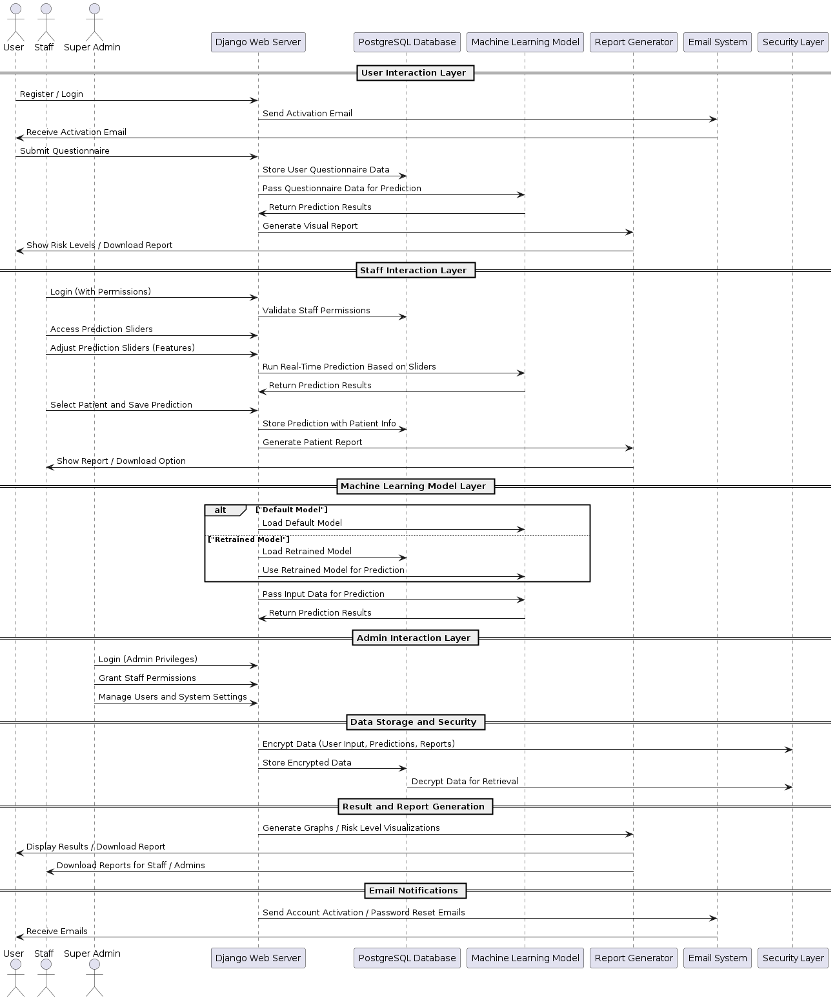
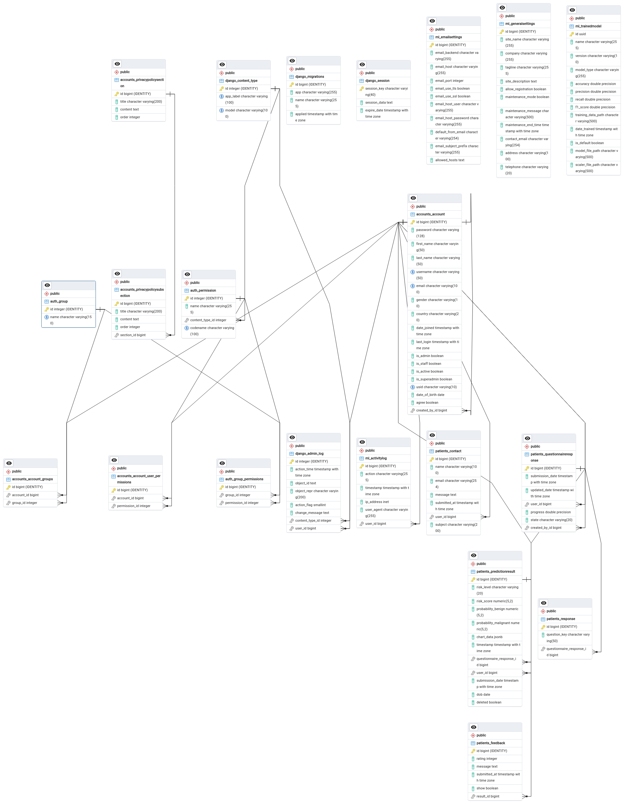

# **Breast Cancer Diagnosis Prediction System**

## **Project Overview**

This is a web-based Breast Cancer Diagnosis Prediction system built using Python Django and Machine Learning (ML). It utilizes the **Wisconsin Breast Cancer dataset** to predict breast cancer risk based on user inputs and generates a detailed risk assessment report.

---

### **Table of Contents**

1. [Features](#features)
2. [Technologies Used](#technologies-used)
3. [System Architecture](#system-architecture)
4. [Installation & Setup](#installation--setup)
5. [Configuration (.env Variables)](#configuration-env-variables)
6. [Database Design](#database-design)
7. [Usage](#usage)
8. [Deployment](#deployment)
9. [Contributing](#contributing)
10. [License](#license)
11. [Contact](#contact)

---

## **Features**

### **User Interface**:

- User registration, login, and email account activation.
- Questionnaire form for users to input symptoms.
- ML-powered prediction based on user responses.
- Risk assessment report generation (downloadable and printable).
- Profile management and password recovery.

### **Staff Interface**:

- Admin/staff login and permission management.
- Retrain ML models and switch between trained models.
- Manage users, system settings, and activity logs.
- Email configuration and log management.

### **Other Features**:

- Terms & Privacy Policy pages.
- FAQ and Contact page management.
- Testimonials from users.

---

## **Technologies Used**

- **Backend**: Django 5.0.6
- **Frontend**: HTML, Bootstrap 5, Font Awesome Icons
- **Database**: PostgreSQL
- **Machine Learning**: scikit-learn 1.5.1
- **Visualization**: Matplotlib, Plotly
- **Deployment**: PythonAnywhere, Gunicorn
- **Version Control**: Git, GitHub

---

## **System Architecture**

Here's a high-level overview of the system architecture:

****

---

## **Installation & Setup**

Follow these steps to set up and run the project locally:

### **Prerequisites**

- Python 3.10.12
- PostgreSQL (or SQLite for development)
- Git

### **Clone the Repository**

Open your terminal and clone the repository:

```bash
git clone https://github.com/your-username/breast-cancer-diagnosis.git
cd breast-cancer-diagnosis
```

### **Install Dependencies**

Ensure all required packages are installed:

```bash
pip install -r requirements.txt
```

### **Database Migration**

Apply the necessary database migrations:

```bash
python manage.py makemigrations
python manage.py migrate
```

### **Create Superuser**

Create a superuser for accessing the admin and staff panel:

```bash
python manage.py createsuperuser
```

### **Run the Development Server**

Run the Django development server:

```bash
python manage.py runserver
```

---

## **Configuration (.env Variables)**

You’ll need to create a `.env` file to store your environment-specific variables securely. Use the following template and fill in your values:

```bash
ALLOWED_HOSTS=localhost,127.0.0.1
SECRET_KEY=your_secret_key_here
DEBUG=True

EMAIL_HOST=smtp.your-email-provider.com
EMAIL_PORT=587
EMAIL_HOST_USER=your-email@example.com
EMAIL_HOST_PASSWORD=your-email-password
EMAIL_USE_TLS=True
EMAIL_SUBJECT_PREFIX=[Breast Cancer Diagnosis]

DATABASE_ENGINE=django.db.backends.postgresql
DATABASE_NAME=your_database_name
DATABASE_USER=your_database_user
DATABASE_PASSWORD=your_database_password
DATABASE_HOST=localhost
DATABASE_PORT=5432
```

### **How to Configure**:

- Copy the above variables into a `.env` file located in the root directory of your project.
- Replace `SECRET_KEY` with a strong, unique key (you can generate one using online tools).
- Configure your email provider settings to enable email-based account activation and password recovery.
- Set up PostgreSQL or use SQLite for development purposes (change `DATABASE_ENGINE` accordingly).

---

## **Database Design**

**Entity-Relationship Diagram (ERD)**:

****

---

## **Usage**

### **User Interface**:

- **Register**: Users can create accounts and activate them via email.
- **Fill Out Questionnaire**: Users input their symptoms using checkboxes and submit them for analysis.
- **View Prediction**: The system provides a detailed risk report which can be downloaded or printed.

### **Staff Interface**:

- **Admin Login**: Admin or staff log in to access the staff panel.
- **Manage Users & Permissions**: Admins can manage user roles, permissions, and settings.
- **Retrain ML Models**: Staff can upload new datasets to retrain the model or switch between available models.

---

## **Deployment**

This project can be deployed to a hosting platform such as **PythonAnywhere** or **Heroku**.

### **Deploying to PythonAnywhere**

1. **Create a PythonAnywhere Account**:

   - Go to [PythonAnywhere](https://www.pythonanywhere.com/) and create an account.

2. **Upload Your Project**:

   - Clone your GitHub repository onto PythonAnywhere.

3. **Configure the Environment**:

   - Set up the `.env` file with the correct values.
   - Configure the database (PostgreSQL).

4. **Run the Project**:
   - Set up `Gunicorn` to serve the Django app.
   - Configure static files and set up the web app to run on PythonAnywhere.

**[Insert Deployment Diagrams Here]**

---

## **Contributing**

Contributions are welcome! To get started:

1. **Fork the repository**.
2. Create a feature branch:

   ```bash
   git checkout -b feature-branch-name
   ```

3. **Commit your changes**:

   ```bash
   git commit -m "Add some feature"
   ```

4. **Push to the branch**:

   ```bash
   git push origin feature-branch-name
   ```

5. Open a **pull request**.

---

## **License**

This project is licensed under the MIT License - see the [LICENSE](LICENSE) file for details.

---

## **Contact**

Feel free to reach out for any questions or suggestions:

- **Email**: info.zilatech@gmail.com
- **GitHub**: [oluku-project](https://github.com/oluku-project/quickdiag.git)

## **Project Repository**

You can access the full project source code and documentation on GitHub:

[QuickDiag - Breast Cancer Diagnosis Prediction System](https://github.com/oluku-project/quickdiag.git)

Feel free to clone the repository, contribute to the project, or explore the features in more detail.
