# **Breast Cancer Diagnosis Prediction System**

## Project Overview

This is a web-based Breast Cancer Diagnosis Prediction system built using Python Django and Machine Learning (ML). It utilizes the **Wisconsin Breast Cancer dataset** to predict breast cancer risk based on user inputs and generates a detailed risk assessment report.

---

### **Table of Contents**

1. [Features](#features)
2. [Technologies Used](#technologies-used)
3. [System Architecture](#system-architecture)
4. [Installation & Setup](#installation--setup)
5. [Configuration (.env Variables)](#configuration-env-variables)
6. [Database Design](#database-design)
7. [Entity-Relationship Diagram (ERD)](#entity-relationship-diagram-erd)
8. [Usage](#usage)
9. [API Documentation](#api-documentation)
10. [Contributing](#contributing)
11. [License](#license)
12. [Contact](#contact)

---

## **Features**

### **User Interface**:

- User registration, login, and email account activation.
- Questionnaire form for users to input symptoms.
- ML-powered prediction based on user responses.
- Risk assessment report generation (downloadable and printable).
- Profile management and password recovery.

### **Staff Interface**:

- Admin/staff login and permission management.
- Retrain ML models and switch between trained models.
- Manage users, system settings, and activity logs.
- Email configuration and log management.

### **Other Features**:

- Terms & Privacy Policy pages.
- FAQ and Contact page management.
- Testimonials from users.

---

## **Technologies Used**

- **Backend**: Django 5.0.6
- **Frontend**: HTML, Bootstrap 5, Font Awesome Icons
- **Database**: PostgreSQL
- **Machine Learning**: scikit-learn 1.5.1
- **Visualization**: Matplotlib, Plotly
- **Deployment**: PythonAnywhere, Gunicorn
- **Version Control**: Git, GitHub

---

### Purpose:

The system's primary goal is to help healthcare providers and patients by offering predictive insights that support timely decision-making for further diagnosis and treatment. The project addresses the growing need for machine learning tools in healthcare, particularly in oncology.

### Goals:

- Provide accurate and reliable predictions regarding breast cancer risks.
- Offer a user-friendly interface for medical professionals to input patient data.
- Ensure data security and patient privacy.

---

## **System Architecture**

Here's a high-level overview of the system architecture:

```mermaid
flowchart LR
    A[🏠 breastAI - Django Project] --> B[👤 accounts]
    A --> C[🧠 ml]
    A --> D[👥 patients]
    A --> E[⚙️ Project Settings - breastAI]

    B -->|Contains| B1[📂 templates/accounts]
    B1 -->|Files| B1a[📄 account_verification_email.html]
    B1 -->|Files| B1b[📄 email.html]
    B1 -->|Files| B1c[📄 forgotPassword.html]
    B1 -->|Files| B1d[📄 login.html]
    B1 -->|Files| B1e[📄 password_reset_complete.html]
    B1 -->|Files| B1f[📄 privacy.html]
    B1 -->|Files| B1g[📄 profile.html]
    B1 -->|Files| B1h[📄 register.html]
    B1 -->|Files| B1i[📄 reset_password_email.html]
    B1 -->|Files| B1j[📄 terms.html]
    B1 -->|Files| B1k[📄 user-dashboard.html]

    C -->|Contains| C1[📂 management/commands]
    C1 -->|Files| C1a[📄 train_model.py]

    D -->|Contains| D2[📂 templates/patients/includes]
    D2 -->|Files| D2a[📄 contact_form_script.html]
    D2 -->|Files| D2b[📄 feedback.html]

    E -->|Files| E1[📄 settings.py]
    E -->|Files| E8[📄 wsgi.py]

```



## Getting Started

This section will guide you through setting up the project locally and getting it running on your system.

## Installation & Setup

Follow these steps to set up and run the project locally:

### Prerequisites

- Python 3.10.12
- PostgreSQL (or SQLite for development)
- Git

Clone the Repository

### Installation:

1. Clone the repository:

   ```bash
   git clone git@github.com:oluku-project/quickdiag.git
   cd breast-cancer-prediction
   ```

2. Create a virtual environment and activate it:

   ```bash
   python -m venv venv
   source venv/bin/activate  # For Windows, use `venv\Scripts\activate` Linux `source venv/bin/activate`
   ```

3. Install the required dependencies:

   ```bash
   pip install -r requirements.txt
   ```

4. ## **Configuration (.env Variables)**

You’ll need to create a `.env` file to store your environment-specific variables securely. Use the following template and fill in your values:

ALLOWED_HOSTS=localhost,127.0.0.1
SECRET_KEY=your_secret_key_here
DEBUG=True

EMAIL_HOST=smtp.your-email-provider.com
EMAIL_PORT=587
EMAIL_HOST_USER=your-email@example.com
EMAIL_HOST_PASSWORD=your-email-password
EMAIL_USE_TLS=True
EMAIL_SUBJECT_PREFIX=[Breast Cancer Diagnosis]

DATABASE_ENGINE=django.db.backends.postgresql
DATABASE_NAME=your_database_name
DATABASE_USER=your_database_user
DATABASE_PASSWORD=your_database_password
DATABASE_HOST=localhost
DATABASE_PORT=5432

### **How to Configure**:

- Copy the above variables into a `.env` file located in the root directory of your project.
- Replace `SECRET_KEY` with a strong, unique key (you can generate one using online tools).
- Configure your email provider settings to enable email-based account activation and password recovery.
- Set up PostgreSQL or use SQLite for development purposes (change `DATABASE_ENGINE` accordingly).

---

5. Apply migrations:

```bash
python manage.py makemigrations
python manage.py migrate

```

6. Create Superuser

```bash
  python manage.py createsuperuser
```

7. Run the project locally:
   ```bash
   python manage.py runserver
   ```

---

## **Usage**

### **User Interface**:

- **Register**: Users can create accounts and activate them via email.
- **Fill Out Questionnaire**: Users input their symptoms using checkboxes and submit them for analysis.
- **View Prediction**: The system provides a detailed risk report which can be downloaded or printed.

### **Staff Interface**:

- **Admin Login**: Admin or staff log in to access the staff panel.
- **Manage Users & Permissions**: Admins can manage user roles, permissions, and settings.
- **Retrain ML Models**: Staff can upload new datasets to retrain the model or switch between available models.

---

## **Contributing**

Contributions are welcome! To get started:

1. **Fork the repository**.
2. Create a feature branch:

   ```bash
   git checkout -b feature-branch-name
   ```

3. **Commit your changes**:

   ```bash
   git commit -m "Add some feature"
   ```

4. **Push to the branch**:

   ```bash
   git push origin feature-branch-name
   ```

5. Open a **pull request**.

---

## **License**

This project is licensed under the MIT License - see the [LICENSE](LICENSE) file for details.

---

## **Contact**

Feel free to reach out for any questions or suggestions:

- **Email**: info.zilatech@gmail.com
- **GitHub**: [oluku-project](https://github.com/oluku-project/quickdiag.git)

## **Project Repository**

You can access the full project source code and documentation on GitHub:

[QuickDiag - Breast Cancer Diagnosis Prediction System](https://github.com/oluku-project/quickdiag.git)

## File and Directory Structure

The project follows a typical Django structure with some additional layers for machine learning and task handling.

```plaintext
breastAI/
│
├── accounts/
│   ├── templates/accounts/
│   │   ├── login.html
│   │   ├── register.html
│   │   └── ...
│   ├── forms.py
│   ├── models.py
│   ├── views.py
│   └── urls.py
│
├── ml/
│   ├── management/commands/
│   │   └── train_model.py
│   ├── templates/ml/
│   │   └── dashboard.html
│   ├── forms.py
│   ├── models.py
│   ├── views.py
│   └── urls.py
│
├── patients/
│   ├── templates/patients/
│   │   ├── questionnaire.html
│   │   ├── results.html
│   │   └── ...
│   ├── forms.py
│   ├── models.py
│   ├── views.py
│   └── urls.py
│
├── breastAI/
    ├── settings.py
    ├── celery.py
    ├── urls.py
    └── wsgi.py
```

# Directory Structure Visualization:

## We can visualize this structure through a flowchart (referencing the diagram present in the directory):

```mermaid
  flowchart LR
    A([🏠 breastAI - Django Project]) --> B([👤 accounts])
    A --> C([🧠 ml])
    A --> D([👥 patients])
    A --> E([⚙️ breastAI - Settings])
    A --> F([📁 static])
    A --> G([📂 templates])

    subgraph Accounts App
        B1([📄 pycache])
        B2([📂 migrations])
        B3([📂 templates/accounts])
        B4([📄 templatetags])
        B5([🧪 tests])
        B --> B1
        B --> B2
        B --> B3
        B --> B4
        B --> B5
    end

    subgraph Machine Learning App
        C1([📄 pycache])
        C2([📂 management/commands/pycache])
        C3([📂 migrations])
        C4([📂 templates/ml/includes])
        C --> C1
        C --> C2
        C --> C3
        C --> C4
    end

    subgraph Patients App
        D1([📄 pycache])
        D2([📂 management/commands/pycache])
        D3([📂 migrations])
        D4([📂 templates/patients/includes])
        D5([🧪 tests])
        D --> D1
        D --> D2
        D --> D3
        D --> D4
        D --> D5
    end

    subgraph Project Files
        E1([📄 pycache])
        E --> E1
    end

    subgraph Static Files
        F1([📂 assets])
        F2([📂 css])
        F3([📂 images])
        F4([📂 js])
        F5([📂 models])
        F --> F1
        F --> F2
        F --> F3
        F --> F4
        F --> F5
    end

    subgraph Templates
        G1([📂 errors])
        G2([📂 includes])
        G --> G1
        G --> G2
    end

```



# Django Project Structure

The following diagram illustrates the structure of the Django project with `breastAI` as the root, including its apps and their respective files. This enhanced structure is designed for documentation purposes, making it easy to understand the relationships between different components of the system.

```mermaid
flowchart LR
    A[🏠 breastAI - Django Project] -->|Main Project| B[👤 accounts]
    A -->|Main Project| C[🧠 ml]
    A -->|Main Project| D[👥 patients]
    A -->|Main Project| E[⚙️ Project Settings - breastAI]

    %% Accounts app structure
    B -->|Contains| B1[📂 templates/accounts]
    B1 -->|Files| B1a[📄 account_verification_email.html]
    B1 -->|Files| B1b[📄 email.html]
    B1 -->|Files| B1c[📄 forgotPassword.html]
    B1 -->|Files| B1d[📄 login.html]
    B1 -->|Files| B1e[📄 password_reset_complete.html]
    B1 -->|Files| B1f[📄 privacy.html]
    B1 -->|Files| B1g[📄 profile.html]
    B1 -->|Files| B1h[📄 register.html]
    B1 -->|Files| B1i[📄 reset_password_email.html]
    B1 -->|Files| B1j[📄 terms.html]
    B1 -->|Files| B1k[📄 user-dashboard.html]

    B -->|Contains| B2[📂 templatetags]
    B2 -->|Files| B2a[📄 custom_filters.py]

    B -->|Files| B3[📄 admin.py]
    B -->|Files| B4[📄 apps.py]
    B -->|Files| B5[📄 filters.py]
    B -->|Files| B6[📄 forms.py]
    B -->|Files| B7[📄 mixins.py]
    B -->|Files| B8[📄 models.py]
    B -->|Files| B9[🧪 tests.py]
    B -->|Files| B10[📄 urls.py]
    B -->|Files| B11[📄 views.py]

    %% ML app structure
    C -->|Contains| C1[📂 management/commands]
    C1 -->|Files| C1a[📄 train_model.py]

    C -->|Contains| C2[📂 templates/ml/includes]
    C2 -->|Files| C2a[📄 contacts_modal.html]
    C2 -->|Files| C2b[📄 contacts_script.html]
    C2 -->|Files| C2c[📄 data_visualization_script.html]
    C2 -->|Files| C2d[📄 logs_modal.html]
    C2 -->|Files| C2e[📄 logs_script.html]
    C2 -->|Files| C2f[📄 measurement_user_list_modal.html]
    C2 -->|Files| C2g[📄 models_modal.html]
    C2 -->|Files| C2h[📄 models_script.html]
    C2 -->|Files| C2i[📄 user_list_modal.html]
    C2 -->|Files| C2j[📄 user_list_script.html]

    C -->|Contains| C3[📂 templates/ml]
    C3 -->|Files| C3a[📄 contacts.html]
    C3 -->|Files| C3b[📄 dashboard.html]
    C3 -->|Files| C3c[📄 data_visualization.html]
    C3 -->|Files| C3d[📄 feature_explanations.html]
    C3 -->|Files| C3e[📄 log_detail.html]
    C3 -->|Files| C3f[📄 logs.html]
    C3 -->|Files| C3g[📄 measurement.html]
    C3 -->|Files| C3h[📄 models.html]
    C3 -->|Files| C3i[📄 record_management.html]
    C3 -->|Files| C3j[📄 system_settings.html]
    C3 -->|Files| C3k[📄 testimonials.html]
    C3 -->|Files| C3l[📄 user_list.html]

    C -->|Files| C4[📄 admin.py]
    C -->|Files| C5[📄 apps.py]
    C -->|Files| C6[📄 context_processors.py]
    C -->|Files| C7[📄 filters.py]
    C -->|Files| C8[📄 forms.py]
    C -->|Files| C9[📄 middleware.py]
    C -->|Files| C10[📄 models.py]
    C -->|Files| C11[📄 signals.py]
    C -->|Files| C12[📄 tasks.py]
    C -->|Files| C13[📄 urls.py]
    C -->|Files| C14[📄 utils.py]
    C -->|Files| C15[📄 views.py]

    %% Patients app structure
    D -->|Contains| D1[📂 management/commands]
    D1 -->|Files| D1a[📄 flush_model.py]

    D -->|Contains| D2[📂 templates/patients/includes]
    D2 -->|Files| D2a[📄 contact_form_script.html]
    D2 -->|Files| D2b[📄 contact_form.html]
    D2 -->|Files| D2c[📄 feedback_script.html]
    D2 -->|Files| D2d[📄 feedback.html]
    D2 -->|Files| D2e[📄 pending_results_modal.html]
    D2 -->|Files| D2f[📄 pending_results_script.html]
    D2 -->|Files| D2g[📄 questionnaire_script.html]
    D2 -->|Files| D2h[📄 result_histories_modal.html]
    D2 -->|Files| D2i[📄 result_histories_script.html]
    D2 -->|Files| D2j[📄 results_scripts.html]
    D2 -->|Files| D2k[📄 supports.html]
    D2 -->|Files| D2l[📄 testimonials.html]
    D2 -->|Files| D2m[📄 user_dashboard.html]

    D -->|Contains| D3[📂 templates/patients]
    D3 -->|Files| D3a[📄 pending_results.html]
    D3 -->|Files| D3b[📄 questionnaire.html]
    D3 -->|Files| D3c[📄 result_histories.html]
    D3 -->|Files| D3d[📄 results.html]
    D3 -->|Files| D3e[📄 summary.html]

    D -->|Files| D4[📄 admin.py]
    D -->|Files| D5[📄 apps.py]
    D -->|Files| D6[📄 filters.py]
    D -->|Files| D7[📄 forms.py]
    D -->|Files| D8[📄 models.py]
    D -->|Files| D9[📄 urls.py]
    D -->|Files| D10[📄 views.py]

    %% Project Files structure
    E -->|Files| E1[📄 asgi.py]
    E -->|Files| E2[📄 celery.py]
    E -->|Files| E3[📄 decorators.py]
    E -->|Files| E4[📄 mixins.py]
    E -->|Files| E5[📄 settings.py]
    E -->|Files| E6[📄 urls.py]
    E -->|Files| E7[📄 utils.py]
    E -->|Files| E8[📄 wsgi.py]
```



# Entity-Relationship Diagram (ERD) - Advanced Representation

The following diagram represents the ERD of the database for the **Breast Cancer Prediction System**. It shows the relationships between the entities in the **Accounts**, **ML**, and **Patients** apps, with icons representing different types of tables (users, logs, settings, etc.).


## App: Accounts

- This app manages user authentication, registration, and profile management.

### Views

```python
# accounts/views.py
from django.contrib.auth.views import (
    LoginView,
    LogoutView,
    PasswordResetConfirmView,
    PasswordResetConfirmView as AuthPasswordResetConfirmView,
)
from django.shortcuts import get_object_or_404, render, redirect
from django.views.generic import CreateView, View, FormView, TemplateView
from django.urls import reverse_lazy
from django.contrib import messages
from django.utils.translation import gettext_lazy as _
from PaulVideoPlatform.utils import PASSWORD_VALIDITY, MailUtils
from accounts.mixins import ActiveUserRequiredMixin
from ml.utils import log_user_activity
from patients.models import PredictionResult
from .forms import LoginForm, RegistrationForm, SetPasswordForm, UpdateAccountForm
from .models import Account
from django.contrib import auth
from django.contrib.auth.hashers import make_password
from django.contrib.auth.models import Group
from django.utils.http import urlsafe_base64_decode
from django.contrib.auth.tokens import default_token_generator
from django.contrib.auth import update_session_auth_hash
import logging
from django.db import transaction

logger = logging.getLogger("custom_logger")


# View for user registration using a CreateView (handles displaying form and processing form submission)
class UserRegistrationView(MailUtils, CreateView):
    form_class = RegistrationForm
    template_name = "accounts/register.html"
    success_url = reverse_lazy("auth:login")

    def dispatch(self, request, *args, **kwargs):
        # Override dispatch to check if registration is allowed
        if not request.allow_registration:
            messages.info(
                request,
                _(
                    "We're sorry, but new registrations are currently not allowed. Please check back later or contact support for more information."
                ),
            )
            return redirect("auth:login")
        return super().dispatch(request, *args, **kwargs)

    def form_valid(self, form):
        # Handles valid form submissions and user creation with email verification
        try:
            with transaction.atomic():
                user = form.save(commit=False)
                user.is_active = False  # User needs to activate account via email
                password = form.cleaned_data.get("password")
                email = form.cleaned_data.get("email")
                user.username = str(email.split("@")[0])
                user.password = make_password(password)
                user.save()

                # Assign user to "Users" group
                group, created = Group.objects.get_or_create(name="Users")
                if created:
                    group.save()
                user.groups.add(group)

                # Send activation email
                mail_temp = "accounts/account_verification_email.html"
                mail_subject = "Activate Your Account"
                self.compose_email(
                    self.request, user, mail_subject=mail_subject, mail_temp=mail_temp
                )

                self.request.session["registration_success"] = True
                log_user_activity(
                    self.request, user, "User registered and activation email sent"
                )
                return redirect(self.success_url)

        except Exception as e:
            # Handle any errors during registration by logging and showing error messages
            if user.pk:
                user.delete()
            logger.error(f"Error during registration: {e}", exc_info=True)
            messages.error(
                self.request,
                _("An error occurred during registration. Please try again."),
            )
            return self.form_invalid(form)

    def form_invalid(self, form):
        # Show specific error messages if form is invalid
        for field, errors in form.errors.items():
            for error in errors:
                messages.error(self.request, _(f"{field}: {error}"))
        return super().form_invalid(form)

    def get_context_data(self, **kwargs):
        # Add extra context data for rendering the template
        context = super().get_context_data(**kwargs)
        context["title_root"] = _("Sign Up")
        return context


userregistrationview = UserRegistrationView.as_view()


# View for activating the user account using a token sent via email
class ActivateAccountView(View):

    def get(self, request, uidb64, token):
        try:
            # Decode the UID and retrieve the user by primary key
            uid = urlsafe_base64_decode(uidb64).decode()
            user = get_object_or_404(Account, pk=uid)

            # Check if the token is valid and activate the account
            if user is not None and default_token_generator.check_token(user, token):
                user.is_active = True
                user.save()
                log_user_activity(request, user, "User activated their account")
                messages.success(
                    request, _("Congratulations! Your account is activated.")
                )
                return redirect("auth:login")
            else:
                # Invalid token handling
                messages.error(request, _("Invalid activation link"))
                return redirect("auth:signup")

        except Exception as e:
            # Log any errors and show error messages
            logger.error(f"Error during account activation: {e}", exc_info=True)
            messages.error(
                request,
                _("An error occurred during account activation. Please try again."),
            )
            return redirect("auth:signup")


activateaccountview = ActivateAccountView.as_view()


# Custom login view handling user authentication and redirection after login
class LoginView(FormView):
    template_name = "accounts/login.html"
    form_class = LoginForm

    def redirect_to_staff_dashboard(self):
        return redirect(reverse_lazy("AdminHub:dashboard"))

    def redirect_to_user_dashboard(self):
        return redirect(reverse_lazy("auth:user_dashboard"))

    def form_valid(self, form):
        # Handles valid login form submission and user authentication
        try:
            username = form.cleaned_data.get("username")
            password = form.cleaned_data.get("password")
            user = auth.authenticate(email=username, password=password)
            if user is not None:
                auth.login(self.request, user)
                log_user_activity(self.request, user, "User logged in successfully")
                messages.success(self.request, _("You are now logged in."))
                if user.is_staff:
                    return self.redirect_to_staff_dashboard()
                else:
                    return self.redirect_to_user_dashboard()
            else:
                # Log failed login attempt
                log_user_activity(
                    self.request,
                    None,
                    f"Failed login attempt with username: {username}",
                )
                messages.error(self.request, _("Invalid login credentials."))
                return self.form_invalid(form)
        except Exception as e:
            # Handle errors during login process
            logger.error(f"Error during login: {e}", exc_info=True)
            messages.error(
                self.request, _("An error occurred during login. Please try again.")
            )
            return self.form_invalid(form)

    def form_invalid(self, form):
        # Handle form invalid errors and check if the user account is inactive
        try:
            user = User.objects.get(email=form.cleaned_data.get("username"))
            if user.is_active:
                messages.error(
                    self.request, _("Invalid credentials. Please try again.")
                )
            else:
                messages.error(
                    self.request,
                    _(
                        "Your account is inactive. Please check your email for activation instructions."
                    ),
                )
        except User.DoesNotExist:
            messages.error(
                self.request,
                _(
                    "Invalid email credentials. Please try signing up if have no account."
                ),
            )
        return self.render_to_response(self.get_context_data(form=form))

    def get_context_data(self, **kwargs):
        # Add extra context data for rendering the template
        context = super().get_context_data(**kwargs)
        context["title_root"] = "Login"
        return context


loginview = LoginView.as_view()


# View for handling user logout
class LogoutView(ActiveUserRequiredMixin, View):
    allow_both = True

    def get(self, request):
        try:
            log_user_activity(request, request.user, "User logged out")
            auth.logout(request)
            messages.success(request, _("You are logged out."))
            return redirect("auth:login")
        except Exception as e:
            logger.error(f"Error during logout: {e}", exc_info=True)
            messages.error(
                request, _("An error occurred during logout. Please try again.")
            )
            return redirect("auth:login")


logoutview = LogoutView.as_view()


# View for handling password reset requests
class ForgotPasswordView(MailUtils, View):
    template_name = "accounts/forgotPassword.html"

    def get(self, request):
        # Renders the forgot password page
        return render(request, self.template_name, {"title_root": "Forgot Password"})

    def post(self, request):
        # Handles the password reset request and sends a reset email
        try:
            email = request.POST.get("email")
            if Account.objects.filter(email=email).exists():
                user = Account.objects.get(email__exact=email)
                mail_temp = "accounts/reset_password_email.html"
                mail_subject = "Reset Your Password"
                self.compose_email(
                    self.request, user, mail_subject=mail_subject, mail_temp=mail_temp
                )
                log_user_activity(request, user, "Requested password change")
                messages.success(
                    request,
                    _("Password reset email has been sent to your email address."),
                )
                return redirect("auth:login")
            else:
                log_user_activity(
                    request,
                    None,
                    f"Password reset attempt with non-existing email: {email}",
                )
                messages.error(request, _("Account does not exist!"))
                return redirect("auth:forgotPassword")

        except Exception as e:
            # Log any errors and show error messages
            logger.error(f"Error during password reset request: {e}", exc_info=True)
            messages.error(
                request,
                _(
                    "An error occurred during the password reset request. Please try again."
                ),
            )
            return redirect("auth:forgotPassword")


forgotpasswordview = ForgotPasswordView.as_view()


# Password reset confirmation view (checks token and allows user to set a new password)
class PasswordResetConfirmView(AuthPasswordResetConfirmView):
    form_class = SetPasswordForm
    success_url = reverse_lazy("auth:login")
    template_name = "accounts/reset_password_validate.html"


passwordresetconfirmview = PasswordResetConfirmView.as_view()


# Simple user dashboard view rendering the dashboard page
class UserDashboardView(ActiveUserRequiredMixin, View):
    allow_both = True
    template_name = "accounts/user_dashboard.html"

    def get(self, request):
        return render(request, self.template_name)


userdashboardview = UserDashboardView.as_view()


# View for updating user account details
class UpdateAccountView(View):
    form_class = UpdateAccountForm
    template_name = "accounts/update_profile.html"

    def get(self, request):
        # Renders the update account page with the current user's data
        form = self.form_class(instance=request.user)
        return render(
            request, self.template_name, {"form": form, "title_root": "Update Profile"}
        )

    def post(self, request):
        # Handles the form submission for updating account details
        form = self.form_class(request.POST, instance=request.user)
        if form.is_valid():
            form.save()
            update_session_auth_hash(request, form.instance)
            log_user_activity(request, request.user, "User updated their profile")
            messages.success(request, _("Your account has been updated!"))
            return redirect("auth:update_account")
        return render(
            request, self.template_name, {"form": form, "title_root": "Update Profile"}
        )


updateaccountview = UpdateAccountView.as_view()


```

## Models

In this section, we define the models used in the Breast Cancer Prediction system. These models are part of the Django application and represent the core entities of the system. They handle user management, privacy policies, and other essential data structures.

### Accounts App

The `accounts` app includes models related to user management and privacy policies. Below are the detailed descriptions of each model in this app:

```python
# accounts/models.py
# Import necessary Django modules and libraries
from django.db import models
from django.urls import reverse
import string
import random
from django.contrib.auth.models import (
    AbstractBaseUser,
    BaseUserManager,
    Group,
    Permission,
)
from django.db.models.functions import Now
from django.utils.translation import gettext_lazy as _
import pycountry
from datetime import date

# Custom user manager for handling user creation and superuser creation
class MyAccountManager(BaseUserManager):
    """
    Custom manager for the `Account` model, extending BaseUserManager.
    Handles user and superuser creation.
    """
    def create_user(
        self, first_name, last_name, username, email, password=None, agree=False
    ):
        """
        Create and return a regular user with email and password.
        """
        if not email:
            raise ValueError("User must have an email address")
        if not username:
            raise ValueError("User must have a username")
        if not agree:
            raise ValueError("User must agree to the terms and conditions")

        user = self.model(
            email=self.normalize_email(email),
            username=username,
            first_name=first_name,
            last_name=last_name,
            agree=agree,
        )
        user.set_password(password)
        user.save(using=self.db)
        return user

    def create_superuser(
        self, first_name, last_name, email, username, password, agree=True
    ):
        """
        Create and return a superuser with email and password.
        """
        user = self.create_user(
            email=self.normalize_email(email),
            username=username,
            password=password,
            first_name=first_name,
            last_name=last_name,
            agree=agree,
        )
        user.is_admin = True
        user.is_active = True
        user.is_staff = True
        user.is_superadmin = True
        user.save(using=self.db)
        return user

# Choices for country field
class CountryChoices(models.TextChoices):
    """
    Choices for the `country` field in the `Account` model.
    Uses pycountry to get a list of countries.
    """
    @classmethod
    def choices(cls):
        return [(country.alpha_2, country.name) for country in pycountry.countries]

    @classmethod
    def labels(cls):
        return [country.name for country in pycountry.countries]

    @classmethod
    def as_dict(cls):
        return {country.alpha_2: country.name for country in pycountry.countries}

    @classmethod
    def as_choices(cls):
        return [(key, value) for key, value in cls.as_dict().items()]

# Choices for gender field
class Gender(models.TextChoices):
    """
    Choices for the `gender` field in the `Account` model.
    """
    MALE = "Male", "Male"
    FEMALE = "Female", "Female"
    OTHER = "Other", "Other"

# User model extending AbstractBaseUser
class Account(AbstractBaseUser):
    """
    Custom user model with fields for personal information, permissions, and account details.
    """
    first_name = models.CharField(max_length=50)
    last_name = models.CharField(max_length=50)
    username = models.CharField(max_length=50, unique=True)
    email = models.EmailField(_("email address"), max_length=100, unique=True)
    gender = models.CharField(max_length=10, choices=Gender, default=Gender.MALE)
    country = models.CharField(
        max_length=20, choices=CountryChoices.as_choices(), default="Gh"
    )
    agree = models.BooleanField(default=False)
    date_joined = models.DateTimeField(db_default=Now())
    last_login = models.DateTimeField(db_default=Now(), auto_now=True)
    is_admin = models.BooleanField(db_default=False)
    is_staff = models.BooleanField(db_default=False)
    is_active = models.BooleanField(db_default=False)
    is_superadmin = models.BooleanField(db_default=False)
    usid = models.CharField(max_length=10, unique=True, editable=False)
    date_of_birth = models.DateField(verbose_name="Birthday", null=True)
    created_by = models.ForeignKey(
        "self",
        null=True,
        blank=True,
        on_delete=models.SET_NULL,
        related_name="created_users",
    )

    USERNAME_FIELD = "email"
    REQUIRED_FIELDS = ["username", "first_name", "last_name", "agree"]

    objects = MyAccountManager()

    groups = models.ManyToManyField(Group, blank=True)
    user_permissions = models.ManyToManyField(Permission, blank=True)

    def save(self, *args, **kwargs):
        """
        Override save method to generate a unique `usid` if not set.
        """
        if not self.usid:
            alphanumeric = string.ascii_uppercase + string.digits
            usid = "".join(random.choices(alphanumeric, k=9))
            usid += random.choice(string.digits)
            self.usid = usid.capitalize()
        super(Account, self).save(*args, **kwargs)

    @property
    def country_name(self):
        """
        Return the country name for the `country` field.
        """
        try:
            return pycountry.countries.get(alpha_2=self.country).name
        except KeyError:
            return "Unknown Country"

    def full_name(self):
        """
        Return the full name of the user.
        """
        return f"{self.first_name} {self.last_name}"

    @property
    def age(self):
        """
        Calculate and return the age of the user based on `date_of_birth`.
        """
        try:
            today = date.today()
            age = (
                today.year
                - self.date_of_birth.year
                - (
                    (today.month, today.day)
                    < (self.date_of_birth.month, self.date_of_birth.day)
                )
            )
        except:
            return 0
        return age

    def __str__(self):
        """
        Return the email address of the user as the string representation.
        """
        return self.email

    def has_perm(self, perm, obj=None):
        """
        Check if the user has a specific permission.
        """
        return self.is_admin

    def has_module_perms(self, app_label):
        """
        Check if the user has permissions for a specific app.
        """
        return True

    @property
    def is_superuser(self):
        """
        Return if the user is a superuser.
        """
        return self.is_admin

# Model for privacy policy sections
class PrivacyPolicySection(models.Model):
    """
    Model for privacy policy sections, which may contain multiple subsections.
    """
    title = models.CharField(max_length=200)
    content = models.TextField()
    order = models.IntegerField(default=0)

    class Meta:
        ordering = ["order"]

    def __str__(self):
        """
        Return the title of the privacy policy section.
        """
        return self.title

# Model for privacy policy subsections
class PrivacyPolicySubSection(models.Model):
    """
    Model for subsections of a privacy policy section.
    """
    section = models.ForeignKey(
        PrivacyPolicySection, related_name="subsections", on_delete=models.CASCADE
    )
    title = models.CharField(max_length=200)
    content = models.TextField()
    order = models.IntegerField(default=0)

    class Meta:
        ordering = ["order"]

    def __str__(self):
        """
        Return the title of the privacy policy subsection.
        """
        return self.title
```

# `urls.py` - Accounts App

**Path:** `accounts/urls.py`

**Type:** URL Routing Configuration

**Purpose:** This file configures the URL patterns for authentication-related views within the `accounts` app. It maps specific URL paths to their corresponding view functions, facilitating user registration, login, account activation, password management, and viewing of privacy and terms information.

## Code

````python
from django.urls import path
from .views import (
    userregistrationview,
    loginview,
    logoutview,
    activateaccountview,
    forgotpasswordview,
    passwordresetconfirmview,
    passwordresetcompleteview,
    privacyview,
    termsview,
    userdashboardview,
    updateaccountview,
)

# Namespace for the URL patterns related to authentication
app_name = "auth"

urlpatterns = [
    # URL pattern for user registration
    path("signup/", userregistrationview, name="signup"),

    # URL pattern for user login
    path("login/", loginview, name="login"),

    # URL pattern for user logout
    path("logout/", logoutview, name="logout"),

    # URL pattern for account activation with UID and token
    path("activate/<uidb64>/<token>/", activateaccountview, name="activate"),

    # URL pattern for password reset request
    path("forgot-password/", forgotpasswordview, name="forgotPassword"),

    # URL pattern for password reset confirmation with UID and token
    path(
        "reset-password/<uidb64>/<token>/",
        passwordresetconfirmview,
        name="password_reset_confirm",
    ),

    # URL pattern for password reset completion
    path(
        "reset-password-complete/",
        passwordresetcompleteview,
        name="password_reset_complete",
    ),

    # URL pattern for privacy policy view
    path("privacy/", privacyview, name="privacy"),

    # URL pattern for terms and conditions view
    path("terms/", termsview, name="terms"),

    # URL pattern for user profile update
    path("profile/", updateaccountview, name="profile"),

    # URL pattern for user dashboard
    path("user/dashboard", userdashboardview, name="user_dashboard"),
]

# `mixins.py` - Accounts App

**Path:** `accounts/mixins.py`

**Type:** Mixin Classes

**Purpose:** This file defines custom mixins used for handling user access and permissions in Django views. These mixins ensure that users are authenticated, active, and have the appropriate permissions before accessing certain views.

## Code

```python
import logging
from django.contrib.auth import logout
from django.core.exceptions import PermissionDenied
from django.contrib.auth.mixins import AccessMixin
from django.shortcuts import redirect
from django.contrib import messages
from django.utils.translation import gettext as _
from ml.utils import log_user_activity

logger = logging.getLogger(__name__)

class ActiveUserRequiredMixin(AccessMixin):
    """
    Verify that the current user is authenticated,
    active, and optionally restrict access based on
    staff status.
    """

    require_staff = False
    require_non_staff = False
    allow_both = False

    def dispatch(self, request, *args, **kwargs):
        user = request.user

        # Check if the user is authenticated and active
        if not user.is_authenticated or not user.is_active:
            logout(request)
            messages.error(request, _("Please log in to access this page."))
            return redirect("auth:login")

        # Check if the view is staff-only and the user is not staff
        if self.require_staff and not user.is_staff:
            log_user_activity(request, user, "Attempted access to staff-only page")
            logger.warning(
                f"403 Forbidden: User {user} attempted to access a staff-only page."
            )
            raise PermissionDenied(_("You do not have permission to access this page."))

        # Check if the view is non-staff-only and the user is staff
        if self.require_non_staff and user.is_staff:
            log_user_activity(request, user, "Attempted access to non-staff page")
            logger.warning(
                f"403 Forbidden: User {user} attempted to access a non-staff page."
            )
            raise PermissionDenied(_("You do not have permission to access this page."))

        # Ensure that `allow_both` is consistent with other flags
        if not self.allow_both and self.require_staff and self.require_non_staff:
            raise ValueError(
                "Cannot set both `require_staff` and `require_non_staff` to True without setting `allow_both` to True."
            )

        return super().dispatch(request, *args, **kwargs)


class ActiveUserRequiredMixin1(AccessMixin):
    """Verify that the current user is authenticated, active, and optionally a staff member."""

    require_staff = False

    def dispatch(self, request, *args, **kwargs):
        if not request.user.is_authenticated or not request.user.is_active:
            logout(request)
            messages.error(request, _("Please log in to access this page."))
            return redirect("auth:login")

        if self.require_staff and not request.user.is_staff:
            logout(request)
            messages.error(
                request,
                _(
                    "You do not have permission to access this page. Please contact your administrator."
                ),
            )
            return redirect("auth:login")

        return super().dispatch(request, *args, **kwargs)


````

# `mixins.py` - Accounts App

**Path:** `accounts/mixins.py`

**Type:** Mixin Classes

**Purpose:** This file defines custom mixins used for handling user access and permissions in Django views. These mixins ensure that users are authenticated, active, and have the appropriate permissions before accessing certain views.

## Code

```python
import logging
from django.contrib.auth import logout
from django.core.exceptions import PermissionDenied
from django.contrib.auth.mixins import AccessMixin
from django.shortcuts import redirect
from django.contrib import messages
from django.utils.translation import gettext as _
from ml.utils import log_user_activity

logger = logging.getLogger(__name__)

class ActiveUserRequiredMixin(AccessMixin):
    """
    Verify that the current user is authenticated,
    active, and optionally restrict access based on
    staff status.
    """

    require_staff = False
    require_non_staff = False
    allow_both = False

    def dispatch(self, request, *args, **kwargs):
        user = request.user

        # Check if the user is authenticated and active
        if not user.is_authenticated or not user.is_active:
            logout(request)
            messages.error(request, _("Please log in to access this page."))
            return redirect("auth:login")

        # Check if the view is staff-only and the user is not staff
        if self.require_staff and not user.is_staff:
            log_user_activity(request, user, "Attempted access to staff-only page")
            logger.warning(
                f"403 Forbidden: User {user} attempted to access a staff-only page."
            )
            raise PermissionDenied(_("You do not have permission to access this page."))

        # Check if the view is non-staff-only and the user is staff
        if self.require_non_staff and user.is_staff:
            log_user_activity(request, user, "Attempted access to non-staff page")
            logger.warning(
                f"403 Forbidden: User {user} attempted to access a non-staff page."
            )
            raise PermissionDenied(_("You do not have permission to access this page."))

        # Ensure that `allow_both` is consistent with other flags
        if not self.allow_both and self.require_staff and self.require_non_staff:
            raise ValueError(
                "Cannot set both `require_staff` and `require_non_staff` to True without setting `allow_both` to True."
            )

        return super().dispatch(request, *args, **kwargs)


class ActiveUserRequiredMixin1(AccessMixin):
    """Verify that the current user is authenticated, active, and optionally a staff member."""

    require_staff = False

    def dispatch(self, request, *args, **kwargs):
        if not request.user.is_authenticated or not request.user.is_active:
            logout(request)
            messages.error(request, _("Please log in to access this page."))
            return redirect("auth:login")

        if self.require_staff and not request.user.is_staff:
            logout(request)
            messages.error(
                request,
                _(
                    "You do not have permission to access this page. Please contact your administrator."
                ),
            )
            return redirect("auth:login")

        return super().dispatch(request, *args, **kwargs)
```

# `forms.py` - Accounts App

**Path:** `accounts/forms.py`

**Type:** Django Forms

**Purpose:** This file defines custom forms for user authentication, registration, and profile management. These forms handle user input, validation, and ensure proper data submission for various user-related operations.

## Code

```python
from django import forms
from django.contrib.auth.forms import UserCreationForm, UserChangeForm
from PaulVideoPlatform.utils import MONTHS
from .models import Account, CountryChoices
from django.contrib.auth.forms import AuthenticationForm
from django.core.exceptions import ValidationError
from django.contrib.auth import password_validation
from django.contrib.auth.forms import SetPasswordForm as AuthSetPasswordForm
from django.utils.translation import gettext_lazy as _

class LoginForm(AuthenticationForm):
    username = forms.EmailField(
        widget=forms.EmailInput(
            attrs={
                "class": "form-control ps-15 bg-transparent",
                "placeholder": "Enter Email",
            }
        )
    )
    password = forms.CharField(
        widget=forms.PasswordInput(
            attrs={
                "class": "form-control ps-15 bg-transparent",
                "placeholder": "Enter Password",
            }
        )
    )

class CustomUserCreationForm(UserCreationForm):
    agree = forms.BooleanField(required=True, initial=False)

    class Meta:
        model = Account
        fields = (
            "email",
            "username",
            "first_name",
            "last_name",
            "gender",
            "date_of_birth",
            "country",
            "agree",
        )

class CustomUserChangeForm(UserChangeForm):
    class Meta:
        model = Account
        fields = (
            "email",
            "username",
            "first_name",
            "last_name",
            "gender",
            "date_of_birth",
            "country",
            "is_active",
            "is_staff",
            "is_admin",
            # "groups",
            # "user_permissions",
        )

class RegistrationForm(forms.ModelForm):
    error_messages = {
        "password_mismatch": _("The two password fields didn’t match."),
    }
    password = forms.CharField(
        widget=forms.PasswordInput(
            attrs={
                "placeholder": "Enter password",
                "class": "form-control ps-15 bg-transparent",
            }
        ),
        strip=False,
        help_text=password_validation.password_validators_help_text_html(),
    )
    confirm_password = forms.CharField(
        strip=False,
        widget=forms.PasswordInput(
            attrs={
                "placeholder": "Confirm password",
                "class": "form-control ps-15 bg-transparent",
            }
        ),
    )

    class Meta:
        model = Account
        fields = [
            "first_name",
            "last_name",
            "gender",
            "email",
            "password",
            "country",
            "agree",
        ]
        widgets = {
            "first_name": forms.TextInput(
                attrs={
                    "placeholder": "Enter First Name",
                    "class": "form-control ps-15 bg-transparent",
                }
            ),
            "last_name": forms.TextInput(
                attrs={
                    "placeholder": "Enter Last Name",
                    "class": "form-control ps-15 bg-transparent",
                }
            ),
            "email": forms.EmailInput(
                attrs={
                    "placeholder": "Enter Email",
                    "class": "form-control ps-15 bg-transparent",
                }
            ),
            "gender": forms.Select(attrs={"class": "form-select ps-15 bg-transparent"}),
            "country": forms.Select(
                choices=CountryChoices.as_choices(),
                attrs={"class": "form-select ps-15 bg-transparent"},
            ),
        }

    def clean_agree(self):
        agree = self.cleaned_data.get("agree")
        if not agree:
            raise ValidationError("You must agree to the terms and privacy.")
        return agree

    def clean_email(self):
        email = self.cleaned_data.get("email")
        if Account.objects.filter(email=email).exists():
            raise ValidationError("This email is already registered.")
        return email

    def clean_confirm_password(self):
        password = self.cleaned_data.get("password")
        confirm_password = self.cleaned_data.get("confirm_password")
        if password and confirm_password and password != confirm_password:
            raise ValidationError(
                self.error_messages["password_mismatch"],
                code="password_mismatch",
            )
        password_validation.validate_password(confirm_password)
        return confirm_password

class ForgotPasswordForm(forms.Form):
    email = forms.EmailField(
        widget=forms.EmailInput(
            attrs={
                "class": "form-control ps-15 bg-transparent",
                "placeholder": "Enter Email",
            }
        )
    )

class SetPasswordForm(AuthSetPasswordForm):
    """
    A form that lets a user set their password without entering the old
    password.
    """

    new_password1 = forms.CharField(
        widget=forms.PasswordInput(
            attrs={
                "autocomplete": "new-password",
                "class": "form-control ps-15 bg-transparent",
                "placeholder": "New password",
            }
        ),
        strip=False,
        help_text=password_validation.password_validators_help_text_html(),
    )
    new_password2 = forms.CharField(
        strip=False,
        widget=forms.PasswordInput(
            attrs={
                "autocomplete": "new-password",
                "class": "form-control ps-15 bg-transparent",
                "placeholder": "New password confirmation",
            }
        ),
    )

class UpdateAccountForm(forms.ModelForm):
    date_of_birth = forms.DateField(
        required=True,
        widget=forms.SelectDateWidget(
            years=range(1900, 2050), attrs={"class": "form-select"}
        ),
    )

    class Meta:
        model = Account
        fields = (
            "username",
            "first_name",
            "last_name",
            "gender",
            "date_of_birth",
            "country",
        )
        widgets = {
            "username": forms.TextInput(attrs={"class": "form-control"}),
            "first_name": forms.TextInput(attrs={"class": "form-control"}),
            "last_name": forms.TextInput(attrs={"class": "form-control"}),
            "gender": forms.Select(attrs={"class": "form-select ps-15 bg-transparent"}),
            "country": forms.Select(
                choices=CountryChoices.as_choices(),
                attrs={"class": "form-select ps-15 bg-transparent"},
            ),
        }

class UserCreateForm(forms.ModelForm):
    year = forms.ChoiceField(
        label="Birth Year",
        choices=[(year, year) for year in range(1900, 2050)],
        widget=forms.Select(attrs={"class": "form-select ps-15 bg-transparent"}),
        required=True,
    )
    month = forms.ChoiceField(
        label="Birth Month",
        choices=MONTHS,
        widget=forms.Select(attrs={"class": "form-select ps-15 bg-transparent"}),
        required=True,
    )
    day = forms.ChoiceField(
        label="Birth Day",
        choices=[(day, day) for day in range(1, 32)],
        widget=forms.Select(attrs={"class": "form-select ps-15 bg-transparent"}),
        required=True,
    )

    class Meta:
        model = Account
        fields = [
            "first_name",
            "last_name",
            "email",
            "gender",
            "country",
            "year",
            "month",
            "day",
        ]
        widgets = {
            "first_name": forms.TextInput(
                attrs={
                    "placeholder": "Enter First Name",
                    "class": "form-control ps-15 bg-transparent",
                }
            ),
            "last_name": forms.TextInput(
                attrs={
                    "placeholder": "Enter Last Name",
                    "class": "form-control ps-15 bg-transparent",
                }
            ),
            "email": forms.EmailInput(
                attrs={
                    "placeholder": "Enter Email",
                    "class": "form-control ps-15 bg-transparent",
                }
            ),
            "gender": forms.Select(attrs={"class": "form-select ps-15 bg-transparent"}),
            "country": forms.Select(
                choices=CountryChoices.as_choices(),
                attrs={"class": "form-select ps-15 bg-transparent"},
            ),
        }

    def clean(self):
        cleaned_data = super().clean()
        year = int(cleaned_data.get("year"))
        month = int(cleaned_data.get("month"))
        day = int(cleaned_data.get("day"))

        try:
            date_of_birth = date(year, month, day)
        except ValueError:
            raise forms.ValidationError(
                "Invalid date of birth. Please check the day, month, and year."
            )

        cleaned_data["date_of_birth"] = date_of_birth
        return cleaned_data

    def save(self, commit=True, user=None):
        instance = super().save(commit=False)

        # Extract the domain name from the email and set it as the username
        email = self.cleaned_data.get("email")
        domain = str(email.split("@")[0])
        instance.username = domain

        instance.password = make_password("defaultpassword123")

        instance.date_of_birth = self.cleaned_data["date_of_birth"]
        instance.agree = True
        if user:
            instance.created_by = user

        if commit:
            instance.save()
        return instance


```

# `filters.py` - Accounts App

**Path:** `accounts/filters.py`

**Type:** Django Filters

**Purpose:** This file defines custom filters for the `Account` model to facilitate advanced searching and filtering in views, particularly for list views and search functionalities.

## Code

```python
import django_filters
from django import forms
from django.utils import timezone
from datetime import datetime, timedelta

from .models import Account, CountryChoices, Gender

class DateInput(forms.DateInput):
    input_type = "date"

class AccountFilter(django_filters.FilterSet):
    first_name = django_filters.CharFilter(
        field_name="first_name",
        lookup_expr="icontains",
        label="First Name",
        widget=forms.TextInput(
            attrs={"class": "form-control", "placeholder": "Search by First Name"}
        ),
    )
    last_name = django_filters.CharFilter(
        field_name="last_name",
        lookup_expr="icontains",
        label="Last Name",
        widget=forms.TextInput(
            attrs={"class": "form-control", "placeholder": "Search by Last Name"}
        ),
    )
    username = django_filters.CharFilter(
        field_name="username",
        lookup_expr="icontains",
        label="Username",
        widget=forms.TextInput(
            attrs={"class": "form-control", "placeholder": "Search by Username"}
        ),
    )
    email = django_filters.CharFilter(
        field_name="email",
        lookup_expr="icontains",
        label="Email",
        widget=forms.TextInput(
            attrs={"class": "form-control", "placeholder": "Search by Email"}
        ),
    )
    gender = django_filters.ChoiceFilter(
        field_name="gender",
        choices=Gender.choices,
        label="Gender",
        widget=forms.Select(attrs={"class": "form-control"}),
    )
    country = django_filters.ChoiceFilter(
        field_name="country",
        choices=CountryChoices.as_choices(),
        label="Country",
        widget=forms.Select(attrs={"class": "form-control"}),
    )
    date_joined_start = django_filters.DateFilter(
        field_name="date_joined",
        lookup_expr="gte",
        label="Joined After",
        widget=DateInput(
            attrs={"class": "form-control", "placeholder": "Joined After"}
        ),
    )
    date_joined_end = django_filters.DateFilter(
        field_name="date_joined",
        lookup_expr="lte",
        label="Joined Before",
        widget=DateInput(
            attrs={"class": "form-control", "placeholder": "Joined Before"}
        ),
    )
    last_login_start = django_filters.DateFilter(
        field_name="last_login",
        lookup_expr="gte",
        label="Last Login After",
        widget=DateInput(
            attrs={"class": "form-control", "placeholder": "Last Login After"}
        ),
    )
    last_login_end = django_filters.DateFilter(
        field_name="last_login",
        lookup_expr="lte",
        label="Last Login Before",
        widget=DateInput(
            attrs={"class": "form-control", "placeholder": "Last Login Before"}
        ),
    )
    is_active = django_filters.ChoiceFilter(
        field_name="is_active",
        label="Is Active",
        choices=[("", "All"), (True, "Yes"), (False, "No")],
        widget=forms.Select(attrs={"class": "form-control"}),
    )
    is_staff = django_filters.ChoiceFilter(
        field_name="is_staff",
        label="Is Staff",
        choices=[("", "All"), (True, "Yes"), (False, "No")],
        widget=forms.Select(attrs={"class": "form-control"}),
    )
    is_superadmin = django_filters.ChoiceFilter(
        field_name="is_superadmin",
        label="Is Super Admin",
        choices=[("", "All"), (True, "Yes"), (False, "No")],
        widget=forms.Select(attrs={"class": "form-control"}),
    )
    min_age = django_filters.NumberFilter(
        method="filter_min_age",
        label="Minimum Age",
        widget=forms.NumberInput(
            attrs={"class": "form-control", "placeholder": "Min Age"}
        ),
    )
    max_age = django_filters.NumberFilter(
        method="filter_max_age",
        label="Maximum Age",
        widget=forms.NumberInput(
            attrs={"class": "form-control", "placeholder": "Max Age"}
        ),
    )

    class Meta:
        model = Account
        fields = [
            "first_name",
            "last_name",
            "username",
            "email",
            "gender",
            "country",
            "date_joined_start",
            "date_joined_end",
            "last_login_start",
            "last_login_end",
            "is_active",
            "is_staff",
            "is_superadmin",
            "min_age",
            "max_age",
        ]

    def filter_min_age(self, queryset, name, value):
        min_birth_date = timezone.now().date() - timedelta(days=int(value) * 365.25)
        return queryset.filter(date_of_birth__lte=min_birth_date)

    def filter_max_age(self, queryset, name, value):
        max_birth_date = timezone.now().date() - timedelta(days=int(value) * 365.25)
        return queryset.filter(date_of_birth__gte=max_birth_date)


```

# `admin.py` - Accounts App

**Path:** `accounts/admin.py`

**Type:** Django Admin Configuration

**Purpose:** This file configures the Django admin interface for managing `Account`, `PrivacyPolicySection`, and `PrivacyPolicySubSection` models. It customizes the admin views and forms to enhance the user experience for administrators.

## Code

```python
from django.contrib import admin
from django.contrib.auth.admin import UserAdmin
from accounts.forms import CustomUserChangeForm, CustomUserCreationForm
from django.utils.translation import gettext_lazy as _
from .models import PrivacyPolicySection, PrivacyPolicySubSection, Account

admin.site.site_header = _("Breast Cancer Prediction Administration")
admin.site.site_title = _("Breast Cancer Prediction Admin Portal")
admin.site.index_title = _("Welcome to the Breast Cancer Prediction Admin Portal")

@admin.register(Account)
class AccountAdmin(UserAdmin):
    add_form = CustomUserCreationForm
    form = CustomUserChangeForm
    model = Account
    list_display = (
        "email",
        "created_by",
        "first_name",
        "last_name",
        "username",
        "gender",
        "last_login",
        "date_joined",
        "date_of_birth",
        "is_active",
        "agree",
    )
    list_filter = (
        "email",
        "created_by",
        "first_name",
        "last_name",
        "date_of_birth",
        "gender",
        "is_staff",
        "is_active",
        "agree",
    )
    fieldsets = (
        (
            None,
            {
                "fields": (
                    "first_name",
                    "last_name",
                    "username",
                    "gender",
                    "email",
                    "password",
                    "date_of_birth",
                    "country",
                    "agree",
                    "created_by",
                )
            },
        ),
        (
            "Permissions",
            {
                "fields": (
                    "is_staff",
                    "is_active",
                    "is_admin",
                    "groups",
                    "user_permissions",
                )
            },
        ),
    )
    add_fieldsets = (
        (
            None,
            {
                "fields": (
                    "first_name",
                    "last_name",
                    "email",
                    "username",
                    "gender",
                    "password1",
                    "password2",
                    "date_of_birth",
                    "country",
                    "agree",
                    "is_staff",
                    "is_active",
                    "is_admin",
                )
            },
        ),
    )
    search_fields = ("email", "username", "first_name", "last_name")
    ordering = ("email",)

@admin.register(PrivacyPolicySection)
class PrivacyPolicySectionAdmin(admin.ModelAdmin):
    list_display = ["title", "order"]
    search_fields = ["title", "content"]
    list_filter = ["order"]
    list_per_page = 10
    ordering = ["order"]

@admin.register(PrivacyPolicySubSection)
class PrivacyPolicySubSectionAdmin(admin.ModelAdmin):
    list_display = ["section", "title", "order"]
    search_fields = ["title", "content", "section__title"]
    list_filter = ["section"]
    list_per_page = 10
    ordering = ["section", "order"]


```

# `custom_filters.py` - Templates

**Path:** `templates/accounts/custom_filters.py`

**Type:** Django Template Filters and Tags

**Purpose:** This file defines custom template filters and tags used to enhance the functionality and flexibility of Django templates. These filters and tags are used for rendering specific data, applying conditional logic, and manipulating template context.

## Code

```python
from datetime import date
from django import template
from django.urls import reverse

register = template.Library()

@register.filter
def gender_to_avatar(gender):
    value = 13 if gender == "Male" else 16
    return value

@register.filter
def get_grouped_questions(grouped_questions, section_header):
    return grouped_questions.get(section_header, [])

@register.filter
def get_section_header(counter, section_headers):
    index = counter // 6
    try:
        return section_headers[index]
    except IndexError:
        return ""

@register.simple_tag(takes_context=True)
def update_registration_session(context):
    request = context["request"]
    request.session["registration_success"] = False
    if "registration_success" in request.session:
        success = request.session.pop("registration_success")
        return success
    return False

@register.filter
def calculate_age(date_of_birth):
    try:
        today = date.today()
        age = (
            today.year
            - date_of_birth.year
            - ((today.month, today.day) < (date_of_birth.month, date_of_birth.day))
        )
    except:
        return 0
    return age

@register.filter
def ternary(value, arg):
    arg1, arg2 = arg.split(",")
    return arg1 if value else arg2

@register.simple_tag(takes_context=True)
def active_link_exclude_home(context, url_name):
    request = context["request"]
    url = reverse(url_name)

    if url_name == "home" and request.path != "/":
        return ""
    return "active" if request.path.startswith(url) else ""

@register.filter(name="add_class")
def add_class(field, css):
    """
    Add a CSS class to the given form field.
    """
    return field.as_widget(attrs={"class": css})

@register.filter
def conditional(value, arg):
    conditions = arg.split("|")
    for condition in conditions:
        try:
            cond, result = condition.split(":")
            if eval(cond):
                return result
        except ValueError:
            continue
    return ""


```

# `account_verification_email.html` - Email Template

**Path:** `templates/accounts/account_verification_email.html`

**Type:** HTML Email Template

**Purpose:** This template is used for sending account verification emails to users who have just signed up. It includes a verification link that the user needs to click to activate their account.

## Template Code

```django
<!DOCTYPE html>
<html>
  <head>
    <title></title>
    <meta http-equiv="Content-Type" content="text/html; charset=utf-8" />
    <meta name="viewport" content="width=device-width, initial-scale=1" />
    <meta http-equiv="X-UA-Compatible" content="IE=edge" />
    <link
      rel="icon"
      href="https://investx-admin-template.multipurposethemes.com/New_InvestX-main-files/html/images/favicon.ico"
    />
    <style type="text/css">
      @import url('https://fonts.googleapis.com/css?family=Poppins:100,100i,200,200i,300,300i,400,400i,500,500i,600,600i,700,700i,800,800i,900,900i');

      /* CLIENT-SPECIFIC STYLES */
      body,
      table,
      td,
      a {
        -webkit-text-size-adjust: 100%;
        -ms-text-size-adjust: 100%;
      }
      table,
      td {
        mso-table-lspace: 0pt;
        mso-table-rspace: 0pt;
      }
      img {
        -ms-interpolation-mode: bicubic;
      }

      /* RESET STYLES */
      img {
        border: 0;
        height: auto;
        line-height: 100%;
        outline: none;
        text-decoration: none;
      }
      table {
        border-collapse: collapse !important;
      }
      body {
        height: 100% !important;
        margin: 0 !important;
        padding: 0 !important;
        width: 100% !important;
      }

      /* iOS BLUE LINKS */
      a[x-apple-data-detectors] {
        color: inherit !important;
        text-decoration: none !important;
        font-size: inherit !important;
        font-family: inherit !important;
        font-weight: inherit !important;
        line-height: inherit !important;
      }

      /* MOBILE STYLES */
      @media screen and (max-width: 600px) {
        h1 {
          font-size: 32px !important;
          line-height: 32px !important;
        }
      }

      /* ANDROID CENTER FIX */
      div[style*='margin: 16px 0;'] {
        margin: 0 !important;
      }
    </style>
  </head>
  <body
    style="background-color: #f3f5f7; margin: 0 !important; padding: 0 !important;"
  >
    <!-- HIDDEN PREHEADER TEXT -->
    <div
      style="display: none; font-size: 1px; color: #f3f5f7; line-height: 1px; font-family: 'Poppins', sans-serif; max-height: 0px; max-width: 0px; opacity: 0; overflow: hidden;"
    >
      We're thrilled to have you here! Get ready to dive into your new account.
    </div>

    <table border="0" cellpadding="0" cellspacing="0" width="100%">
      <!-- LOGO -->
      <tr>
        <td align="center">
          <table
            border="0"
            cellpadding="0"
            cellspacing="0"
            width="100%"
            style="max-width: 600px;"
          >
            <tr>
              <td
                align="center"
                valign="top"
                style="padding: 40px 10px 10px 10px;"
              >
                <a href="#" target="_blank" style="text-decoration: none;">
                  
                </a>
              </td>
            </tr>
          </table>
        </td>
      </tr>
      <!-- HERO -->
      <tr>
        <td align="center" style="padding: 0px 10px 0px 10px;">
          <table
            border="0"
            cellpadding="0"
            cellspacing="0"
            width="100%"
            style="max-width: 600px;"
          >
            <tr>
              <td
                bgcolor="#ffffff"
                align="center"
                valign="top"
                style="padding: 40px 20px 10px 20px; border-radius: 4px 4px 0px 0px;"
              >
                <h1
                  style="color: #000000; font-size: 29px; font-weight: 400; margin: 0; font-family: 'Poppins', sans-serif;"
                >
                  Hi! {{ user.first_name }}
                </h1>
              </td>
            </tr>
          </table>
        </td>
      </tr>
      <!-- COPY BLOCK -->
      <tr>
        <td align="center" style="padding: 0px 10px 0px 10px;">
          <table
            border="0"
            cellpadding="0"
            cellspacing="0"
            width="100%"
            style="max-width: 600px;"
          >
            <!-- COPY -->
            <tr>
              <td
                bgcolor="#ffffff"
                align="left"
                style="padding: 10px 30px 10px 30px; color: #000000; font-family: 'Poppins', sans-serif; font-size: 16px; font-weight: 400; line-height: 25px; text-align: center;"
              >
                <p style="margin: 0;">
                  We're excited to have you get started. First, you need to
                  confirm your account. Just press the button below.
                </p>
              </td>
            </tr>
            <!-- BULLETPROOF BUTTON -->
            <tr>
              <td bgcolor="#ffffff" align="left">
                <table width="100%" border="0" cellspacing="0" cellpadding="0">
                  <tr>
                    <td
                      bgcolor="#ffffff"
                      align="center"
                      style="padding: 20px 30px 30px 30px;"
                    >
                      <table border="0" cellspacing="0" cellpadding="0">
                        <tr>
                          <td
                            align="center"
                            style="border-radius: 3px;"
                            bgcolor="#46bc5c"
                          >
                            <a
                              href="http://{{ domain }}"
                              target="_blank"
                              style="font-size: 18px; font-family: 'Poppins', sans-serif; color: #ffffff; text-decoration: none; color: #ffffff; text-decoration: none; padding: 12px 50px; border-radius: 5px; border: 1px solid #46bc5c; display: inline-block;"
                            >
                              Confirm Account
                            </a>
                          </td>
                        </tr>
                      </table>
                    </td>
                  </tr>
                </table>
              </td>
            </tr>
            <!-- COPY -->
            <tr>
              <td
                bgcolor="#ffffff"
                align="left"
                style="padding: 0px 30px 0px 30px; color: #000000; font-family: 'Poppins', sans-serif; font-size: 16px; font-weight: 400; line-height: 24px;"
              >
                <p style="margin: 0;">
                  If that doesn't work, copy and paste the following link in
                  your browser:
                </p>
              </td>
            </tr>
            <!-- COPY -->
            <tr>
              <td
                bgcolor="#ffffff"
                align="left"
                style="padding: 20px 30px 20px 30px; color: #000000; font-family: 'Poppins', sans-serif; font-size: 12px; font-weight: 400; line-height: 24px;"
              >
                <p style="margin: 0;">
                  <a href="#" target="_blank" style="color: #46bc5c;">
                    http://{{ domain }}
                  </a>
                </p>
              </td>
            </tr>
            <!-- COPY -->
            <tr>
              <td
                bgcolor="#ffffff"
                align="left"
                style="padding: 0px 30px 20px 30px; color: #000000; font-family: 'Poppins', sans-serif; font-size: 16px; font-weight: 400; line-height: 24px;"
              >
                <p style="margin: 0;">
                  If you have any questions, just reply to this email—we're
                  always happy to help out.
                </p>
              </td>
            </tr>
            <!-- COPY -->
            <tr>
              <td
                bgcolor="#ffffff"
                align="left"
                style="padding: 0px 30px 40px 30px; border-radius: 0px 0px 0px 0px; color: #000000; font-family: 'Poppins', sans-serif; font-size: 16px; font-weight: 400; line-height: 24px;"
              >
                <p style="margin: 0;">Cheers,<br />Team</p>
              </td>
            </tr>
          </table>
        </td>
      </tr>
      <!-- FOOTER -->
      <tr>
        <td align="center" style="padding: 10px 10px 50px 10px;">
          <table
            border="0"
            cellpadding="0"
            cellspacing="0"
            width="100%"
            style="max-width: 600px;"
          >
            <!-- PERMISSION REMINDER -->
            <tr>
              <td
                bgcolor="#ffffff"
                align="left"
                style="padding: 0px 30px 30px 30px; color: #000000; font-family: 'Poppins', sans-serif; font-size: 12px; font-weight: 400; line-height: 18px;"
              >
                <p style="margin: 0;">
                  You received this email because you just signed up for a new
                  account. If it looks weird,
                  <a
                    href="http://{{ domain }}"
                    target="_blank"
                    style="color: #000000; font-weight: 500;"
                    >view it in your browser</a
                  >.
                </p>
              </td>
            </tr>
            <!-- ADDRESS -->
            <tr>
              <td
                bgcolor="#ffffff"
                align="left"
                style="padding: 0px 30px 30px 30px; color: #000000; font-family: 'Poppins', sans-serif; font-size: 12px; font-weight: 400; line-height: 18px;"
              >
                <p style="margin: 0;">{{ site_address }}</p>
              </td>
            </tr>
            <!-- COPYRIGHT -->
            <tr>
              <td
                align="center"
                style="padding: 30px 30px 30px 30px; color: #333333; font-family: 'Poppins', sans-serif; font-size: 12px; font-weight: 400; line-height: 18px;"
              >
                <p style="margin: 0;">
                  Copyright ©  {{ site_company }}. {{ site_tagline
                  }}
                </p>
              </td>
            </tr>
          </table>
        </td>
      </tr>
    </table>
  </body>
</html>
```

# `forgotPassword.html` - Accounts App

**Path:** `templates/accounts/forgotPassword.html`

**Type:** HTML Template

**Purpose:** This template is used to display the "Forgot Password" page. It allows users to request a password reset by entering their email address. The page includes a form for email input and a link for users to sign in if they already have an account.

## Code

````django
 
<div class="container h-p100">
  <div class="row align-items-center justify-content-md-center h-p100">
    <div class="col-12">
      <div class="row justify-content-center g-0">
        <div class="col-lg-5 col-md-5 col-12">
          <div class="bg-white rounded10 shadow-lg">
            <div class="content-top-agile p-20 pb-0">
              <h2 class="mb-10 fw-600 text-primary">Forgot Password ?</h2>
              <p class="mb-0 text-fade">
                Enter your email to reset your password.
              </p>
            </div>
            <div class="p-40">
              <form method="post">
                
                <div class="form-group">
                  <div class="input-group mb-3">
                    <span class="input-group-text bg-transparent"
                      ><i class="text-fade ti-email"></i
                    ></span>
                    <input
                      type="email"
                      name="email"
                      class="form-control ps-15 bg-transparent"
                      placeholder="Your Email"
                    />
                  </div>
                </div>
                <div class="row">
                  <div class="col-12 text-center">
                    <button type="submit" class="btn btn-primary w-p100 mt-10">
                      Reset
                    </button>
                  </div>
                  <div class="text-center">
                    <p class="mt-15 mb-0 text-fade">
                      Already have an account?<a
                        href=""
                        class="text-primary ms-5"
                        >Sign In</a
                      >
                    </p>
                  </div>
                </div>
              </form>
            </div>
          </div>
        </div>
      </div>
    </div>
  </div>
</div>

 # `login.html` - Accounts App **Path:**
`templates/accounts/login.html` **Type:** HTML Template **Purpose:** This
template is used to display the "Login" page. It allows users to sign in to
their account by entering their username and password. The page includes a form
for user credentials, options for "Remember Me" and "Forgot Password," and links
for account registration and login. ## Code ```django    
<div class="container h-p100">
  <div class="row align-items-center justify-content-md-center h-p100">
    <div class="col-12">
      <div class="row justify-content-center g-0">
        <div class="col-lg-5 col-md-5 col-12">
          <div class="bg-white rounded10 shadow-lg">
            <div class="content-top-agile p-20 pb-0">
              <h2 class="text-primary fw-600">Let's Get Started</h2>
              <p class="mb-0 text-fade">
                Sign in to continue to {{site_name}}.
              </p>
            </div>
            <div class="p-40">
              <form method="post">
                
                <div class="form-group">
                  <div class="input-group mb-3">
                    <span class="input-group-text bg-transparent"
                      ><i class="text-fade ti-email"></i
                    ></span>
                    {{form.username}}
                  </div>
                </div>
                <div class="form-group">
                  <div class="input-group mb-3">
                    <span class="input-group-text  bg-transparent"
                      ><i class="text-fade ti-lock"></i
                    ></span>
                    {{form.password}}
                  </div>
                </div>
                <div class="row">
                  <div class="col-6">
                    <div class="checkbox">
                      <input type="checkbox" id="basic_checkbox_1" />
                      <label for="basic_checkbox_1">Remember Me</label>
                    </div>
                  </div>
                  <!-- /.col -->
                  <div class="col-6">
                    <div class="fog-pwd text-end">
                      <a
                        href=""
                        class="text-primary fw-500 hover-primary"
                        ><i class="ion ion-locked"></i> Forgot password?</a
                      ><br />
                    </div>
                  </div>
                  <!-- /.col -->
                  <div class="col-12 text-center">
                    <button type="submit" class="btn btn-primary w-p100 mt-10">
                      SIGN IN
                    </button>
                  </div>
                  <!-- /.col -->
                </div>
              </form>
              <div class="text-center">
                <p class="mt-15 mb-0 text-fade">
                  Don't have an account?
                  <a href="" class="text-primary ms-5"
                    >Sign Up</a
                  >
                </p>
              </div>
            </div>
          </div>
        </div>
      </div>
    </div>
  </div>
</div>


<script>
  document.addEventListener('DOMContentLoaded', function () {
    swal({
      title: 'Registration Successful',
      text: "Please confirm your email address to complete the registration. Check your spam folder and report if it's not spam.",
      icon: 'success',
    });
  });
  // Clear the session flag
</script>
;   
<script src=""></script>

````

# `password_reset_complete.html` - Accounts App

**Path:** `templates/accounts/password_reset_complete.html`

**Type:** HTML Template

**Purpose:** This template is used to display a "Password Reset Complete" page. It informs the user that their password has been successfully reset and provides a link to log in with the new password. The page also features a confetti animation to celebrate the successful reset.

## Code

```django
  
<style>
  #confetti-canvas {
    position: fixed;
    top: 0;
    left: 0;
    width: 100%;
    height: 100%;
    pointer-events: none;
    z-index: 9999;
  }
</style>
 
<div class="container h-p100">
  <div class="row align-items-center justify-content-md-center h-p100">
    <div class="col-12">
      <div class="row justify-content-center g-0">
        <div class="col-lg-5 col-md-5 col-12">
          <div class="bg-white rounded10 shadow-lg">
            <div class="content-top-agile p-20 pb-0">
              <i class="fa fa-check-circle fa-4x text-primary"></i>
              <h2 class="mb-10 fw-600 text-primary">Password Reset Complete</h2>
            </div>
            <div id="confetti-canvas"></div>
            <div class="p-40">
              <p class="mb-0 text-fade fs-5">
                Your password has been successfully reset. You can now
                <a
                  class="waves-effect waves-light btn btn-outline btn-primary"
                  href=""
                  >log in</a
                >
                with your new password.
              </p>
            </div>
          </div>
        </div>
      </div>
    </div>
  </div>
</div>

 
<script src=""></script>
<script>
  // Confetti effect
  function confettiEffect() {
    const duration = 5 * 1000;
    const end = Date.now() + duration;

    (function frame() {
      confetti({
        particleCount: 3,
        angle: 60,
        spread: 55,
        origin: { x: 0 },
      });
      confetti({
        particleCount: 3,
        angle: 120,
        spread: 55,
        origin: { x: 1 },
      });

      if (Date.now() < end) {
        requestAnimationFrame(frame);
      }
    })();
  }

  // Trigger the confetti effect when the page loads
  window.onload = confettiEffect;
</script>

```

# `password_reset_confirm.html` - Accounts App

**Path:** `templates/accounts/password_reset_confirm.html`

**Type:** HTML Template

**Purpose:** This template is used to display a page where users can enter a new password to complete the password reset process. It allows users to set a new password and confirm it by entering it twice.

## Code

```django
 
<div class="container h-p100">
  <div class="row align-items-center justify-content-md-center h-p100">
    <div class="col-12">
      <div class="row justify-content-center g-0">
        <div class="col-lg-5 col-md-5 col-12">
          <div class="bg-white rounded10 shadow-lg">
            <div class="content-top-agile p-20 pb-0">
              <h2 class="mb-10 fw-600 text-primary">Reset Your Password ?</h2>
              <p class="mb-0 text-fade">Enter new password.</p>
            </div>
            <div class="p-40">
              <form method="post">
                
                <div class="form-group">
                  <div class="input-group mb-3">
                    <div
                      class="helptext"
                      id="{{ form.new_password1.auto_id }}_helptext"
                    >
                      {{ form.new_password1.help_text|safe }}
                    </div>
                    <span class="input-group-text bg-transparent"
                      ><i class="text-fade ti-lock"></i
                    ></span>
                    {{form.new_password1}}
                  </div>
                  <div class="input-group mb-3">
                    <span class="input-group-text bg-transparent"
                      ><i class="text-fade ti-lock"></i
                    ></span>
                    {{form.new_password2}}
                  </div>
                </div>
                <div class="row">
                  <div class="col-12 text-center">
                    <button type="submit" class="btn btn-primary w-p100 mt-10">
                      Reset
                    </button>
                  </div>
                </div>
              </form>
              <div class="text-center">
                <p class="mt-15 mb-0 text-fade">
                  Back to Sign in?
                  <a href="" class="text-primary ms-5"
                    >Sign In</a
                  >
                </p>
              </div>
            </div>
          </div>
        </div>
      </div>
    </div>
  </div>
</div>


```

# `privacy.html` - Privacy Policy Page

**Path:** `templates/privacy.html`

**Type:** HTML Template

**Purpose:** This template is used to display the privacy policy of the website. It outlines how the website collects, uses, and protects user information, including details on data security, sharing, and user rights.

## Code

```django
  
<style>
  .hero-section {
    position: relative;
    background-image: url('');
    background-size: cover;
    background-position: center;
    padding: 100px 0;
    text-align: center;
    color: #222;
  }

  .hero-section .container {
    position: relative;
    z-index: 2;
  }

  .hero-section::before {
    content: '';
    position: absolute;
    top: 0;
    left: 0;
    width: 100%;
    height: 100%;
    background: rgba(0, 0, 0, 0.5);
    z-index: 1;
  }
</style>
 
<section class="content">
  <!-- Hero Section -->
  <section class="hero-section">
    <div class="container text-center text-white">
      <h1 class="display-4">Privacy Policy</h1>
      <p class="lead">
        Your privacy is important to us. Learn how we protect your information.
      </p>
    </div>
  </section>

  <div class="row bg-transparent">
    <div class="col-12">
      <!-- Introduction -->
      <div class="row mb-3">
        <div class="py-4" href="#">
          <div class="d-flex align-items-center">
            <i class="ti-info fa-5x text-primary mb-3"></i>
            <div class="mx-3">
              <h3 class="mb-0">
                We are committed to protecting your privacy. This privacy policy
                explains how we collect, use, and safeguard your information
                when you visit our website.
              </h3>
              <button class="btn btn-xs btn-light">Introduction</button>
            </div>
          </div>
        </div>
      </div>
      <div class="col-12">
        <!-- Default box -->
        <div class="box">
          <div class="box-header with-border">
            <h4 class="box-title">Information We Collect</h4>
          </div>
          <div class="box-body">
            <div class="row">
              <div class="col-md-5">
                
              </div>
              <div class="col-md-7">
                <div id="slimtest1" class="text-fade">
                  <h2 class="box-title fw-600 hover-primary fs-18">
                    Personal Information
                  </h2>
                  <p>
                    We collect personal information that you provide to us such
                    as your full name, email address, date of birth, gender, and
                    other personally identifiable information.
                  </p>
                  <h2 class="box-title fw-600 hover-primary fs-18">
                    Health Information
                  </h2>
                  <p>
                    We collect data related to your questionnaire responses,
                    risk assessments, and other health-related information.
                  </p>
                  <h2 class="box-title fw-600 hover-primary fs-18">
                    Usage Data
                  </h2>
                  <p>
                    We collect information on how you interact with our site,
                    including your IP address, browser type, pages visited, and
                    the time spent on each page.
                  </p>
                  <h2 class="box-title fw-600 hover-primary fs-18">
                    Cookies and Tracking Technologies
                  </h2>
                  <p>
                    We use cookies and other tracking technologies to enhance
                    your experience on our site. These technologies help us
                    understand how you use our site and how we can improve our
                    services.
                  </p>
                </div>
              </div>
            </div>
          </div>
          <!-- /.box-body -->
        </div>
        <!-- /.box -->
      </div>
      <div class="box">
        <div class="box-body">
          <div class="row">
            <div class="col-lg-12">
              <div class="row">
                <h3>How We Use Your Information</h3>
                <div class="col-lg-4">
                  <a class="box box-body box-hover-shadow mb-3" href="#">
                    <div class="d-flex align-items-center">
                      <div>
                        <i class="ti-medall" style="font-size: 40px;"></i>
                      </div>
                      <div class="mx-3">
                        <h6 class="mt-3">Legal Compliance</h6>
                        <p class="text-fade">
                          We use your information to comply with legal
                          obligations and protect the rights and safety of users
                          and the site
                        </p>
                      </div>
                    </div>
                  </a>
                </div>
                <div class="col-lg-4">
                  <a class="box box-body box-hover-shadow mb-3" href="#">
                    <div class="d-flex align-items-center">
                      <div>
                        <i class="ti-announcement" style="font-size: 40px;"></i>
                      </div>
                      <div class="mx-3">
                        <h6 class="mt-3">Communication</h6>
                        <p class="text-fade">
                          We use your information to send updates, newsletters,
                          and respond to inquiries or support requests.
                        </p>
                      </div>
                    </div>
                  </a>
                </div>
                <div class="col-lg-4">
                  <a class="box box-body box-hover-shadow mb-3" href="#">
                    <div class="d-flex align-items-center">
                      <div>
                        <i class="ti-stats-up" style="font-size: 40px;"></i>
                      </div>
                      <div class="mx-3">
                        <h6 class="mt-3">Analytics</h6>
                        <p class="text-fade">
                          We use your information to analyze usage patterns and
                          improve site performance and user experience.
                        </p>
                      </div>
                    </div>
                  </a>
                </div>
              </div>
            </div>
            <div class="col-lg-6">
              <a class="box box-body box-hover-shadow mb-3" href="#">
                <div class="d-flex align-items-center">
                  <div class="mx-3">
                    <h6 class="mt-3">Service Delivery</h6>
                    <i class="ti-signal" style="font-size: 40px;"></i>
                    <p class="text-fade">
                      We use your information to provide, maintain, and improve
                      our services, including personalized risk assessments and
                      recommendations. .
                    </p>
                  </div>
                </div>
              </a>
            </div>
          </div>
        </div>
      </div>
      <div class="box">
        <div class="box-body">
          <h3>Sharing Your Information</h3>
          <hr />
          <div>
            <div class="row">
              <div class="col-lg-5">
                <p class="text-fade">
                  We may share your information with third-party service
                  providers for processing, such as analytics and payment
                  processing, with appropriate safeguards in place.
                </p>
                <h3>Third-Party Service Providers</h3>
              </div>
              <div class="col-lg-3">
                <h3>Legal Requirements</h3>
                <p class="text-fade">
                  We may disclose your information in response to legal requests
                  or to protect user safety and site integrity.
                </p>
              </div>
              <div class="col-lg-4">
                <p class="text-fade">
                  In the event of a merger, acquisition, or sale of assets, your
                  information may be transferred as part of the business
                  transaction.
                </p>
                <h3>Business Transfers</h3>
              </div>
            </div>
          </div>
        </div>
      </div>
      <div class="row">
        <div class="my-5"><h3 class="text-center">Data Security</h3></div>
        <div class="col-lg-4 col-12">
          <div class="box">
            <div class="box-body">
              <h3>Security Measures</h3>
              <div>
                <p class="text-fade">
                  We implement technical, administrative, and physical
                  safeguards to protect your data.
                </p>
              </div>
            </div>
          </div>
        </div>
        <div class="col-lg-4 col-12">
          <div class="box">
            <div class="box-body">
              <h3>Encryption</h3>
              <div>
                <p class="text-fade">
                  We use encryption practices for data storage and transmission.
                </p>
              </div>
            </div>
          </div>
        </div>
        <div class="col-lg-4 col-12">
          <div class="box">
            <div class="box-body">
              <h3>Access Control</h3>
              <div>
                <p class="text-fade">
                  We have access restrictions and authentication measures in
                  place to secure your information.
                </p>
              </div>
            </div>
          </div>
        </div>
      </div>
    </div>
    <section>
      <div class="box-body">
        <div class="col-lg-9">
          <h3>Children's Privacy</h3>
          <p class="text-light">
            We do not knowingly collect information from children under a
            certain age without parental consent. If we learn that we have
            collected personal information from a child under the specified age
            without parental consent, we will delete that information.
          </p>
          <br />
          <h3>User Rights and Choices</h3>
          <div class="row">
            <div class="col-lg-12 text-fade">
              <p>
                <strong>Access and Correction</strong> :
                <span class="text-first">
                  You can access and correct your personal information by
                  contacting us.
                </span>
              </p>
              <p>
                <strong>Data Deletion</strong> :
                <span class="text-left">
                  You can request the deletion of your data by following our
                  data deletion procedures.
                </span>
              </p>
              <p>
                <strong>Opt-Out Options</strong> :
                <span class="text-left">
                  You can opt out of data collection and communications through
                  the settings in your account or by contacting us.
                </span>
              </p>
              <p>
                <strong>Cookie Management</strong> :
                <span class="text-left">
                  You can manage your cookie preferences through your browser
                  settings.
                </span>
              </p>
            </div>
          </div>
          <br />
          <h3>Policy Changes</h3>
          <p class="text-light">
            We may update this privacy policy from time to time. We will notify
            you of any changes by posting the new privacy policy on this page.
            We encourage you to review this policy periodically for any changes.
          </p>
          <br />
        </div>
      </div>
    </section>
  </div>
</section>
 
<script src=""></script>

```

# `profile.html` - User Profile Page

**Path:** `templates/profile.html`

**Type:** HTML Template

**Purpose:** This template is used to display and update user profile information. It includes sections for personal details and password management, with tab navigation for different actions.

## Code

```django
   
<section class="content">
  <div class="row">
    <!-- User Profile -->
    <div class="col-xl-4 col-lg-5">
      <div class="card text-center">
        <div class="card-body">
          
          
          

          <h4 class="mb-0 mt-2">
            {{user.username.upper|default:user.first_name.upper}}
          </h4>
          <p class="text-muted fs-14">
            Staff User
          </p>

          <button type="button" class="btn btn-primary btn-sm mb-2">
            Gender
          </button>
          <button type="button" class="btn btn-light btn-sm mb-2">
            {{user.gender}}
          </button>

          <div class="text-start mt-3">
            <p class="text-muted mb-2">
              <strong class="text-dark">User ID :</strong>
              <span class="ms-2">{{user.usid}}</span>
            </p>
            <p class="text-muted mb-2">
              <strong class="text-dark">Full Name :</strong>
              <span class="ms-2">{{user.full_name.title}}</span>
            </p>

            <p class="text-muted mb-2">
              <strong class="text-dark">Email :</strong>
              <span class="ms-2">{{user.email}}</span>
            </p>
            <p class="text-muted mb-2">
              <strong class="text-dark">Location :</strong>
              <span class="ms-2">{{user.country}}</span>
            </p>
          </div>
        </div>
      </div>
    </div>

    <!-- Tabs -->
    <div class="col-xl-8 col-lg-7">
      <div class="card">
        <div class="card-body">
          <ul class="nav nav-pills bg-nav-pills nav-justified mb-3">
            <li class="nav-item">
              <a
                href="#aboutme"
                data-bs-toggle="tab"
                aria-expanded="true"
                class="nav-link rounded-0 active"
              >
                &nbsp; Profile Update
              </a>
            </li>
            <li class="nav-item">
              <a
                href="#changepwd"
                data-bs-toggle="tab"
                aria-expanded="false"
                class="nav-link rounded-0"
              >
                Change Password
              </a>
            </li>
          </ul>
          <!-- tab-content -->
          <div class="tab-content">
            <!-- Profile Update Content -->
            <div class="tab-pane show active" id="aboutme">
              <form id="profileUpdateForm" method="post">
                
                <h5 class="mb-4 text-uppercase">
                  <i class="mdi mdi-account-circle me-1"></i> Personal Info
                </h5>
                <div class="row">
                  <div class="col-md-6">
                    <div class="mb-3">
                      <label for="id_firstname" class="form-label"
                        >First Name</label
                      >
                      {{update_form.first_name}}
                    </div>
                  </div>
                  <div class="col-md-6">
                    <div class="mb-3">
                      <label for="id_lastname" class="form-label"
                        >Last Name</label
                      >
                      {{update_form.last_name}}
                    </div>
                  </div>
                  <div class="col-md-6">
                    <div class="mb-3">
                      <label for="lastname" class="form-label">User Name</label>
                      {{update_form.username}}
                    </div>
                  </div>
                  <div class="col-md-6">
                    <div class="mb-3">
                      <label for="id_gender" class="form-label">Gender</label>
                      {{update_form.gender}}
                    </div>
                  </div>
                  <div class="col-md-6">
                    <div class="mb-3">
                      <label for="id_date_of_birth" class="form-label"
                        >Date of Birth</label
                      >
                      {{update_form.date_of_birth}}
                    </div>
                  </div>
                  <div class="col-md-6">
                    <div class="mb-3">
                      <label for="id_country" class="form-label">Country</label>
                      {{update_form.country}}
                    </div>
                  </div>
                </div>
                <!-- end row -->

                <div class="text-end">
                  <button
                    type="submit"
                    name="update_profile"
                    class="btn btn-primary mt-2"
                  >
                    <i class="mdi mdi-content-save"></i> Update Profile
                  </button>
                </div>
              </form>
            </div>
            <!-- End Profile Update Content -->

            <!-- Password Change -->
            <div class="tab-pane" id="changepwd">
              <div class="rounded">
                <form id="changePasswordForm" method="post">
                  
                  <div class="row">
                    <h5 class="mb-4 text-uppercase">
                      <i class="mdi mdi-account-key me-1"></i> Password Change
                    </h5>
                    
                    <div class="col-md-6 mb-3">
                      <div class="timeline-label">
                        <div class="timeline-item">
                          <div class="timeline-label fw-500 fs-16">
                            {{valid.title}}
                            <i
                              class="fa fa-dot-circle-o {{valid.txt}} fs-14"
                            ></i>
                          </div>
                          
                          <div class="timeline-content {{valid.css}} ps-3">
                            {{valid.des}}
                          </div>
                          
                          <span class="fw-500 {{valid.css}} ps-3">
                            {{valid.des}}
                          </span>
                          
                        </div>
                      </div>
                    </div>
                    
                    <div class="col-md-6">
                      <div class="mb-3">
                        <div class="input-group mb-3">
                          <span class="input-group-text bg-transparent">
                            <i class="text-fade ti-lock"></i>
                          </span>
                          {{password_form.new_password1}}
                        </div>
                      </div>
                    </div>
                    <div class="col-md-6">
                      <div class="input-group mb-3">
                        <span class="input-group-text bg-transparent">
                          <i class="text-fade ti-lock"></i>
                        </span>
                        {{password_form.new_password2}}
                      </div>
                    </div>
                  </div>
                  <div class="text-end">
                    <button
                      type="submit"
                      name="change_password"
                      class="btn btn-primary mt-2"
                    >
                      <i class="mdi mdi-content-save"></i> Change Password
                    </button>
                  </div>
                </form>
              </div>
            </div>
            <!-- End Password Change -->
          </div>
          <!-- End tab-content -->
        </div>
      </div>
    </div>
  </div>
</section>

```

# `register.html` - User Registration Page

**Path:** `templates/accounts/register.html`

**Type:** HTML Template

**Purpose:** This template is used for user registration, allowing new users to create an account. It includes fields for personal information, account details, and agreement to terms and conditions.

## Code

```django
  
<div class="container h-p100">
  <div class="row align-items-center justify-content-md-center h-p100">
    <div class="col-12">
      <div class="row justify-content-center g-0">
        <div class="col-lg-5 col-md-5 col-12">
          <div class="bg-white rounded10 shadow-lg">
            <div class="content-top-agile p-20 pb-0">
              <h2 class="text-primary fw-600">Create Your Account</h2>
              <p class="mb-0 text-fade">
                Join us to manage your health information and receive
                personalized insights.
              </p>
            </div>
            <div class="p-40">
              <form method="post">
                
                <div class="form-group">
                  <div class="input-group mb-3">
                    <span class="input-group-text bg-transparent"
                      ><i class="text-fade ti-user"></i
                    ></span>
                    {{ form.first_name }} {{ form.last_name }}
                  </div>
                </div>
                <div class="form-group">
                  <div class="input-group mb-3">
                    <span class="input-group-text bg-transparent"
                      ><i class="text-fade  ti-flag-alt-2"></i
                    ></span>
                    {{ form.country }}
                  </div>
                </div>
                <div class="form-group">
                  <div class="input-group mb-3">
                    <span class="input-group-text bg-transparent"
                      ><i class="text-fade ti-target"></i
                    ></span>
                    {{ form.gender }}
                  </div>
                </div>
                <div class="form-group">
                  <div class="input-group mb-3">
                    <span class="input-group-text bg-transparent"
                      ><i class="text-fade ti-email"></i
                    ></span>
                    {{ form.email }}
                  </div>
                </div>
                <div class="form-group">
                  <div class="input-group mb-3">
                    <span class="input-group-text bg-transparent"
                      ><i class="text-fade ti-lock"></i
                    ></span>
                    {{ form.password }}
                  </div>
                </div>
                <div class="form-group">
                  <div class="input-group mb-3">
                    <span class="input-group-text bg-transparent"
                      ><i class="text-fade ti-lock"></i
                    ></span>
                    {{ form.confirm_password }}
                  </div>
                </div>
                <div class="row">
                  <div class="col-6">
                    <div class="checkbox">
                      {{ form.agree }}
                      <label for="id_agree">You agree to our</label>
                    </div>
                  </div>
                  <div class="col-6">
                    <div class="fog-pwd text-end">
                      <a
                        href=""
                        target="_blank"
                        class="text-primary fw-500 hover-primary"
                      >
                        Terms
                      </a>
                      and
                      <a
                        href=""
                        target="_blank"
                        class="text-primary fw-500 hover-primary"
                        >Privacy</a
                      ><br />
                    </div>
                  </div>
                  <div class="col-12 text-center">
                    <button type="submit" class="btn btn-primary w-p100 mt-10">
                      REGISTER
                    </button>
                  </div>
                </div>
              </form>
              <div class="text-center">
                <p class="mt-15 mb-0 text-fade">
                  Already have an account?<a
                    href=""
                    class="text-primary ms-5"
                    >Sign In</a
                  >
                </p>
              </div>
            </div>
          </div>
        </div>
      </div>
    </div>
  </div>
</div>

```

# `reset_password_email.html` - Accounts App

**Path:** `templates/accounts/reset_password_email.html`

**Type:** HTML Email Template

**Purpose:** This template is used to send a password reset email to users who have requested a password change. It includes a button for resetting the password and provides instructions for the user to follow. If the request was not made by the user, they are advised to ignore the email.

## Code

```django
<!DOCTYPE html>
<html>
  <head>
    <title></title>
    <meta http-equiv="Content-Type" content="text/html; charset=utf-8" />
    <meta name="viewport" content="width=device-width, initial-scale=1" />
    <meta http-equiv="X-UA-Compatible" content="IE=edge" />
    <link
      rel="icon"
      href="https://investx-admin-template.multipurposethemes.com/New_InvestX-main-files/html/images/favicon.ico"
    />
    <style type="text/css">
      /* FONTS */
      @import url('https://fonts.googleapis.com/css?family=Poppins:100,100i,200,200i,300,300i,400,400i,500,500i,600,600i,700,700i,800,800i,900,900i');

      /* CLIENT-SPECIFIC STYLES */
      body,
      table,
      td,
      a {
        -webkit-text-size-adjust: 100%;
        -ms-text-size-adjust: 100%;
      }
      table,
      td {
        mso-table-lspace: 0pt;
        mso-table-rspace: 0pt;
      }
      img {
        -ms-interpolation-mode: bicubic;
      }

      /* RESET STYLES */
      img {
        border: 0;
        height: auto;
        line-height: 100%;
        outline: none;
        text-decoration: none;
      }
      table {
        border-collapse: collapse !important;
      }
      body {
        height: 100% !important;
        margin: 0 !important;
        padding: 0 !important;
        width: 100% !important;
      }

      /* iOS BLUE LINKS */
      a[x-apple-data-detectors] {
        color: inherit !important;
        text-decoration: none !important;
        font-size: inherit !important;
        font-family: inherit !important;
        font-weight: inherit !important;
        line-height: inherit !important;
      }

      /* MOBILE STYLES */
      @media screen and (max-width: 600px) {
        h1 {
          font-size: 32px !important;
          line-height: 32px !important;
        }
      }

      /* ANDROID CENTER FIX */
      div[style*='margin: 16px 0;'] {
        margin: 0 !important;
      }
    </style>
  </head>
  <body
    style="background-color: #f3f5f7; margin: 0 !important; padding: 0 !important;"
  >
    <!-- HIDDEN PREHEADER TEXT -->
    <div
      style="display: none; font-size: 1px; color: #f3f5f7; line-height: 1px; font-family: 'Poppins', sans-serif; max-height: 0px; max-width: 0px; opacity: 0; overflow: hidden;"
    >
      We're thrilled to have you here! Get ready to dive into your new account.
    </div>

    <table border="0" cellpadding="0" cellspacing="0" width="100%">
      <!-- LOGO -->
      <tr>
        <td align="center">
          <table
            border="0"
            cellpadding="0"
            cellspacing="0"
            width="100%"
            style="max-width: 600px;"
          >
            <tr>
              <td
                align="center"
                valign="top"
                style="padding: 40px 10px 10px 10px;"
              >
                <a href="#" target="_blank" style="text-decoration: none;">
                  
                </a>
              </td>
            </tr>
          </table>
        </td>
      </tr>
      <!-- HERO -->
      <tr>
        <td align="center" style="padding: 0px 10px 0px 10px;">
          <table
            border="0"
            cellpadding="0"
            cellspacing="0"
            width="100%"
            style="max-width: 600px;"
          >
            <tr>
              <td
                bgcolor="#ffffff"
                align="center"
                valign="top"
                style="padding: 40px 20px 10px 20px; border-radius: 4px 4px 0px 0px;"
              >
                <h1
                  style="color: #000000; font-size: 29px; font-weight: 400; margin: 0; font-family: 'Poppins', sans-serif;"
                >
                  Trouble signing in?
                </h1>
              </td>
            </tr>
          </table>
        </td>
      </tr>
      <!-- COPY BLOCK -->
      <tr>
        <td align="center" style="padding: 0px 10px 0px 10px;">
          <table
            border="0"
            cellpadding="0"
            cellspacing="0"
            width="100%"
            style="max-width: 600px;"
          >
            <!-- COPY -->
            <tr>
              <td
                bgcolor="#ffffff"
                align="left"
                style="padding: 10px 30px 10px 30px; color: #000000; font-family: 'Poppins', sans-serif; font-size: 16px; font-weight: 400; line-height: 24px; text-align: center;"
              >
                <p style="margin: 0;">
                  There is a request to change your password. Resetting your
                  password is easy. Just press the button below and follow the
                  instructions. We'll have you up and running in no time.
                </p>
              </td>
            </tr>
            <!-- BULLETPROOF BUTTON -->
            <tr>
              <td bgcolor="#ffffff" align="left">
                <table width="100%" border="0" cellspacing="0" cellpadding="0">
                  <tr>
                    <td
                      bgcolor="#ffffff"
                      align="center"
                      style="padding: 20px 30px 30px 30px;"
                    >
                      <table border="0" cellspacing="0" cellpadding="0">
                        <tr>
                          <td
                            align="center"
                            style="border-radius: 3px;"
                            bgcolor="#46bc5c"
                          >
                            <a
                              href="http://{{domain}}"
                              target="_blank"
                              style="font-size: 18px; font-family: 'Poppins', sans-serif; color: #ffffff; text-decoration: none; color: #ffffff; text-decoration: none; padding: 12px 50px; border-radius: 5px; border: 1px solid #46bc5c; display: inline-block;"
                              >Reset Password</a
                            >
                          </td>
                        </tr>
                      </table>
                    </td>
                  </tr>
                </table>
              </td>
            </tr>
            <!-- COPY -->
            <tr>
              <td
                bgcolor="#ffffff"
                align="left"
                style="padding: 0px 30px 20px 30px; color: #000000; font-family: 'Lato', 'Poppins', sans-serif; font-size: 16px; font-weight: 400; line-height: 24px;"
              >
                <p style="margin: 0; text-align: center;">
                  If you did not make this request, just ignore this email.
                  Otherwise, please click the button above to change your
                  password.
                </p>
              </td>
            </tr>
            <!-- COPY -->
            <tr>
              <td
                bgcolor="#ffffff"
                align="left"
                style="padding: 0px 30px 40px 30px; border-radius: 0px 0px 0px 0px; color: #000000; font-family: 'Poppins', sans-serif; font-size: 16px; font-weight: 400; line-height: 24px;"
              >
                <p style="margin: 0;">Cheers,<br />Team</p>
              </td>
            </tr>
          </table>
        </td>
      </tr>
      <!-- FOOTER -->
      <tr>
        <td align="center" style="padding: 10px 10px 50px 10px;">
          <table
            border="0"
            cellpadding="0"
            cellspacing="0"
            width="100%"
            style="max-width: 600px;"
          >
            <!-- PERMISSION REMINDER -->
            <tr>
              <td
                bgcolor="#ffffff"
                align="left"
                style="padding: 0px 30px 30px 30px; color: #000000; font-family: 'Poppins', sans-serif; font-size: 12px; font-weight: 400; line-height: 18px;"
              >
                <p style="margin: 0;">
                  You received this email because you just signed up for a new
                  account. If it looks weird,
                  <a
                    href="http://{{ domain }}"
                    target="_blank"
                    style="color: #000000; font-weight: 500;"
                    >view it in your browser</a
                  >.
                </p>
              </td>
            </tr>
            <!-- ADDRESS -->
            <tr>
              <td
                bgcolor="#ffffff"
                align="left"
                style="padding: 0px 30px 30px 30px; color: #000000; font-family: 'Poppins', sans-serif; font-size: 12px; font-weight: 400; line-height: 18px;"
              >
                <p style="margin: 0;">{{site_address}}</p>
              </td>
            </tr>
            <!-- COPYRIGHT -->
            <tr>
              <td
                align="center"
                style="padding: 30px 30px 30px 30px; color: #333333; font-family: 'Poppins', sans-serif; font-size: 12px; font-weight: 400; line-height: 18px;"
              >
                <p style="margin: 0;">
                  Copyright ©  {{site_company}}. {{site_tagline}}
                </p>
              </td>
            </tr>
          </table>
        </td>
      </tr>
    </table>
  </body>
</html>
```

# `terms.html` - Accounts App

**Path:** `templates/accounts/terms.html`

**Type:** Django Template

**Purpose:** This template displays the Terms of Service for users of the breast cancer risk assessment tool. It includes sections on the introduction, acceptance of terms, description of services, user responsibilities, privacy and data protection, intellectual property, disclaimers, governing law, and termination of services. It provides detailed information about the legal aspects of using the website and outlines user rights and obligations.

## Code

```django



<style>
  .hero-section {
    background-image: url("");
    background-size: cover;
    background-position: center;
    color: #fff;
    text-align: center;
    padding: 5rem 0;
    position: relative;
  }

  .hero-section::before {
    content: '';
    position: absolute;
    top: 0;
    left: 0;
    right: 0;
    bottom: 0;
    background: rgba(0, 0, 0, 0.5);
  }

  .hero-section .container {
    position: relative;
    z-index: 2;
  }

  .hero-section h1 {
    font-size: 3.5rem;
    font-weight: bold;
  }

  .hero-section p {
    font-size: 1.5rem;
  }
</style>



<div class="content">
  <section class="hero-section">
    <div class="container">
      <h1>Terms of Service</h1>
      <p>
        Understand the terms and conditions of using our breast cancer risk
        assessment tool.
      </p>
    </div>
  </section>

  <div class="row bg-transparent">
    <div class="col-12">
      <!-- Introduction -->
      <div class="row">
        <div class="my-15">
          <h3 class="text-center display-5">Introduction</h3>
        </div>
        <div class="col-12">
          <div class="box">
            <div class="box-body">
              <div class="d-flex align-items-center">
                <div>
                  <i class="ti-info-alt" style="font-size: 40px"></i>
                </div>
                <p class="mx-3 text-fade">
                  The purpose of these Terms of Service is to outline the legal
                  agreement between you, the user, and our website. By using our
                  services, you agree to be bound by these terms.
                </p>
              </div>
            </div>
          </div>
        </div>
      </div>
      <!-- Acceptance of Terms -->
      <div class="row">
        <h3>Acceptance of Terms</h3>
        <div class="col-lg-6">
          <a class="box box-body box-hover-shadow mb-3" href="#">
            <div class="d-flex align-items-center">
              <div>
                <i class="fa fa-check-circle" style="font-size: 40px"></i>
              </div>
              <div class="mx-3">
                <h6 class="mt-3">User Agreement</h6>
                <p class="text-fade">
                  By accessing and using our website, you accept and agree to be
                  bound by the terms and provision of this agreement.
                </p>
              </div>
            </div>
          </a>
        </div>
        <div class="col-lg-6">
          <a class="box box-body box-hover-shadow mb-3" href="#">
            <div class="d-flex align-items-center">
              <div>
                <i class="fa fa-edit" style="font-size: 40px"></i>
              </div>
              <div class="mx-3">
                <h6 class="mt-3">Modification of Terms</h6>
                <p class="text-fade">
                  We reserve the right to modify these terms at any time. We
                  will notify users of any changes by posting the new terms on
                  this page.
                </p>
              </div>
            </div>
          </a>
        </div>
      </div>
      <!-- Description of Services -->
      <div class="row">
        <h3>Description of Services</h3>
        <div class="col-lg-6">
          <a class="box box-body box-hover-shadow mb-3" href="#">
            <div class="d-flex align-items-center">
              <div>
                <i class="fa fa-briefcase" style="font-size: 40px"></i>
              </div>
              <div class="mx-3">
                <h6 class="mt-3">Overview of Services</h6>
                <p class="text-fade">
                  Our site provides a breast cancer risk assessment tool, data
                  visualizations, ML for prediction and other resources to help
                  users understand and manage their health risks.
                </p>
              </div>
            </div>
          </a>
        </div>
        <div class="col-lg-6">
          <a class="box box-body box-hover-shadow mb-3" href="#">
            <div class="d-flex align-items-center">
              <div>
                <i class="fa fa-exclamation-circle" style="font-size: 40px"></i>
              </div>
              <div class="mx-3">
                <h6 class="mt-3">Service Availability</h6>
                <p class="text-fade">
                  All services are provided on an "as is" and "as available"
                  basis. We reserve the right to change, suspend, or discontinue
                  any aspect of the service at any time without notice.
                </p>
              </div>
            </div>
          </a>
        </div>
      </div>
      <!-- User Responsibilities -->
      <div class="row">
        <h3>User Responsibilities</h3>
        <div class="col-lg-4">
          <a class="box box-body box-hover-shadow mb-3" href="#">
            <div class="d-flex align-items-center">
              <div>
                <i class="ti-user" style="font-size: 40px"></i>
              </div>
              <div class="mx-3">
                <h6 class="mt-3">Account Registration</h6>
                <p class="text-fade">
                  Users may be required to create an account to access certain
                  features. You must provide accurate, complete, and updated
                  registration information.
                </p>
              </div>
            </div>
          </a>
        </div>
        <div class="col-lg-4">
          <a class="box box-body box-hover-shadow mb-3" href="#">
            <div class="d-flex align-items-center">
              <div>
                <i class="ti-na" style="font-size: 40px"></i>
              </div>
              <div class="mx-3">
                <h6 class="mt-3">Prohibited Conduct</h6>
                <p class="text-fade">
                  Users must not engage in unauthorized access, misuse of data,
                  illegal activities, or any conduct that disrupts the site's
                  functionality.
                </p>
              </div>
            </div>
          </a>
        </div>
        <div class="col-lg-4">
          <a class="box box-body box-hover-shadow mb-3" href="#">
            <div class="d-flex align-items-center">
              <div>
                <i class="ti-pencil-alt" style="font-size: 40px"></i>
              </div>
              <div class="mx-3">
                <h6 class="mt-3">User Content</h6>
                <p class="text-fade">
                  If users contribute content, they retain ownership but grant
                  us a license to use it. Users are responsible for the legality
                  and appropriateness of their content.
                </p>
              </div>
            </div>
          </a>
        </div>
      </div>
      <!-- Privacy and Data Protection -->
      <div class="row">
        <div class="my-15">
          <h3 class="text-center display-5">Privacy and Data Protection</h3>
        </div>
        <div class="col-12">
          <div class="box">
            <div class="box-body">
              <div class="d-flex align-items-center">
                <div>
                  <i class="ti-lock" style="font-size: 40px"></i>
                </div>
                <p class="mx-3 text-fade">
                  Our Privacy Policy explains how we collect, use, and protect
                  your personal data. Please review our
                  <a href="" target="_blank">Privacy Policy</a>
                  for more details.
                </p>
              </div>
            </div>
          </div>
        </div>
      </div>
    </div>

    <section>
      <div class="box-body">
        <div class="col-lg-9">
          <!-- Intellectual Property -->
          <h3>Intellectual Property</h3>
          <p class="text-light">
            <i class="fa fa-copyright"></i>
            <strong>Ownership of Content:</strong> All content on the site,
            including text, graphics, and software, is owned by us or our
            licensors.
          </p>
          <p class="text-light">
            <i class="ti-file"></i> <strong>License to Use:</strong> Users are
            granted a limited, non-exclusive license to access and use the site
            for personal, non-commercial purposes.
          </p>
          <p class="text-light">
            <i class="ti-na"></i>
            <strong>Prohibited Uses:</strong> Users must not copy, distribute,
            or modify the site's content without our permission.
          </p>
          <br />
          <!-- Disclaimers and Limitation of Liability -->
          <h3>Disclaimers and Limitation of Liability</h3>
          <div class="row">
            <div class="col-lg-12 text-fade">
              <p>
                <i class="fa fa-exclamation-triangle"></i>
                <strong>No Warranties</strong> :
                <span class="text-first">
                  The site is provided "as is" without any warranties, express
                  or implied.
                </span>
              </p>
              <p>
                <i class="fa fa-gavel"></i>
                <strong>Limitation of Liability</strong> :
                <span class="text-left">
                  We are not liable for any damages arising from the use of the
                  site, including direct, indirect, incidental, and
                  consequential damages.
                </span>
              </p>
              <p>
                <i class="ti-shield"></i>
                <strong>Indemnification</strong> :
                <span class="text-left">
                  Users agree to indemnify and hold us harmless from any claims
                  or damages arising from their use of the site.
                </span>
              </p>
              <br />
              <h3>Governing Law and Dispute Resolution</h3>
              <p>
                <i class="fa fa-balance-scale"></i>
                <strong>Governing Law</strong> :
                <span class="text-left">
                  These terms are governed by the laws of Ghana.
                </span>
              </p>
              <p>
                <i class="fa fa-handshake-o"></i>
                <strong>Dispute Resolution</strong> :
                <span class="text-left">
                  Any disputes arising from these terms will be resolved through
                  arbitration in accordance with the rules of the Ghana
                  Arbitration Centre.
                </span>
              </p>
              <br>
              <h3>Termination of Services</h3>
              <p>
                <i class="ti-timer"></i>
                <strong>Termination Rights</strong> :
                <span class="text-left">
                  We reserve the right to terminate or suspend user accounts for violations of these terms.
                </span>
              </p>
              <p>
                <i class="ti-trash"></i>
                <strong>User Obligations Upon Termination</strong> :
                <span class="text-left">
                  Users must cease use of the site and delete any downloaded content upon termination.
                </span>
              </p>
              <p>
                <i class="fa fa-puzzle-piece"></i>
                <strong>Severability</strong> :
                <span class="text-left">
                   If any provision of these terms is found to be invalid, the remaining provisions will continue in effect.
                </span>
              </p>
              <p>
                <i class="ti-files"></i>
                <strong>Entire Agreement</strong> :
                <span class="text-left">
                   These terms constitute the entire agreement between you and us regarding the use of our services.
                </span>
              </p>
              <p>
                <i class="ti-na"></i>
                <strong>Waiver</strong> :
                <span class="text-left">
                   Any failure to enforce a provision of these terms does not constitute a waiver of that provision.
                </span>
              </p>
            </div>
          </div>
          <br />
          <h3>Contact Information</h3>
          <p class="text-light">
           <i class="fa fa-envelope"></i>
           For support inquiries, please contact us at {{site_contact_email}}
          </p>
          <br />
        </div>
      </div>
    </section>
  </div>
</div>


```

# `user-dashboard.html` - Accounts App

**Path:** `templates/accounts/user-dashboard.html`

**Type:** Django Template

**Purpose:** This template provides a user dashboard view. It displays an overview of the user's breast cancer risk assessments, including their total risk score, predictions, high-risk predictions, and last prediction date. It also includes visualizations such as monthly risk scores and risk levels distribution. Users can view detailed results of their latest assessment, perform quick actions like taking the questionnaire, viewing results, and updating their account.

## Code

```django




<section class="content">
  <div class="row">
    <!-- Welcome user -->
    <div class="col-12">
      <div class="box">
        <div class="box-body">
          <div class="d-md-flex justify-content-between align-items-center">
            <div class="col-lg-8 offset-lg-2">
              <h2 class="text-center mb-4">
                Welcome {{ user.first_name.title }}
              </h2>
              <p>Welcome to your dashboard. Here you can see an overview of your breast cancer risk assessments.</p>
            </div>
          </div>
        </div>
      </div>
    </div>

    <!-- Dashboard Overview -->
    <div class="col-12">
      <div class="box">
        <div class="box-body pb-lg-0">
          <div class="row">
            <div class="col-lg-3 col-12 be-1">
              <div class="d-flex justify-content-between align-items-center">
                <p class="mb-0 text-fade">Total Risk Score</p>
                <p class="mb-0 text-success">{{ overall_risk_score }}</p>
              </div>
              <div>
                <h1 class="mb-0 fw-600">
                  Total Predictions
                  <small class="ms-10 me-5">
                    <i class="text-success fa fa-caret-up"></i> {{ total_predictions }}
                  </small>
                </h1>
              </div>
            </div>
            <div class="col-lg-9 col-12">
              <div class="ms-lg-20 mt-20 mt-lg-0 d-flex justify-content-between align-items-center">
                <div>
                  <p class="mb-0 text-fade">High Risk Predictions</p>
                  <h2 class="mb-0 fw-600">{{ high_risk_predictions }}</h2>
                </div>
                <div>
                  <p class="mb-0 text-fade">Last Prediction Date</p>
                  <h2 class="mb-0 fw-600 text-success">{{ last_prediction_date|date:"M j, Y" }}</h2>
                </div>
              </div>
            </div>
          </div>
          <div class="row mt-30">
            <div class="col-lg-7 col-12">
              <h3 class="box-title">Monthly Risk Scores</h3>
              <div id="area-chart"></div>
            </div>
            <div class="col-lg-5 col-12">
              <h3 class="box-title">Risk Levels Distribution</h3>
              <div class="d-flex justify-content-start align-items-center mt-md-20 mt-0">
                <div id="donut-chart"></div>
              </div>
            </div>
          </div>
        </div>
      </div>
    </div>

    <!-- Health Overview -->
    <div class="col-12">
      
        <div class="box">
          <div class="box-body">
            <div class="d-md-flex justify-content-between align-items-center">
              <div>
                <p>
                  <span class="text-primary">Result</span> |
                  <span class="text-fade">Health Overview</span>
                </p>
                <h3 class="mb-0 fw-500">Summary of your health info.</h3>
              </div>
              <div class="mt-10 mt-md-0">
                <a onclick="navigateToUrl(this)"
                   data-url=""
                   href="javascript:void(0)"
                   class="waves-effect waves-light btn btn-outline btn-primary">
                  View Now
                </a>
              </div>
            </div>
            <hr />
            <div class="d-md-flex justify-content-between align-items-center">
              <div class="d-flex justify-content-start align-items-center">
                <div class="min-w-100">
                  <p class="mb-0 text-fade">Last Assessment Date</p>
                  <h6 class="mb-0">{{ result.submission_date }}</h6>
                </div>
                <div class="mx-lg-50 mx-20 min-w-70">
                  <p class="mb-0 text-fade">Recommendations</p>
                  <h6 class="mb-0 text-success">{{ result.get_risk_level }}</h6>
                </div>
                <div>
                  <p class="mb-0 text-fade">Risk</p>
                  <h6 class="mb-0">{{ result.risk_level }}</h6>
                </div>
              </div>
              <div class="mt-10 mt-md-0">
                <a data-bs-toggle="modal" data-bs-target="#deleteModal"
                   onclick="confirmDelete('{{ result.id }}')"
                   class="waves-effect waves-light btn mb-5 bg-gradient-danger btn-flat">
                  <i class="fa fa-trash me-10"></i>Delete
                </a>
              </div>
            </div>
          </div>
        </div>
      
    </div>

    <!-- Quick Actions -->
    <div class="col-12">
      <div class="box">
        <div class="box-body">
          <div class="d-md-flex justify-content-between align-items-center mb-20">
            <div>
              <h3 class="mb-0 fw-500">Quick Actions</h3>
            </div>
          </div>
          <div class="d-md-flex justify-content-between align-items-center">
            
              <a onclick="navigateToUrl(this)"
                 data-url=""
                 href="javascript:void(0);"
                 class="waves-effect waves-light btn btn-primary m-10 p-20">
                Take Questionnaire
              </a>
            
            <a onclick="navigateToUrl(this)"
               data-url=""
               href="javascript:void(0);"
               class="waves-effect waves-light btn btn-danger m-10 p-20">
              View Results
            </a>
            <a onclick="navigateToUrl(this)"
               data-url=""
               href="javascript:void(0);"
               class="waves-effect waves-light btn btn-info m-10 p-20">
              Update Account
            </a>
          </div>
        </div>
      </div>
    </div>
  </div>

  
</section>






```

# `wsgi.py` Documentation

## Overview

This file is responsible for providing the WSGI (Web Server Gateway Interface) application callable for the Django project. The WSGI application is used by servers to forward requests to the Django application and handle responses.

## Code

```python
import os

from django.core.wsgi import get_wsgi_application

# Set the default settings module for the 'DJANGO_SETTINGS_MODULE' environment variable.
os.environ.setdefault('DJANGO_SETTINGS_MODULE', 'PaulVideoPlatform.settings')

# Get the WSGI application for the Django project.
application = get_wsgi_application()
```

# `utils.py` Documentation

## Overview

This file contains utility functions and classes used throughout the Django project. It includes email composition and sending utilities, user type constants, and other helper data.

## Path

`breastAI/utils.py`

## Code

```python
from django.contrib.sites.shortcuts import get_current_site
from django.template.loader import render_to_string
from django.utils.http import urlsafe_base64_encode
from django.utils.encoding import force_bytes
from django.contrib.auth.tokens import default_token_generator
from django.utils.html import strip_tags
from django.core.mail import EmailMultiAlternatives


class UserTypes:
    USER_GROUP = "Users"
    DOCTOR_GROUP = "Professional Doctors"


MONTHS = [
    (1, "January"),
    (2, "February"),
    (3, "March"),
    (4, "April"),
    (5, "May"),
    (6, "June"),
    (7, "July"),
    (8, "August"),
    (9, "September"),
    (10, "October"),
    (11, "November"),
    (12, "December"),
]

PASSWORD_VALIDITY = [
    {
        "title": "Step One",
        "des": "Your password can’t be too similar to your other personal information.",
        "css": "text-muted text-warning",
        "txt": "text-warning",
    },
    {
        "title": "Step Two",
        "des": "Your password must contain at least 8 characters.",
        "css": "text-success",
        "txt": "text-success",
    },
    {
        "title": "Step Three",
        "des": "Your password can’t be a commonly used password.",
        "css": "text-muted text-danger",
        "txt": "text-danger",
    },
    {
        "title": "Step Four",
        "des": "Your password can’t be entirely numeric.",
        "css": "text-primary",
        "txt": "text-primary",
    },
]


class MailUtils:

    def compose_email(self, request, user, **kwargs):
        """Instance method to send an email."""
        self._compose_email(request, user, **kwargs)

    @staticmethod
    def send_activation_email(request, user, **kwargs):
        """Static method to send an email."""
        MailUtils._compose_email(request, user, **kwargs)

    @staticmethod
    def _compose_email(request, user, **kwargs):
        """Private method to handle email composition and sending."""
        current_site = get_current_site(request)
        mail_subject = kwargs.get("mail_subject", "Activate Your Account")
        mail_temp = kwargs.get("mail_temp", "accounts/account_verification_email.html")

        message_html = render_to_string(
            mail_temp,
            {
                "user": user,
                "domain": current_site.domain,
                "uid": urlsafe_base64_encode(force_bytes(user.pk)),
                "token": default_token_generator.make_token(user),
                "site_name": request.site_name,
                "site_company": request.site_company,
                "site_tagline": request.site_tagline,
                "site_address": request.site_address,
            },
        )

        message_plain = strip_tags(message_html)
        to_email = user.email

        email = EmailMultiAlternatives(mail_subject, message_plain, to=[to_email])
        email.attach_alternative(message_html, "text/html")
        email.send()
```

# `urls.py` Documentation for BreastAI Project

## Path

`breastAI/urls.py`

## Overview

This file defines the URL patterns for the `breastAI` project. It includes the URL configurations for the admin interface, the `ml` app, the `patients` app, and the `accounts` app. It also specifies custom error handlers for various HTTP errors.

## Code

```python
from django.conf import settings
from django.conf.urls.static import static

from django.contrib import admin
from django.urls import path, include
from django.conf.urls import handler500, handler403, handler404, handler400

handler500 = "patients.views.error500view"
handler403 = "patients.views.error403view"
handler404 = "patients.views.error404view"
handler400 = "patients.views.error400view"

urlpatterns = [
    path("admin/", admin.site.urls),
    path("AdminHub/", include("ml.urls")),
    path("", include("patients.urls")),
    path("auth/", include("accounts.urls")),
]
urlpatterns += static(settings.STATIC_URL, document_root=settings.STATIC_ROOT)
urlpatterns += static(settings.MEDIA_URL, document_root=settings.MEDIA_ROOT)
```

# `settings.py` Documentation for BreastAI Project

## Path

`breastAI/settings.py`

## Overview

This file contains the Django settings for the `breastAI` project. It configures various aspects of the project, including installed apps, middleware, database settings, static and media file settings, email configuration, Celery settings, and logging. It also includes security and session settings.

## Code

```python
import logging
from pathlib import Path
import os
import environ
from celery.schedules import crontab

env = environ.Env(
    DEBUG=(bool, False),
)
BASE_DIR = Path(__file__).resolve().parent.parent
env.read_env(str(BASE_DIR / "env" / ".env"))

LOG_DIR = BASE_DIR / "logs"
if not os.path.exists(LOG_DIR):
    os.makedirs(LOG_DIR)

SECRET_KEY = env("SECRET_KEY")
DEBUG = env("DEBUG", default=False)

ALLOWED_HOSTS = env("ALLOWED_HOSTS", default="localhost,127.0.0.1").split(",")

# Application definition
DEFAULT_APPS = [
    "django.contrib.admin",
    "django.contrib.auth",
    "django.contrib.contenttypes",
    "django.contrib.sessions",
    "django.contrib.messages",
    "django.contrib.staticfiles",
]
THIRD_PARTY_APPS = [
    "active_link",
]
LOCAL_APPS = [
    "accounts",
    "patients",
    "ml",
    "django_extensions",
]

INSTALLED_APPS = DEFAULT_APPS + THIRD_PARTY_APPS + LOCAL_APPS

MIDDLEWARE = [
    "django.middleware.security.SecurityMiddleware",
    "django.contrib.sessions.middleware.SessionMiddleware",
    "django.middleware.common.CommonMiddleware",
    "django.middleware.csrf.CsrfViewMiddleware",
    "django.contrib.auth.middleware.AuthenticationMiddleware",
    "django.contrib.messages.middleware.MessageMiddleware",
    "django.middleware.clickjacking.XFrameOptionsMiddleware",
    "ml.middleware.AutoLogoutMiddleware",
    "ml.middleware.SettingsMiddleware",
    "ml.middleware.TrainedModelMiddleware",
    "ml.middleware.GeneralSettingsMiddleware",
]

ROOT_URLCONF = "PaulVideoPlatform.urls"

TEMPLATES = [
    {
        "BACKEND": "django.template.backends.django.DjangoTemplates",
        "DIRS": [BASE_DIR / "templates"],
        "APP_DIRS": True,
        "OPTIONS": {
            "context_processors": [
                "django.template.context_processors.debug",
                "django.template.context_processors.request",
                "django.contrib.auth.context_processors.auth",
                "django.contrib.messages.context_processors.messages",
                "ml.context_processors.general_settings",
                "ml.context_processors.feedback_testimonials",
            ],
        },
    },
]

WSGI_APPLICATION = "PaulVideoPlatform.wsgi.application"

# Database
# https://docs.djangoproject.com/en/4.2/ref/settings/#databases

DATABASES = {
    "default": {
        "ENGINE": env("DATABASE_ENGINE"),
        "NAME": env("DATABASE_NAME"),
        "USER": env("DATABASE_USER"),
        "PASSWORD": env("DATABASE_PASSWORD"),
        "HOST": env("DATABASE_HOST"),
        "PORT": env("DATABASE_PORT"),
    }
}

# Password validation
# https://docs.djangoproject.com/en/4.2/ref/settings/#auth-password-validators

AUTH_PASSWORD_VALIDATORS = [
    {
        "NAME": "django.contrib.auth.password_validation.UserAttributeSimilarityValidator",
    },
    {
        "NAME": "django.contrib.auth.password_validation.MinimumLengthValidator",
    },
    {
        "NAME": "django.contrib.auth.password_validation.CommonPasswordValidator",
    },
    {
        "NAME": "django.contrib.auth.password_validation.NumericPasswordValidator",
    },
]

SESSION_COOKIE_AGE = 1800
SESSION_EXPIRE_AT_BROWSER_CLOSE = True
SESSION_SAVE_EVERY_REQUEST = True

LANGUAGE_CODE = "en-us"

TIME_ZONE = "UTC"

USE_I18N = True

USE_TZ = True

AUTH_USER_MODEL = "accounts.Account"

# Static files (CSS, JavaScript, Images)
STATIC_URL = "/static/"
STATIC_ROOT = BASE_DIR / "staticfiles_build" / "static"
STATICFILES_DIRS = [os.path.join(BASE_DIR, "static")]

# Media files (Uploaded files)
MEDIA_URL = "/media/"
MEDIA_ROOT = os.path.join(BASE_DIR, "media")

# Optionally, if using Whitenoise for serving static files in production:

# Celery settings for Redis
CELERY_BROKER_URL = env("REDIS_URL")
CELERY_ACCEPT_CONTENT = ["json"]
CELERY_TASK_SERIALIZER = "json"
CELERY_RESULT_BACKEND = env("REDIS_URL")

# SMTP configuration
EMAIL_BACKEND = "django.core.mail.backends.smtp.EmailBackend"

EMAIL_HOST = env("EMAIL_HOST")
EMAIL_PORT = env.int("EMAIL_PORT")
EMAIL_HOST_USER = env("EMAIL_HOST_USER")
EMAIL_HOST_PASSWORD = env("EMAIL_HOST_PASSWORD")
EMAIL_USE_TLS = env.bool("EMAIL_USE_TLS")
EMAIL_SUBJECT_PREFIX = env("EMAIL_SUBJECT_PREFIX")

# Security and Middleware settings for production
SECURE_CONTENT_TYPE_NOSNIFF = True
SECURE_BROWSER_XSS_FILTER = True
X_FRAME_OPTIONS = "DENY"

LOGGING = {
    "version": 1,
    "disable_existing_loggers": False,
    "formatters": {
        "verbose": {
            "format": "%(asctime)s %(levelname)s %(name)s %(message)s",
            "datefmt": "%Y-%m-%d %H:%M:%S",
        },
    },
    "handlers": {
        "file": {
            "level": "ERROR",
            "class": "logging.FileHandler",
            "filename": str(LOG_DIR / "django_errors.log"),
            "formatter": "verbose",
        },
        "console": {
            "level": "INFO",
            "class": "logging.StreamHandler",
            "formatter": "verbose",
        },
    },
    "loggers": {
        "django": {
            "handlers": ["file", "console"],
            "level": "ERROR",
            "propagate": True,
        },
        "custom_logger": {
            "handlers": ["file", "console"],
            "level": "INFO",
        },
    },
}

# LOGIN_REDIRECT_URL = "account:profile_complete"
LOGOUT_REDIRECT_URL = "auth:login"

LOGIN_URL = "auth:login"
LOGOUT_URL = "auth:logout"

CELERY_BEAT_SCHEDULE = {
    "delete-old-logs-every-day": {
        "task": "ml.tasks.delete_old_logs",
        "schedule": crontab(hour=0, minute=0),
    },
}

# Default primary key field type
# https://docs.djangoproject.com/en/4.2/ref/settings/#default-auto-field

DEFAULT_AUTO_FIELD = "django.db.models.BigAutoField"

"""
5. Use X_FRAME_OPTIONS and Security Middleware
If you are serving these custom pages in a production environment, consider security headers:
X_FRAME_OPTIONS = "DENY"  # Protect against clickjacking
SECURE_CONTENT_TYPE_NOSNIFF = True
SECURE_BROWSER_XSS_FILTER = True
"""
```

# `mixins.py` Documentation for BreastAI Project

## Path

`breastAI/mixins.py`

## Overview

This file contains the `CustomPermissionMixin` class for handling permissions in class-based views. The mixin utilizes a custom decorator to check permissions and optionally handle JSON responses. It also allows for the inclusion of custom messages and staff checks.

## Code

```python
from .decorators import custom_permission_required

class CustomPermissionMixin:
    """
    Custom mixin for handling class-based views
    """

    def dispatch(self, request, *args, **kwargs):
        permissions = getattr(self, "required_permissions", [])
        isjson = getattr(self, "isjson", False)
        message = getattr(self, "permission_denied_message", None)
        check_staff = getattr(self, "check_staff", False)
        user_type_decorator = custom_permission_required(
            permissions,
            message,
            isjson,
            check_staff=check_staff,
        )
        decorated = user_type_decorator(super().dispatch)
        return decorated(request, *args, **kwargs)
```

# `decorators.py` Documentation for BreastAI Project

## Path

`breastAI/decorators.py`

## Overview

This file contains several decorators used for handling user permissions, authentication requirements, and response management in the application. Key functions include handling cases where login is not required, checking user permissions, and managing user logout with appropriate responses.

## Code

```python
from django.conf import settings
from functools import wraps
from django.http import HttpResponseRedirect, JsonResponse
from django.contrib import messages
from django.shortcuts import redirect
from django.urls import reverse, reverse_lazy
from django.core.exceptions import ImproperlyConfigured

def no_login_required(view_func):
    @wraps(view_func)
    def _wrapped_view(request, *args, **kwargs):
        response = view_func(request, *args, **kwargs)
        if response.status_code == 302 and response.url == settings.LOGIN_URL:
            response.status_code = 200
        return response

    return _wrapped_view

def login_not_required(view_func):
    """
    Decorator that marks a view as not requiring login.
    """

    @wraps(view_func)
    def _wrapped_view(request, *args, **kwargs):
        if request.user.is_authenticated:
            # If the user is already authenticated, proceed with the view as usual
            return view_func(request, *args, **kwargs)
        else:
            # If the user is not authenticated, check if a redirect to the login page is needed
            response = view_func(request, *args, **kwargs)
            if (
                isinstance(response, HttpResponseRedirect)
                and response.url == settings.LOGIN_URL
            ):
                # If the response is a redirect to the login page, change it to a regular response
                response.status_code = 200  # Change status code to prevent redirection
            return response

    return _wrapped_view

def check_permissions(user, permissions, check_staff=False):
    """
    Check if user type, is_active, is_staff (optional), and permissions are valid.
    """
    if not user.is_active:
        return False, "Your account is inactive. Please contact support."

    if check_staff and not user.is_staff:
        return False, "You do not have staff privileges to access this page."

    group = user.groups.first()

    if permissions and group:
        # Check if all required permissions exist in the group's permissions
        required_permission_set = set(permissions)
        group_permission_set = set(group.permissions.values_list("codename", flat=True))
        if not required_permission_set.issubset(group_permission_set):
            return False, "You do not have permission to access this page."

    return True, None

def logout_and_response(request, isjson):
    """
    Logout user and return appropriate JSON response or redirect.
    """
    from accounts.views import logoutview

    # call logout here
    response = logoutview(request)

    if isjson:
        response_data = {"success": False, "redirect_url": reverse_lazy("login")}
        return JsonResponse(response_data)
    else:
        return response

def custom_permission_required(
    permissions=None, message=None, isjson=False, check_staff=False
):
    """
    Decorator for function-based views to check user types and permissions.
    """

    def decorator(view_func):
        @wraps(view_func)
        def _wrapped_view(request, *args, **kwargs):
            user = request.user
            if user.is_authenticated and request.session.session_key is not None:
                valid, msg = check_permissions(user, permissions, check_staff)
                if not valid:
                    messages.error(request, msg)
                    return logout_and_response(request, isjson)
            else:
                messages.error(request, "Please log in to access this page.")
                return logout_and_response(request, isjson)
            return view_func(request, *args, **kwargs)

        return _wrapped_view

    return decorator

# @custom_permission_required(user_types=["superadmin"], permissions=["view_data"], isjson=True)
```

# `celery.py` Documentation for BreastAI Project

## Path

`breastAI/celery.py`

## Overview

This file sets up Celery for the project, configuring it to use Django settings and automatically discover tasks. Celery is used for asynchronous task management and scheduling.

## Code

```python
from __future__ import absolute_import, unicode_literals
import os
from celery import Celery

# Set the default Django settings module for the 'celery' program.
os.environ.setdefault("DJANGO_SETTINGS_MODULE", "PaulVideoPlatform.settings")

# Create an instance of the Celery class with the name 'PaulVideoPlatform'.
app = Celery("PaulVideoPlatform")

# Load task modules from all registered Django app configs.
app.config_from_object("django.conf:settings", namespace="CELERY")

# Discover tasks in all installed Django apps.
app.autodiscover_tasks()
```

# `asgi.py` Documentation for BreastAI Project

## Path

`breastAI/asgi.py`

## Overview

This file configures the ASGI (Asynchronous Server Gateway Interface) for the project, which is used for handling asynchronous web requests and deploying Django with ASGI servers.

## Code

```python
"""
ASGI config for PaulVideoPlatform project.

It exposes the ASGI callable as a module-level variable named ``application``.

For more information on this file, see
https://docs.djangoproject.com/en/4.2/howto/deployment/asgi/
"""

import os

from django.core.asgi import get_asgi_application

# Set the default Django settings module for the 'asgi' program.
os.environ.setdefault('DJANGO_SETTINGS_MODULE', 'PaulVideoPlatform.settings')

# Create an ASGI application instance.
application = get_asgi_application()
```

# `__init__.py` Documentation for BreastAI Project

## Path

`breastAI/__init__.py`

## Overview

This file initializes the Django project module and sets up Celery for asynchronous task management by importing the Celery application instance.

## Code

```python
# myproject/__init__.py
from __future__ import absolute_import, unicode_literals
from .celery import app as celery_app

__all__ = ("celery_app",)
```

# `root.html` Documentation for BreastAI Project

## Path

`templates/root.html`

## Overview

This template file serves as the base layout for the website. It includes the header and script includes, and dynamically sets the page's body class and inline styles based on the current URL. It allows for various sections to be overridden by child templates using Django's template inheritance.

## Code

```django

<!DOCTYPE html>
<html lang="en">
  <head>
      
      
      
  </head>
  
    <body class="
      hold-transition theme-primary
      
        bg-img
      
        light-skin sidebar-mini fixed
      
      " 
        style="margin: 0;
        padding: 0;
        width: 100%;
        height: 100%;
        font-family: Arial, sans-serif important;
        background: url('') no-repeat center center fixed;
        background-size: cover;
        justify-content: center important;
        align-items: center important;
        text-align: center important;
        "
      
    >
      
      
      
      
      
      
      
    </body>
  
</html>
```

# `home.html` Documentation for BreastAI Project

## Path

`templates/home.html`

## Overview

This template file extends the `base.html` layout and defines the main content for the home page. It includes sections for a hero message, introduction to the platform, explanation of how the platform works, feature highlights, and additional resources. It also provides a button for starting the questionnaire or logging in, depending on the user's authentication status.

## Code

```django




    <section class="content">
      <div class="row">
        <div class="col-12">
          <!-- hero section -->
          <div class="row mb-3">
            <div class="">
              <div class="d-flex align-items-center">
                <div class="mx-3">
                  <h1 class="display-4 mb-4">Predict Breast Cancer Risks</h1>
                  <p class="lead mb-5">
                    Empowering you with knowledge to detect breast cancer early
                    and make informed decisions.
                  </p>

                  <button onclick="navigateToUrl(this)"
                    data-url="#start" class="btn btn-xs btn-light">Get Started</button>
                </div>
              </div>
            </div>
          </div>
          <!-- Introduction Section -->
          <div class="box">
            <div class="box-body">
              <div class="d-md-flex justify-content-between align-items-center">
                <div class="col-lg-8 offset-lg-2">
                  <h2 class="text-center mb-4">
                    Welcome to Breast Cancer Prediction
                  </h2>
                  <p class="text-center">
                    At Breast Cancer Prediction, we are committed to empowering you with the knowledge and tools to effectively manage your breast health. Our platform utilizes a scientifically validated questionnaire crafted by leading oncologists and medical experts to evaluate your unique risk factors for breast cancer. By considering elements such as family history, lifestyle choices, and genetic predispositions, we provide a comprehensive assessment of your susceptibility.
                  </p>
                  <p class="text-center">
                    Our mission is to enable you to make informed decisions about your health. Through our intuitive interface and sophisticated algorithms, we deliver personalized insights and recommendations tailored to your specific risk profile. Whether you are looking for early detection strategies or advice on preventive measures, Breast Cancer Prediction is dedicated to supporting you at every stage. Join us in advancing breast health awareness and prevention. Begin your journey today with our extensive questionnaire and take proactive steps towards your well-being.
                  </p>
                  <div class="text-center">
                    <a
                      target="_blank"
                      onclick="navigateToUrl(this,true)"
                      data-url="https://www.dana-farber.org/cancer-care/types/breast-cancer"
                      href="javascript:void(0)"
                      class="waves-effect waves-light btn btn-outline btn-primary"
                      >Learn More</a
                    >
                  </div>
                </div>
              </div>
            </div>
          </div>
          <!-- How It Works Section -->
          <div class="box">
            <div class="box-body">
              <div class="col-12">
                <h2 class="text-center mb-4">How It Works</h2>
                <div class="row">
                  <div class="col-md-4 mb-4">
                    <div class="h-200">
                      <div class="text-center">
                        <i class="fa fa-file-text fa-3x text-primary mb-3"></i>
                        <h3>Step 1: Complete the Questionnaire</h3>
                        <p class="card-text">
                          Fill out our detailed questionnaire to provide
                          information about your medical history, lifestyle, and
                          genetic factors.
                        </p>
                      </div>
                    </div>
                  </div>
                  <div class="col-md-4 mb-4">
                    <div class="h-200">
                      <div class="text-center">
                        <i class="fa fa-cogs fa-3x text-primary mb-3"></i>
                        <h4 class="mt-2">Step 2: Machine Learning Analysis</h4>
                        <p>
                          Our platform uses advanced machine learning algorithms
                          to analyze your data and assess your risk of breast
                          cancer.
                        </p>
                      </div>
                    </div>
                  </div>
                  <div class="col-md-4 mb-4">
                    <div class="h-200">
                      <div class="text-center">
                        <i class="fa fa-line-chart fa-3x text-primary mb-3"></i>
                        <h4 class="mt-2">Step 3: Review Your Results</h4>
                        <p>
                          Receive personalized insights and recommendations
                          based on the analysis. Take proactive steps towards
                          your health.
                        </p>
                      </div>
                    </div>
                  </div>
                </div>
              </div>
            </div>
          </div>
          <!-- Features Section -->
          <div class="box">
            <div class="box-body">
              <div class="d-md-flex justify-content-between align-items-center">
                <div class="col">
                  <h2 class="display-5">Our Features</h2>
                  <p class="lead">
                    Explore the powerful features we offer for early detection
                    and prevention.
                  </p>
                </div>
              </div>

              <hr />

              <div class="row">
                  <div class="col-md-4 p-10">
                    <div class="mb-3">
                      <i class="fa fa-stethoscope fa-3x text-primary"></i>
                    </div>
                    <h5 class="mb-0">Comprehensive Questionnaire</h5>
                    <p class="mb-0 text-fade">
                      A detailed questionnaire to assess your risk factors with
                      precision.
                    </p>
                  </div>
                  <div class="col-md-4 p-10">
                    <div class="mb-3">
                      <i class="fa fa-line-chart fa-3x text-primary"></i>
                    </div>
                    <h5 class="mb-0 text-success">Real-Time Analysis</h5>
                    <p class="mb-0 text-fade">
                      Instant analysis of your responses to provide immediate
                      feedback.
                    </p>
                  </div>

                  <div class="col-md-4 p-10">
                    <div class="mb-3">
                      <i class="fa fa-shield fa-3x text-primary"></i>
                    </div>
                    <h5 class="mb-0">Privacy Protection</h5>
                    <p class="mb-0 text-fade">
                      Your data is secure and confidential, with top-notch
                      privacy protection.
                    </p>
                  </div>
              </div>
            </div>
          </div>
          <!-- Resources Section -->
          <div class="box">
            <div class="box-body">
              <div class="row">
                <div class="col">
                  <h2 class="display-5">Resources</h2>
                  <p class="lead">
                    Explore our curated resources to learn more about breast
                    cancer prevention and support.
                  </p>
                </div>
              </div>

              <hr />

              <div class="row">
                  <div class="col-md-4 mb-4">
                    <div class="mb-3">
                      <i class="fa fa-book fa-3x text-primary"></i>
                    </div>
                    <h5 class="mb-0 text-success">Educational Articles</h5>
                    <p class="mb-0 text-fade">
                      In-depth articles on breast cancer prevention, diagnosis,
                      and treatment.
                    </p>
                    <a
                      onclick="navigateToUrl(this,true)"
                      data-url=""
                      class="waves-effect waves-light btn btn-outline btn-primary"
                      >Read More</a
                    >
                  </div>
                  <div class="col-md-4 mb-4">
                    <div class="mb-3">
                      <i class="fa fa-video-camera fa-3x text-primary"></i>
                    </div>
                    <h5 class="mb-0 text-fade">Video Tutorials</h5>
                    <p class="mb-0 text-fade">
                      Watch video tutorials and expert talks to better
                      understand breast cancer.
                    </p>
                    <a
                      onclick="navigateToUrl(this,true)"
                      data-url="https://www.youtube.com/watch?v=ooDu-UbqUGs"
                      href="javascript:void(0)"
                      class="waves-effect waves-light btn btn-outline btn-primary"
                      >Watch Now</a
                    >
                  </div>

                  <div class="col-md-4 mb-4">
                    <div class="mb-3">
                      <i class="fa fa-heartbeat fa-3x text-primary"></i>
                    </div>
                    <h5 class="mb-0">Support Groups</h5>
                    <p class="mb-0 text-fade">
                      Join support groups to connect with others and share your
                      experiences.
                    </p>
                    <a
                      onclick="navigateToUrl(this,true)"
                      data-url="https://www.nationalbreastcancer.org/breast-cancer-support-groups/"
                      href="javascript:void(0)"
                      class="waves-effect waves-light btn btn-outline btn-primary"
                      >Join Now</a
                    >
                  </div>
              </div>
            </div>
          </div>

        </div>

        <!-- Start question -->
        <div id="start" class="col-xl-6 col-12 my-50">

          <div class="mb-20 ">
            <button
              onclick="navigateToUrl(this)"
              data-url="
                  
                "
              class="waves-effect waves-light btn p-20 btn-success pull-up"
              >
               <i class="fa fa-stethoscope fa-3x"></i> Start Questionnaire
            </button>
          </div>
          <div class="box ">
            <div class="box-header ">
              <h3 class="box-title">
                Take the First Step Towards Early Detection
              </h3>
              <p class="mb-0 lead mb-10">
                Early detection saves lives. Start our questionnaire to
                assess your breast cancer risk now.
              </p>
            </div>
          </div>
        </div>
      </div>
    </section>

```

# `faqs.html` Documentation for BreastAI Project

## Path

`templates/faqs.html`

## Overview

This template extends the `base.html` layout and provides a dynamic FAQ page for the BreastAI project. It features a hero section, a search bar, and sections for frequently asked questions. The FAQ sections and their content are dynamically loaded based on user input. The page uses a combination of custom styles and JavaScript for interactive functionality.

## Code

```django





    <style>
    .hero-section {
            background: url('') no-repeat center center/cover;
            background-size: cover;
            background-position: center;
            color: #fff;
            text-align: center;
            padding: 5rem 0;
            position: relative;
        }

        .hero-section::before {
            content: '';
            position: absolute;
            top: 0;
            left: 0;
            right: 0;
            bottom: 0;
            background: rgba(0, 0, 0, 0.5);
        }

        .hero-section .container {
            position: relative;
            z-index: 2;
        }

        .hero-section h1 {
            font-size: 3.5rem;
            font-weight: bold;
        }

        .hero-section p {
            font-size: 1.5rem;
        }
    </style>




<div class="content">
    <!-- Hero Section -->
    <section class="hero-section">
        <div class="container">
            <h1>Frequently Asked Questions</h1>
            <p>Find answers to common questions about our breast cancer risk assessment tool.</p>
        </div>
    </section>

    <section class="search-bar py-5 bg-light">
        <div class="container">
            <div class="row justify-content-center">
                <div class="col-md-8">
                    <div class="input-group">
                        <div class="input-group-addon">
                        <i class="fa fa-search"></i>
                        </div>
                    <input type="search" id="search-input" class="form-control" placeholder="Search for answers...">
                    </div>
                </div>
            </div>
        </div>
    </section>

    <div class="container">
        <div class="row my-20">
            <div class="col-12">
                <div class="box">
                    <div class="box-body">
                        <ul class="nav nav-pills bg-nav-pills nav-justified" id="faq-sections">
                            <!-- Sections will be loaded here dynamically -->
                        </ul>
                    </div>
                </div>
            </div>
            <div class="container">
                <div class="box">
                    <div class="box-body">
                        <div class="tab-content faq-bx" id="faq-contents">
                            <!-- FAQ contents will be loaded here dynamically -->
                        </div>
                    </div>
                </div>
            </div>
        </div>
    </div>
</div>



    <script>
    document.addEventListener('DOMContentLoaded', function() {
        const searchInput = document.getElementById('search-input');
        function SearchFaqs() {
            const query = searchInput.value;
            fetch(`?q=${query}`, {
                headers: {
                    'X-Requested-With': 'XMLHttpRequest'
                }
            })
            .then(response => response.json())
            .then(data => {
                const sections = document.getElementById('faq-sections');
                const contents = document.getElementById('faq-contents');

                sections.innerHTML = '';
                contents.innerHTML = '';

                data.forEach((section, index) => {
                    sections.innerHTML += `
                        <li class="nav-item text-center">
                            <a href="#navpills-${index}" class="nav-link ${index === 0 ? 'active' : ''}" data-bs-toggle="tab" aria-expanded="${index === 0 ? 'true' : 'false'}">
                                ${section.heading}
                            </a>
                        </li>
                    `;

                    let questionsHTML = '';
                    section.questions.forEach((question, qIndex) => {
                        questionsHTML += `
                            <div class="panel">
                                <div class="panel-heading" id="question-${index}-${qIndex}" role="tab">
                                    <a class="panel-title fs-16 fw-500" aria-controls="answer-${index}-${qIndex}" aria-expanded="${qIndex === 0 ? 'true' : 'false'}" data-bs-toggle="collapse" href="#answer-${index}-${qIndex}" data-parent="#accordion${index}">
                                        ${question.question}
                                    </a>
                                </div>
                                <div class="panel-collapse collapse ${qIndex === 0 ? 'show' : ''}" id="answer-${index}-${qIndex}" aria-labelledby="question-${index}-${qIndex}" role="tabpanel" data-bs-parent="#category-${index}">
                                    <div class="panel-body text-fade">
                                        ${question.answer}
                                    </div>
                                </div>
                            </div>
                        `;
                    });

                    contents.innerHTML += `
                        <div id="navpills-${index}" class="tab-pane ${index === 0 ? 'active' : ''}">
                            <div class="tab-pane animation-fade ${index === 0 ? 'active' : ''}" id="category-${index}" role="tabpanel">
                                <div class="panel-group panel-group-simple panel-group-continuous" id="accordion${index}" aria-multiselectable="true" role="tablist">
                                    ${questionsHTML}
                                </div>
                            </div>
                        </div>
                    `;
                });
            });
        }
        searchInput.addEventListener('keyup',SearchFaqs);
        SearchFaqs()
    });
</script>

```

# `contact.html` Documentation for BreastAI Project

## Path

`templates/contact.html`

## Overview

This template extends the `base.html` layout and provides a contact page for the BreastAI project. It includes a hero section, contact information, a contact form, and additional sections for support hours and FAQ links. The page is styled with custom CSS and includes sections for reaching out to the support team.

## Code

```django




    <style>
            .hero-section {
                background-image: url("");
                background-size: cover;
                background-position: center;
                color: #fff;
                text-align: center;
                padding: 5rem 0;
                position: relative;
            }

            .hero-section::before {
                content: '';
                position: absolute;
                top: 0;
                left: 0;
                right: 0;
                bottom: 0;
                background: rgba(0, 0, 0, 0.5);
            }

            .hero-section .container {
                position: relative;
                z-index: 2;
            }

            .hero-section h1 {
                font-size: 3.5rem;
                font-weight: bold;
            }

            .hero-section p {
                font-size: 1.5rem;
            }
    </style>



<div class="content">
    <!-- Hero Section -->
    <section class="hero-section">
        <div class="container">
            <h1>Get in Touch with Us</h1>
            <p>
                We’re here to help. Reach out with any questions, concerns, or feedback.
            </p>
        </div>
    </section>
    <!-- Contact Information Section -->
    <section class="container mt-20">
        <div class="row text-center">
            <div class="col-md-4">
                <div>
                    <i class="fa fa-envelope fa-3x mb-3"></i>
                    <h5>Support Email</h5>
                    <p><a href="mailto:{{site_contact_email}}">{{site_contact_email}}</a></p>
                </div>
            </div>
            <div class="col-md-4">
                <div>
                    <i class="fa fa-phone fa-3x mb-3"></i>
                    <h5>Phone Number</h5>
                    <p>{{site_telephone}}</p>
                    <p>Mon-Fri: 9 AM - 5 PM</p>
                    <p>Time Zone: EST</p>
                </div>
            </div>
            <div class="col-md-4">
                <div>
                    <i class="fa fa-map-marker fa-3x mb-3"></i>
                    <h5>Mailing Address</h5>
                    <p>{{site_address}}</p>
                </div>
            </div>
        </div>
    </section>
    <!-- Contact Form Section -->
    <div class="container py-50">
        <h2 class="text-center mb-4">Contact Form</h2>
        <div class="row justify-content-center">
            <div class="col-md-8">
                
            </div>
        </div>
    </div>
    <!-- Support Hours Section -->
    <div class="container text-center">
        <div class="row justify-content-center">
            <div class="col-md-6">
                <div class="box pull-up">
                    <div class="box-body">
                        <h2>Support Hours</h2>
                        <p>Monday - Friday: 9 AM - 5 PM (GMT)</p>
                        <p>Saturday - Sunday: Closed</p>
                    </div>
                </div>
            </div>
            <!-- FAQ Link Section -->
            <div class="col-md-6">
                <div class="box pull-up">
                    <div class="box-body">
                        <h2>Have Questions?</h2>
                        <p class="py-5"><a href="" class="btn btn-info">Visit Our FAQ Page</a></p>
                    </div>
                </div>
            </div>
        </div>
    </div>
</div>

```

# `base.html` Documentation for BreastAI Project

## Path

`templates/base.html`

## Overview

This template extends `root.html` and serves as the base layout for all pages in the BreastAI project. It includes the main structure for the page, including header, sidebar, content wrapper, footer, and various side panels. It is designed to be used as a common template that other templates extend, providing a consistent layout and including essential components.

## Code

```django





  <div class="wrapper">
    <div id="loader"></div>

    <!-- header -->
    

    <!-- sidebar-->
    

    <!-- Content Wrapper. Contains page content -->

    <div class="content-wrapper">
      <div class="container-full">
        <!-- Main content -->
        

        

        <!-- /.content -->
      </div>
    </div>
    <!-- /.content-wrapper -->

    <!-- footer-->
    

    <!-- Side panel -->

    <!-- quick_user_toggle -->
    
    <!-- /quick_user_toggle -->

    <!-- Control Sidebar -->
    
    <!-- /.control-sidebar -->

    <!-- Add the sidebar's background. This div must be placed immediately after the control sidebar -->
    <div class="control-sidebar-bg.html"></div>
  </div>
  <!-- ./wrapper -->

  <!-- chat-box -->
  <div class="chat-box.html"></div>

  <!-- Page Content overlay -->

  

  
  

  
```

# `about.html` Documentation for BreastAI Project

## Path

`templates/about.html`

## Overview

This template extends `base.html` and provides information about the Breast Cancer Prediction Project. It includes a hero section, a mission statement, details about the team, and contact options. This page is designed to inform users about the project's goals, the team behind it, and provide navigation to other parts of the site.

## Code

```django



  <style>
    .hero-section {
        background: url('') no-repeat center center/cover;
        background-size: cover;
        background-position: center;
        color: #fff;
        text-align: center;
        padding: 5rem 0;
        position: relative;
    }

    .hero-section::before {
        content: '';
        position: absolute;
        top: 0;
        left: 0;
        right: 0;
        bottom: 0;
        background: rgba(0, 0, 0, 0.5);
    }

    .hero-section .container {
        position: relative;
        z-index: 2;
    }

    .hero-section h1 {
        font-size: 3.5rem;
        font-weight: bold;
    }

    .hero-section p {
        font-size: 1.5rem;
    }
    /* Social Links */
    .social-links a {
      transition: color 0.3s ease, border-color 0.3s ease;
    }

    .social-links a:hover {
      color: #fff !important;
      background-color: #007bff;
      border-color: #007bff;
    }
  </style>


  <section class="content">
    <!-- Hero Section -->
    <section class="hero-section">
        <div class="container text-center">
            <h1 class="display-4 ">About Our Breast Cancer Prediction Project</h1>
            <p class="lead">Learn more about our mission, team, and methodology.</p>
            <a

            href="javascript:void(0)"
            onclick="navigateToUrl(this)"
            data-url=""
            class="waves-effect waves-light btn btn-primary btn-lg m-2"
          >
            <i class="fa fa-home"></i> Home
          </a>
          <a
            onclick="navigateToUrl(this)"
            data-url=""
            class="waves-effect waves-light btn btn-outline-light btn-lg m-2"
          >
            <i class="fa fa-envelope"></i> Contact Us
          </a>
        </div>
    </section>


    <section class="container">
      <!-- Mission Statement Section -->
      <section class="py-20">
        <div class="row text-center mb-4">
            <div class="col">
              <h2 class="font-weight-bold">Our Mission</h2>
              <p class="lead">
                Dedicated to early detection and comprehensive support for breast
                cancer through advanced prediction technology.
              </p>
            </div>
        </div>
        <div class="row">
          <div class="col-md-4 text-center mb-4">
            <i class="fa fa-heartbeat fa-3x text-primary mb-3"></i>
            <h4 class="font-weight-bold">Early Detection</h4>
            <p>
              Utilizing cutting-edge algorithms to identify breast cancer at its
              earliest stages.
            </p>
          </div>
          <div class="col-md-4 text-center mb-4">
            <i class="fa fa-users fa-3x text-primary mb-3"></i>
            <h4 class="font-weight-bold">Patient Support</h4>
            <p>
              Providing resources and support for individuals diagnosed with breast
              cancer.
            </p>
          </div>
          <div class="col-md-4 text-center mb-4">
            <i class="fa fa-flask fa-3x text-primary mb-3"></i>
            <h4 class="font-weight-bold">Research & Innovation</h4>
            <p>
              Continuously improving our prediction technology through research and
              innovation.
            </p>
          </div>
        </div>
      </section>

      <!-- Team Members Section -->
      <section class="mt-20">
        <div class="row text-center mb-4">
          <div class="col">
            <h2 class="font-weight-bold">Meet Our Team</h2>
            <p class="lead">
              The dedicated professionals behind our breast cancer prediction project.
            </p>
          </div>
        </div>
        <div class="row fx-element-overlay">
          <div class="col-md-12 col-lg-4">
            <div class="box">
              <div class="fx-card-item">
                <div class="fx-card-avatar fx-overlay-1"> 
                  <div class="fx-overlay scrl-up">
                    <ul class="fx-info">
                      <li><a class="btn default btn-outline" href="javascript:void(0);"><i class="fa fa-facebook"></i></a></li>
                      <li><a class="btn default btn-outline" href="javascript:void(0);"><i class="fa fa-twitter"></i></a></li>
                      <li><a class="btn default btn-outline" href="javascript:void(0);"><i class="fa fa-instagram"></i></a></li>
                    </ul>
                  </div>
                </div>
                <div class="fx-card-content">
                  <h3 class="box-title">Maical Luka</h3> <small>Managing Director</small>
                  <br> </div>
              </div>
            </div>
          </div>
          <div class="col-md-12 col-lg-4">
            <div class="box">
              <div class="fx-card-item">
                <div class="fx-card-avatar fx-overlay-1"> 
                  <div class="fx-overlay scrl-up">
                    <ul class="fx-info">
                      <li><a class="btn default btn-outline" href="javascript:void(0);"><i class="fa fa-facebook"></i></a></li>
                      <li><a class="btn default btn-outline" href="javascript:void(0);"><i class="fa fa-twitter"></i></a></li>
                      <li><a class="btn default btn-outline" href="javascript:void(0);"><i class="fa fa-instagram"></i></a></li>
                    </ul>
                  </div>
                </div>
                <div class="fx-card-content">
                  <h3 class="box-title">Maical Luka</h3> <small>Managing Director</small>
                  <br> </div>
              </div>
            </div>
          </div>
          <div class="col-md-12 col-lg-4">
            <div class="box">
              <div class="fx-card-item">
                <div class="fx-card-avatar fx-overlay-1"> 
                  <div class="fx-overlay scrl-up">
                    <ul class="fx-info">
                      <li><a class="btn default btn-outline" href="javascript:void(0);"><i class="fa fa-facebook"></i></a></li>
                      <li><a class="btn default btn-outline" href="javascript:void(0);"><i class="fa fa-twitter"></i></a></li>
                      <li><a class="btn default btn-outline" href="javascript:void(0);"><i class="fa fa-instagram"></i></a></li>
                    </ul>
                  </div>
                </div>
                <div class="fx-card-content">
                  <h3 class="box-title">Maical Luka</h3> <small>Managing Director</small>
                  <br> </div>
              </div>
            </div>
          </div>
        </div>
      </section>

      <!-- Methodology Section -->
      <section class="py-40">
        <div class="row text-center mb-4">
          <div class="col">
            <h2 class="font-weight-bold">Our Methodology</h2>
            <p class="lead">
              Discover the scientific approach behind our breast cancer prediction
              project.
            </p>
          </div>
        </div>
        <div class="row">
          <!-- Data Sources -->
          <div class="col-md-4 mb-4">
            <div class="card border-0 shadow-lg p-4">
              <div class="card-body text-center">
                <i class="fa fa-database fa-3x text-primary mb-3"></i>
                <h5 class="card-title font-weight-bold">Data Sources</h5>
                <p class="card-text">
                  We utilize data from reputable sources such as medical research
                  institutions and public health databases to ensure accuracy and
                  reliability.
                </p>
              </div>
            </div>
          </div>
          <!-- Algorithm and Analysis -->
          <div class="col-md-4 mb-4">
            <div class="card border-0 shadow-lg p-4">
              <div class="card-body text-center">
                <i class="fa fa-cogs fa-3x text-primary mb-3"></i>
                <h5 class="card-title font-weight-bold">Algorithm & Analysis</h5>
                <p class="card-text">
                  Our prediction model is built using advanced machine learning
                  algorithms that analyze various risk factors to provide accurate
                  predictions.
                </p>
              </div>
            </div>
          </div>
          <!-- Validation -->
          <div class="col-md-4 mb-4">
            <div class="card border-0 shadow-lg p-4">
              <div class="card-body text-center">
                <i class="fa fa-check-circle fa-3x text-primary mb-3"></i>
                <h5 class="card-title font-weight-bold">Validation</h5>
                <p class="card-text">
                  We rigorously validate our methods through clinical trials and
                  peer-reviewed studies to ensure high accuracy and reliability of
                  our predictions.
                </p>
              </div>
            </div>
          </div>
        </div>
      </section>

      <!-- Impact Section -->
      <section class="my-60">
        <div class="row text-center mb-4">
          <div class="col">
            <h2 class="font-weight-bold">Our Impact</h2>
            <p class="lead">
              See the difference our project has made in the fight against breast
              cancer.
            </p>
          </div>
        </div>
        <div class="row">
          <!-- Statistics and Metrics -->
          <div class="col-md-4 mb-4">
            <div class="card border-primary">
              <div class="card-body text-center">
                <i class="fa fa-bar-chart fa-3x text-primary mr-3"></i>
                <h4 class="card-title">Statistics & Metrics</h4>
                <div
                  class="card-text d-flex justify-content-center align-items-center"
                >
                  <ul class="list-unstyled mb-0">
                    <li><strong>Users:</strong> 50,000+</li>
                    <li><strong>Accuracy Rate:</strong> 95%</li>
                    <li><strong>Positive Feedback:</strong> 4,500+</li>
                  </ul>
                </div>
              </div>
            </div>
          </div>
          <!-- Success Stories -->
          <div class="col-md-8 mb-4">
            <div class="card border-primary">
              <div class="card-body">
                <h4 class="card-title">Success Stories</h4>
                <div class="d-flex justify-content-center align-items-center mb-4">
                  <i class="fa fa-heart fa-3x text-primary mr-3"></i>
                  <p class="mb-0">Hover over the cards to see more stories!</p>
                </div>
                  <h5 class="card-title">Sarah Johnson</h5>
                  <p>
                    "Thanks to this project, I got an early warning and took the
                    necessary steps to protect my health."
                  </p>
                </div>
              </div>
            </div>
          </div>
        </div>
      </section>

      <!-- Research and Publications Section -->
      <section class="py-50">
        <div class="row text-center mb-4">
          <div class="col">
            <h2 class="font-weight-bold">Research and Publications</h2>
            <p class="lead">
              Explore our research papers and articles that contribute to the breast
              cancer prediction project.
            </p>
          </div>
        </div>
        <div class="container">
          <div class="row">
          <!-- Research Paper 1 -->
          <div class="col-md-6 mb-4">
            <div class="card">
              <div class="card-body">
                <h4 class="card-title">
                  Machine Learning in Breast Cancer Prediction
                </h4>
                <p class="card-text">
                  This paper discusses various machine learning techniques used in
                  breast cancer prediction and their effectiveness.
                </p>
                <button
                  onclick="navigateToUrl(this,true)"
                  data-url="https://www.ncbi.nlm.nih.gov/pmc/articles/PMC9175124/"
                  class="waves-effect waves-light btn btn-primary"
                  >Read Full Text</button
                >
              </div>
            </div>
          </div>
          <!-- Research Paper 2 -->
          <div class="col-md-6 mb-4">
            <div class="card">
              <div class="card-body">
                <h4 class="card-title">Data Analysis for Early Detection</h4>
                <p class="card-text">
                  An in-depth analysis of data sources and methods used for the
                  early detection of breast cancer.
                </p>
                <button
                  onclick="navigateToUrl(this,true)"
                    data-url=""
                  class="waves-effect waves-light btn btn-primary"
                  >Read Full Text</button
                >
              </div>
            </div>
          </div>
          <!-- Research Paper 3 -->
          <div class="col-md-6 mb-4">
            <div class="card">
              <div class="card-body">
                <h4 class="card-title">Predictive Models and Their Validation</h4>
                <p class="card-text">
                  Overview of different predictive models and their validation
                  processes in breast cancer diagnosis.
                </p>
                <button
                  onclick="navigateToUrl(this,true)"
                  data-url=""
                  class="waves-effect waves-light btn btn-primary"
                  >Read Full Text</button
                >
              </div>
            </div>
          </div>
          <!-- Research Paper 4 -->
          <div class="col-md-6 mb-4">
            <div class="card">
              <div class="card-body">
                <h4 class="card-title">
                  AI and Its Impact on Breast Cancer Detection
                </h4>
                <p class="card-text">
                  Examines the role of artificial intelligence in enhancing the
                  accuracy and efficiency of breast cancer detection.
                </p>
                <button
                  onclick="navigateToUrl(this,true)"
                  data-url=""
                  class="waves-effect waves-light btn btn-primary"
                  >Read Full Text</button
                >
              </div>
            </div>
          </div>
        </div>
        </div>
      </section>

      <!-- Partnerships and Collaborations Section -->
      <section class="py-5">
        <div class="container">
          <div class="row text-center mb-4">
            <div class="col">
              <h2 class="font-weight-bold">Partnerships and Collaborations</h2>
              <p class="lead">
                We collaborate with various organizations to enhance our research and
                reach.
              </p>
            </div>
          </div>
          <div class="row my-20">
            <!-- Partner 1 -->
            <div class="col-md-4 mb-4">
              <div class="card">
                <div class="card-body text-center">
                  <i
                    class="fa fa-hospital-o fa-5x text-primary mb-3"
                    aria-hidden="true"
                  ></i>
                  <h5 class="card-title">General Hospital</h5>
                  <p class="card-text">
                    General Hospital has been instrumental in providing critical data
                    and support for our research efforts, especially in the early
                    detection of breast cancer.
                  </p>
                </div>
              </div>
            </div>
            <!-- Partner 2 -->
            <div class="col-md-4 mb-4">
              <div class="card">
                <div class="card-body text-center">
                  <i
                    class="fa fa-flask fa-5x text-primary mb-3"
                    aria-hidden="true"
                  ></i>
                  <h5 class="card-title">Cancer Research Institute</h5>
                  <p class="card-text">
                    Cancer Research Institute collaborates with us on algorithm
                    development and validation processes, ensuring the accuracy and
                    reliability of our predictive models.
                  </p>
                </div>
              </div>
            </div>
            <!-- Partner 3 -->
            <div class="col-md-4 mb-4">
              <div class="card">
                <div class="card-body text-center">
                  <i
                    class="fa fa-university fa-5x text-primary mb-3"
                    aria-hidden="true"
                  ></i>
                  <h5 class="card-title">State University</h5>
                  <p class="card-text">
                    State University supports our project through academic research
                    and providing expert insights from leading oncologists and data
                    scientists.
                  </p>
                </div>
              </div>
            </div>
          </div>
          <div class="row">
            <!-- Collaborative Efforts -->
            <div class="col-12">
              <div class="card mt-4">
                <div class="card-body">
                  <h4 class="card-title">Collaborative Efforts</h4>
                  <p class="card-text">
                    Our project thrives on the collaborative efforts with hospitals,
                    research institutes, and universities. These partnerships enhance
                    the accuracy of our predictive models and expand the reach of our
                    research. We are committed to working together to make a
                    significant impact in the early detection and treatment of breast
                    cancer.
                  </p>
                </div>
              </div>
            </div>
          </div>
        </div>
      </section>

      <!-- Awards and Recognition Section -->
      <section class="py-5">
        <div class="container">
          <div class="row text-center mb-4">
            <div class="col">
              <h2 class="font-weight-bold">Awards and Recognition</h2>
              <p class="lead">
                Our project has been recognized for its innovation and impact.
              </p>
            </div>
          </div>
          <div class="row my-20">
            <!-- Award 1 -->
            <div class="col-md-6 mb-4">
              <div class="card">
                <div class="card-body text-center">
                  <i
                    class="fa fa-trophy fa-5x text-primary mb-3"
                    aria-hidden="true"
                  ></i>
                  <h5 class="card-title">Best Student Research Project</h5>
                  <p class="card-text">
                    Awarded by KNUST University for outstanding innovation in the
                    field of medical technology and predictive analytics.
                  </p>
                </div>
              </div>
            </div>
            <!-- Award 2 -->
            <div class="col-md-6 mb-4">
              <div class="card">
                <div class="card-body text-center">
                  <i
                    class="fa fa-star fa-5x text-primary mb-3"
                    aria-hidden="true"
                  ></i>
                  <h5 class="card-title">Innovation in Healthcare</h5>
                  <p class="card-text">
                    Recognized by ABC Conference for significant contributions to
                    improving healthcare through technology.
                  </p>
                </div>
              </div>
            </div>
          </div>
          <div class="row">
            <!-- Media Mention 1 -->
            <div class="col-md-6 mb-4">
              <div class="card">
                <div class="card-body text-center">
                  <i
                    class="fa fa-newspaper-o fa-5x text-primary mb-3"
                    aria-hidden="true"
                  ></i>
                  <h5 class="card-title">University Times</h5>
                  <p class="card-text">
                    Featured in University Times for our innovative approach to breast
                    cancer prediction using AI.
                  </p>
                  <button
                  onclick="navigateToUrl(this,true)"
                  data-url="https://www.ncbi.nlm.nih.gov/pmc/articles/PMC10625863/"
                  class="waves-effect waves-light btn btn-primary">Read Article</button>
                </div>
              </div>
            </div>
            <!-- Media Mention 2 -->
            <div class="col-md-6 mb-4">
              <div class="card">
                <div class="card-body text-center">
                  <i
                    class="fa fa-television fa-5x text-primary mb-3"
                    aria-hidden="true"
                  ></i>
                  <h5 class="card-title">Health Tech News</h5>
                  <p class="card-text">
                    Interviewed on Health Tech News discussing the impact of our
                    project on early breast cancer detection.
                  </p>
                  <button
                  onclick="navigateToUrl(this,true)"
                  data-url="https://youtu.be/8XsiMQQ-4mM?si=EeWxkezOCRjqCr0c"
                  class="waves-effect waves-light btn btn-primary">Watch Interview</button>
                </div>
              </div>
            </div>
          </div>
        </div>
      </section>

      <!-- Call-to-Action Section -->
      <section class="py-5 text-center mt-100">
        <div class="container">
          <h2 class="font-weight-bold">Get Involved</h2>
          <p class="lead mb-4">
            Join us in making a difference by volunteering, donating, or spreading
            awareness about breast cancer.
          </p>

          <div class="row justify-content-center mb-4 ">
            <div class="col-md-4 mb-3">
              <div class="box pt-5 pull-up">
                  <i class="fa fa-handshake-o fa-3x text-primary mt-3" aria-hidden="true"></i>
                <div class="box-body">
                  <h5 class="box-title">Volunteer</h5>
                  <p class="box-text">
                    Help us by volunteering in various capacities to support our
                    mission.
                  </p>
                  <a href="#" class="waves-effect waves-light btn btn-primary">Sign Up</a>
                </div>
              </div>
            </div>
            <div class="col-md-4 mb-3">
              <div class="box pt-5 pull-up">
                  <i class="fa fa-heart text-primary fa-3x mt-3" aria-hidden="true"></i>
                <div class="box-body">
                  <h5 class="box-title">Donate</h5>
                  <p class="box-text">
                    Support our cause by making a donation to help fund our research
                    and outreach efforts.
                  </p>
                  <a href="#" class="waves-effect waves-light btn btn-primary">Donate Now</a>
                </div>
              </div>
            </div>
            <div class="col-md-4 mb-3">
              <div class="box pull-up">
                  <i class="fa fa-share-alt text-primary fa-3x mt-3" aria-hidden="true"></i>
                <div class="box-body">
                  <h5 class="box-title">Spread Awareness</h5>
                  <p class="box-text">
                    Help us spread the word about breast cancer and our mission
                    through your network.
                  </p>
                  <a href="#" class="waves-effect waves-light btn btn-primary">Learn How</a>
                </div>
              </div>
            </div>
          </div>
        </div>
      </section>


    </section>

  </section>

```

# sidebar.html Documentation for BreastAI Project

## Path

`templates/includes/sidebar.html`

### Overview

This template is used to render the sidebar navigation of the admin dashboard. It provides a structured menu for different sections based on the user's role and status. The sidebar includes links to various functionalities such as home, record management, user management, contact management, logs management, prediction & models, and user-facing pages like about, FAQs, and contact. The menu items are conditionally displayed based on whether the user is staff or not.

## Code

```django






  <aside class="main-sidebar">
    <section class="sidebar position-relative">
      <div class="multinav">
        <div class="multinav-scroll" style="height: 97%">
          <!-- sidebar menu-->
          <ul class="sidebar-menu" data-widget="tree">
            <li class="treeview   ">
              <a href="javascript:void(0)">
                <i data-feather="home"></i>
                <span>Home</span>
                <span class="pull-right-container">
                  <i class="fa fa-angle-right pull-right"></i>
                </span>
              </a>
              <ul class="treeview-menu">
                <li>
                  <li class="">
                    <a href="" >
                      <i class="icon-Commit">
                        <span class="path1"></span><span class="path2"></span>
                      </i>Home
                    </a>
                  </li>
                  

                    
                      <li class="">
                        <a href="" >
                          <i class="icon-Commit">
                            <span class="path1"></span><span class="path2"></span>
                          </i>AdminHub
                        </a>
                      </li>
                      <li class="">
                        <a href="" >
                          <i class="icon-Commit">
                            <span class="path1"></span><span class="path2"></span>
                          </i>User Dashboard
                        </a>
                      </li>
                      <li class="">
                        <a href="" >
                          <i class="icon-Commit">
                            <span class="path1"></span><span class="path2"></span>
                          </i>Data Visualization
                        </a>
                      </li>
                      
                        <li class="">
                        <a href="" >
                          <i class="icon-Commit">
                            <span class="path1"></span><span class="path2"></span>
                          </i>User Dashboard
                        </a>
                      </li>
                    
                  
                </li>
              </ul>
            </li>

            

              
                <li class="treeview 
                  
                    active
                  
                  ">
                  <a href="javascript:void(0)">
                    <i data-feather="database"></i>
                    <span>Record Management</span>
                    <span class="pull-right-container">
                      <i class="fa fa-angle-right pull-right"></i>
                    </span>
                  </a>
                  <ul class="treeview-menu">
                    <li>
                      <li class="">
                        <a href="">
                          <i class="icon-Commit">
                            <span class="path1"></span><span class="path2"></span>
                          </i>Results
                        </a>
                      </li>
                      <li class="">
                        <a href="">
                          <i class="icon-Commit">
                            <span class="path1"></span><span class="path2"></span>
                          </i>My Results
                        </a>
                      </li>
                    </li>
                  </ul>
                </li>
                <li class="treeview ">
                  <a href="javascript:void(0)">
                    <i data-feather="users"></i>
                    <span> User Management</span>
                    <span class="pull-right-container">
                      <i class="fa fa-angle-right pull-right"></i>
                    </span>
                  </a>
                  <ul class="treeview-menu">
                    <li>
                      <li class="">
                        <a href="">
                          <i class="icon-Commit">
                            <span class="path1"></span><span class="path2"></span>
                          </i>User List
                        </a>
                      </li>
                    </li>
                  </ul>
                </li>
                <li class="treeview ">
                  <a href="javascript:void(0)">
                    <i data-feather="phone"></i>
                    <span>Contact Management</span>
                    <span class="pull-right-container" class="feather-icon">
                      <i class="fa fa-angle-right pull-right"></i>
                    </span>
                  </a>
                  <ul class="treeview-menu">
                    <li>
                      <li class="">
                        <a href="">
                          <i class="icon-Commit">
                            <span class="path1"></span><span class="path2"></span>
                          </i>Contact List
                        </a>
                      </li>
                    </li>
                  </ul>
                </li>
                <li class="treeview ">
                  <a href="javascript:void(0)">
                    <i data-feather="file-text"  class="feather-icon"></i>
                    <span>Logs Management</span>
                    <span class="pull-right-container">
                      <i class="fa fa-angle-right pull-right"></i>
                    </span>
                  </a>
                  <ul class="treeview-menu">
                    <li>
                      <li class="">
                        <a href="">
                          <i class="icon-Commit">
                            <span class="path1"></span><span class="path2"></span>
                          </i>Activity Logs
                        </a>
                      </li>
                      <li class="">
                        <a href="">
                          <i class="icon-Commit">
                            <span class="path1"></span><span class="path2"></span>
                          </i>Testimonials
                        </a>
                      </li>
                    </li>
                  </ul>
                </li>
                <li class="treeview ">
                  <a href="javascript:void(0)">
                    <i data-feather="activity"  class="feather-icon"></i>
                    <span>Prediction & Models</span>
                    <span class="pull-right-container">
                      <i class="fa fa-angle-right pull-right"></i>
                    </span>
                  </a>
                  <ul class="treeview-menu">
                    <li>
                      <li class="">
                        <a href="">
                          <i class="icon-Commit">
                            <span class="path1"></span><span class="path2"></span>
                          </i>Make Prediction
                        </a>
                      </li>
                      <li class="">
                        <a href="">
                          <i class="icon-Commit">
                            <span class="path1"></span><span class="path2"></span>
                          </i>Feature Explanation
                        </a>
                      </li>
                      <li class="">
                        <a href="">
                          <i class="icon-Commit">
                            <span class="path1"></span><span class="path2"></span>
                          </i>Model List
                        </a>
                      </li>
                    </li>
                  </ul>
                </li>
              
                <li class="treeview 
                
                  active
                
                ">
                  <a href="javascript:void(0)">
                    <i data-feather="paperclip"></i>
                    <span>Questionnaire</span>
                    <span class="pull-right-container">
                      <i class="fa fa-angle-right pull-right"></i>
                    </span>
                  </a>
                  <ul class="treeview-menu">
                    <li>
                      <li class="">
                        <a href="">
                          <i class="icon-Commit">
                            <span class="path1"></span>
                            <span class="path2"></span>
                          </i>Questionnaire
                        </a>
                      </li>
                      <li class="">
                        <a href="">
                          <i class="icon-Commit">
                            <span class="path1"></span>
                            <span class="path2"></span>
                          </i>Pending Results
                        </a>
                      </li>
                    </li>
                  </ul>
                </li>
                <li class="treeview 
                  
                    active
                  
                  ">
                  <a href="javascript:void(0)">
                    <i data-feather="database"></i>
                    <span>Record Management</span>
                    <span class="pull-right-container">
                      <i class="fa fa-angle-right pull-right"></i>
                    </span>
                  </a>
                  <ul class="treeview-menu">
                    <li>
                      <li class="">
                        <a href="">
                          <i class="icon-Commit">
                            <span class="path1"></span><span class="path2"></span>
                          </i>Results
                        </a>
                      </li>
                    </li>
                  </ul>
                </li>
              
          
            
              <li class="">
                <a href="">
                  <i data-feather="award"></i>
                  <span>About</span>
                </a>
              </li>
              <li class="">
                <a href="">
                  <i data-feather="tag"></i>
                  <span>FAQs</span>
                </a>
              </li>
              <li class="">
                <a href="">
                  <i data-feather="voicemail"></i>
                  <span>Contact</span>
                </a>
              </li>
            

          </ul>
          <div class="sidebar-widgets" onclick="navigateToUrl(this)" data-url="">
            <div class="mx-25 mb-30 pb-20 side-bx bg-primary-light rounded20">
              <div class="text-center">
                
                <h4 class="title-bx text-primary">
                    QuickDiag
                </h4>
              </div>
            </div>
          </div>
        </div>
      </div>
    </section>
  </aside>

```

# root-script.html Documentation for BreastAI Project

## Path

`templates/includes/root-script.html`

## Overview

This script file includes various JavaScript resources and custom scripts essential for the admin dashboard. It loads vendor libraries for functionalities such as charts, notifications, and toasts, and defines custom JavaScript functions for navigation, form handling, and user notifications. The scripts are crucial for enhancing interactivity and user experience within the dashboard.

## Code

```javascript

<!-- Vendor JS -->
    <script src=""></script>
    <script src=""></script>
    <script src=""></script>
    <script src=""></script>
    <script src=""></script>


    <script src=""></script>
    <script>
     // Custom navigation
      function navigateToUrl(element, blank = false) {
      var url = element.getAttribute('data-url') || element.textContent || element.href;
      window.open(url, blank ? '_blank' : '_parent');
  }
  function clearFilters(formId) {
        const form = document.getElementById(formId);
        if (form) {
            form.reset();


            const url = new URL(window.location);
            url.search = '';
            window.history.replaceState({}, '', url);
            setTimeout(() => {
                window.location.reload();
            }, 100);
        }
    }
        function getCookie(name) {
            var value = '; ' + document.cookie;
            var parts = value.split('; ' + name + '=');
            if (parts.length === 2) return parts.pop().split(';').shift();
        }
      $(document).ready(function() {
        
          
              
                  showToast("Success", "{{ message | safe}}", "success");
              
              showToast("Error", "{{ message | safe}}", "error");
              
              showToast("Warning", "{{ message | safe}}", "warning");
              
              showToast("Info", "{{ message | safe}}", "info");
              
          
        
        $('.checkAll').on('click', function () {
          $(this)
            .parents('.table')
            .find('input:checkbox')
            .prop('checked', this.checked);
        });
      });

    </script>
```

# `root-header.html` Documentation for BreastAI Project

## Path

`templates/includes/root-header.html`

## Overview

This template includes the essential meta tags and links to CSS stylesheets for the header section of the admin dashboard. It sets up the character encoding, viewport settings, and favicon, and links to vendor and custom stylesheets. The title of the page is dynamically set based on the title_root and site_name variables.

## Code

```django

<meta charset="utf-8" />
<meta http-equiv="X-UA-Compatible" content="IE=edge" />
<meta name="viewport" content="width=device-width, initial-scale=1" />
<meta name="description" content="" />
<meta name="author" content="" />
<link rel="icon" href=""/>

<title>{{title_root}} - {{site_name}}</title>

<!-- Vendors Style-->
<link rel="stylesheet" href="" />

<!-- Style-->
<link rel="stylesheet" href="" />
<link rel="stylesheet" href="" />
```

# `quick_user_toggle.html` Documentation for BreastAI Project

## Path

`templates/includes/quick_user_toggle.html`

## Overview

This template provides the HTML structure for the quick user profile modal on the admin dashboard. It includes user profile information, such as the user’s avatar, full name, email, and a logout or login button based on the user's active status. It also displays additional options for active users, including profile settings and system settings for staff users. The modal is designed to be displayed from the right side of the screen and includes responsive elements and styling for user interaction.

## Code

```django



<div class="modal modal-right fade" id="quick_user_toggle" tabindex="-1">
    <div class="modal-dialog">
        <div class="modal-content slim-scroll3">
            <div class="modal-body p-30 bg-white">
                <div class="d-flex align-items-center justify-content-between pb-30">
                    <h4 class="m-0">User Profile</h4>
                    <a href="#" class="btn btn-icon btn-primary-light btn-sm no-shadow" data-bs-dismiss="modal">
                        <span class="fa fa-close"></span>
                    </a>
                </div>
                <div>
                    <div class="d-flex flex-row">
                        
                        <div class="">
                            
                        </div>
                        
                        <div class="ps-20">
                            
                                <h5 class="mb-0">{{user.full_name.title}}</h5>
                                <p class="my-5 text-fade"> Manager User</p>
                                <a href="mailto:{{user.email}}"><span class="icon-Mail-notification me-5 text-primary"><span class="path1"></span><span class="path2"></span></span> {{user.email}}</a>
                            
                            <button class="btn btn-primary-light btn-sm mt-5" onclick="navigateToUrl(this)" data-url="  ">
                                <i class="ti-new-window"></i> Log outLog in</button>
                        </div>
                    </div>
                </div>
                
                <div class="dropdown-divider my-30"></div>
                <div>
                    <div class="d-flex align-items-center mb-30">
                        <div class="me-15 bg-primary-light h-50 w-50 l-h-60 rounded text-center">
                            <span class="icon-Library fs-24"><span class="path1"></span><span class="path2"></span></span>
                        </div>
                        <div class="d-flex flex-column fw-500">
                            <a href="" class="text-dark hover-primary mb-1 fs-16">My Profile</a>
                            <span class="text-fade">Account settings and more</span>
                        </div>
                    </div>
                    
                        <div class="d-flex align-items-center mb-30">
                            <div class="me-15 bg-primary-light h-50 w-50 l-h-60 rounded text-center">
                                <span class="icon-Group-chat fs-24"><span class="path1"></span><span class="path2"></span></span>
                            </div>
                            <div class="d-flex flex-column fw-500">
                                <a
                                    onclick="navigateToUrl(this)"
                                    data-url=""
                                    href="javascript:void(0);"
                                    class="text-dark hover-primary mb-1 fs-16">Settings</a>
                                <span class="text-fade">System Settings</span>
                            </div>
                        </div>
                    
                </div>
                <div class="dropdown-divider my-30"></div>
                
            </div>
        </div>
    </div>
</div>
```

# `paginator.html` Documentation for BreastAI Project

## Path

`templates/includes/paginator.html`

## Overview

This template handles pagination for a list of items in the admin dashboard. It generates pagination controls, allowing users to navigate through pages of data. The pagination includes links for the first page, previous page, next page, and last page, with conditional rendering based on the availability of previous or next pages. It also includes logic to display a range of page numbers around the current page, with ellipses (`...`) indicating skipped ranges.

## Code

```django

    <nav aria-label="Page navigation">
        <ul class="pagination justify-content-center">
            
                <li class="page-item">
                    <a class="page-link" href="?&{{ key }}={{ value }}&page=1" aria-label="First">
                        <span aria-hidden="true">&laquo;&laquo;</span>
                        <span class="sr-only">First</span>
                    </a>
                </li>
                <li class="page-item">
                    <a class="page-link" href="?&{{ key }}={{ value }}&page={{ page_obj.previous_page_number }}" aria-label="Previous">
                        <span aria-hidden="true">&laquo;</span>
                        <span class="sr-only">Previous</span>
                    </a>
                </li>
            

            
                
                    <li class="page-item active">
                        <a class="page-link" href="?&{{ key }}={{ value }}&page={{ i }}">{{ i }}</a>
                    </li>
                
                    <li class="page-item active">
                        <a class="page-link" href="?&{{ key }}={{ value }}&page={{ i }}">{{ i }}</a>
                    </li>
                
                    <li class="page-item disabled text-center py-10">
                        <span class="page-link ">...</span>
                    </li>
                
            

            
                <li class="page-item">
                    <a class="page-link" href="?&{{ key }}={{ value }}&page={{ page_obj.next_page_number }}" aria-label="Next">
                        <span aria-hidden="true">&raquo;</span>
                        <span class="sr-only">Next</span>
                    </a>
                </li>
                <li class="page-item">
                    <a class="page-link" href="?&{{ key }}={{ value }}&page={{ paginator.num_pages }}" aria-label="Last">
                        <span aria-hidden="true">&raquo;&raquo;</span>
                        <span class="sr-only">Last</span>
                    </a>
                </li>
            
        </ul>
    </nav>

```

# `nav-bar.html` Documentation for BreastAI Project

## Path

`templates/includes/nav-bar.html`

## Overview

This template defines the navigation bar for the admin dashboard. It includes the logo section, a sidebar toggle button, a search form (if available), and several navigation controls such as theme toggle, fullscreen, control sidebar toggle, and user account settings. The logo changes based on the light or dark theme, and user information, including their avatar, is dynamically displayed.

## Code

```django



<header class="main-header">
  <div class="d-flex align-items-center logo-box justify-content-start">
    <!-- Logo -->
    <a href="" class="logo">
      <!-- logo-->
      <div class="logo-mini w-40">
        <span class="light-logo"
          ></span>
        <span class="dark-logo"
          ></span>
      </div>
      <div class="logo-lg">
        <span class="light-logo"
          ></span>
        <span class="dark-logo"
          ></span>
      </div>
    </a>
  </div>

  <!-- Header Navbar -->
  <nav class="navbar navbar-static-top">
    <!-- Sidebar toggle button-->
    <div class="app-menu">
      <ul class="header-megamenu nav">
        <li class="btn-group nav-item">
          <a
            href="#"
            class="waves-effect waves-light nav-link push-btn btn-primary-light"
            data-toggle="push-menu"
            role="button"
            id="toggle_sidebar"
          >
            <i data-feather="menu"></i>
          </a>
        </li>
        
        <li class="btn-group d-lg-inline-flex d-none">
          <div class="app-menu">
            <div class="search-bx mx-5">
              <form>
                <div class="input-group">
                  {{filter.form.title}}
                  <div class="input-group-append">
                    <button class="btn" type="submit" id="button-addon3">
                      <i class="icon-Search"
                        ><span class="path1"></span><span class="path2"></span
                      ></i>
                    </button>
                  </div>
                </div>
              </form>
            </div>
          </div>
        </li>
        
      </ul>
    </div>

    <div class="navbar-custom-menu r-side">
      <ul class="nav navbar-nav">
        <!--Theme-->
        <li class="btn-group d-md-inline-flex d-none">
          <label class="switch">
            <span class="waves-effect skin-toggle waves-light">
              <input
                type="checkbox"
                data-mainsidebarskin="toggle"
                id="toggle_left_sidebar_skin"
              />
              <span class="switch-on"><i data-feather="moon"></i></span>
              <span class="switch-off"><i data-feather="sun"></i></span>
            </span>
          </label>
        </li>

        <!--Fullscreen-->
        <li class="btn-group nav-item d-xl-inline-flex d-none">
          <a
            href="javascript:void(0);"
            data-provide="fullscreen"
            class="waves-effect waves-light nav-link btn-primary-light svg-bt-icon"
            title="Full Screen"
          >
            <i data-feather="maximize"></i>
          </a>
        </li>
        <!-- Control Sidebar Toggle Button -->
        <li class="btn-group nav-item d-xl-inline-flex d-none">
          <a
            href="javascript:void(0);"
            data-toggle="control-sidebar"
            title="Setting"
            class="waves-effect waves-light nav-link btn-primary-light svg-bt-icon"
          >
            <i data-feather="sliders"></i>
          </a>
        </li>

        <!-- User Account-->
        <li class="dropdown user user-menu">
          <a
            href="javascript:void(0);"
            class="waves-effect waves-light dropdown-toggle w-auto l-h-12 bg-transparent p-0 no-shadow"
            title="User"
            data-bs-toggle="modal"
            data-bs-target="#quick_user_toggle"
          >
          
            
          

          </a>
        </li>
      </ul>
    </div>
  </nav>
</header>
```

# `footer.html` Documentation for BreastAI Project

## Path

`templates/includes/footer.html`

## Overview

This template defines the footer section of the admin dashboard. It includes several sections such as About Us, Products, Useful Links, and Contact information. It also features a social media section with links to various platforms. The footer is designed to be responsive and includes dynamic content like site description, contact details, and social media icons.

## Code

```django
<footer class="main-footer pt-5 pb-4">
    <div class="container text-md-left">
        <div class="row text-md-left">
            <!-- About Section -->
            <div class="col-md-3 col-lg-3 col-xl-3 mx-auto mt-3">
                <h5 class="text-uppercase mb-4 font-weight-bold">About Us</h5>
                <p>{{site_description}}</p>
            </div>
            <!-- Products Section -->
            <div class="col-md-2 col-lg-2 col-xl-2 mx-auto mt-3">
                <h5 class="text-uppercase mb-4 font-weight-bold">Products</h5>
                <p><a onclick="navigateToUrl(this)"
                    data-url=""
                    href="javascript:void(0);" class="text-decoration-none">Terms</a></p>
                <p><a onclick="navigateToUrl(this)"
                    data-url=""
                    href="javascript:void(0);" class="text-decoration-none">Privacy</a></p>
                <p><a
                    onclick="navigateToUrl(this)"
                    data-url=""
                    href="javascript:void(0);"
                    class="text-decoration-none">Support</a></p>
            </div>
            <!-- Useful Links Section -->
            <div class="col-md-3 col-lg-2 col-xl-2 mx-auto mt-3">
                <h5 class="text-uppercase mb-4 font-weight-bold">Useful Links</h5>
                <p><a onclick="navigateToUrl(this)"
                                data-url=""
                                href="javascript:void(0);" class="text-decoration-none"><i class="fa fa-home me-2"></i>Home</a></p>
                <p><a onclick="navigateToUrl(this)"
                                data-url=""
                                href="javascript:void(0);" class="text-decoration-none"><i class="fa fa-info-circle me-2"></i>About</a></p>
                <p><a onclick="navigateToUrl(this)"
                                data-url=""
                                href="javascript:void(0);" class="text-decoration-none"><i class="fa fa-cogs me-2"></i>FAQs</a></p>
            </div>
            <!-- Contact Section -->
            <div class="col-md-4 col-lg-3 col-xl-3 mx-auto mt-3">
                <h5 class="text-uppercase mb-4 font-weight-bold">Contact</h5>
                <p><i class="fa fa-home me-3"></i> {{site_address}}</p>
                <p><i class="fa fa-envelope me-3"></i> {{site_contact_email}}</p>
                <p><i class="fa fa-phone me-3"></i> {{site_telephone}} </p>
            </div>
        </div>
        <hr class="mb-4">
        <!-- Social Media Section -->
        <div class="row align-items-center">
            <div class="col-md-7 col-lg-8">
                <p class="text-center text-md-start">&copy;  {{site_company}}. {{site_tagline}}</p>
            </div>
            <div class="col-md-5 col-lg-4">
                <div class="text-center text-md-end">
                    <ul class="list-unstyled list-inline">
                        <li class="list-inline-item">
                            <a href="#" class="text-decoration-none me-4"><i class="fa fa-facebook fa-lg"></i></a>
                        </li>
                        <li class="list-inline-item">
                            <a href="#" class="text-decoration-none me-4"><i class="fa fa-twitter fa-lg"></i></a>
                        </li>
                        <li class="list-inline-item">
                            <a href="#" class="text-decoration-none me-4"><i class="fa fa-linkedin fa-lg"></i></a>
                        </li>
                        <li class="list-inline-item">
                            <a href="#" class="text-decoration-none"><i class="fa fa-instagram fa-lg"></i></a>
                        </li>
                    </ul>
                </div>
            </div>
        </div>
    </div>
</footer>
```

# `error-script.html` Documentation for BreastAI Project

## Path

`templates/includes/error-script.html`

## Overview

This template includes JavaScript files essential for handling various scripts on the admin dashboard. It loads vendor scripts, specific page scripts (such as for chat popup), and icon libraries like Feather Icons. These scripts provide functionality and enhance the UI components.

## Code

```django

<script src=""></script>
<script src=""></script>
<script src=""></script>
```

# `error-header.html` Documentation for BreastAI Project

## Path

`templates/includes/error-header.html`

## Overview

This template includes the header elements and a script for applying stored theme preferences. It loads the common header from `root-header.html` and adds a script that sets the theme and layout based on values stored in `localStorage`. This ensures that user preferences for themes and layouts are applied when the page loads.

## Code

```django


<script>
    // Apply the stored theme before the page renders
    document.addEventListener("DOMContentLoaded", function() {
    var storedTheme = localStorage.getItem('theme-skin') || 'light-skin';
    document.body.classList.add(storedTheme);

    var storedLayout = localStorage.getItem('theme') || 'theme-primary';
    document.body.classList.add(storedLayout);
    });
</script>
```

# `control-sidebar.html` Documentation for BreastAI Project

## Path

`templates/includes/control-sidebar.html`

## Overview

This template defines the structure for a control sidebar used in the admin dashboard. It includes a close button for the sidebar and a tabbed interface. Currently, the sidebar contains an empty "Home" tab, which can be populated with additional content as needed. The sidebar's visibility can be toggled using the button provided.

## Code

```django

<aside class="control-sidebar">
  <div class="rpanel-title">
    <span
      class="pull-right btn btn-circle btn-danger"
      data-toggle="control-sidebar"
      ><i class="ion ion-close text-white"></i
    ></span>
  </div>
  <!-- Create the tabs -->
  <ul class="nav nav-tabs control-sidebar-tabs">
    <li class="nav-item">
      <a href="#control-sidebar-home-tab" data-bs-toggle="tab"
      >
    </a>
    </li>
  </ul>
  <!-- Tab panes -->
  <div class="tab-content">
    <!-- Home tab content -->
    <div class="tab-pane" id="control-sidebar-home-tab">

    </div>
  </div>
</aside>
```

# `base-script.html` Documentation for BreastAI Project

## Path

`templates/includes/base-script.html`

## Overview

This template includes the necessary JavaScript files for the admin dashboard. It loads the ApexCharts library for charting, along with custom demo scripts and the main template script for handling various functionalities and interactions within the dashboard.

## Code

```django

<script src=""></script>
<script src=""></script>
<script src=""></script>
```

# `maintenance.html` Documentation for BreastAI Project

## Path

`templates/errors/maintenance.html`

## Overview

This template is used to display a maintenance page when the site is under maintenance. It includes a spinner icon and a message indicating that the site is currently unavailable. The background image and text provide a visually appealing and informative message. Additionally, if a maintenance end time is provided, it will be displayed along with a contact email for urgent inquiries.

## Code

```django

<!DOCTYPE html>
<html lang="en">
  <head>
      
    </head>

<body class="hold-transition light-skin theme-primary bg-img" style="
background-image: url();
 background-position: bottom right;
">
    <section class="error-page h-p100">
        <div class="container h-p100">
            <div class="row h-p100 align-items-center justify-content-center text-center">
                <div class="col-lg-7 col-md-10 col-12">
                    <div class="rounded30 p-50">
                        <h1 class="fs-180 fw-bold text-primary">
                            <i class="fa fa-gear fa-spin"></i>
                        </h1>
                        <h1 class="fw-600">UNDER MAINTENANCE!</h1>
                        <h3 class="text-fade">{{ maintenance_message }}</h3>
                        
                        <h4 class="text-fade">Estimated completion time: {{ maintenance_end_time|date:"F j, Y, g:i a" }}</h4>
                        
                        <h4 class="text-fade">For urgent inquiries, please contact us at <a href="mailto:{{ contact_email }}">{{ contact_email }}</a>.</h4>
                    </div>
                </div>
            </div>
        </div>
    </section>
    

</body>
</html>
```

# `500.html` Documentation for BreastAI Project

## Path

`templates/errors/500.html`

## Overview

This template is used to display a 500 Internal Server Error page. It provides users with a message indicating that an unexpected server error has occurred and that the team is working on resolving it. The page includes options to return to the homepage or contact support, and it has a background image and styling consistent with the project's theme.

## Code

```django

<!DOCTYPE html>
<html lang="en">
  <head>
    
  </head>
  <body class="hold-transition light-skin theme-primary bg-img" style="background-image: url(); background-position: bottom right">

    <section class="error-page h-p100">
      <div class="container h-p100">
        <div class="row h-p100 align-items-center justify-content-center text-center">
          <div class="col-lg-7 col-md-10 col-12">
            <div class="rounded10 p-50 ">
              <h1 class="fs-100">500</h1>
              <h1>Uh-Ah</h1>
              <h3 class="text-fade">Internal Server Error !</h3>
              <p class="lead text-muted">
                We encountered an unexpected error. Please know that our team is
                already working on it.
              </p>
              <p class="lead text-muted">
                It seems there's an issue with our server. We apologize for
                the inconvenience this may have caused.
              </p>
              <div class="mt-4">
                <a href="" class="m-10 btn btn-primary btn-lg">
                  <i class="fa fa-home"></i> Return to Homepage
                </a>
                <a href="" class="m-10 btn-outline btn-lg">
                  <i class="fa fa-envelope"></i> Contact Support
                </a>
                <h5 class="mb-15 text-fade">-- OR --</h5>
                <h4 class="text-fade">Please try after some time</h4>
              </div>
            </div>
          </div>
        </div>
      </div>
    </section>

    
  </body>
</html>
```

# `404.html` Documentation for BreastAI Project

## Path

`templates/errors/404.html`

## Overview

This template is used to display a 404 Not Found error page. It informs users that the page they are looking for cannot be found. The page includes options to return to the homepage or contact support, and it has a background image and styling consistent with the project's theme.

## Code

```django

<!DOCTYPE html>
<html lang="en">
<head>
 
</head>
<body class="hold-transition light-skin theme-primary bg-img" style="background-image: url(); background-position: bottom right">

  <section class="error-page h-p100">
    <div class="container h-p100">
      <div class="row h-p100 align-items-center justify-content-center text-center">
        <div class="col-lg-7 col-md-10 col-12">
          <div class="rounded10 p-50">
            <h1 class="fs-100">404</h1>
            <h1>Oops! Page Not Found</h1>
                    <p class="lead text-secondary">
                        We can't seem to find the page you're looking for. It might have been removed, had its name changed, or is temporarily unavailable.
                    </p>
                    <div class="error-details text-muted">
                        <p>
                            Try navigating back to the homepage or using the search function to find what you're looking for.
                        </p>
                    </div>
                    <div class="error-actions mt-4">
                        <a href="/" class="btn btn-primary btn-lg">
                            <i class="fa fa-home"></i> Go to Homepage
                        </a>
                        <a href="/contact" class="btn btn-outline-secondary btn-lg">
                            <i class="fa fa-envelope"></i> Contact Support
                        </a>
                    </div>

          </div>
        </div>
      </div>
    </div>
  </section>

    

</body>
</html>
```

# `403.html` Documentation for BreastAI Project

## Path

`templates/errors/403.html`

## Overview

This template is used to display a 403 Forbidden error page. It informs users that they do not have permission to access the requested page. The page includes a message indicating the lack of permission and provides a button to return to the homepage. The styling and background image are consistent with the project's theme.

## Code

```django

<!DOCTYPE html>
<html lang="en">
  <head>
    
  </head>
  <body class="hold-transition light-skin theme-primary bg-img" style="background-image: url(); background-position: bottom right">

    <section class="error-page h-p100">
      <div class="container h-p100">
        <div
          class="row h-p100 align-items-center justify-content-center text-center"
        >
          <div class="col-lg-7 col-md-10 col-12">
            <div class="rounded10 p-50 ">
              <h1 class="display-4 text-warning">Access Denied!</h1>
              <p class="lead text-muted">
                    You don't have permission to view this page.
              </p>
              <p >
                We're sorry, but you are not authorized to access this resource. Please contact the administrator if you believe this is a mistake.
              </p>
              <div class="mt-4">
                <a href="" class="m-10 btn btn-primary btn-lg">
                  <i class="fa fa-home"></i> Return to Homepage
                </a>
              </div>
            </div>
          </div>
        </div>
      </div>
    </section>

    
  </body>
</html>
```

# `400.html` Documentation for BreastAI Project

## Path

`templates/errors/400.html`

## Overview

This template is used to display a 400 Bad Request error page. It informs users that the server could not understand their request, likely due to a mistyped URL or invalid request. The page provides a message about the error and includes options to return to the homepage or contact support. The styling and background image are consistent with the project's theme.

## Code

```django

<!DOCTYPE html>
<html lang="en">
  <head>
    
  </head>
  <body class="hold-transition light-skin theme-primary bg-img" style="background-image: url(); background-position: bottom right">

    <section class="error-page h-p100">
      <div class="container h-p100">
        <div
          class="row h-p100 align-items-center justify-content-center text-center"
        >
          <div class="col-lg-7 col-md-10 col-12">
            <div class="rounded10 p-50 ">
              <h1 class="fs-100">400</h1>
              <h1>Bad Request</h1>
              <p class="lead text-muted">
                The server could not understand your request. Please check the URL or contact support if the problem persists.
              </p>
              <p class="lead text-muted">
                This could be due to a mistyped URL or an invalid request. Please try again or go back to the previous page.
              </p>
              <div class="mt-4">
                <a href="" class="m-10 btn btn-primary btn-lg">
                  <i class="fa fa-home"></i> Return to Homepage
                </a>
                <a href="" class="m-10 btn-outline btn-secondary btn-lg">
                  <i class="fa fa-envelope"></i> Contact Support
                </a>
              </div>
            </div>
          </div>
        </div>
      </div>
    </section>

    

  </body>
</html>
```

### 4. Patients App

#### Path: `patients/views.py`

```python
import logging
from django.urls import reverse
from django.shortcuts import render, redirect
from django.db import transaction
from accounts.mixins import ActiveUserRequiredMixin
from accounts.templatetags.custom_filters import calculate_age
from ml.models import GeneralSettings
from ml.utils import log_user_activity
from patients.forms import ContactForm, FeedbackForm
from patients.utils import (
    QUESTIONS,
    HelpResponse,
    section_headers,
    RISK_LEVEL,
    CATEGORIES,
    FAQS,
)
from django.http import HttpResponse, JsonResponse
from django.views.generic import DetailView, View, TemplateView
from typing import List
from django.shortcuts import get_object_or_404
from .models import STATE, PredictionResult, QuestionnaireResponse, Response
from PaulVideoPlatform import settings
import pandas as pd
import pickle5 as pickle
from django_filters.views import FilterView
from .filters import PredictionResultFilter, QuestionnaireResponseFilter
from reportlab.lib.pagesizes import letter
from reportlab.lib import colors
from reportlab.lib.styles import getSampleStyleSheet, ParagraphStyle
from reportlab.platypus import (
    SimpleDocTemplate,
    Paragraph,
    Spacer,
    Table,
    TableStyle,
    Image,
)
from django.contrib import messages
from io import BytesIO
import matplotlib.pyplot as plt
import base64
from django.utils.translation import gettext_lazy as _


# Initialize custom logger
logger = logging.getLogger("custom_logger")


# Questionnaire View handles the rendering and submission of the patient's assessment questionnaire.
class QuestionnaireView(ActiveUserRequiredMixin, View):
    require_non_staff = True
    template_name = "patients/questionnaire.html"
    responseID = None

    # Dispatch method checks user's authentication and ensures they meet age criteria.
    def dispatch(self, request, *args, **kwargs):
        response = super().dispatch(request, *args, **kwargs)
        if not request.user.is_authenticated:
            messages.error(request, _("You need to be logged in to access this page."))
            return redirect("auth:login")

        if request.user.date_of_birth is None:
            messages.error(
                request, _("We could not retrieve your date of birth. Please update your profile.")
            )
            return redirect("auth:profile")

        user_age = calculate_age(request.user.date_of_birth)
        if user_age < 18:
            messages.error(
                request,
                _("You must be at least 18 years old to complete the questionnaire. Please update your profile if this information is incorrect."),
            )
            return redirect("auth:profile")

        return response

    # GET method renders the questionnaire.
    def get(self, request, *args, **kwargs):
        self.responseID = kwargs.get("pk", None)
        return render(request, self.template_name, self.get_context())

    # POST method handles the submission of questionnaire responses.
    def post(self, request, *args, **kwargs):
        self.responseID = kwargs.get("pk", None)
        form_data = request.POST
        progress = form_data.get("progress", 0)
        responses = {key: value for key, value in form_data.items() if value == "on"}

        if responses:
            response_instance, msg = self.save_responses(request.user, responses, progress)
            messages.success(request, msg)
            return redirect(reverse("summary", kwargs={"pk": response_instance.id}))

        return render(request, self.template_name, self.get_context())

    # Retrieves the context for rendering the questionnaire.
    def get_context(self):
        question_keys = (
            self.get_question_keys_for_response(self.responseID)
            if self.responseID
            else None
        )
        context = {
            "questions": QUESTIONS,
            "section_headers": section_headers,
            "question_keys": question_keys,
            "title_root": "Questionnaire",
        }
        return context

    # Save user responses to the database with atomic transactions.
    def save_responses(self, user, responses, progress):
        with transaction.atomic():
            if self.responseID:
                response_instance = QuestionnaireResponse.objects.get(id=self.responseID)
                response_instance.responses.all().delete()
                if response_instance.progress != progress:
                    response_instance.progress = progress
                    response_instance.save()
                    log_user_activity(self.request, user, "Updated responses for the assessment.")
                    msg = "Your responses have been updated and successfully submitted."
            else:
                response_instance = QuestionnaireResponse.objects.create(
                    user=user, progress=progress, created_by=user
                )
                log_user_activity(self.request, user, "Initiated a new assessment.")
                msg = "Your responses have been created successfully."

            response_objects = [
                Response(questionnaire_response=response_instance, question_key=key)
                for key in responses.keys()
            ]
            Response.objects.bulk_create(response_objects)

        return response_instance, msg

    # Retrieve keys of previously saved responses for a specific questionnaire.
    def get_question_keys_for_response(self, pk) -> List[str]:
        response_instance = get_object_or_404(QuestionnaireResponse, pk=pk)
        question_keys = response_instance.responses.all().values_list("question_key", flat=True)
        return list(question_keys)


# Questionnaire summary view showing the responses in a grouped format.
class SummaryView(ActiveUserRequiredMixin, HelpResponse, DetailView):
    allow_both = True
    model = QuestionnaireResponse
    template_name = "patients/summary.html"
    context_object_name = "response_instance"

    def get_context_data(self, **kwargs):
        context = super().get_context_data(**kwargs)
        response_instance = self.object
        grouped_questions = self.fetchRespondedQuestions(response_instance)
        context.update(
            {
                "grouped_questions": grouped_questions,
                "section_headers": section_headers,
                "title_root": "Summary",
            }
        )
        response_instance.state = STATE.IN_PROGRESS
        response_instance.save()
        log_user_activity(self.request, self.request.user, "Viewed summary of the assessment.")
        return context


# Prediction view displays the results of predictions based on the user's assessment.
class PredictionView(ActiveUserRequiredMixin, HelpResponse, DetailView):
    allow_both = True
    template_name = "patients/results.html"
    context_object_name = "response_instance"

    # Return querysets based on URL names.
    def get_queryset(self):
        if self.request.resolver_match.url_name == "detailed_result":
            return PredictionResult.objects.all()
        return QuestionnaireResponse.objects.all()

    # Fetch the appropriate object based on the URL (either PredictionResult or QuestionnaireResponse).
    def get_object(self, queryset=None):
        if self.request.resolver_match.url_name == "detailed_result":
            return get_object_or_404(PredictionResult, pk=self.kwargs["pk"])
        else:
            return get_object_or_404(QuestionnaireResponse, pk=self.kwargs["pk"])

    # Chart generation for prediction results (line and scatter chart).
    def get_line_scatter_chart(self, input_data):
        input_data = self.get_scaled_values(input_data)
        mean = [round(input_data[f"{metric}_mean"], 2) for metric in CATEGORIES]
        standard = [round(input_data[f"{metric}_se"], 2) for metric in CATEGORIES]
        worst = [round(input_data[f"{metric}_worst"], 2) for metric in CATEGORIES]

        chart_data = {
            "categories": CATEGORIES,
            "mean": mean,
            "standard": standard,
            "worst": worst,
        }
        return chart_data

    # Explanation of different prediction metrics.
    def display_explanations(self):
        return {
            "Mean Value": "Average or typical measurement for each category",
            "Standard Error": "Measure of variability or dispersion of the data",
            "Worst Value": "Worst-case scenario or maximum measurement observed for each category",
        }

    # Save the prediction result for the user.
    def save_prediction_result(
        self, user, response_instance, risk_level, risk_score, probabilities, chart_data
    ):
        existing_result = PredictionResult.objects.filter(
            user=user, questionnaire_response=response_instance
        ).first()

        if existing_result:
            existing_result.risk_level = risk_level["level"]
            existing_result.risk_score = risk_score
            existing_result.dob = user.date_of_birth
            existing_result.probability_benign = probabilities[0][0]
            existing_result.probability_malignant = probabilities[0][1]
            existing_result.chart_data = chart_data
            existing_result.save()
        else:
            PredictionResult.objects.create(
                user=user,
                questionnaire_response=response_instance,
                dob=user.date_of_birth,
                risk_level=risk_level["level"],
                risk_score=risk_score,
                probability_benign=probabilities[0][0],
                probability_malignant=probabilities[0][1],
                chart_data=chart_data,
            )
            response_instance.state = STATE.COMPLETED
            response_instance.save()

    # Main context for displaying prediction results and handling form submissions.
    def get_context_data(self, **kwargs):
        context = super().get_context_data(**kwargs)
        response_instance = self.object
        explanations = self.display_explanations()

        url_name = self.request.resolver_match.url_name
        if url_name == "detailed_result":
            score = response_instance.risk_score
            risk_level, risk_score = self.make_prediction(risk_score=score)
            probability_benign = response_instance.probability_benign
            probability_malignant = response_instance.probability_malignant
            chart_data = response_instance.chart_data
            risk_level_label = risk_level["label"]
        else:
            answers = self.fetchRespondedQuestions(response_instance)
            model = self.get_model_instance()
            data = self.buildDataFromAnswers(answers)
            probabilities, risk_level, risk_score = model.predict_proba(data)
            chart_data = self.get_line_scatter_chart(data)
            self.save_prediction_result(
                user=self.request.user,
                response_instance=response_instance,
                risk_level=risk_level,
                risk_score=risk_score,
                probabilities=probabilities,
                chart_data=chart_data,
            )
            risk_level_label = risk_level["label"]
            probability_benign = probabilities[0][0]
            probability_malignant = probabilities[0][1]

        context.update(
            {
                "explanations": explanations,
                "risk_level": risk_level_label,
                "probability_benign": probability_benign,
                "probability_malignant": probability_malignant,
                "categories": CATEGORIES,
                "chart_data": chart_data,
                "title_root": "Prediction",
            }
        )
        log_user_activity(self.request, self.request.user, "Viewed prediction results.")
        return context

    # Generate scaling values for categories.
    def get_scaled_values(self, input_data):
        return {
            category: {
                "mean": input_data[f"{category}_mean"],
                "se": input_data[f"{category}_se"],
                "worst": input_data[f"{category}_worst"],
            }
            for category in CATEGORIES
        }


class PDFReportView(ActiveUserRequiredMixin, HelpResponse, View):
    """Generates a detailed PDF report for a user's breast cancer prediction."""

    allow_both = True

    def get_data(self):
        """
        Retrieve and prepare data for the PDF report from the session.
        If no data is found, return a 400 status response.
        """
        data = self.request.session.get("input_data")
        if not data:
            return HttpResponse("No prediction data found in session.", status=400)

        # Retrieve the prediction result based on the session data
        pk = data["pk"]
        url = data["url_name"]
        if url == "result":
            response_instance = get_object_or_404(QuestionnaireResponse, pk=pk)
            response_instance = get_object_or_404(
                PredictionResult, questionnaire_response=response_instance
            )
        else:
            response_instance = get_object_or_404(PredictionResult, pk=pk)

        # Calculate risk scores and probabilities for benign/malignant outcomes
        score = response_instance.risk_score
        scores = score / 100
        risk_level, risk_score = self.make_prediction(risk_score=scores)
        probability_benign = response_instance.probability_benign
        probability_malignant = response_instance.probability_malignant
        chart_data = response_instance.chart_data

        # Return the processed data for use in the PDF generation
        return {
            "risk_level": risk_level,
            "risk_score": risk_score,
            "score": score,
            "probability_benign": probability_benign,
            "probability_malignant": probability_malignant,
            "chart_data": chart_data,
            "response_instance": response_instance,
        }

    def generate_chart(self, chart_data):
        """
        Create a chart using the chart data and return it as a base64-encoded PNG image.
        The chart visualizes mean values, standard errors, and worst values.
        """
        # Set up chart categories, means, standards, and worst values
        categories = chart_data["categories"]
        mean = chart_data["mean"]
        standard = chart_data["standard"]
        worst = chart_data["worst"]

        fig, ax = plt.subplots(figsize=(10, 6))

        # Plot data: bar chart, area chart, and line chart
        ax.bar(categories, mean, color="skyblue", label="Mean Values", alpha=0.85, zorder=2, width=0.5)
        x = list(range(len(categories)))
        ax.fill_between(x, [m - s for m, s in zip(mean, standard)], [m + s for m, s in zip(mean, standard)],
                        color="lightgreen", alpha=0.25, label="Standard Error", zorder=1)
        ax.plot(categories, worst, color="darkred", linewidth=2, marker="o", label="Worst Values", zorder=3, linestyle="--")

        # Customize the chart appearance
        ax.set_xlabel("Features", fontsize=12)
        ax.set_ylabel("Values", fontsize=12)
        ax.set_title("Breast Cancer Prediction Data", fontsize=16, fontweight="bold")
        ax.legend(fontsize=10)
        ax.grid(True, which="both", linestyle="--", linewidth=0.5, alpha=0.7)
        ax.set_xticklabels(categories, rotation=45, ha="right")
        plt.tight_layout()

        # Save the chart as a base64-encoded PNG image
        chart_image = BytesIO()
        plt.savefig(chart_image, format="png")
        chart_image.seek(0)
        chart_base64 = base64.b64encode(chart_image.read()).decode("utf-8")
        plt.close()

        return chart_base64

class PDFReportDownloadView(PDFReportView):
    """
    Handles downloading of the breast cancer prediction PDF report as an attachment.
    """

    def get(self, request, *args, **kwargs):
        """
        Generate and download the PDF report.
        Logs user activity and returns the PDF file as an attachment.
        """
        user = request.user
        logger.info(f"User {user.username} initiated a report download.")
        pdf = self.generate_pdf()
        response = HttpResponse(content_type="application/pdf")
        response["Content-Disposition"] = f'attachment; filename="{user.username}-report.pdf"'
        response.write(pdf)
        log_user_activity(request, user, "assessment report downloaded")
        logger.info(f"User {user.username} successfully downloaded the report.")
        return response


pdfreportdownload = PDFReportDownloadView.as_view()


class PDFReportPrintView(PDFReportView):
    """
    Handles printing of the breast cancer prediction PDF report.
    """

    def get(self, request, *args, **kwargs):
        """
        Generate and print the PDF report.
        Logs user activity and displays the PDF in the browser.
        """
        user = request.user
        logger.info(f"User {user.username} initiated a report print.")
        pdf = self.generate_pdf()
        response = HttpResponse(content_type="application/pdf")
        response["Content-Disposition"] = f'inline; filename="{user.username}-report.pdf"'
        response.write(pdf)
        log_user_activity(request, user, "assessment report printed")
        logger.info(f"User {user.username} successfully printed the report.")
        return response


pdfreportprint = PDFReportPrintView.as_view()

class PendingResultView(ActiveUserRequiredMixin, FilterView):
    """Displays pending breast cancer prediction assessments that are in progress."""

    require_non_staff = True
    filterset_class = QuestionnaireResponseFilter
    model = QuestionnaireResponse
    template_name = "patients/pending-results.html"
    context_object_name = "items"
    ordering = ["-submission_date", "-updated_date"]
    paginate_by = 9

    def get_queryset(self):
        """Filter the results to show only those in progress by the current user."""
        queryset = super().get_queryset()
        return queryset.filter(state=STATE.IN_PROGRESS, user=self.request.user)

    def get_context_data(self, **kwargs):
        """Adds custom context data to be rendered in the template."""
        context = super().get_context_data(**kwargs)
        context["title_root"] = "Results In Progress"
        log_user_activity(self.request, self.request.user, "viewed uncompleted assessment")
        logger.info(f"User {self.request.user.username} viewed uncompleted assessments.")
        return context


pending_result = PendingResultView.as_view()


class PendingResultDeleteView(ActiveUserRequiredMixin, View):
    """Allows users to delete pending breast cancer assessment results."""

    require_non_staff = True

    def post(self, request, *args, **kwargs):
        """
        Deletes a pending result based on the POST request.
        Logs user activity and returns a JSON response indicating success or failure.
        """
        try:
            result_id = request.POST.get("result_id")
            result = get_object_or_404(QuestionnaireResponse, id=result_id)
            result.delete()
            log_user_activity(self.request, request.user, "deleted pending result")
            messages.success(request, "Result deleted successfully.")
            return JsonResponse({"success": True, "message": "Result deleted successfully."})
        except Exception as e:
            logger.error(f"User {request.user.username} failed to delete result {result_id}. Error: {str(e)}")
            messages.error(request, "Unable to delete result.")
            return JsonResponse({"success": False, "message": "Unable to delete result."})


pending_result_delete = PendingResultDeleteView.as_view()

class PredictionResultView(ActiveUserRequiredMixin, FilterView):
    """Displays the history of breast cancer prediction results for the user."""

    allow_both = True
    filterset_class = PredictionResultFilter
    model = PredictionResult
    template_name = "patients/result-histores.html"
    context_object_name = "results"
    ordering = ["-submission_date", "-timestamp"]
    paginate_by = 9

    def get_queryset(self):
        """Filter results to show only those belonging to the current user."""
        query = super().get_queryset()
        return query.filter(user=self.request.user)

    def get_context_data(self, **kwargs):
        """Adds custom context data to be rendered in the template."""
        context = super().get_context_data(**kwargs)
        context["title_root"] = "Prediction Results"
        log_user_activity(self.request, self.request.user, "viewed all reports")
        logger.info(f"User {self.request.user.username} viewed all reports.")
        return context


result_hostores = PredictionResultView.as_view()


class PredictionResultDeleteView(ActiveUserRequiredMixin, View):
    """Allows users to delete their breast cancer assessment results."""

    require_non_staff = True

    def post(self, request, *args, **kwargs):
        """
        Deletes a prediction result based on the POST request.
        Logs user activity and returns a JSON response indicating success or failure.
        """
        try:
            result_id = request.POST.get("result_id")
            result = get_object_or_404(PredictionResult, id=result_id)
            result.deleted = True
            result.save()
            log_user_activity(self.request, self.request.user, "deleted assessment result")
            messages.success(request, "Result deleted successfully.")
            return JsonResponse({"success": True, "message": "Result deleted successfully."})
        except Exception as e:
            logger.error(f"User {request.user.username} failed to delete result {result_id}. Error: {str(e)}")
            messages.error(request, "Unable to delete result.")
            return JsonResponse({"success": False, "message": "Unable to delete result."})


result_delete = PredictionResultDeleteView.as_view()

class FeedbackView(ActiveUserRequiredMixin, View):
    """
    Handles feedback submission from users.

    - Uses `FeedbackForm` to validate and save feedback data.
    - Logs the user's activity upon successful feedback submission.
    - Returns a JSON response indicating success or failure.
    """

    require_non_staff = True

    def post(self, request, *args, **kwargs):
        form = FeedbackForm(request.POST)
        if form.is_valid():
            feedback = form.save(commit=False)
            feedback.save()
            log_user_activity(request, request.user, "provided feedback")
            return JsonResponse(
                {"success": True, "message": "Thank you for your feedback!"}
            )
        else:
            logger.error(
                f"User {request.user.username} failed to submit feedback. Errors: {form.errors}"
            )
            return JsonResponse({"success": False, "errors": form.errors})


feedback = FeedbackView.as_view()


class ContactView(View):
    """
    Handles the contact form submission.

    - Displays a contact form on GET request.
    - Processes the form submission on POST request and saves the contact message.
    - Logs the user's activity and returns a JSON response upon success or failure.
    """

    def get(self, request, *args, **kwargs):
        return render(request, "contact.html", {"title_root": "Contact"})

    def post(self, request, *args, **kwargs):
        form = ContactForm(request.POST)
        if form.is_valid():
            contact_message = form.save(commit=False)
            if request.user.is_authenticated:
                contact_message.user = request.user
            contact_message.save()
            log_user_activity(request, request.user, "contacted administration")
            return JsonResponse(
                {"success": True, "message": "Thank you for your message!"}
            )
        else:
            return JsonResponse({"success": False, "errors": form.errors})


contactview = ContactView.as_view()


class AboutView(View):
    """
    Displays the 'About Us' page with information about the system.

    - Logs user activity when the page is viewed.
    """

    template_name = "about.html"

    def get(self, request, *args, **kwargs):
        log_user_activity(request, request.user, "viewed about page")
        return render(request, self.template_name, self.get_context())

    def get_context(self):
        return {
            "title_root": "About Us",
        }


about = AboutView.as_view()

class FAQView(TemplateView):
    """
    Displays frequently asked questions (FAQs) to users.

    - Handles AJAX requests for filtering FAQs based on a search query.
    - Logs user activity when the FAQs page is accessed.
    """

    template_name = "faqs.html"

    def get_context_data(self, **kwargs):
        context = super().get_context_data(**kwargs)
        context["faqs"] = FAQS
        context["title_root"] = "FAQs"
        log_user_activity(self.request, self.request.user, "viewed faqs page")
        return context

    def get(self, request, *args, **kwargs):
        if request.headers.get("x-requested-with") == "XMLHttpRequest":
            query = request.GET.get("q", "").lower()
            filtered_faqs = []

            # Filter FAQs based on the search query
            for section in FAQS:
                filtered_questions = [
                    question
                    for question in section["questions"]
                    if query in question["question"].lower()
                    or query in question["answer"].lower()
                ]
                if filtered_questions:
                    filtered_faqs.append(
                        {"heading": section["heading"], "questions": filtered_questions}
                    )

            return JsonResponse(filtered_faqs, safe=False)

        return super().get(request, *args, **kwargs)


faqs = FAQView.as_view()

class HomeView(TemplateView):
    """
    Displays the home page for the application.

    - Logs user activity when the home page is accessed.
    """

    template_name = "home.html"

    def get_context_data(self, **kwargs):
        context = super().get_context_data(**kwargs)
        context["title_root"] = "Home"
        log_user_activity(self.request, self.request.user, "viewed home page")
        return context


homeview = HomeView.as_view()

class Error500View(TemplateView):
    """
    Handles 500 Internal Server Errors by rendering a custom error page.

    - Logs the error and user activity.
    - Displays relevant error information on the error page.
    """

    template_name = "errors/500.html"
    extra_context = {"error_code": 500, "title_root": "Internal Server Error"}

    def get_context_data(self, **kwargs):
        context = super().get_context_data(**kwargs)
        context["request_path"] = self.request.path
        context["user"] = self.request.user
        return context

    def dispatch(self, request, *args, **kwargs):
        user = request.user if request.user.is_authenticated else None
        log_user_activity(request, user, "500 Internal Server Error encountered")
        logger.error(f"500 error at {request.path}")
        return super().dispatch(request, *args, **kwargs)


error500view = Error500View.as_view()


class Error403View(TemplateView):
    """
    Handles 403 Forbidden Errors by rendering a custom error page.

    - Logs the error and user activity.
    - Displays relevant error information on the error page.
    """

    template_name = "errors/403.html"
    extra_context = {"error_code": 403, "title_root": "Forbidden"}

    def get_context_data(self, **kwargs):
        context = super().get_context_data(**kwargs)
        context["request_path"] = self.request.path
        context["user"] = self.request.user
        return context

    def dispatch(self, request, *args, **kwargs):
        user = request.user if request.user.is_authenticated else None
        log_user_activity(request, user, "403 Forbidden error encountered")
        logger.warning(f"403 Forbidden error at {request.path}")
        return super().dispatch(request, *args, **kwargs)


error403view = Error403View.as_view()

class Error404View(TemplateView):
    """
    Handles 404 Page Not Found Errors by rendering a custom error page.

    - Logs the error and user activity.
    - Displays relevant error information on the error page.
    """

    template_name = "errors/404.html"
    extra_context = {"error_code": 404, "title_root": "Page Not Found"}

    def get_context_data(self, **kwargs):
        context = super().get_context_data(**kwargs)
        context["request_path"] = self.request.path
        context["user"] = self.request.user
        return context

    def dispatch(self, request, *args, **kwargs):
        user = request.user if request.user.is_authenticated else None
        log_user_activity(request, user, "404 Not Found error encountered")
        logger.info(f"404 Not Found error at {request.path}")
        return super().dispatch(request, *args, **kwargs)


error404view = Error404View.as_view()

class Error400View(TemplateView):
    """
    Handles 400 Bad Request Errors by rendering a custom error page.

    - Logs the error and user activity.
    - Displays relevant error information on the error page.
    """

    template_name = "errors/400.html"
    extra_context = {"error_code": 400, "title_root": "Bad Request"}

    def get_context_data(self, **kwargs):
        context = super().get_context_data(**kwargs)
        context["request_path"] = self.request.path
        context["user"] = self.request.user
        return context

    def dispatch(self, request, *args, **kwargs):
        user = request.user if request.user.is_authenticated else None
        log_user_activity(request, user, "400 Bad Request error encountered")
        logger.warning(f"400 Bad Request error at {request.path}")
        return super().dispatch(request, *args, **kwargs)


error400view = Error400View.as_view()


```

# utils.py - Patients App Utilities

This module contains utility functions and constants for the `patients` app, including breast cancer diagnostic questions mapped to specific medical features. Each question helps gather patient-reported data and correlate it with measurable clinical features. The data is later processed by the prediction model.

---

## Imports

````python
QUESTIONS = [
    # Mean Features
    ("Do you feel a noticeable lump in your breast?", "radius_mean", 12.0),
    ("Does the lump feel rough to the touch?", "texture_mean", 18.0),
    ("Is the lump's edge easy to feel when you touch it?", "perimeter_mean", 85.0),
    (
        "Does the lump take up a significant amount of space in your breast?",
        "area_mean",
        500.0,
    ),
    ("Does the lump feel bumpy or uneven?", "smoothness_mean", 0.1),
    ("When you press the lump, does it feel tight and firm?", "compactness_mean", 0.2),
    ("Does the lump have any inward curves or indentations?", "concavity_mean", 0.2),
    (
        "Do you notice any small dimples or dents on the lump?",
        "concave points_mean",
        0.1,
    ),
    ("Does the lump seem to have an uneven shape?", "symmetry_mean", 0.2),
    ("Does the lump have an irregular shape?", "fractal_dimension_mean", 0.06),
    # Standard Error (SE) Features
    (
        "Does the lump's size seem to change when you touch different areas?",
        "radius_se",
        0.3,
    ),
    ("Does the lump's texture feel different in some spots?", "texture_se", 0.9),
    ("Does the edge of the lump feel different in some places?", "perimeter_se", 3.0),
    ("Does the lump's size feel different when you press on it?", "area_se", 20.0),
    (
        "Does the lump's surface feel smoother in some areas and bumpier in others?",
        "smoothness_se",
        0.01,
    ),
    ("Does the lump feel more firm in some areas than others?", "compactness_se", 0.03),
    (
        "Does the lump's shape seem to curve inwards more in some spots?",
        "concavity_se",
        0.03,
    ),
    (
        "Are the small dimples or dents on the lump more noticeable in some areas?",
        "concave points_se",
        0.015,
    ),
    (
        "Does the shape of the lump seem to vary depending on where you touch it?",
        "symmetry_se",
        0.02,
    ),
    (
        "Does the lump's shape feel more complicated in some areas?",
        "fractal_dimension_se",
        0.005,
    ),
    # Worst Features
    ("Has the lump ever felt particularly large?", "radius_worst", 18.0),
    ("Has the lump ever felt rougher than usual?", "texture_worst", 25.0),
    (
        "Has the edge of the lump ever felt very distinct and easy to trace?",
        "perimeter_worst",
        120.0,
    ),
    (
        "Has the lump ever seemed to take up a lot of space in your breast?",
        "area_worst",
        800.0,
    ),
    ("Has the lump ever felt very uneven or bumpy?", "smoothness_worst", 0.15),
    ("Has the lump ever felt particularly firm or hard?", "compactness_worst", 0.25),
    ("Has the lump ever had deep indentations or curves?", "concavity_worst", 0.3),
    (
        "Have you ever noticed a lot of small dimples or dents on the lump?",
        "concave points_worst",
        0.12,
    ),
    ("Has the lump ever felt very irregular in shape?", "symmetry_worst", 0.3),
    (
        "Has the lump ever had a very complicated or irregular shape?",
        "fractal_dimension_worst",
        0.08,
    ),
]
CATEGORIES = [
    "Lump in Breast",
    "Pain in Armpit/Breast",
    "Redness of Breast Skin",
    "Change in Size/Shape",
    "Nipple Discharge",
    "Inverted Nipple",
    "Rash on Nipple",
    "Swelling in Armpit/Collarbone",
    "Skin Texture Changes",
    "Thickened Tissue Areas",
]
section_headers = [
    "Physical Symptoms",
    "Skin and Texture",
    "Sensation",
    "Nipple and Discharge",
    "Lumps",
]
RISK_LEVEL = [
    {
        "level": "Low",
        "info": "Your risk level based on the assessment is <strong>Low</strong>. This indicates a lower likelihood of breast cancer. Regular screenings and a healthy lifestyle are recommended to maintain this low risk. Please continue to monitor for any unusual changes and consult your healthcare provider if you have concerns.",
        "description": [
            "With a score of {score}%, your risk of breast cancer is considered low. It is essential to continue regular check-ups and adopt healthy lifestyle habits to keep this risk minimal.",
            "A score of {score}% places you in the low-risk category. Maintaining a balanced diet, regular exercise, and routine medical screenings can help manage this risk effectively.",
        ],
        "next_steps": [
            {
                "title": "Continue Regular Check-Ups",
                "subtitle": "Maintain Routine Screenings",
                "messages": [
                    "Continue regular self-examinations and annual mammograms as recommended by your healthcare provider.",
                    "Maintain a healthy lifestyle, including a balanced diet and regular physical activity.",
                    "Stay informed about breast health and promptly report any changes to your healthcare provider.",
                ],
            },
            {
                "title": "Maintain Healthy Lifestyle",
                "subtitle": "Healthy Habits",
                "messages": [
                    "Maintain a healthy diet rich in fruits, vegetables, and whole grains.",
                    "Engage in regular physical activity, aiming for at least 150 minutes of moderate exercise per week.",
                    "Avoid smoking and limit alcohol consumption to reduce overall cancer risk.",
                ],
            },
        ],
        "resources": [
            {
                "text": "Breast Cancer Screening Guidelines",
                "url": "https://www.cancer.org/cancer/screening/get-screened.html",
            },
            {
                "text": "Healthy Lifestyle Tips",
                "url": "https://www.cancer.org/cancer/risk-prevention/diet-physical-activity/diet-and-physical-activity.html",
            },
        ],
        "recommendations": [
            {
                "title": "Schedule Routine Mammograms",
                "message": "Schedule routine mammograms as recommended by your healthcare provider, typically every 1-2 years for women over 40.",
            },
            {
                "title": "Stay Informed About Breast Health",
                "message": "Stay informed about breast health and perform regular self-examinations to detect any changes early.",
            },
            {
                "title": "Discuss Family History",
                "message": "Discuss any family history of breast cancer with your healthcare provider to ensure appropriate monitoring.",
            },
        ],
    },
    {
        "level": "Moderate",
        "info": "Your risk level based on the assessment is <strong>Moderate</strong>. This suggests an intermediate likelihood of breast cancer. It is important to consult with your healthcare provider to discuss your risk factors in detail. They may recommend more frequent screenings or preventive measures to manage your risk effectively.",
        "description": [
            "With a score of {score}%, your breast cancer risk is moderate. A detailed discussion with your healthcare provider about personalized screening plans and lifestyle adjustments is recommended.",
            "A score of {score}% indicates a moderate risk. Engaging in regular screenings and potentially adopting preventive measures as advised by your healthcare provider can help manage this risk.",
        ],
        "next_steps": [
            {
                "title": "Schedule a Consultation",
                "subtitle": "Discuss Risk Factors",
                "messages": [
                    "Schedule a detailed consultation with your healthcare provider to discuss your risk factors and create a personalized screening plan.",
                    "Consider lifestyle changes that can reduce your risk, such as a healthy diet and regular exercise.",
                    "Stay vigilant about breast health and promptly report any changes to your healthcare provider.",
                ],
            },
            {
                "title": "Lifestyle Adjustments",
                "subtitle": "Reduce Your Risk",
                "messages": [
                    "Increase the frequency of mammograms to annually, or as advised by your healthcare provider.",
                    "Consider lifestyle changes, such as adopting a diet high in antioxidants and omega-3 fatty acids.",
                    "Discuss the possibility of genetic testing if there is a family history of breast cancer.",
                ],
            },
        ],
        "resources": [
            {
                "text": "Understanding Your Risk",
                "url": "https://www.breastcancer.org/risk/understand",
            },
            {
                "text": "Preventive Health Measures",
                "url": "https://www.cdc.gov/chronic-disease/prevention/index.html",
            },
        ],
        "recommendations": [
            {
                "title": "Maintain a Healthy Weight",
                "message": "Maintain a healthy weight through balanced nutrition and regular exercise.",
            },
            {
                "title": "Consider Risk-Reducing Medications",
                "message": "Consider medications such as tamoxifen or raloxifene for risk reduction if recommended by your doctor.",
            },
            {
                "title": "Stay Vigilant for Changes",
                "message": "Stay vigilant for any changes in your breast tissue and report them to your healthcare provider immediately.",
            },
        ],
    },
    {
        "level": "High",
        "info": "Your risk level based on the assessment is <strong>High</strong>. This indicates a higher likelihood of breast cancer. Immediate consultation with your healthcare provider is crucial for a comprehensive evaluation. They will guide you on the next steps, which may include diagnostic tests and potential treatment options to address your risk.",
        "description": [
            "With a score of {score}%, your risk is high. It is crucial to seek immediate medical advice for a comprehensive evaluation and to discuss potential diagnostic tests and treatment options.",
            "A score of {score}% signifies a high risk of breast cancer. Prompt consultation with your healthcare provider is necessary to determine the appropriate next steps, including possible diagnostic procedures and interventions.",
        ],
        "next_steps": [
            {
                "title": "Urgent Consultation",
                "subtitle": "Seek Immediate Advice",
                "messages": [
                    "Arrange an urgent appointment with your healthcare provider for a comprehensive evaluation.",
                    "Be prepared to discuss potential diagnostic tests and treatment options with your healthcare provider.",
                    "Follow your healthcare provider's recommendations closely and stay informed about the latest advancements in breast cancer prevention and treatment.",
                ],
            },
            {
                "title": "Advanced Diagnostic Tests",
                "subtitle": "Detailed Evaluation",
                "messages": [
                    "Schedule an immediate appointment with a breast cancer specialist for a detailed evaluation.",
                    "Undergo advanced diagnostic tests such as MRI or ultrasound in addition to routine mammograms.",
                    "Discuss the potential benefits of risk-reducing medications or prophylactic surgery (e.g., mastectomy) with your healthcare provider.",
                ],
            },
        ],
        "resources": [
            {
                "text": "Steps to Take After a High-Risk Assessment",
                "url": "https://www.uchealth.com/en/media-room/articles/breast-cancer-risk-assessment",
            },
            {
                "text": "Breast Cancer Treatment Options",
                "url": "https://www.breastcancer.org/treatment",
            },
        ],
        "recommendations": [
            {
                "title": "Genetic Counseling and Testing",
                "message": "Consider genetic counseling and testing, especially if there is a significant family history of breast cancer.",
            },
            {
                "title": "Personalized Monitoring Plan",
                "message": "Develop a personalized monitoring plan with frequent clinical breast exams and imaging tests.",
            },
            {
                "title": "Stay Informed About Advances",
                "message": "Stay informed about the latest research and advances in breast cancer prevention and treatment.",
            },
            {
                "title": "Engage in Support Groups",
                "message": "Engage in support groups or counseling to address any emotional or psychological impacts of a high-risk diagnosis.",
            },
        ],
    },
]
FAQS = [
    {
        "heading": "General Information",
        "questions": [
            {
                "question": "What is the Breast Cancer Prediction Project?",
                "answer": "The Breast Cancer Prediction Project is an initiative designed to develop and implement machine learning models to predict the likelihood of breast cancer in individuals based on various risk factors.",
            },
            {
                "question": "What types of data are used in the prediction models?",
                "answer": "The models use data such as demographic information, medical history, genetic factors, lifestyle habits, and results from medical tests (e.g., mammograms, biopsies).",
            },
            {
                "question": "How does machine learning improve breast cancer prediction?",
                "answer": "Machine learning algorithms can analyze large datasets to identify patterns and correlations that might not be apparent through traditional analysis, leading to more accurate and personalized risk assessments.",
            },
            {
                "question": "Who can benefit from this project?",
                "answer": "This project is beneficial for women at risk of breast cancer, healthcare providers seeking to improve early detection, and researchers looking to enhance predictive models for breast cancer.",
            },
            {
                "question": "How accurate are the machine learning models used in the project?",
                "answer": "The accuracy of the models depends on the quality and quantity of the data used for training. While machine learning models can provide high accuracy, they are not infallible and should be used in conjunction with professional medical advice.",
            },
            {
                "question": "What are the primary goals of this project?",
                "answer": "The main goals are to improve early detection of breast cancer, provide personalized risk assessments, and support healthcare providers in making informed decisions about patient care.",
            },
            {
                "question": "How is patient privacy maintained in this project?",
                "answer": "Patient data is anonymized and stored securely. Only authorized personnel have access to the data, and strict protocols are in place to ensure confidentiality and compliance with data protection regulations.",
            },
            {
                "question": "Can the prediction models be integrated into existing healthcare systems?",
                "answer": "Yes, the models are designed to be compatible with existing electronic health record (EHR) systems and can be integrated to enhance clinical decision support tools.",
            },
            {
                "question": "What challenges does the project face?",
                "answer": "Challenges include ensuring the diversity and quality of the data, maintaining patient privacy, addressing ethical considerations, and continuously updating models to reflect new research findings.",
            },
            {
                "question": "How can healthcare providers use the predictions?",
                "answer": "Healthcare providers can use the predictions to identify high-risk individuals, recommend appropriate screenings, and discuss preventive measures or treatment options with their patients.",
            },
            {
                "question": "What is the significance of using AI in breast cancer prediction?",
                "answer": "AI can process vast amounts of data quickly and accurately, leading to earlier detection and potentially better outcomes for patients by enabling timely intervention.",
            },
            {
                "question": "How does the project address false positives and false negatives?",
                "answer": "The models are continuously refined to minimize false positives and negatives. Cross-validation, rigorous testing, and feedback loops with clinical data help improve model accuracy and reliability.",
            },
            {
                "question": "What are the future directions of this project?",
                "answer": "Future directions include expanding the dataset, incorporating new risk factors, improving model algorithms, and exploring collaborations with healthcare institutions for real-world implementation.",
            },
            {
                "question": "How can individuals participate in this project?",
                "answer": "Individuals can participate by contributing their data through clinical trials or registries, and by engaging with healthcare providers who use the prediction tools developed by the project.",
            },
            {
                "question": "What impact does this project aim to have on public health?",
                "answer": "The project aims to reduce the incidence of late-stage breast cancer diagnoses, improve survival rates, and contribute to the overall knowledge and management of breast cancer through advanced predictive analytics.",
            },
        ],
    },
    {
        "heading": "Results Interpretation",
        "questions": [
            {
                "question": "How should I interpret the risk score provided by the model?",
                "answer": "The risk score indicates the likelihood of developing breast cancer based on the input data. Higher scores suggest a higher risk, but it is important to discuss the results with a healthcare provider for a comprehensive interpretation.",
            },
            {
                "question": "What do the terms 'benign' and 'malignant' mean in the results?",
                "answer": "'Benign' indicates non-cancerous conditions, while 'malignant' indicates cancerous growths. The model provides probabilities for both to help assess the risk.",
            },
            {
                "question": "How can I understand the probabilities provided in the prediction?",
                "answer": "The probabilities for benign and malignant conditions are expressed as percentages. These indicate the likelihood of each condition based on the input data.",
            },
            {
                "question": "What should I do if my prediction indicates a high risk of breast cancer?",
                "answer": "If the prediction indicates a high risk, it is important to consult with a healthcare provider to discuss further diagnostic tests, preventive measures, and possible treatment options.",
            },
            {
                "question": "Can the prediction results change over time?",
                "answer": "Yes, prediction results can change as new data becomes available or if there are changes in risk factors such as age, lifestyle, or medical history.",
            },
            {
                "question": "Are the prediction results definitive?",
                "answer": "No, the results are not definitive. They are probabilistic estimates based on the input data and should be used as part of a broader diagnostic process involving healthcare professionals.",
            },
            {
                "question": "How often should I use the prediction tool?",
                "answer": "The frequency of use depends on individual risk factors and recommendations from healthcare providers. Regular updates to the data can help maintain accurate predictions.",
            },
        ],
    },
    {
        "heading": "Data Privacy and Security",
        "questions": [
            {
                "question": "How is my personal data protected in this project?",
                "answer": "Personal data is anonymized and encrypted to protect privacy. Strict access controls and data protection protocols are in place to ensure confidentiality.",
            },
            {
                "question": "Who has access to my data?",
                "answer": "Only authorized personnel involved in the project have access to the data. Access is granted based on the need to know and in compliance with data protection regulations.",
            },
            {
                "question": "Can I withdraw my data from the project?",
                "answer": "Yes, participants can request to withdraw their data from the project at any time. Procedures are in place to handle such requests while maintaining data integrity.",
            },
            {
                "question": "What measures are taken to ensure data security?",
                "answer": "Data security measures include encryption, secure storage, access controls, and regular security audits to protect against unauthorized access and data breaches.",
            },
            {
                "question": "Will my data be shared with third parties?",
                "answer": "Data may be shared with research collaborators or healthcare providers only with explicit consent from participants and under strict confidentiality agreements.",
            },
        ],
    },
    {
        "heading": "Technical Aspects",
        "questions": [
            {
                "question": "What machine learning algorithms are used in the project?",
                "answer": "The project employs various algorithms such as logistic regression, decision trees, random forests, support vector machines, and neural networks.",
            },
            {
                "question": "How is the model trained and validated?",
                "answer": "The model is trained using historical data and validated through cross-validation techniques to ensure accuracy and generalizability.",
            },
            {
                "question": "What programming languages and tools are used in the project?",
                "answer": "Common programming languages and tools used include Python, R, TensorFlow, Scikit-learn, and Pandas.",
            },
            {
                "question": "How are the models updated and maintained?",
                "answer": "Models are regularly updated with new data and retrained to improve performance. Continuous monitoring and evaluation ensure they remain accurate and relevant.",
            },
            {
                "question": "Can the model be customized for different populations?",
                "answer": "Yes, the model can be adapted to account for demographic and genetic variations across different populations to improve accuracy and relevance.",
            },
        ],
    },
    {
        "heading": " Clinical Applications",
        "questions": [
            {
                "question": "How can healthcare providers integrate the prediction tool into their practice?",
                "answer": "Healthcare providers can integrate the tool into their electronic health records (EHR) systems and use it as part of routine screenings and risk assessments.",
            },
            {
                "question": "What benefits does the prediction tool offer to clinicians?",
                "answer": "The tool provides clinicians with additional insights into patient risk profiles, helping them make more informed decisions about screening and preventive measures.",
            },
            {
                "question": "How can the prediction tool support early detection of breast cancer?",
                "answer": "By identifying high-risk individuals early, the tool can prompt timely screenings and interventions, potentially leading to earlier detection and better outcomes.",
            },
            {
                "question": "What training is required for healthcare providers to use the tool?",
                "answer": "Minimal training is required, focusing on understanding the results and integrating the tool into clinical workflows. Detailed user guides and support are provided.",
            },
            {
                "question": "Can the tool be used in conjunction with other diagnostic methods?",
                "answer": "Yes, the tool is designed to complement other diagnostic methods such as mammograms and biopsies, providing a more comprehensive assessment of breast cancer risk.",
            },
        ],
    },
    {
        "heading": "Research Development",
        "questions": [
            {
                "question": "What are the key research objectives of the project?",
                "answer": "Key objectives include improving model accuracy, expanding the dataset, and exploring new risk factors and biomarkers for breast cancer prediction.",
            },
            {
                "question": "How can researchers contribute to the project?",
                "answer": "Researchers can contribute by providing data, collaborating on model development, and conducting studies to validate and refine the prediction models.",
            },
            {
                "question": "What advancements have been made since the project's inception?",
                "answer": "Significant advancements include the development of more accurate models, integration with healthcare systems, and publication of research findings.",
            },
            {
                "question": "How is the project funded?",
                "answer": "The project is funded through a combination of grants, institutional support, and contributions from research collaborators and healthcare organizations.",
            },
            {
                "question": "What are the long-term goals of the project?",
                "answer": "Long-term goals include widespread adoption of the prediction tool in clinical practice, continuous improvement of model performance, and significant contributions to breast cancer research and prevention.",
            },
        ],
    },
]
RATE_CHOICES = [
    (1, "Very Poor"),
    (2, "Poor"),
    (3, "Average"),
    (4, "Good"),
    (5, "Excellent"),
]
SLIDER_LABELS = [
    ("Radius (mean)", "radius_mean"),
    ("Texture (mean)", "texture_mean"),
    ("Perimeter (mean)", "perimeter_mean"),
    ("Area (mean)", "area_mean"),
    ("Smoothness (mean)", "smoothness_mean"),
    ("Compactness (mean)", "compactness_mean"),
    ("Concavity (mean)", "concavity_mean"),
    ("Concave points (mean)", "concave points_mean"),
    ("Symmetry (mean)", "symmetry_mean"),
    ("Fractal dimension (mean)", "fractal_dimension_mean"),
    ("Radius (se)", "radius_se"),
    ("Texture (se)", "texture_se"),
    ("Perimeter (se)", "perimeter_se"),
    ("Area (se)", "area_se"),
    ("Smoothness (se)", "smoothness_se"),
    ("Compactness (se)", "compactness_se"),
    ("Concavity (se)", "concavity_se"),
    ("Concave points (se)", "concave points_se"),
    ("Symmetry (se)", "symmetry_se"),
    ("Fractal dimension (se)", "fractal_dimension_se"),
    ("Radius (worst)", "radius_worst"),
    ("Texture (worst)", "texture_worst"),
    ("Perimeter (worst)", "perimeter_worst"),
    ("Area (worst)", "area_worst"),
    ("Smoothness (worst)", "smoothness_worst"),
    ("Compactness (worst)", "compactness_worst"),
    ("Concavity (worst)", "concavity_worst"),
    ("Concave points (worst)", "concave points_worst"),
    ("Symmetry (worst)", "symmetry_worst"),
    ("Fractal dimension (worst)", "fractal_dimension_worst"),
]
PROBABILITY_SUMMARIES = [
    {
        "range": "0% - 10% Malignancy (90% - 100% Benign)",
        "summary": (
            "According to medical analysis, the tumor is highly likely to be benign. As a result, the necessity for additional invasive diagnostic procedures is minimal. It is recommended to consider routine follow-up imaging, such as mammography or ultrasound, to monitor any potential changes in the tumor."
        ),
        "recommendation": "Scheduled monitoring and regular check-ups are recommended. No immediate treatment is necessary.",
    },
    {
        "range": "11% - 20% Malignancy (80% - 89% Benign)",
        "summary": (
            "The tumor is highly likely to be benign. Although the probability of malignancy is low, it is advisable to conduct a confirmatory test, such as a core needle biopsy or advanced imaging, in order to rule out malignancy. Subsequent steps should be determined based on the results of the imaging."
        ),
        "recommendation": "Kindly consider arranging a follow-up appointment for a biopsy or advanced imaging to confirm the diagnosis.",
    },
    {
        "range": "21% - 30% Malignancy (70% - 79% Benign)",
        "summary": (
            "The observed tumor presents a relatively high probability of being benign. However, the moderate likelihood of malignancy indicates the necessity for further assessment. It is recommended to proceed with diagnostic investigations, including a biopsy, to establish the benign nature of the tumor or identify potential early-stage malignancy."
        ),
        "recommendation": "Proceed with the biopsy and follow-up with imaging for a more definitive diagnosis.",
    },
    {
        "range": "31% - 40% Malignancy (60% - 69% Benign)",
        "summary": (
            "There is a discernible equilibrium between the probability of benign and malignant conditions, underscoring the need for a comprehensive evaluation. A biopsy is recommended to ascertain the nature of the lesion, and an exploration of treatment options is warranted in the event of confirmed malignancy."
        ),
        "recommendation": "Please ensure comprehensive diagnostic testing is conducted, which includes biopsy and staging.",
    },
    {
        "range": "41% - 50% Malignancy (50% - 59% Benign)",
        "summary": (
            "The tumor presents a near-equal probability of being either benign or malignant. This nuanced situation necessitates prompt diagnostic assessment, including a biopsy. Decisions regarding the clinical course should be made in accordance with the biopsy results and may involve intervention based on subsequent findings."
        ),
        "recommendation": "Immediate diagnostic evaluation, including a biopsy, and potential early intervention are recommended.",
    },
    {
        "range": "51% - 60% Malignancy (40% - 49% Benign)",
        "summary": (
            "The tumor exhibits a slightly higher likelihood of being malignant. It is imperative to promptly undertake diagnostic procedures, including imaging and biopsy, to definitively determine the malignancy status. Subsequent treatment options, such as surgery or chemotherapy, may be necessary, contingent upon the confirmed diagnosis."
        ),
        "recommendation": "Please proceed with conducting a diagnostic workup and carefully consider the available treatment options.",
    },
    {
        "range": "61% - 70% Malignancy (30% - 39% Benign)",
        "summary": (
            "The findings indicate a high probability of malignancy. Prompt diagnostic testing is essential for early detection. It is imperative to promptly consider a comprehensive treatment plan, which may include surgical intervention, chemotherapy, or radiation therapy."
        ),
        "recommendation": "Urgent oncology consultation and immediate treatment preparation.",
    },
    {
        "range": "71% - 80% Malignancy (20% - 29% Benign)",
        "summary": (
            "The findings indicate a high probability of malignancy, necessitating immediate intervention. The recommended course of action typically involves surgical excision, followed by adjunctive therapies such as chemotherapy or radiation. Prioritizing a comprehensive diagnostic assessment and staging is imperative."
        ),
        "recommendation": "Make the comprehensive oncological intervention a top priority and proceed with the development of a treatment plan.",
    },
    {
        "range": "81% - 90% Malignancy (10% - 19% Benign)",
        "summary": (
            "The initial assessment indicates a high probability of malignancy. We recommend pursuing aggressive management strategies which may include surgical resection and systemic therapies. Additionally, consideration should be given to incorporating adjuvant therapies to address potential metastatic spread."
        ),
        "recommendation": "Aggressive treatment, including surgery and systemic therapy, is necessary.",
    },
    {
        "range": "91% - 100% Malignancy (0% - 9% Benign)",
        "summary": (
            "Based on the diagnosis, the tumor is highly likely to be malignant, necessitating prompt intervention such as surgical excision, chemotherapy, radiation, or other targeted treatments. It is imperative to involve a multidisciplinary team to ensure comprehensive care."
        ),
        "recommendation": "Urgent and aggressive intervention with a comprehensive oncological management plan.",
    },
]
FEATURE_EXPLANATIONS = [
    {
        "feature": "radius_mean",
        "explanation": "The average distance from the center of the tumor to its edge. Larger values typically indicate a larger tumor.",
    },
    {
        "feature": "texture_mean",
        "explanation": "The average variation in the grayscale values of the tumor's pixels. Higher values suggest a rougher texture.",
    },
    {
        "feature": "perimeter_mean",
        "explanation": "The average length around the boundary of the tumor. Larger values may suggest a larger or more irregularly shaped tumor.",
    },
    {
        "feature": "area_mean",
        "explanation": "The average size of the tumor's cross-sectional area. Larger values indicate a larger tumor.",
    },
    {
        "feature": "smoothness_mean",
        "explanation": "The average smoothness of the tumor's surface. Lower values indicate a smoother surface, while higher values suggest more irregularity.",
    },
    {
        "feature": "compactness_mean",
        "explanation": "The ratio of the tumor's perimeter squared to its area, adjusted for the shape's compactness. Higher values suggest a less compact and more irregular shape.",
    },
    {
        "feature": "concavity_mean",
        "explanation": "The extent to which the tumor's contour is concave {i.e., has inward-curving parts). Higher values suggest more concave areas.",
    },
    {
        "feature": "concave_points_mean",
        "explanation": "The number of concave parts of the tumor's boundary. Higher values indicate more pronounced inward curves.",
    },
    {
        "feature": "symmetry_mean",
        "explanation": "The symmetry of the tumor's shape. Higher values suggest less symmetry.",
    },
    {
        "feature": "fractal_dimension_mean",
        "explanation": "A measure of the tumor's boundary complexity. Higher values indicate a more irregular and complex boundary.",
    },
    {
        "feature": "radius_se",
        "explanation": "The standard error of the radius measurement. Higher values suggest more variation in the tumor's radius.",
    },
    {
        "feature": "texture_se",
        "explanation": "The standard error of the texture measurement. Higher values indicate more variation in the tumor's texture.",
    },
    {
        "feature": "perimeter_se",
        "explanation": "The standard error of the perimeter measurement. Higher values suggest more variation in the tumor's boundary.",
    },
    {
        "feature": "area_se",
        "explanation": "The standard error of the area measurement. Higher values indicate more variation in the tumor's size.",
    },
    {
        "feature": "smoothness_se",
        "explanation": "The standard error of the smoothness measurement. Higher values suggest more variation in the tumor's surface smoothness.",
    },
    {
        "feature": "compactness_se",
        "explanation": "The standard error of the compactness measurement. Higher values indicate more variation in the tumor's compactness.",
    },
    {
        "feature": "concavity_se",
        "explanation": "The standard error of the concavity measurement. Higher values suggest more variation in the tumor's concave areas.",
    },
    {
        "feature": "concave_points_se",
        "explanation": "The standard error of the concave points measurement. Higher values indicate more variation in the number of concave points.",
    },
    {
        "feature": "symmetry_se",
        "explanation": "The standard error of the symmetry measurement. Higher values suggest more variation in the tumor's symmetry.",
    },
    {
        "feature": "fractal_dimension_se",
        "explanation": "The standard error of the fractal dimension measurement. Higher values indicate more variation in the boundary complexity.",
    },
    {
        "feature": "radius_worst",
        "explanation": "The largest value of the radius across all cells in the image. Higher values typically indicate a larger tumor.",
    },
    {
        "feature": "texture_worst",
        "explanation": "The roughest texture observed in the tumor. Higher values suggest a rougher surface.",
    },
    {
        "feature": "perimeter_worst",
        "explanation": "The longest boundary measurement observed in the tumor. Higher values indicate a larger or more irregularly shaped tumor.",
    },
    {
        "feature": "area_worst",
        "explanation": "The largest area observed for the tumor. Higher values indicate a larger tumor.",
    },
    {
        "feature": "smoothness_worst",
        "explanation": "The least smooth surface observed in the tumor. Higher values suggest a more irregular surface.",
    },
    {
        "feature": "compactness_worst",
        "explanation": "The most compact (or least compact) shape observed for the tumor. Higher values suggest a less compact and more irregular shape.",
    },
    {
        "feature": "concavity_worst",
        "explanation": "The most concave shape observed in the tumor. Higher values suggest deeper inward curves.",
    },
    {
        "feature": "concave_points_worst",
        "explanation": "The highest number of concave points observed in the tumor. Higher values indicate more pronounced inward curves.",
    },
    {
        "feature": "symmetry_worst",
        "explanation": "The least symmetrical shape observed in the tumor. Higher values suggest less symmetry.",
    },
    {
        "feature": "fractal_dimension_worst",
        "explanation": "The most complex boundary observed in the tumor. Higher values indicate a more irregular and complex boundary.",
    },
]
FEATURE_ABBRI = [
    {
        "feature": "Tumor",
        "explanation": "An abnormal growth of cells that can be benign (non-cancerous) or malignant (cancerous).",
    },
    {
        "feature": "Radius",
        "explanation": "The distance from the center of the tumor to its edge.",
    },
    {
        "feature": "Texture",
        "explanation": "The variation in grayscale values of the tumor's pixels.",
    },
    {
        "feature": "Perimeter",
        "explanation": "The length around the boundary of the tumor.",
    },
    {"feature": "Area", "explanation": "The size of the tumor's cross-sectional area."},
    {
        "feature": "Smoothness",
        "explanation": "How smooth or irregular the tumor's surface is.",
    },
    {
        "feature": "Compactness",
        "explanation": "How closely packed or dense the tumor is.",
    },
    {
        "feature": "Concavity",
        "explanation": "The extent to which the tumor's contour is concave.",
    },
    {
        "feature": "Concave Points",
        "explanation": "The number of concave parts of the tumor's boundary.",
    },
    {
        "feature": "Symmetry",
        "explanation": "How evenly balanced or identical the tumor's shape is.",
    },
    {
        "feature": "Fractal Dimension",
        "explanation": "A measure of the tumor's boundary complexity.",
    },
]
import pandas as pd
from PaulVideoPlatform import settings


import pickle5 as pickle
# HelpResponse Class Documentation

## Overview

The `HelpResponse` class is responsible for handling various operations related to the breast cancer prediction model. This includes generating keys, processing data, making predictions, and fetching responded questions.

## Class Definition

```python
class HelpResponse:
    """
    A class for handling operations related to the breast cancer prediction model.
    """

    categories = [
        "Radius",
        "Texture",
        "Perimeter",
        "Area",
        "Smoothness",
        "Compactness",
        "Concavity",
        "Concave Points",
        "Symmetry",
        "Fractal Dimension",
    ]
    """
    List of categories for the features used in the breast cancer prediction model.
    """

    def generate_key(self, category, key_type):
        """
        Generates a key for a given category and key type.

        Args:
            category (str): The category name.
            key_type (str): The type of key to generate (e.g., 'mean', 'se', 'worst').

        Returns:
            str: The generated key.
        """
        if category == "Concave Points":
            return f"concave points_{key_type}"
        return f"{category.lower().replace(' ', '_')}_{key_type}"

    def get_clean_data(self):
        """
        Loads and cleans the data from a CSV file.

        Returns:
            pd.DataFrame: The cleaned dataset.
        """
        data = pd.read_csv(f"{settings.STATICFILES_DIRS[0]}/model/data.csv")
        data = data.drop(["Unnamed: 32", "id"], axis=1)
        data["diagnosis"] = data["diagnosis"].map({"M": 1, "B": 0})
        return data

    def add_predictions(self, input_data):
        """
        Adds predictions to the input data using a trained model and scaler.

        Args:
            input_data (dict): The input data for prediction.

        Returns:
            tuple: A tuple containing probabilities and predictions.
        """
        dir = settings.STATICFILES_DIRS[0]
        model_file_path = self.request.trained_model.model_file_path
        scaler_file_path = self.request.trained_model.scaler_file_path
        model = pickle.load(open(model_file_path, "rb"))
        scaler = pickle.load(open(scaler_file_path, "rb"))

        input_df = pd.DataFrame([input_data])
        input_array_scaled = scaler.transform(input_df)
        prediction = model.predict(input_array_scaled)
        probabilities = model.predict_proba(input_array_scaled)
        return probabilities, prediction

    def get_scaled_values(self, input_dict):
        """
        Scales input values based on the training data.

        Args:
            input_dict (dict): The input data to scale.

        Returns:
            dict: The scaled input data.
        """
        data = self.get_clean_data()
        X = data.drop(["diagnosis"], axis=1)
        scaled_dict = {}
        for key, value in input_dict.items():
            max_val = X[key].max()
            min_val = X[key].min()
            scaled_value = (value - min_val) / (max_val - min_val)
            scaled_dict[key] = scaled_value
        return scaled_dict

    def fetchRespondedQuestions(self, response_instance):
        """
        Fetches and groups the responded questions from a response instance.

        Args:
            response_instance (QuestionnaireResponse): The response instance.

        Returns:
            dict: A dictionary containing grouped questions.
        """
        grouped_questions = {header: [] for header in section_headers}
        for response in response_instance.responses.all():
            question = next(q for q in QUESTIONS if q[1] == response.question_key)
            index = QUESTIONS.index(question) // 6
            section_header = section_headers[index]
            grouped_questions[section_header].append(question[0])

        grouped_questions = {k: v for k, v in grouped_questions.items() if v}
        return grouped_questions

    def make_prediction(self, probabilities=None, risk_score=None):
        """
        Makes a prediction based on provided probabilities or risk score.

        Args:
            probabilities (array, optional): Probabilities from the model.
            risk_score (float, optional): A custom risk score.

        Returns:
            tuple: A tuple containing the risk level and risk score.
        """
        risk_score = risk_score if risk_score else probabilities[0][1]
        risk_level = self.get_risk_level_from_score(risk_score)
        return risk_level, risk_score

    def get_risk_level_from_score(self, score):
        """
        Determines the risk level based on the score.

        Args:
            score (float): The risk score.

        Returns:
            dict: A dictionary containing the risk level and related information.
        """
        formatted_score = f"{score * 100:.2f}"
        if score > 1:
            score /= 100
        if score < 0.33:
            risk_level = RISK_LEVEL[0]
        elif score < 0.66:
            risk_level = RISK_LEVEL[1]
        else:
            risk_level = RISK_LEVEL[2]
        description = risk_level["description"][0].format(score=formatted_score)
        return {
            "level": risk_level["level"],
            "info": risk_level["info"],
            "score": description,
            "next": risk_level["next_steps"][0]["messages"][0],
            "next_steps": risk_level["next_steps"],
            "resources": risk_level["resources"],
            "recommendations": risk_level["recommendations"],
        }


````

# `urls.py` Documentation for Patients App

## Overview

This file contains the URL patterns for the `patients` app in the Django project. It maps URLs to views that handle various functionalities related to patient management, questionnaire handling, results, and reports.

## URL Patterns

```python
from django.urls import path
from .views import *

urlpatterns = [
    # Home page view
    path("", homeview, name="home"),
    """
    URL pattern for the home page. This is the default landing page of the application.
    """

    # Questionnaire view
    path("questionnaire/", questionnaier, name="questionnaire"),
    """
    URL pattern to display the questionnaire form. It handles both displaying and submitting questionnaires.
    """

    # Update questionnaire view
    path("questionnaire/update/<int:pk>/", questionnaier, name="update_questionnaire"),
    """
    URL pattern for updating an existing questionnaire. The <int:pk> is a placeholder for the primary key of the questionnaire.
    """

    # Pending results view
    path("pending/results/", pending_result, name="pending_results"),
    """
    URL pattern to view pending results. It shows a list of results that are yet to be processed or reviewed.
    """

    # Delete pending results view
    path("delete/pending-results/", pending_result_delete, name="delete_pending_result"),
    """
    URL pattern to delete pending results. It handles the deletion of results from the pending state.
    """

    # Summary view
    path("summary/<pk>/", summary_view, name="summary"),
    """
    URL pattern to view a summary of a specific result. The <pk> is a placeholder for the primary key of the result.
    """

    # Results view
    path("result/<pk>/", results, name="result"),
    """
    URL pattern to view detailed results for a specific patient or test. The <pk> is a placeholder for the primary key of the result.
    """

    # Result histories view
    path("result-hostores/", result_hostores, name="result_hostores"),
    """
    URL pattern to view the history of results. This may show past results and their details.
    """

    # Delete result view
    path("delete-result/", resultdelete_view, name="delete_result"),
    """
    URL pattern to delete a specific result. This handles the deletion of result records from the database.
    """

    # Detailed result view
    path("detailed/result/<pk>/", results, name="detailed_result"),
    """
    URL pattern for viewing a detailed result. This may include more granular details compared to the summary view.
    """

    # PDF report download view
    path("report/download/", pdfreportdownload, name="report_download"),
    """
    URL pattern to download a PDF report of results. This allows users to obtain a printable version of the report.
    """

    # PDF report print view
    path("report/print/", pdfreportprint, name="report_print"),
    """
    URL pattern to print a PDF report of results. This initiates a print job for the report.
    """

    # Feedback view
    path("feedback/", feedback, name="feedback"),
    """
    URL pattern to submit feedback. This allows users to provide feedback about the application or results.
    """

    # Contact view
    path("contact/", contactview, name="contact"),
    """
    URL pattern for the contact page. This provides a way for users to get in touch with the application's support team.
    """

    # About view
    path("about/", about, name="about"),
    """
    URL pattern for the about page. This page contains information about the application and its purpose.
    """

    # FAQs view
    path("faqs", faqs, name="faqs"),
    """
    URL pattern for the FAQs page. This page provides answers to frequently asked questions about the application.
    """
]
```

# `models.py` Documentation for Patients App

## Overview

This file defines the data models used in the `patients` app, including handling questionnaire responses, prediction results, feedback, and contact messages.

## Models

# patients/models.py

from django.db import models
from django.utils import timezone
from patients.utils import RATE_CHOICES, RISK_LEVEL

class STATE(models.TextChoices):
"""
Enumeration for tracking the state of a questionnaire response.

    - `Pending`: Response is submitted but not yet processed.
    - `In Progress`: Response is currently being processed.
    - `Completed`: Response has been fully processed.
    - `Cancelled`: Response has been cancelled.
    """
    PENDING = "Pending", "Pending"
    IN_PROGRESS = "In Progress", "In Progress"
    COMPLETED = "Completed", "Completed"
    CANCELLED = "Cancelled", "Cancelled"

class QuestionnaireResponse(models.Model):
"""
Stores the responses of a patient to the breast cancer questionnaire.

    Fields:
    - `user`: References the patient who submitted the response.
    - `state`: Represents the current processing state of the response.
    - `created_at`: Stores the timestamp when the response was created.
    - `updated_at`: Stores the timestamp when the response was last updated.
    """

    user = models.ForeignKey("accounts.Account", on_delete=models.CASCADE)
    """
    ForeignKey to the `Account` model that links the questionnaire response
    to a specific patient in the system.
    """

    state = models.CharField(
        max_length=20,
        choices=STATE.choices,
        default=STATE.PENDING,
    )
    """
    This field stores the state of the questionnaire response using
    the `STATE` enumeration for better tracking of the response status.
    """

    created_at = models.DateTimeField(default=timezone.now)
    """
    Timestamp when the questionnaire response was created.
    Automatically set to the current date and time.
    """

    updated_at = models.DateTimeField(auto_now=True)
    """
    Timestamp for when the questionnaire response was last updated.
    Automatically updates whenever the response is modified.
    """

    def __str__(self):
        """
        Returns the string representation of the model instance.
        """
        return f"QuestionnaireResponse of {self.user.email} - {self.state}"

    class Meta:
        ordering = ["-created_at"]
        """
        Orders the questionnaire responses by the `created_at` field in descending order.
        Ensures that the most recent responses are displayed first.
        """

### `PredictionResult`

This model stores the results of predictions made for each patient's questionnaire.

````python
class PredictionResult(models.Model):
    """
    Stores the prediction result based on the patient's questionnaire response.

    Fields:
    - `response`: Links the prediction result to a specific questionnaire response.
    - `risk_level`: The predicted risk level of breast cancer.
    - `created_at`: Timestamp for when the prediction result was created.
    """

    response = models.OneToOneField(QuestionnaireResponse, on_delete=models.CASCADE)
    """
    A OneToOneField linking the `PredictionResult` to a specific `QuestionnaireResponse`.
    Ensures that each response has a single corresponding prediction result.
    """

    risk_level = models.CharField(max_length=20, choices=RISK_LEVEL, default="Low")
    """
    This field stores the risk level predicted by the machine learning model.
    Possible values are defined in the `RISK_LEVEL` choices.
    """

    created_at = models.DateTimeField(default=timezone.now)
    """
    Timestamp for when the prediction result was created.
    Automatically set to the current date and time.
    """

    def __str__(self):
        """
        Returns the string representation of the model instance.
        """
        return f"PredictionResult for {self.response.user.email} - {self.risk_level}"

    class Meta:
        ordering = ["-created_at"]
        """
        Orders the prediction results by `created_at` in descending order.
        This ensures that the most recent predictions are shown first.
        """

### `Feedback`

This model captures feedback from patients regarding the system's functionality or their experience.

```python
class Feedback(models.Model):
    """
    Stores feedback submitted by patients after using the system.

    Fields:
    - `user`: The patient who submitted the feedback.
    - `content`: The content of the feedback message.
    - `created_at`: Timestamp for when the feedback was submitted.
    """

    user = models.ForeignKey("accounts.Account", on_delete=models.CASCADE)
    """
    ForeignKey to the `Account` model linking feedback to the patient who submitted it.
    """

    content = models.TextField()
    """
    Stores the actual content of the feedback message.
    Allows patients to describe their experience or suggestions.
    """

    created_at = models.DateTimeField(default=timezone.now)
    """
    Timestamp for when the feedback was created.
    Automatically set to the current date and time.
    """

    def __str__(self):
        """
        Returns the string representation of the feedback, showing the user's email and a content preview.
        """
        return f"Feedback from {self.user.email} - {self.content[:50]}"

    class Meta:
        ordering = ["-created_at"]
        """
        Orders the feedback by `created_at` in descending order.
        Ensures the most recent feedback is displayed first.
        """

class ContactMessage(models.Model):
    """
    Stores contact messages sent by patients.

    Fields:
    - `name`: The name of the person sending the message.
    - `email`: The email of the sender.
    - `subject`: The subject of the message.
    - `message`: The content of the message.
    - `created_at`: Timestamp for when the message was sent.
    """

    name = models.CharField(max_length=100)
    """
    The name of the individual sending the contact message.
    """

    email = models.EmailField()
    """
    The email address of the sender.
    """

    subject = models.CharField(max_length=200)
    """
    The subject of the contact message.
    Provides a brief overview of the message content.
    """

    message = models.TextField()
    """
    The content of the contact message.
    This field stores the detailed message sent by the user.
    """

    created_at = models.DateTimeField(default=timezone.now)
    """
    Timestamp for when the contact message was created.
    Automatically set to the current date and time.
    """

    def __str__(self):
        """
        Returns the string representation of the contact message, showing the sender's name and subject.
        """
        return f"Message from {self.name} - {self.subject}"

    class Meta:
        ordering = ["-created_at"]
        """
        Orders the contact messages by `created_at` in descending order.
        Ensures that the most recent messages are shown first.
        """


````

# Patients App - Forms Documentation

This document provides a detailed overview of the forms used in the `patients` app for the **Breast Cancer Prediction System**. The forms manage user input for providing feedback and submitting contact requests.

## FeedbackForm

The `FeedbackForm` is a Django `ModelForm` that handles user feedback, capturing the user's message, rating, and result after their interaction with the system.

```python
from django import forms
from patients.models import Feedback

class FeedbackForm(forms.ModelForm):
    """
    A form that allows users to submit their feedback regarding the system. The form includes fields
    for the feedback message, rating, and the result, which corresponds to the outcome of their prediction.

    **Model**: `Feedback`

    **Fields**:
    - `message`: A text field where users provide their feedback message.
    - `rating`: An integer field where users rate the system, typically on a scale.
    - `result`: A field where the prediction result can be noted.
    """

    class Meta:
        model = Feedback
        fields = ["message", "rating", "result"]
```

# Patient Filters Documentation

## Overview

This documentation provides an overview of the filters available in the `patients` app, which are used to query and filter data related to predictions, questionnaire responses, contact forms, trained models, activity logs, and feedback.

## Filter Classes

### 1. `PredictionResultFilter`

This filter is used for querying `PredictionResult` instances based on various criteria.

#### Fields:

- **User**: Filter by username using a text search.

  - **Field Name**: `user__username`
  - **Widget**: `TextInput`
  - **Placeholder**: "Search by Username"

- **Risk Level**: Filter by risk level using a text search.

  - **Field Name**: `risk_level`
  - **Widget**: `TextInput`
  - **Placeholder**: "Search by Risk Level"

- **Risk Score Min**: Filter results where the risk score is greater than or equal to a minimum value.

  - **Field Name**: `risk_score`
  - **Lookup Expression**: `gte`
  - **Widget**: `NumberInput`
  - **Placeholder**: "Min Risk Score"

- **Risk Score Max**: Filter results where the risk score is less than or equal to a maximum value.

  - **Field Name**: `risk_score`
  - **Lookup Expression**: `lte`
  - **Widget**: `NumberInput`
  - **Placeholder**: "Max Risk Score"

- **Probability Benign Min**: Filter results where the probability of benign is greater than or equal to a minimum value.

  - **Field Name**: `probability_benign`
  - **Lookup Expression**: `gte`
  - **Widget**: `NumberInput`
  - **Placeholder**: "Min Probability Benign"

- **Probability Benign Max**: Filter results where the probability of benign is less than or equal to a maximum value.

  - **Field Name**: `probability_benign`
  - **Lookup Expression**: `lte`
  - **Widget**: `NumberInput`
  - **Placeholder**: "Max Probability Benign"

- **Probability Malignant Min**: Filter results where the probability of malignant is greater than or equal to a minimum value.

  - **Field Name**: `probability_malignant`
  - **Lookup Expression**: `gte`
  - **Widget**: `NumberInput`
  - **Placeholder**: "Min Probability Malignant"

- **Probability Malignant Max**: Filter results where the probability of malignant is less than or equal to a maximum value.

  - **Field Name**: `probability_malignant`
  - **Lookup Expression**: `lte`
  - **Widget**: `NumberInput`
  - **Placeholder**: "Max Probability Malignant"

- **Submission Date Start**: Filter results where the submission date is greater than or equal to a start date.

  - **Field Name**: `submission_date`
  - **Lookup Expression**: `gte`
  - **Widget**: `DateInput`
  - **Placeholder**: "Submission Date Start"

- **Submission Date End**: Filter results where the submission date is less than or equal to an end date.

  - **Field Name**: `submission_date`
  - **Lookup Expression**: `lte`
  - **Widget**: `DateInput`
  - **Placeholder**: "Submission Date End"

- **Date of Birth Start**: Filter results where the date of birth is greater than or equal to a start date.

  - **Field Name**: `dob`
  - **Lookup Expression**: `gte`
  - **Widget**: `DateInput`
  - **Placeholder**: "Date of Birth Start"

- **Date of Birth End**: Filter results where the date of birth is less than or equal to an end date.

  - **Field Name**: `dob`
  - **Lookup Expression**: `lte`
  - **Widget**: `DateInput`
  - **Placeholder**: "Date of Birth End"

- **Min Age**: Filter results where the age is greater than or equal to a minimum value. The filter is implemented using a custom method to calculate age based on the date of birth.

  - **Method**: `filter_min_age`

- **Max Age**: Filter results where the age is less than or equal to a maximum value. The filter is implemented using a custom method to calculate age based on the date of birth.
  - **Method**: `filter_max_age`

#### Meta Information:

- **Model**: `PredictionResult`
- **Fields**: `user`, `risk_level`, `risk_score_min`, `risk_score_max`, `probability_benign_min`, `probability_benign_max`, `probability_malignant_min`, `probability_malignant_max`, `submission_date_start`, `submission_date_end`, `dob_start`, `dob_end`, `min_age`, `max_age`

---

### 2. `QuestionnaireResponseFilter`

This filter is used for querying `QuestionnaireResponse` instances based on various criteria.

#### Fields:

- **Progress Min**: Filter results where the progress score is greater than or equal to a minimum value.

  - **Field Name**: `progress`
  - **Lookup Expression**: `gte`
  - **Widget**: `NumberInput`
  - **Placeholder**: "Min Progress Score"

- **Progress Max**: Filter results where the progress score is less than or equal to a maximum value.

  - **Field Name**: `progress`
  - **Lookup Expression**: `lte`
  - **Widget**: `NumberInput`
  - **Placeholder**: "Max Progress Score"

- **Submission Date Start**: Filter results where the submission date is greater than or equal to a start date.

  - **Field Name**: `submission_date`
  - **Lookup Expression**: `gte`
  - **Widget**: `DateInput`
  - **Placeholder**: "Submission Date Start"

- **Submission Date End**: Filter results where the submission date is less than or equal to an end date.

  - **Field Name**: `submission_date`
  - **Lookup Expression**: `lte`
  - **Widget**: `DateInput`
  - **Placeholder**: "Submission Date End"

- **Updated Date Start**: Filter results where the updated date is greater than or equal to a start date.

  - **Field Name**: `updated_date`
  - **Lookup Expression**: `gte`
  - **Widget**: `DateInput`
  - **Placeholder**: "Updated Date Start"

- **Updated Date End**: Filter results where the updated date is less than or equal to an end date.

  - **Field Name**: `updated_date`
  - **Lookup Expression**: `lte`
  - **Widget**: `DateInput`
  - **Placeholder**: "Updated Date End"

- **State**: Filter results by state.
  - **Field Name**: `state`
  - **Widget**: `Select`
  - **Choices**: `STATE.choices`

#### Meta Information:

- **Model**: `QuestionnaireResponse`
- **Fields**: `progress_min`, `progress_max`, `submission_date_start`, `submission_date_end`, `updated_date_start`, `updated_date_end`, `state`

---

### 3. `ContactFilter`

This filter is used for querying `Contact` instances based on various criteria.

#### Fields:

- **User**: Filter by username using a text search.

  - **Field Name**: `user__username`
  - **Widget**: `TextInput`
  - **Placeholder**: "Search by Username"

- **Name**: Filter by contact name using a text search.

  - **Field Name**: `name`
  - **Widget**: `TextInput`
  - **Placeholder**: "Search by Name"

- **Subject**: Filter by subject using a text search.

  - **Field Name**: `subject`
  - **Widget**: `TextInput`
  - **Placeholder**: "Search by Subject"

- **Email**: Filter by email using a text search.

  - **Field Name**: `email`
  - **Widget**: `EmailInput`
  - **Placeholder**: "Search by Email"

- **Submission Date Start**: Filter results where the submission date is greater than or equal to a start date.

  - **Field Name**: `submission_date`
  - **Lookup Expression**: `gte`
  - **Widget**: `DateInput`
  - **Placeholder**: "Submission Date Start"

- **Submission Date End**: Filter results where the submission date is less than or equal to an end date.
  - **Field Name**: `submission_date`
  - **Lookup Expression**: `lte`
  - **Widget**: `DateInput`
  - **Placeholder**: "Submission Date End"

#### Meta Information:

- **Model**: `Contact`
- **Fields**: `user`, `name`, `subject`, `email`, `submission_date_start`, `submission_date_end`

---

### 4. `TrainedModelFilter`

This filter is used for querying `TrainedModel` instances based on various criteria.

#### Fields:

- **Name**: Filter by model name using a text search.

  - **Field Name**: `name`
  - **Widget**: `TextInput`
  - **Placeholder**: "Search by Name"

- **Version**: Filter by model version using a text search.

  - **Field Name**: `version`
  - **Widget**: `TextInput`
  - **Placeholder**: "Search by Version"

- **Upload Date Start**: Filter results where the upload date is greater than or equal to a start date.

  - **Field Name**: `upload_date`
  - **Lookup Expression**: `gte`
  - **Widget**: `DateInput`
  - **Placeholder**: "Upload Date Start"

- **Upload Date End**: Filter results where the upload date is less than or equal to an end date.
  - **Field Name**: `upload_date`
  - **Lookup Expression**: `lte`
  - **Widget**: `DateInput`
  - **Placeholder**: "Upload Date End"

#### Meta Information:

- **Model**: `TrainedModel`
- **Fields**: `name`, `version`, `upload_date_start`, `upload_date_end`

---

### 5. `ActivityLogFilter`

This filter is used for querying `ActivityLog` instances based on various criteria.

#### Fields:

- **User**: Filter by username using a text search.

  - **Field Name**: `user__username`
  - **Widget**: `TextInput`
  - **Placeholder**: "Search by Username"

- **Action**: Filter by action using a text search.

  - **Field Name**: `action`
  - **Widget**: `TextInput`
  - **Placeholder**: "Search by Action"

- **Timestamp Start**: Filter results where the timestamp is greater than or equal to a start date.

  - **Field Name**: `timestamp`
  - **Lookup Expression**: `gte`
  - **Widget**: `DateInput`
  - **Placeholder**: "Timestamp Start"

- **Timestamp End**: Filter results where the timestamp is less than or equal to an end date.
  - **Field Name**: `timestamp`
  - **Lookup Expression**: `lte`
  - **Widget**: `DateInput`
  - **Placeholder**: "Timestamp End"

#### Meta Information:

- **Model**: `ActivityLog`
- **Fields**: `user`, `action`, `timestamp_start`, `timestamp_end`

---

### 6. `FeedbackFilter`

This filter is used for querying `Feedback` instances based on various criteria.

#### Fields:

- **User**: Filter by username using a text search.

  - **Field Name**: `user__username`
  - **Widget**: `TextInput`
  - **Placeholder**: "Search by Username"

- **Content**: Filter by feedback content using a text search.

  - **Field Name**: `content`
  - **Widget**: `TextInput`
  - **Placeholder**: "Search by Content"

- **Rating Min**: Filter results where the rating is greater than or equal to a minimum value.

  - **Field Name**: `rating`
  - **Lookup Expression**: `gte`
  - **Widget**: `NumberInput`
  - **Placeholder**: "Min Rating"

- **Rating Max**: Filter results where the rating is less than or equal to a maximum value.

  - **Field Name**: `rating`
  - **Lookup Expression**: `lte`
  - **Widget**: `NumberInput`
  - **Placeholder**: "Max Rating"

- **Submission Date Start**: Filter results where the submission date is greater than or equal to a start date.

  - **Field Name**: `submission_date`
  - **Lookup Expression**: `gte`
  - **Widget**: `DateInput`
  - **Placeholder**: "Submission Date Start"

- **Submission Date End**: Filter results where the submission date is less than or equal to an end date.
  - **Field Name**: `submission_date`
  - **Lookup Expression**: `lte`
  - **Widget**: `DateInput`
  - **Placeholder**: "Submission Date End"

#### Meta Information:

- **Model**: `Feedback`
- **Fields**: `user`, `content`, `rating_min`, `rating_max`, `submission_date_start`, `submission_date_end`

# `admin.py` - Patients App

**Path:** `patients/admin.py`

**Type:** Django Admin Configuration

**Purpose:** This file configures the Django admin interface for managing `QuestionnaireResponse`, `Response`, `PredictionResult`, `Feedback`, and `Contact` models. It customizes the admin views and actions to enhance the administrative functionality and user experience.

## Code

```python
from django.contrib import admin
from django.urls import reverse
from django.utils.html import format_html
from patients.models import QuestionnaireResponse, Response, PredictionResult, Feedback, Contact

@admin.register(QuestionnaireResponse)
class QuestionnaireResponseAdmin(admin.ModelAdmin):
    list_display = [
        "user",
        "created_by",
        "progress",
        "submission_date",
        "updated_date",
        "state",
        "score",
        "result_display",
    ]
    search_fields = ["user__username", "created_by__username", "state"]
    list_filter = ["state", "submission_date", "progress"]
    list_per_page = 15
    ordering = ["-submission_date"]

    def score(self, obj):
        return obj.score

    score.admin_order_field = "score"
    score.short_description = "Score"

    def result_display(self, obj):
        result = obj.result
        if result:
            url = reverse("admin:prediction_predictionresult_change", args=[result.id])
            return format_html('<a href="{}">View Result</a>', url)
        return "No result"

    result_display.admin_order_field = "result"
    result_display.short_description = "Result"

    def get_queryset(self, request):
        queryset = super().get_queryset(request)
        return queryset.select_related("user", "created_by")


@admin.register(Response)
class ResponseAdmin(admin.ModelAdmin):
    list_display = ["questionnaire_response", "question_key"]
    search_fields = ["question_key", "questionnaire_response__user__username"]
    list_filter = ["questionnaire_response"]
    list_per_page = 20
    ordering = ["questionnaire_response", "question_key"]

    def get_queryset(self, request):
        queryset = super().get_queryset(request)
        return queryset.select_related("questionnaire_response")


class PredictionResultAdmin(admin.ModelAdmin):
    list_display = (
        "id",
        "user",
        "risk_level",
        "risk_score",
        "probability_benign",
        "probability_malignant",
        "submission_date",
        "dob",
        "deleted",
    )
    list_per_page = 10
    list_filter = ("deleted",)
    actions = ["delete_selected", "restore_selected"]

    def get_queryset(self, request):
        # Override the queryset to include deleted objects for superusers and staff
        return PredictionResult.objects.for_user(request.user)

    def get_actions(self, request):
        actions = super().get_actions(request)
        if not request.user.is_superuser and not request.user.is_staff:
            if "delete_selected" in actions:
                del actions["delete_selected"]
        return actions

    def has_delete_permission(self, request, obj=None):
        return request.user.is_superuser or request.user.is_staff

    def delete_selected(self, request, queryset):
        # Custom delete action to set deleted=True instead of actual deletion
        queryset.update(deleted=True)

    delete_selected.short_description = "Mark selected as deleted"

    def restore_selected(self, request, queryset):
        # Custom action to restore deleted objects
        queryset.update(deleted=False)

    restore_selected.short_description = "Restore selected deleted objects"


admin.site.register(PredictionResult, PredictionResultAdmin)


@admin.register(Feedback)
class FeedbackAdmin(admin.ModelAdmin):
    list_display = ("get_user", "rating", "show", "submitted_at", "view_result_link")
    list_filter = ("rating", "show", "submitted_at")
    search_fields = ("result__user__username", "rating", "message")
    list_editable = ("show",)
    list_per_page = 10
    ordering = ("-submitted_at",)
    readonly_fields = ("submitted_at",)

    def get_user(self, obj):
        return obj.result.user.username

    get_user.short_description = "User"

    def view_result_link(self, obj):
        if obj.result:
            url = f"/admin/patients/predictionresult/{obj.result.id}/change/"
            return format_html('<a href="{}">View Prediction</a>', url)
        return "No Result"

    view_result_link.short_description = "Prediction Result"

    def save_model(self, request, obj, form, change):
        if obj.show:
            count = Feedback.objects.filter(show=True).count()
            if count >= 3 and not obj.pk:
                self.message_user(
                    request,
                    "Cannot have more than 3 feedback items marked to show.",
                    level="error",
                )
                obj.show = False
        super().save_model(request, obj, form, change)

    def has_delete_permission(self, request, obj=None):
        # Custom logic to prevent deletion based on condition
        return super().has_delete_permission(request, obj)

    def get_queryset(self, request):
        qs = super().get_queryset(request)
        return qs.select_related("result__user")


@admin.register(Contact)
class ContactAdmin(admin.ModelAdmin):
    list_display = ("name", "email", "submitted_at")
    search_fields = ("name", "email", "message")
    list_per_page = 10
```

# `flush_models.py` - Patients App Management Command

**Path:** `patients/management/commands/flush_models.py`

**Type:** Python Management Command

**Purpose:** This script defines a Django management command to flush data from specified models and reset their primary key sequences. It allows administrators to clear the data in the database and reset auto-incrementing primary keys to start from 1.

## Code

```python
from django.core.management.base import BaseCommand
from django.apps import apps
from django.db import connection

class Command(BaseCommand):
    help = "Flush data for specified models and reset primary key sequences"

    def add_arguments(self, parser):
        parser.add_argument(
            "models",
            nargs="+",
            type=str,
            help="The models to flush (e.g., app_label.ModelName)",
        )

    def handle(self, *args, **options):
        models = options["models"]

        for model_name in models:
            try:
                app_label, model = model_name.split(".")
                Model = apps.get_model(app_label, model)
            except (ValueError, LookupError) as e:
                self.stdout.write(
                    self.style.ERROR(f"Invalid model name: {model_name} ({e})")
                )
                continue

            Model.objects.all().delete()
            self.stdout.write(
                self.style.SUCCESS(f"Successfully flushed {model_name} data")
            )

            # Reset primary key sequence
            if connection.vendor == "postgresql":
                with connection.cursor() as cursor:
                    cursor.execute(
                        f"SELECT setval(pg_get_serial_sequence('{Model._meta.db_table}', 'id'), 1, false);"
                    )
            elif connection.vendor in ("sqlite", "mysql"):
                with connection.cursor() as cursor:
                    cursor.execute(
                        f"UPDATE sqlite_sequence SET seq = 0 WHERE name = '{Model._meta.db_table}';"
                    )

            self.stdout.write(
                self.style.SUCCESS(f"Reset primary key sequence for {model_name}")
            )

```

# `summary.html` - Patients App Template

**Path:** `templates/patients/summary.html`

**Type:** Django Template

**Purpose:** This template displays a summary of a questionnaire response, including progress, grouped questions, and action buttons based on user permissions. It extends the base layout and utilizes custom filters and static files.

## Code

```django





<div class="container mt-5">
    <div class="card">
        <div class="card-header d-flex justify-content-between align-items-center">
            <h4 class="card-title">
                Summary of <strong>Questionnaire</strong> Responses
            </h4>
            <div class="d-flex align-items-center">
                <span>{{ response_instance.user.username }}</span>
                <span class="text-muted ms-2">| {{ response_instance.submission_date }}</span>
            </div>
        </div>
        <div class="card-body">
            <div class="progress my-4">
                <div class="progress-bar bg-primary" role="progressbar" id="progressBar"
                     aria-valuenow="{{ response_instance.progress }}" style="width: {{ response_instance.progress }}%;"
                     aria-valuemin="{{ response_instance.progress }}" aria-valuemax="100">
                     {{ response_instance.progress }}%
                </div>
            </div>
            <div class="timeline5">
                <!-- Loop through section headers and display grouped questions -->
                
                    <div class="timeline__group">
                        <span class="timeline__year">{{ section_header }}</span>
                        
                            <div class="timeline__box">
                                <div class="timeline__date">
                                    <span class="timeline__day">{{ forloop.counter }}</span>
                                </div>
                                <div class="timeline__post">
                                    <div class="timeline__content">
                                        <p>{{ question }}</p>
                                    </div>
                                </div>
                            </div>
                        
                    </div>
                
            </div>
        </div>

        <div class="card-footer text-end">
            
                <a onclick="navigateToUrl(this)"
                   data-url=""
                   href="javascript:void(0);" class="btn btn-primary me-3">
                   <i class="fa fa-check me-1"></i> Confirm and Proceed
                </a>
                <a onclick="navigateToUrl(this)"
                   data-url=""
                   href="javascript:void(0);" class="btn btn-secondary">
                   <i class="fa fa-edit me-1"></i> Edit
                </a>
            
                <a onclick="navigateToUrl(this)"
                   data-url=""
                   href="javascript:void(0);" class="btn btn-info me-3">
                   <i class="fa fa-toggle-left me-1"></i> Get back
                </a>
            
        </div>
    </div>
</div>

```

# `results.html` - Patients App Template

**Path:** `templates/patients/results.html`

**Type:** Django Template

**Purpose:** This template displays the results of the breast cancer risk assessment, including a hero section, risk assessment details, a summary of the questionnaire, and various interactive components. It extends the base layout and includes custom CSS, JavaScript, and external resources.

## Code

```django





    <style>
        /* Hero Section */
        .hero-section {
            background: url('') no-repeat center center/cover;
            background-size: cover;
            background-position: center;
            color: #fff;
            text-align: center;
            padding: 5rem 0;
            position: relative;
        }

        .hero-section::before {
            content: '';
            position: absolute;
            top: 0;
            left: 0;
            right: 0;
            bottom: 0;
            background: rgba(0, 0, 0, 0.5);
        }

        .hero-section .container {
            position: relative;
            z-index: 2;
        }

        .hero-section h1 {
            font-size: 3.5rem;
            font-weight: bold;
        }

        .hero-section p {
            font-size: 1.5rem;
        }

        /* Risk Assessment Section */
        .risk-assessment-section .card {
            border-radius: 8px;
        }
        .risk-indicator {
            width: 150px;
            height: 150px;
            border-radius: 50%;
            display: flex;
            align-items: center;
            justify-content: center;
            position: relative;
            margin: 0 auto;
        }
        .risk-indicator.low {
            background-color: #28a745;
        }
        .risk-indicator.moderate {
            background-color: #ffc107;
        }
        .risk-indicator.high {
            background-color: #dc3545;
        }
        .risk-label {
            font-size: 1.2rem;
            color: #fff;
            font-weight: bold;
        }
        .risk-score h3 {
            font-size: 2rem;
            color: #007bff;
        }
    </style>



    <div class="content">
        <!-- Hero Section -->
        <section class="hero-section mb-50">
            <div class="container">
                <h1>Your Breast Cancer Risk Assessment Results</h1>
                <p>Based on your responses, here’s your personalized risk assessment.</p>
            </div>
        </section>
        <!-- Risk Level -->
        <section class="row mb-50">
            <a class="col-md-6 col-lg-4">
                <div class="box-round pull-up">
                    <div class="box-body box-hover-shadow">
                        <div class="d-flex align-items-center mb-3">
                            <i class="fa fa-user-md fa-5x"></i>
                            <h4 class="mx-3">Risk Level</h4>
                        </div>
                        <p class="text-fade">{{ risk_level.info|safe }}</p>
                    </div>
                </div>
            </a>
            <a class="col-md-6 col-lg-4">
                <div class="box-round pull-up">
                    <div class="box-body">
                        <div class="d-flex align-items-center mb-3">
                            <i class="fa fa-thermometer-2 fa-5x"></i>
                            <h4 class="mx-3">Score</h4>
                        </div>
                        <p class="text-fade">{{ risk_level.score|safe }}</p>
                    </div>
                </div>
            </a>
            <a class="col-md-6 col-lg-4">
                <div class="box-round pull-up">
                    <div class="box-body">
                        <div class="d-flex align-items-center mb-3">
                            <i class="fa fa-calendar-check-o fa-5x"></i>
                            <h4 class="mx-3">Next Steps</h4>
                        </div>
                        <p class="text-fade">{{ risk_level.next|safe }}</p>
                    </div>
                </div>
            </a>
            <a class="col-md-6 col-lg-4 mt-4">
                <div class="box-round pull-up">
                    <div class="box-body">
                        <div class="d-flex align-items-center mb-3">
                            <i class="ti-book fa-5x"></i>
                            <h4 class="mx-3">Resources</h4>
                        </div>
                        <p class="text-fade">
                            Explore our resources for more information on breast cancer, prevention strategies, and support groups.
                        </p>
                    </div>
                </div>
            </a>
        </section>
        <!-- Questions -->
        
            <div class="container my-5">
                <div class="row mb-4">
                    <div class="col text-center">
                        <h2 class="display-5">Summary of Questionnaire</h2>
                    </div>
                    <div class="card">
                        <div class="card-header d-flex justify-content-between align-items-center">
                            <h5 class="mb-0">Questions Answered</h5>
                            <button class="btn btn-link" data-bs-toggle="collapse" data-bs-target="#filterForm" aria-expanded="true">
                                View Questions
                            </button>
                        </div>
                        <div id="filterForm" class="collapse">
                            <div class="card-body">
                                <div class="timeline5">
                                    <!-- Loop through section headers and display grouped questions -->
                                    
                                        <div class="timeline__group">
                                            <span class="timeline__year">{{ section_header }}</span>
                                            
                                                <div class="timeline__box">
                                                    <div class="timeline__date">
                                                        <span class="timeline__day">{{ forloop.counter }}</span>
                                                    </div>
                                                    <div class="timeline__post">
                                                        <div class="timeline__content">
                                                            <p>{{ question }}</p>
                                                        </div>
                                                    </div>
                                                </div>
                                            
                                        </div>
                                    
                                </div>
                            </div>
                        </div>
                    </div>
                </div>
            </div>
        
        <!-- Summary of User Information -->
        <div class="row justify-content-center mb-50">
            <div class="col-12 mb-4">
                <h2 class="display-5 mb-10 text-center">
                    Summary of Your Information
                </h2>
                <p class="fs-5 mb-10 text-center">
                    Review the information you provided. If there are any errors, you can edit and resubmit your responses.
                </p>
            </div>
            <div class="col-md-8">
                <div class="card">
                    <div class="card-body">
                        <h5 class="card-title">User Information</h5>
                        <ul class="list-group list-group-flush">
                            <li class="list-group-item"><strong>Name:</strong> {{ user.full_name }}</li>
                            <li class="list-group-item"><strong>Gender:</strong> {{ user.gender }}</li>
                            
                            <li class="list-group-item"><strong>Age:</strong> {{ user.date_of_birth|calculate_age|default:dob }}</li>
                            <li class="list-group-item"><strong>Key Health History Points:</strong> {{ response_instance.progress|default:progress }}</li>
                            
                            <li class="list-group-item"><strong>Symptoms Reported:</strong> {{ risk_level.level }}</li>
                            <li class="list-group-item">
                                <strong>Probability of being benign:</strong> {{ probability_benign }}
                                <i class="fa fa-info-circle ms-2" data-bs-toggle="tooltip" data-bs-placement="right" title="The probability that the tumor is benign (non-cancerous)."></i>
                                <span class="text-success">🟢</span>
                            </li>
                            <li class="list-group-item">
                                <strong>Probability of being malignant:</strong> {{ probability_malignant }}
                                <i class="fa fa-info-circle ms-2" data-bs-toggle="tooltip" data-bs-placement="right" title="The probability that the tumor is malignant (cancerous)."></i>
                                <span class="text-danger">🔴</span>
                            </li>
                        </ul>
                    </div>
                </div>
                
                <div class="text-center mt-4">
                    <a href="" class="btn btn-primary">Edit Your Information</a>
                </div>
                
            </div>
        </div>
        <!-- Risk Assessment and Visual Analysis -->
        <div class="row justify-content-center">
            <div class="col-md-8">
                <div class="card text-center">
                    <div class="box-header text-center">
                        <h5 class="box-title">Risk Assessment</h5>
                        <h6 class="box-subtitle text-muted">Based on your responses</h6>
                    </div>
                    <div class="card-body">
                        <div class="risk-assessment-section">
                            <div class="card mb-3">
                                <div class="card-body text-center">
                                    <div class="risk-indicator {{ risk_level.level }}">
                                        <span class="risk-label">{{ risk_level.level|capfirst }}</span>
                                    </div>
                                    <div class="risk-score">
                                        <h3>{{ risk_level.score }}%</h3>
                                    </div>
                                </div>
                            </div>
                        </div>
                        <div class="card mt-3">
                            <div class="card-body">
                                <h5 class="card-title">Additional Information</h5>
                                <p class="card-text">For more detailed information about your risk level, please consult with a healthcare professional.</p>
                            </div>
                        </div>
                    </div>
                </div>
            </div>
        </div>
    </div>



    <script src=""></script>

```

# `result-histores.html` - Patients App Template

**Path:** `templates/patients/result-histores.html`

**Type:** Django Template

**Purpose:** This template displays historical prediction results, allowing users to view, filter, and interact with their past breast cancer risk assessments. It includes a hero section, filter form, result cards, and pagination. It also integrates modals for further actions.

## Code

```django





    <!-- Custom CSS -->
    <style>
        .hero-section {
            background: url('') no-repeat center center/cover;
            background-size: cover;
            background-position: center;
            color: #fff;
            text-align: center;
            padding: 5rem 0;
            position: relative;
        }

        .hero-section::before {
            content: '';
            position: absolute;
            top: 0;
            left: 0;
            right: 0;
            bottom: 0;
            background: rgba(0, 0, 0, 0.5);
        }

        .hero-section .container {
            position: relative;
            z-index: 2;
        }

        .hero-section h1 {
            font-size: 3.5rem;
            font-weight: bold;
        }

        .hero-section p {
            font-size: 1.5rem;
        }

        .progress {
            height: 20px;
            border-radius: 10px;
        }

        .progress-bar-benign {
            background-color: #28a745;
        }

        .progress-bar-malignant {
            background-color: #dc3545;
        }
    </style>



<div class="content">
    <!-- Hero Section -->
    <section class="hero-section">
        <div class="container text-center">
            <h1 class="display-4">Prediction Results</h1>
            <p class="lead">View and filter your breast cancer risk assessment reports.</p>
        </div>
    </section>

    <!-- Main Content -->
    <div class="container my-5">
        <div class="row mb-4">
            <div class="col text-center">
                <h2 class="display-5">Filter Results</h2>
            </div>
        </div>

        <div class="row">
            <div class="card">
                <div class="card-header d-flex justify-content-between align-items-center">
                    <h5 class="mb-0">Prediction Result Filters</h5>
                    <button class="btn btn-link" data-bs-toggle="collapse" data-bs-target="#filterForm" aria-expanded="true">
                        Filter Prediction Results
                    </button>
                </div>
                <div id="filterForm" class="collapse">
                    <div class="card-body">
                        <form method="get">
                            <div class="row g-3">
                                
                                    <div class="col-md-4">
                                        {{ field.as_field_group }}
                                    </div>
                                
                                <div class="col-md-12">
                                    <button type="submit" class="btn btn-primary">Apply Filters</button>
                                </div>
                            </div>
                        </form>
                    </div>
                </div>
            </div>
            
                <div class="col-lg-4">
                    <div class="box ribbon-box pull-up">
                        <div class="box-header text-center">
                            <h5 class="box-title">
                                Result - {{ result.timestamp|date:"F j, Y" }}
                            </h5>
                        </div>
                        <div class="box-body">
                            <div class="ribbon-two ribbon-two-dangersuccess">
                                <span>
                                    MalignantBenign
                                </span>
                            </div>
                            <table class="table">
                                <tbody>
                                    <tr>
                                        <th scope="row"><i class="fa fa-user fa-1x"></i></th>
                                        <td>{{ user.first_name }}</td>
                                        <td>{{ user.last_name }}</td>
                                    </tr>
                                    <tr>
                                        <th scope="row"><i class="fa fa-venus fa-1x"></i></th>
                                        <td>{{ user.gender|title }}</td>
                                        
                                            <td>{{ result.dob|calculate_age|default:db }} years old</td>
                                        
                                    </tr>
                                    <tr>
                                        <th scope="row"><i class="fa fa-exclamation-triangle fa-1x"></i></th>
                                        <td>Risk Level</td>
                                        <td>{{ result.risk_level }}</td>
                                    </tr>
                                </tbody>
                            </table>
                            <div class="progress mb-3">
                                
                                    <div class="progress-bar progress-bar-benign" role="progressbar" style="width: {{ pb }}%;" aria-valuenow="{{ pb }}" aria-valuemin="0" aria-valuemax="100">Benign: {{ pb }}%</div>
                                    <div class="progress-bar progress-bar-malignant" role="progressbar" style="width: {{ pm }}%;" aria-valuenow="{{ pm }}" aria-valuemin="0" aria-valuemax="100">Malignant: {{ pm }}%</div>
                                
                            </div>
                        </div>
                        <div class="box-footer text-end">
                            <button onclick="navigateToUrl(this)"
                                data-url=""
                                class="btn btn-primary">View Details
                            </button>
                            <button class="btn btn-danger"
                                data-bs-toggle="modal" data-bs-target="#deleteModal"
                                onclick="confirmDelete('{{ result.id }}')">
                                Delete
                            </button>
                        </div>
                    </div>
                </div>
            
                No Results found
            
        </div>
        
            <p class="mt-2 fst-italic text-muted">
                Total results found: {{ results|length }}
            </p>
        
        
        
    </div>
</div>



    

```

# `questionnaire.html` - Patients App Template

**Path:** `templates/patients/questionnaire.html`

**Type:** Django Template

**Purpose:** This template presents a breast cancer risk assessment questionnaire to users. It collects responses via a form and displays progress as users complete sections of the questionnaire.

## Code

```django





<section class="content">
  <div class="box">
    <div class="box-header with-border">
      <h4 class="box-title">Breast Cancer Risk Assessment Questionnaire</h4>
      <h6 class="box-subtitle">
        Please answer the following questions to help us assess your risk for breast cancer.
      </h6>
      <div class="progressbar1 mt-2 mb-0">
        <div class="progress-bar bg-primary" role="progressbar" id="progressBar" aria-valuenow="0" style="width: 25%;" aria-valuemin="0" aria-valuemax="100">0%</div>
      </div>
    </div>
    <!-- /.box-header -->
    <div class="box-body wizard-content">
      <form id="questionnaireForm" method="post" class="tab-wizard wizard-circle">
        <input type="text" name="progress" id="progress" hidden>
         
         
            
                
                    </div>
                  </section>
                
                  <h6>{{ forloop.counter0|get_section_header:section_headers }} </h6>
                    <section>
                  <div class="row">
            
              <div class="col-md-6">
                <div class="form-group">
                  <p class="text-muted fs-14">{{question}}</p>
                    <div class="form-check form-switch">
                      <input
                        class="form-check-input"
                        type="checkbox"
                        id="id_{{ key }}"
                        name="{{ key }}"
                         checked 
                        data-value="{{ value }}"
                      />
                      <label class="form-check-label" for="id_{{ key }}">Yes</label>
                    </div>
                </div>
              </div>
          
              </div>
         </section>
      </form>
    </div>
  </div>
</section>



    

```

# `pending-results.html` - Patients App Template

**Path:** `templates/patients/pending-results.html`

**Type:** Django Template

**Purpose:** This template displays a list of pending breast cancer risk assessment results, allowing users to view and filter these results.

## Code

```django




<style>
    .hero-section {
        background: url('') no-repeat center center/cover;
        background-size: cover;
        background-position: center;
        color: #fff;
        text-align: center;
        padding: 5rem 0;
        position: relative;
    }

    .hero-section::before {
        content: '';
        position: absolute;
        top: 0;
        left: 0;
        right: 0;
        bottom: 0;
        background: rgba(0, 0, 0, 0.5);
    }

    .hero-section .container {
        position: relative;
        z-index: 2;
    }

    .hero-section h1 {
        font-size: 3.5rem;
        font-weight: bold;
    }

    .hero-section p {
        font-size: 1.5rem;
    }
</style>



<section class="content">
    <!-- Hero Section -->
    <section class="hero-section">
        <div class="container text-center">
            <h1 class="display-4">Pending Results</h1>
            <p class="lead">View and filter your breast cancer risk assessment pending results.</p>
        </div>
    </section>

    <div class="container my-5">
        <div class="row mb-4">
            <div class="col text-center">
                <h2 class="display-5">Filter Results</h2>
            </div>

            <div class="card">
                <div class="card-header d-flex justify-content-between align-items-center">
                    <h5 class="mb-0">Pending Result Filters</h5>
                    <button class="btn btn-link" data-bs-toggle="collapse" data-bs-target="#filterForm" aria-expanded="true">
                        Filter Pending Results
                    </button>
                </div>
                <div id="filterForm" class="collapse">
                    <div class="card-body">
                        <form method="get">
                            <div class="row g-3">

                                
                                    <div class="col-md-4">
                                        
                                            {{ field.as_field_group }}
                                        
                                    </div>
                                

                                <div class="col-md-12 mt-4">
                                    <button type="submit" class="btn btn-primary">Apply Filters</button>
                                </div>
                            </div>
                        </form>
                    </div>
                </div>
            </div>
        </div>

        <div class="table-responsive">
            <table class="table table-centered mb-0">
                <thead class="table-light text-fade">
                    <tr class="text-dark">
                        <th>#</th>
                        <th>Created By</th>
                        <th>Progress</th>
                        <th>Submission On</th>
                        <th>Updated On</th>
                        <th>State</th>
                        <th style="width: 125px;">Action</th>
                    </tr>
                </thead>
                <tbody>
                    
                        <tr>
                            <td>
                                #{{ forloop.counter }}0{{ forloop.counter }}
                            </td>
                            <td>{{ item.user.username }}</td>
                            <td>{{ item.progress }}%</td>
                            <td>{{ item.submission_date|date:"Y-m-d H:i:s" }}</td>
                            <td>{{ item.updated_date|date:"Y-m-d H:i:s" }}</td>
                            <td>{{ item.get_state_display }}</td>
                            <td>
                                <a href="javascript:void(0);" class="action-icon"
                                   onclick="navigateToUrl(this)"
                                   data-url="">
                                    <i class="fa fa-eye"></i>
                                </a>
                                <a href="javascript:void(0);" class="action-icon ms-2"
                                   data-bs-toggle="modal"
                                   data-bs-target="#deleteModal"
                                   onclick="confirmDelete('{{ item.id }}')">
                                    <i class="fa fa-trash-o"></i>
                                </a>
                            </td>
                        </tr>
                    
                        <tr>
                            <td colspan="7" class="text-center">No pending results available.</td>
                        </tr>
                    
                </tbody>
            </table>
            
                <p class="mt-2 fst-italic text-muted">
                    Total pending results found: {{ items|length }}
                </p>
            
        </div>
        
        <!-- Modal -->
        
    </div>
</section>



    

```

# `user-dashboard.html` - Patient Dashboard Includes

**Path:** `templates/patients/includes/user-dashboard.html`

**Type:** JavaScript Embedded in Django Template

**Purpose:** This script initializes and renders charts on the user dashboard page. It uses ApexCharts for displaying area and donut charts with dynamic data.

## Code

```html
<script>
  document.addEventListener("DOMContentLoaded", function() {
    // Area Chart Configuration
    var areaOptions = {
      series: [{
        name: "Total Risk Scores",
        data: {{ area_chart_data|safe }}
      }, {
        name: "Average Risk Scores",
        data: {{ avg_chart_data|safe }}
      }],
      chart: {
        height: 150,
        type: 'area',
        toolbar: {
          show: false,
        },
        zoom: {
          enabled: false
        }
      },
      dataLabels: {
        enabled: false
      },
      stroke: {
        curve: 'smooth',
        width: 2,
      },
      colors: ['#46bc5c'],
      grid: {
        strokeDashArray: 5,
      },
      xaxis: {
        categories: {{ area_chart_labels|safe }},
        labels: {
          show: false,
        },
        axisBorder: {
          show: false,
        },
        axisTicks: {
          show: false,
        },
      },
      tooltip: {
        y: {
          formatter: function (val) {
            return val.toFixed(2);
          }
        }
      }
    };

    var chart = new ApexCharts(document.querySelector("#area-chart"), areaOptions);
    chart.render();

    // Donut Chart Configuration
    var donutOptions = {
      series: {{ donut_chart_data|safe }},
      labels: {{ donut_chart_labels|safe }},
      chart: {
        type: 'donut',
        width: 280
      },
      plotOptions: {
        pie: {
          donut: {
            size: '30%'
          }
        }
      },
      dataLabels: {
        enabled: false
      },
      colors: ['#46bc5c', '#733aeb', '#51ce8a'],
      responsive: [{
        breakpoint: 480,
        options: {
          chart: {
            width: 200
          },
          legend: {
            position: 'bottom'
          }
        }
      }]
    };

    var donutChart = new ApexCharts(document.querySelector("#donut-chart"), donutOptions);
    donutChart.render();
  });
</script>
```

# `testimonial.html` - Testimonials Section

**Path:** `templates/patients/includes/testimonial.html`

**Type:** HTML Template

**Purpose:** Displays a section of testimonials and success stories from individuals who have taken action based on their results.

## Code

```html
<section>
  <div class="row">
    <div class="col-12 text-center mb-4">
      <h2>Testimonials and Success Stories</h2>
      <p>
        Read about the experiences of others who have taken action based on
        their results.
      </p>
    </div>
  </div>
  <div class="row">
    
    <div class="col-md-4">
      <div class="box">
        <div class="box-body">
          <h5 class="box-title">{{item.name}}</h5>
          <p class="text-muted">"{{item.message}}"</p>
          <div class="fs-5">
            Age: {{item.age}} | Risk Level: {{item.risk_level}}
          </div>
        </div>
      </div>
    </div>
    
  </div>
</section>
```

# `supports.html` - Feedback and Contact Section

**Path:** `templates/patients/supports.html`

**Type:** HTML Template

**Purpose:** Provides a section for user feedback and contact information, allowing users to reach out with questions or provide feedback.

## Code

```html
<div class="mt-150">
  <div class="row">
    <div class="col-12 text-center mb-4">
      <h2>Feedback and Contact</h2>
      <p>
        If you have any questions or feedback, please reach out to us or rate
        us.
      </p>
    </div>
  </div>
  <!-- User Feedback and Rating Section -->
  <div class="row">
    
    <div class="col-md-6 mb-4">
      
    </div>
    
    <div
      class="col-md-6 mb-4col-md-12 mb-4"
    >
      
    </div>
  </div>
</div>
```

# `results-scripts.html` - Chart Scripts for Results

**Path:** `templates/patients/includes/results-scripts.html`

**Type:** HTML Template with Embedded JavaScript

**Purpose:** Provides the JavaScript code for rendering charts using ApexCharts. The charts visualize mean values, standard errors, and worst values based on the provided data.

## Code

```html

<script>
  var categories = {{ chart_data.categories|safe }};
  var mean = {{ chart_data.mean|safe }};
  var standard = {{ chart_data.standard|safe }};
  var worst = {{ chart_data.worst|safe }};

  // Helper function to ensure array contains numbers
  function ensureNumericArray(arr) {
      return arr.map(value => {
          var number = parseFloat(value);
          return isNaN(number) ? 0 : number;
      });
  }

  mean = ensureNumericArray(mean);
  standard = ensureNumericArray(standard);
  worst = ensureNumericArray(worst);

  var options = {
      series: [
          {
              name: 'Mean Values',
              type: 'column',
              data: mean
          },
          {
              name: 'Standard Error',
              type: 'area',
              data: standard
          },
          {
              name: 'Worst Values',
              type: 'line',
              data: worst
          }
      ],
      chart: {
          height: 350,
          type: 'line',
          stacked: false,
      },
      stroke: {
          width: [0, 2, 5],
          curve: 'smooth'
      },
      plotOptions: {
          bar: {
              columnWidth: '50%'
          }
      },
      fill: {
          opacity: [0.85, 0.25, 1],
          gradient: {
              inverseColors: false,
              shade: 'light',
              type: "vertical",
              opacityFrom: 0.85,
              opacityTo: 0.55,
              stops: [0, 100, 100, 100]
          }
      },
      labels: categories,
      markers: {
          size: 0
      },
      xaxis: {
          type: 'category'
      },
      yaxis: {
          title: {
              text: 'Values'
          }
      },
      tooltip: {
          shared: true,
          intersect: false,
          y: {
              formatter: function (y) {
                  if (typeof y !== "undefined") {
                      return y.toFixed(2) + " values";
                  }
                  return y;
              }
          }
      },
  };

  var chart = new ApexCharts(document.querySelector("#chart"), options);
  chart.render();
</script>
```

# `result-histories-script.html` - JavaScript for Result Deletion

**Path:** `templates/patients/includes/result-histories-script.html`

**Type:** HTML Template with Embedded JavaScript

**Purpose:** Provides JavaScript code for handling the deletion of results via AJAX. It includes functions for confirming deletion and sending the delete request to the server.

## Code

```html
<script>
  let resultIdToDelete = null;

  function confirmDelete(resultId) {
    resultIdToDelete = resultId;
  }

  function deleteResult() {
    const url = "";
    const deleteBtn = document.getElementById('confirmDeleteBtn');
    const spinner = document.getElementById('loadingSpinner');

    deleteBtn.classList.add('d-none');
    spinner.classList.remove('d-none');

    $.ajax({
      url: url,
      method: 'POST',
      data: {
        result_id: resultIdToDelete,
        csrfmiddlewaretoken: '{{ csrf_token }}',
      },
      success: function (data) {
        location.reload();
      },
      error: function (xhr, status, error) {
        var jsonResponse = JSON.parse(xhr.responseText);
        var errors = xhr.responseJSON.errors;
        showToast('Error', errors, 'error');
        deleteBtn.classList.remove('d-none');
        spinner.classList.add('d-none');
      },
    });
  }

  document.addEventListener('DOMContentLoaded', function () {
    const deleteButtons = document.querySelectorAll('.delete-btn');
    deleteButtons.forEach(function (button) {
      button.addEventListener('click', function () {
        const resultId = this.getAttribute('data-id');
        confirmDelete(resultId);
      });
    });

    const confirmDeleteBtn = document.getElementById('confirmDeleteBtn');
    confirmDeleteBtn.onclick = function () {
      deleteResult();
    };
  });
</script>
```

# `result-histories-modal.html` - Delete Confirmation Modal

**Path:** `templates/patients/includes/result-histories-modal.html`

**Type:** HTML Template

**Purpose:** Provides the HTML structure for a modal dialog that confirms the deletion of a result. It includes a warning message, a spinner for loading, and buttons for canceling or confirming the deletion.

## Code

```html
<!-- Delete Modal -->
<div
  class="modal fade"
  id="deleteModal"
  tabindex="-1"
  aria-labelledby="deleteModalLabel"
  aria-hidden="true"
>
  <div class="modal-dialog modal-dialog-centered modal-lg">
    <div class="modal-content border-0 shadow-lg">
      <div class="modal-header bg-danger ">
        <h5 class="modal-title text-white" id="deleteModalLabel">
          <i class="fa fa-trash-o me-2 fa-2x"></i> Confirm Deletion
        </h5>
        <button
          type="button"
          class="btn-close fs-4 "
          data-bs-dismiss="modal"
          aria-label="Close"
        ></button>
      </div>
      <div class="modal-body">
        <div class="text-center">
          <i
            class="fa fa-exclamation-triangle fa-3x text-warning display-1"
          ></i>
          <p class="fs-5 mt-3">Are you sure you want to delete this result?</p>
          <p class="text-muted">
            This action cannot be undone. Once deleted, the result will be
            permanently removed from the database.
          </p>
        </div>
        <div class="mt-3 d-none" id="loadingSpinner">
          <div class="d-flex justify-content-center align-items-center">
            <div class="spinner-border text-danger me-3" role="status">
              <span class="visually-hidden">Loading...</span>
            </div>
            <strong>Deleting...</strong>
          </div>
        </div>
      </div>
      <div class="modal-footer border-0 justify-content-between">
        <button type="button" class="btn btn-primary" data-bs-dismiss="modal">
          <i class="fa fa-times-circle me-2"></i> Cancel
        </button>
        <button type="button" class="btn btn-danger" id="confirmDeleteBtn">
          <i class="fa fa-trash me-2"></i> Delete
        </button>
      </div>
    </div>
  </div>
</div>
```

# `questionnaire-scripts.html` - Questionnaire Scripts

**Path:** `templates/patients/includes/questionnaire-scripts.html`

**Type:** JavaScript Template

**Purpose:** Contains JavaScript code that manages the functionality of the questionnaire form, including step navigation, progress bar updates, and form submission handling.

## Code

```html

<script src=""></script>
<script>
  $(document).ready(function () {
    $('.tab-wizard').steps({
      headerTag: 'h6',
      bodyTag: 'section',
      transitionEffect: 'none',
      titleTemplate: '<span class="step">#index#</span> #title#',
      labels: {
        finish: 'Submit',
      },
      onFinished: function (event, currentIndex) {
        event.preventDefault();
        $('#questionnaireForm').submit();
      },
    });

    // Total possible score based on sum of all values
    let totalPossibleScore = 0;
    $('#questionnaireForm .form-check-input').each(function () {
      totalPossibleScore += parseFloat($(this).data('value'));
    });

    function updateProgressBar() {
      let currentScore = 0;
      $('#questionnaireForm .form-check-input:checked').each(function () {
        currentScore += parseFloat($(this).data('value'));
      });

      let progress = (currentScore / totalPossibleScore) * 100;
      $('#progressBar').css('width', progress + '%');
      value = progress.toFixed(2);
      $('#progressBar').html(value + '%');
      $('#progress').val(value);
    }

    $('#questionnaireForm .form-check-input').on('change', function () {
      updateProgressBar();
    });

    // Initial update
    updateProgressBar();
  });
</script>
```

# `pending-results-scripts.html` - Pending Results Scripts

**Path:** `templates/patients/includes/pending-results-scripts.html`

**Type:** JavaScript Template

**Purpose:** Contains JavaScript code for handling result deletion in the pending results table, including AJAX requests and user feedback.

## Code

```html
<script>
  let resultIdToDelete = null;

  function confirmDelete(resultId) {
    resultIdToDelete = resultId;
  }

  function deleteResult() {
    url = "";
    $.ajax({
      url: url,
      method: 'POST',
      data: {
        result_id: resultIdToDelete,
        csrfmiddlewaretoken: '{{ csrf_token }}',
      },
      success: function (data) {
        if (data.success) {
          location.reload();
        }
      },
      error: function (xhr, status, error) {
        var jsonResponse = JSON.parse(xhr.responseText);
        var errors = xhr.responseJSON.errors;
        showToast('Error', errors, 'error');
      },
    });
  }
</script>
```

# `pending-results-modal.html` - Delete Modal

**Path:** `templates/patients/includes/pending-results-modal.html`

**Type:** HTML Template

**Purpose:** Provides the HTML structure for a modal dialog used to confirm the deletion of pending results.

## Code

```html
<!-- Delete Modal -->
<div
  class="modal fade"
  id="deleteModal"
  tabindex="-1"
  aria-labelledby="deleteModalLabel"
  aria-hidden="true"
>
  <div class="modal-dialog">
    <div class="modal-content">
      <div class="modal-header">
        <h5 class="modal-title" id="deleteModalLabel">Confirm Delete</h5>
        <button
          type="button"
          class="btn-close"
          data-bs-dismiss="modal"
          aria-label="Close"
        ></button>
      </div>
      <div class="modal-body">Are you sure you want to delete this result?</div>
      <div class="modal-footer">
        <button type="button" class="btn btn-secondary" data-bs-dismiss="modal">
          Cancel
        </button>
        <button type="button" class="btn btn-danger" onclick="deleteResult()">
          Delete
        </button>
      </div>
    </div>
  </div>
</div>
```

# `feedback.html` - Feedback Form

**Path:** `templates/patients/includes/feedback.html`

**Type:** HTML Template

**Purpose:** Provides the HTML structure for a feedback form where users can rate and comment on the helpfulness of the results.

## Code

```html
<div class="card">
  <div class="card-body">
    <form id="feedbackForm" action="">
      
      <h5 class="card-title">Your Feedback Matters</h5>
      <input type="hidden" name="result" value="{{response_instance.pk}}" />
      <div class="mb-3">
        <label for="rating" class="form-label"
          >Rate the Helpfulness of the Results</label
        >
        <select class="form-select" id="rating" name="rating" required>
          <option value="5">5 - Excellent</option>
          <option value="4">4 - Good</option>
          <option value="3">3 - Average</option>
          <option value="2">2 - Below Average</option>
          <option value="1">1 - Poor</option>
        </select>
      </div>
      <div class="mb-3">
        <div class="form-group">
          <label for="message">Comments</label>
          <textarea
            class="form-control"
            id="message"
            name="message"
            rows="4"
            placeholder="Your Comments"
            required
          ></textarea>
        </div>
      </div>
      <button type="submit" class="btn btn-primary">Submit Feedback</button>
    </form>
  </div>
</div>
```

# `feedback.html` - Feedback Form

**Path:** `templates/patients/includes/feedback.html`

**Type:** HTML Template

**Purpose:** Provides the HTML structure for a feedback form where users can rate and comment on the helpfulness of the results.

## Code

```html
<div class="card">
  <div class="card-body">
    <form id="feedbackForm" action="">
      
      <h5 class="card-title">Your Feedback Matters</h5>
      <input type="hidden" name="result" value="{{response_instance.pk}}" />
      <div class="mb-3">
        <label for="rating" class="form-label"
          >Rate the Helpfulness of the Results</label
        >
        <select class="form-select" id="rating" name="rating" required>
          <option value="5">5 - Excellent</option>
          <option value="4">4 - Good</option>
          <option value="3">3 - Average</option>
          <option value="2">2 - Below Average</option>
          <option value="1">1 - Poor</option>
        </select>
      </div>
      <div class="mb-3">
        <div class="form-group">
          <label for="message">Comments</label>
          <textarea
            class="form-control"
            id="message"
            name="message"
            rows="4"
            placeholder="Your Comments"
            required
          ></textarea>
        </div>
      </div>
      <button type="submit" class="btn btn-primary">Submit Feedback</button>
    </form>
  </div>
</div>
```

# `contact-form-script.html` - Contact Form Script

**Path:** `templates/patients/includes/contact-form-script.html`

**Type:** JavaScript

**Purpose:** Handles the submission of the contact form via AJAX, providing feedback to the user based on the server's response.

## Code

```html


<script>
  $(document).ready(function () {
    $('#contactForm').on('submit', function (event) {
      event.preventDefault();
      var formData = $(this).serialize();

      $.ajax({
        type: 'POST',
        url: $(this).attr('action'),
        data: formData,
        dataType: 'json',
        success: function (response) {
          if (response.success) {
            showToast('Success', response.message, 'success');
            $('#contactForm')[0].reset();
          } else {
            var errors = '';
            $.each(response.errors, function (field, error) {
              errors += '<p>' + field + ': ' + error + '</p>';
            });
            showToast('Error', errors, 'error');
          }
        },
        error: function (xhr, status, error) {
          showToast(
            'Error',
            'An error occurred. Please try again later.',
            'error'
          );
        },
      });
    });
  });
</script>
```

# `contact-form-script.html` - Contact Form Script

**Path:** `templates/patients/includes/contact-form-script.html`

**Type:** JavaScript

**Purpose:** Handles the submission of the contact form via AJAX, providing feedback to the user based on the server's response.

## Code

```html


<script>
  $(document).ready(function () {
    $('#contactForm').on('submit', function (event) {
      event.preventDefault();
      var formData = $(this).serialize();

      $.ajax({
        type: 'POST',
        url: $(this).attr('action'),
        data: formData,
        dataType: 'json',
        success: function (response) {
          if (response.success) {
            showToast('Success', response.message, 'success');
            $('#contactForm')[0].reset();
          } else {
            var errors = '';
            $.each(response.errors, function (field, error) {
              errors += '<p>' + field + ': ' + error + '</p>';
            });
            showToast('Error', errors, 'error');
          }
        },
        error: function (xhr, status, error) {
          showToast(
            'Error',
            'An error occurred. Please try again later.',
            'error'
          );
        },
      });
    });
  });
</script>
```

# `views.py` - ML App Views

**Path:** `ml/views.py`

**Purpose:** Handles the logic for various views in the `ml` app, including the dashboard view, user activity logging, filtering, and data visualization.

## Imports

```python
import re
from django.http import Http404, JsonResponse, HttpResponse
from django.shortcuts import redirect, render
from django.utils import timezone
from PaulVideoPlatform.utils import MailUtils
from accounts.filters import AccountFilter
from accounts.forms import UserCreateForm
from accounts.mixins import ActiveUserRequiredMixin
from accounts.models import Account
from accounts.templatetags.custom_filters import calculate_age
from ml.utils import DecimalEncoder, log_user_activity
from patients.filters import (
    ActivityLogFilter,
    ContactFilter,
    FeedbackFilterFilter,
    QuestionnaireResponseFilter,
    TrainedModelFilterFilter,
)
from patients.models import (
    STATE,
    Contact,
    Feedback,
    PredictionResult,
    QuestionnaireResponse,
)
from patients.utils import (
    FEATURE_ABBRI,
    FEATURE_EXPLANATIONS,
    PROBABILITY_SUMMARIES,
    RATE_CHOICES,
    SLIDER_LABELS,
    HelpResponse,
)
from .models import ActivityLog, EmailSettings, GeneralSettings, TrainedModel
from .filters import PredictionResultFilter
from django.db.models import Avg, Q, Count, F
from django.db.models.functions import TruncMonth, TruncWeek
from datetime import date
from django.db.models.functions import ExtractWeekDay
from collections import defaultdict
import json
from django_filters.views import FilterView
from django.contrib import messages
from django.views.generic import DetailView
from django.views.generic.edit import UpdateView
from .forms import EmailSettingsForm, GeneralSettingsForm
import plotly.graph_objects as go
import matplotlib.pyplot as plt
import logging
from django.shortcuts import get_object_or_404
from django.views.generic import View
from io import BytesIO
import base64
from reportlab.lib.pagesizes import letter
from reportlab.lib import colors
from reportlab.lib.styles import getSampleStyleSheet, ParagraphStyle
from reportlab.platypus import (
    SimpleDocTemplate,
    Paragraph,
    Table,
    TableStyle,
    Spacer,
    Image,
)
from django.views.generic import TemplateView
from django.core.paginator import Paginator
from django_filters.rest_framework import DjangoFilterBackend
from rest_framework.views import APIView
from collections import defaultdict
from datetime import date

logger = logging.getLogger("custom_logger")

from django.views import View
from django.utils import timezone
from django.db.models import Count
from django.shortcuts import render
from django.db.models.functions import TruncMonth, ExtractWeekDay

# Dashboard View
class DashboardView(ActiveUserRequiredMixin, View):
    require_staff = True
    template_name = "ml/dashboard.html"

    def get_chart_data(self, queryset, date_field, group_by="month"):
        if group_by == "month":
            # Initialize the months
            months = [
                "Jan",
                "Feb",
                "Mar",
                "Apr",
                "May",
                "Jun",
                "Jul",
                "Aug",
                "Sep",
                "Oct",
                "Nov",
                "Dec",
            ]
            counts = [0] * 12  # Initialize counts to zero for all months

            # Get data from the queryset
            data = (
                queryset.annotate(month=TruncMonth(date_field))
                .values("month")
                .annotate(count=Count("id"))
                .order_by("month")
            )

            # Populate counts based on the available data
            for entry in data:
                month_idx = (
                    entry["month"].month - 1
                )  # Convert month to zero-based index
                counts[month_idx] = entry["count"]

            labels = months

        elif group_by == "weekday":
            data = (
                queryset.annotate(weekday=ExtractWeekDay(date_field))
                .values("weekday")
                .annotate(count=Count("id"))
                .order_by("weekday")
            )
            labels = [
                "Sunday",
                "Monday",
                "Tuesday",
                "Wednesday",
                "Thursday",
                "Friday",
                "Saturday",
            ]
            counts = [0] * 7
            for entry in data:
                counts[entry["weekday"] - 1] = entry["count"]

        return {"labels": labels, "data": counts}

    def get(self, request, *args, **kwargs):
        # General statistics
        total_users = Account.objects.count()
        active_users = Account.objects.filter(is_active=True).count()
        total_assessments = PredictionResult.objects.count()

        one_month_ago = timezone.now() - timezone.timedelta(days=30)
        recent_signups = Account.objects.filter(date_joined__gte=one_month_ago).count()

        # Preparing chart data
        user_chart_data = self.get_chart_data(Account.objects.all(), "date_joined")
        active_users_chart_data = self.get_chart_data(
            Account.objects.filter(is_active=True), "date_joined"
        )
        assessments_chart_data = self.get_chart_data(
            PredictionResult.objects.all(), "submission_date"
        )
        signups_chart_data = self.get_chart_data(
            Account.objects.filter(date_joined__gte=one_month_ago),
            "date_joined",
            group_by="weekday",
        )

        recent_activities = ActivityLog.objects.exclude(user=request.user).order_by(
            "-timestamp"
        )[:5]

        context = {
            "total_users": total_users,
            "active_users": active_users,
            "recent_signups": recent_signups,
            "total_assessments": total_assessments,
            "recent_activities": recent_activities,
            "title_root": "Dashboard",
            "user_chart_data": user_chart_data,
            "active_users_chart_data": active_users_chart_data,
            "assessments_chart_data": assessments_chart_data,
            "signups_chart_data": signups_chart_data,
        }

        return render(request, self.template_name, context)
```

# `views.py` - Data Visualization View

**Path:** `ml/views.py`

**Purpose:** Manages the data visualization page, handling AJAX requests for dynamic chart updates and rendering various types of charts.

## DataVisualizationView

```python
class DataVisualizationView(View):
    template_name = "ml/data_visualization.html"
    context_object_name = "results"

    def get(self, request, *args, **kwargs):
        logger.info(f"User '{request.user.username}' accessed data visualization page.")
        log_user_activity(request, request.user, "accessed data visualization")

        if self.is_ajax(request):
            # Return initial data as JSON for AJAX requests
            return JsonResponse(
                self.get_chart_data(PredictionResult.objects.all()), safe=False
            )

        # Render the initial page without filtering
        return self.render_page(request)

    def post(self, request, *args, **kwargs):
        logger.info(
            f"User '{request.user.username}' applied filters on data visualization."
        )
        log_user_activity(
            request, request.user, "applied filters on data visualization"
        )

        if self.is_ajax(request):
            filterset = PredictionResultFilter(
                request.POST or None, queryset=PredictionResult.objects.all()
            )

            if filterset.is_valid():
                queryset = filterset.qs
            else:
                queryset = PredictionResult.objects.all()

            # Return updated chart data as JSON
            return JsonResponse(self.get_chart_data(queryset), safe=False)

        # Apply filters based on POST data
        return self.render_page(request, apply_filters=True)

    def render_page(self, request, apply_filters=False):
        # Initialize the filterset with POST data if applicable
        filterset = PredictionResultFilter(
            request.POST or None, queryset=PredictionResult.objects.all()
        )

        # Check if we need to apply filters and if the filterset is valid
        if apply_filters and filterset.is_valid():
            queryset = filterset.qs
        else:
            # If not applying filters or the filterset is invalid, use all results
            queryset = PredictionResult.objects.all()

        context = {
            "title_root": "Data Visualization",
            "filter": filterset,
            **self.get_chart_data(queryset),
        }

        # Render the page with the context
        return render(request, self.template_name, context)

    def get_chart_data(self, queryset):
        # Prepare the chart data
        return {
            "pie_chart_html": self.prepare_pie_chart(queryset),
            "bar_chart_html": self.prepare_bar_chart_data(queryset),
            "radar_chart_html": self.prepare_radar_chart_data(queryset),
            "histogram_chart_html": self.prepare_histogram_data(queryset),
            "mixed_chart_html": self.prepare_mixed_chart_data(queryset),
            "area_chart_html": self.prepare_area_chart_data(queryset),
            "line_chart_html": self.prepare_line_chart_data(queryset),
        }

    def is_ajax(self, request):
        """Check if the request is an AJAX request."""
        return (
            request.headers.get("x-requested-with") == "XMLHttpRequest"
            or request.META.get("HTTP_X_REQUESTED_WITH") == "XMLHttpRequest"
        )

    def prepare_pie_chart(self, queryset):
        # Prepare advanced pie chart with Plotly
        pie_chart_data = {"labels": [], "series": []}

        for result in queryset:
            risk_level = result.risk_level
            if risk_level not in pie_chart_data["labels"]:
                pie_chart_data["labels"].append(risk_level)
                pie_chart_data["series"].append(0)
            pie_chart_data["series"][pie_chart_data["labels"].index(risk_level)] += 1

        fig = go.Figure(
            data=[
                go.Pie(
                    labels=pie_chart_data["labels"],
                    values=pie_chart_data["series"],
                    hole=0.4,
                    hoverinfo="label+percent",
                    textinfo="value",
                )
            ]
        )

        fig.update_layout(
            title="Distribution of Risk Levels",
            showlegend=True,
            legend=dict(
                orientation="h",
                yanchor="bottom",
                y=-0.2,
                xanchor="center",
                x=0.5,
            ),
            margin=dict(l=20, r=20, t=40, b=20),
        )

        config = {
            "displaylogo": False,
            "modeBarButtonsToRemove": [
                "zoom2d",
                "select2d",
                "lasso2d",
                "hoverCompareCartesian",
                "hoverClosestCartesian",
            ],
            "displayModeBar": True,
        }

        return fig.to_html(
            config=config, include_plotlyjs=True, full_html=False, div_id="pieChart"
        )

    def prepare_bar_chart_data(self, queryset=None):
        if queryset is None:
            queryset = self.object_list

        # Initialize dictionaries for grouping by year and age group
        year_age_groups = defaultdict(lambda: defaultdict(list))
        today = date.today()

        for record in queryset:
            # Ensure that record.submission_date and record.user.date_of_birth are not None
            if record.submission_date and record.user.date_of_birth:
                # Calculate the year of the record and the age of the user
                record_year = record.submission_date.year
                date_of_birth = record.user.date_of_birth
                age = (
                    today.year
                    - date_of_birth.year
                    - (
                        (today.month, today.day)
                        < (date_of_birth.month, date_of_birth.day)
                    )
                )

                # Determine the age group
                if age < 20:
                    age_group = "Under 20"
                elif 20 <= age < 30:
                    age_group = "20-29"
                elif 30 <= age < 40:
                    age_group = "30-39"
                elif 40 <= age < 50:
                    age_group = "40-49"
                elif 50 <= age < 60:
                    age_group = "50-59"
                else:
                    age_group = "60+"

                # Append the risk score to the appropriate year and age group
                risk_score = (
                    round(record.risk_score, 2) if record.risk_score is not None else 0
                )
                year_age_groups[record_year][age_group].append(risk_score)

        # Prepare data for the bar chart
        bar_chart_data = {"categories": [], "series": []}
        series_data = defaultdict(list)

        for year, age_groups in year_age_groups.items():
            for age_group, risk_scores in age_groups.items():
                category_label = f"{year} ({age_group})"
                bar_chart_data["categories"].append(category_label)

                # Calculate statistical measures: min, max, and average
                if risk_scores:  # Ensure there are risk scores to calculate statistics
                    min_risk = min(risk_scores)
                    max_risk = max(risk_scores)
                    avg_risk = sum(risk_scores) / len(risk_scores)

                    series_data["Min Risk"].append(round(min_risk, 2))
                    series_data["Max Risk"].append(round(max_risk, 2))
                    series_data["Avg Risk"].append(round(avg_risk, 2))
                else:
                    series_data["Min Risk"].append(0)
                    series_data["Max Risk"].append(0)
                    series_data["Avg Risk"].append(0)

        # Create the Plotly bar chart
        fig = go.Figure()

        colors = {"Min Risk": "blue", "Max Risk": "red", "Avg Risk": "green"}

        for stat, data in series_data.items():
            fig.add_trace(
                go.Bar(
                    x=bar_chart_data["categories"],
                    y=data,
                    name=stat,
                    marker_color=colors[stat],
                    text=data,
                    textposition="auto",
                )
            )

        # Customize the layout to enhance aesthetics
        fig.update_layout(
            title={
                "text": "Risk Score Analysis by Year and Age Group",
                "font_size": 22,
                "xanchor": "center",
                "x": 0.5,
            },
            xaxis_title="Year and Age Group",
            yaxis_title="Risk Score",
            barmode="group",
            xaxis=dict(
                tickangle=-45,
                tickvals=list(range(len(bar_chart_data["categories"]))),
                ticktext=bar_chart_data["categories"],
            ),
            legend=dict(
                title="Risk Statistics",
                orientation="h",
                x=0.5,
                xanchor="center",
                y=-0.2,
                yanchor="top",
                bgcolor="rgba(255, 255, 255, 0.7)",
                borderwidth=1,
                font=dict(size=13),
            ),
            autosize=True,
        )

        config = {
            "displaylogo": False,
            "modeBarButtonsToRemove": [
                "zoom2d",
                "select2d",
                "lasso2d",
                "hoverCompareCartesian",
                "hoverClosestCartesian",
            ],
            "displayModeBar": True,
        }

        return fig.to_html(
            config=config, include_plotlyjs=True, full_html=False, div_id="barChart"
        )

    def prepare_radar_chart_data(self, queryset):
        labels = ["Risk Level: Low", "Risk Level: Moderate", "Risk Level: High"]

        benign_data = []
        malignant_data = []

        for label in labels:
            if "Low" in label:
                benign_data.append(
                    queryset.filter(
                        risk_level="Low", probability_benign__gte=0.5
                    ).count()
                )
                malignant_data.append(
                    queryset.filter(
                        risk_level="Low", probability_malignant__gte=0.5
                    ).count()
                )
            elif "Moderate" in label:
                benign_data.append(
                    queryset.filter(
                        risk_level="Moderate", probability_benign__gte=0.5
                    ).count()
                )
                malignant_data.append(
                    queryset.filter(
                        risk_level="Moderate", probability_malignant__gte=0.5
                    ).count()
                )
            elif "High" in label:
                benign_data.append(
                    queryset.filter(
                        risk_level="High", probability_benign__gte=0.5
                    ).count()
                )
                malignant_data.append(
                    queryset.filter(
                        risk_level="High", probability_malignant__gte=0.5
                    ).count()
                )

        # Create radar chart
        fig = go.Figure()

        # Add trace for benign cases
        fig.add_trace(
            go.Scatterpolar(
                r=benign_data,
                theta=labels,
                fill="toself",
                name="Benign Cases",
                line=dict(color="royalblue"),
                fillcolor="rgba(66, 133, 244, 0.2)",
            )
        )

        # Add trace for malignant cases
        fig.add_trace(
            go.Scatterpolar(
                r=malignant_data,
                theta=labels,
                fill="toself",
                name="Malignant Cases",
                line=dict(color="firebrick"),
                fillcolor="rgba(203, 32, 39, 0.2)",
            )
        )

        # Customize the layout for better aesthetics
        fig.update_layout(
            title={
                "text": "Risk Level Distribution by Case Type",
                "font_size": 24,
                "x": 0.5,
                "xanchor": "center",
            },
            polar=dict(
                angularaxis=dict(
                    gridcolor="lightgray", tickfont=dict(size=12), showline=True
                ),
                radialaxis=dict(
                    visible=True,
                    range=[0, max(max(benign_data), max(malignant_data)) + 5],
                ),
            ),
            showlegend=True,
            legend=dict(
                title="Case Type", orientation="h", x=0.5, xanchor="center", y=-0.1
            ),
            autosize=True,
        )

        # Return the figure as HTML
        config = {
            "displaylogo": False,
            "modeBarButtonsToRemove": [
                "zoom2d",
                "select2d",
                "lasso2d",
                "hoverCompareCartesian",
                "hoverClosestCartesian",
            ],
            "displayModeBar": True,
        }

        return fig.to_html(
            config=config, include_plotlyjs=True, full_html=False, div_id="radarChart"
        )

def prepare_histogram_data(self, queryset):
        # Prepare data for the age distribution histogram
        today = date.today()
        age_distribution = defaultdict(int)

        for record in queryset:
            date_of_birth = record.user.date_of_birth
            if date_of_birth is not None:
                age = (
                    today.year
                    - date_of_birth.year
                    - (
                        (today.month, today.day)
                        < (date_of_birth.month, date_of_birth.day)
                    )
                )
                age_distribution[age] += 1

        if not age_distribution:
            return {"labels": [], "series": []}

        # Calculate bin size dynamically
        ages = list(age_distribution.keys())
        min_age, max_age = min(ages), max(ages)
        bin_size = max(1, (max_age - min_age) // 10)  # Adjust bin size based on range

        # Define age bins
        bins = list(range(min_age, max_age + bin_size, bin_size))
        binned_data = defaultdict(int)

        for age, count in age_distribution.items():
            bin_index = (age // bin_size) * bin_size
            binned_data[bin_index] += count

        sorted_bins = sorted(binned_data.keys())
        bin_counts = [binned_data[bin] for bin in sorted_bins]

        # Create histogram plotly chart
        fig = go.Figure()

        fig.add_trace(
            go.Histogram(
                x=[age for age in age_distribution.keys()],
                name="Age Distribution",
                xbins=dict(start=min_age, end=max_age, size=bin_size),
                marker_color="royalblue",
                opacity=0.7,
            )
        )

        # Add mean and median lines
        if ages:
            mean_age = sum(ages) / len(ages)
            median_age = sorted(ages)[len(ages) // 2]

            fig.add_vline(
                x=mean_age,
                line_dash="dash",
                line_color="orange",
                annotation_text=f"Mean Age: {mean_age:.2f}",
                annotation_position="top right",
                annotation_font_size=12,
            )

            fig.add_vline(
                x=median_age,
                line_dash="dot",
                line_color="red",
                annotation_text=f"Median Age: {median_age:.2f}",
                annotation_position="top right",
                annotation_font_size=12,
            )

        # Customize the layout
        fig.update_layout(
            title={
                "text": "Age Distribution of Records",
                "font_size": 24,
                "x": 0.5,
                "xanchor": "center",
            },
            xaxis=dict(
                title="Age", tickmode="linear", dtick=bin_size, gridcolor="lightgray"
            ),
            yaxis=dict(title="Count", gridcolor="lightgray"),
            bargap=0.2,
            showlegend=True,
            legend=dict(
                title="Legend", orientation="h", x=0.5, xanchor="center", y=-0.1
            ),
            autosize=True,
        )

        # Return the figure as HTML
        config = {
            "displaylogo": False,
            "modeBarButtonsToRemove": [
                "zoom2d",
                "select2d",
                "lasso2d",
                "hoverCompareCartesian",
                "hoverClosestCartesian",
            ],
            "displayModeBar": True,
        }

        return fig.to_html(
            config=config,
            include_plotlyjs=True,
            full_html=False,
            div_id="histogramChart",
        )

    def prepare_mixed_chart_data(self, queryset=None):
        if queryset is None:
            queryset = self.object_list

        mixed_chart_data = {"categories": [], "mean": [], "worst": [], "standard": []}

        # Initialize lists for mean, worst, and standard
        mean_series = [0] * 10
        worst_series = [0] * 10
        standard_series = [0] * 10

        # Counter to track the number of records
        record_count = 0

        for record in queryset:
            chart_data = getattr(record, "chart_data", None)  # Safely get chart_data

            if chart_data is not None and isinstance(chart_data, dict):
                # Ensure that chart_data has the required fields
                if all(
                    key in chart_data
                    for key in ("mean", "worst", "standard", "categories")
                ):
                    record_count += 1
                    mean_series = [
                        x + y for x, y in zip(mean_series, chart_data["mean"])
                    ]
                    worst_series = [
                        x + y for x, y in zip(worst_series, chart_data["worst"])
                    ]
                    standard_series = [
                        x + y for x, y in zip(standard_series, chart_data["standard"])
                    ]

                    if not mixed_chart_data["categories"]:
                        mixed_chart_data["categories"] = chart_data["categories"]
                else:
                    print(f"Missing required fields in chart_data: {chart_data}")
            else:
                print(f"Invalid chart_data format or None: {chart_data}")

        # Average the values across all records
        if record_count > 0:
            mean_series = [round(x / record_count, 2) for x in mean_series]
            worst_series = [round(x / record_count, 2) for x in worst_series]
            standard_series = [round(x / record_count, 2) for x in standard_series]

        # Assign the lists to mixed_chart_data
        mixed_chart_data["mean"] = mean_series
        mixed_chart_data["worst"] = worst_series
        mixed_chart_data["standard"] = standard_series

        # Create the Plotly mixed chart
        fig = go.Figure()

        # Add traces for Mean, Worst, and Standard data
        fig.add_trace(
            go.Scatter(
                x=mixed_chart_data["categories"],
                y=mixed_chart_data["mean"],
                mode="lines+markers",
                name="Mean",
                line=dict(color="royalblue", width=2),
                marker=dict(size=8, symbol="circle", color="royalblue"),
            )
        )

        fig.add_trace(
            go.Scatter(
                x=mixed_chart_data["categories"],
                y=mixed_chart_data["worst"],
                mode="lines+markers",
                name="Worst",
                line=dict(color="firebrick", width=2),
                marker=dict(size=8, symbol="square", color="firebrick"),
            )
        )

        fig.add_trace(
            go.Scatter(
                x=mixed_chart_data["categories"],
                y=mixed_chart_data["standard"],
                mode="lines+markers",
                name="Standard",
                line=dict(color="darkorange", width=2),
                marker=dict(size=8, symbol="diamond", color="darkorange"),
            )
        )

        # Customize the layout
        fig.update_layout(
            title={
                "text": "Mixed Chart of Mean, Worst, and Standard Values",
                "font_size": 24,
                "x": 0.5,
                "xanchor": "center",
            },
            xaxis=dict(
                title="Categories",
                tickangle=-45,
                title_font_size=16,
                tickfont_size=14,
                gridcolor="lightgray",
            ),
            yaxis=dict(
                title="Values",
                title_font_size=16,
                tickfont_size=14,
                gridcolor="lightgray",
            ),
            legend=dict(
                title="Legend", orientation="h", x=0.5, xanchor="center", y=-0.1
            ),
            autosize=True,
        )

        # Return the figure as HTML
        config = {
            "displaylogo": False,
            "modeBarButtonsToRemove": [
                "zoom2d",
                "select2d",
                "lasso2d",
                "hoverCompareCartesian",
                "hoverClosestCartesian",
            ],
            "displayModeBar": True,
        }

        return fig.to_html(
            config=config, include_plotlyjs=True, full_html=False, div_id="mixedChart"
        )

    def prepare_area_chart_data(self, queryset=None):
        if queryset is None:
            queryset = self.object_list  # Default to the filtered queryset

        # Initialize data structure
        area_chart_data = {"categories": [], "series": []}

        # Create series data for Low, Moderate, and High risk levels
        series_data = {
            "Low": [],
            "Moderate": [],
            "High": [],
        }

        # Aggregate data by day and risk level
        datewise_data = (
            queryset.values("submission_date")
            .annotate(
                low_risk_count=Count("id", filter=Q(risk_level="Low")),
                medium_risk_count=Count("id", filter=Q(risk_level="Moderate")),
                high_risk_count=Count("id", filter=Q(risk_level="High")),
            )
            .order_by("submission_date")
        )

        # Populate categories and series
        for entry in datewise_data:
            area_chart_data["categories"].append(
                entry["submission_date"].strftime("%Y-%m-%d")
            )
            series_data["Low"].append(entry["low_risk_count"])
            series_data["Moderate"].append(entry["medium_risk_count"])
            series_data["High"].append(entry["high_risk_count"])

        # Create the Plotly area chart
        fig = go.Figure()

        # Add traces for each risk level
        fig.add_trace(
            go.Scatter(
                x=area_chart_data["categories"],
                y=series_data["Low"],
                mode="lines",
                fill="tozeroy",
                name="Low Risk",
                line=dict(color="blue", width=2),
                fillcolor="rgba(0, 0, 255, 0.3)",
            )
        )

        fig.add_trace(
            go.Scatter(
                x=area_chart_data["categories"],
                y=series_data["Moderate"],
                mode="lines",
                fill="tonexty",
                name="Moderate Risk",
                line=dict(color="orange", width=2),
                fillcolor="rgba(255, 165, 0, 0.3)",
            )
        )

        fig.add_trace(
            go.Scatter(
                x=area_chart_data["categories"],
                y=series_data["High"],
                mode="lines",
                fill="tonexty",
                name="High Risk",
                line=dict(color="red", width=2),
                fillcolor="rgba(255, 0, 0, 0.3)",
            )
        )

        # Customize the layout
        fig.update_layout(
            title={
                "text": "Risk Level Distribution Over Time",
                "font_size": 24,
                "x": 0.5,
                "xanchor": "center",
            },
            xaxis=dict(
                title="Submission Date",
                title_font_size=16,
                tickfont_size=14,
                gridcolor="lightgray",
            ),
            yaxis=dict(
                title="Number of Cases",
                title_font_size=16,
                tickfont_size=14,
                gridcolor="lightgray",
            ),
            legend=dict(
                title="Risk Levels", orientation="h", x=0.5, xanchor="center", y=-0.1
            ),
            autosize=True,
            template="plotly_white",  # Provides a clean white background
        )

        # Return the figure as HTML
        config = {
            "displaylogo": False,
            "modeBarButtonsToRemove": [
                "zoom2d",
                "select2d",
                "lasso2d",
                "hoverCompareCartesian",
                "hoverClosestCartesian",
            ],
            "displayModeBar": True,
        }

        return fig.to_html(
            config=config, include_plotlyjs=True, full_html=False, div_id="areaChart"
        )

    def prepare_line_chart_data(self, queryset):
        # Group data by the day of the week and calculate the average risk score
        weekday_data = (
            queryset.annotate(weekday=ExtractWeekDay("submission_date"))
            .values("weekday")
            .annotate(avg_risk_score=Avg("risk_score"))
            .order_by("weekday")
        )

        # Weekday mapping (1=Sunday, 2=Monday, ..., 7=Saturday)
        weekday_mapping = ["Sun", "Mon", "Tue", "Wed", "Thu", "Fri", "Sat"]

        # Prepare the data for the line chart
        categories = []
        series = []
        for entry in weekday_data:
            weekday = entry["weekday"]
            categories.append(weekday_mapping[weekday - 1])
            series.append(float(entry["avg_risk_score"]))

        # Create Plotly line chart
        fig = go.Figure()

        # Add line trace
        fig.add_trace(
            go.Scatter(
                x=categories,
                y=series,
                mode="lines+markers",
                name="Average Risk Score",
                line=dict(color="royalblue", width=3, dash="solid"),
                marker=dict(
                    size=8,
                    color="royalblue",
                    line=dict(width=2, color="rgba(0, 0, 0, 0.5)"),
                ),
                text=series,
                textposition="top center",
                hoverinfo="x+y",
            )
        )

        # Update layout for better aesthetics
        fig.update_layout(
            title={
                "text": "Average Risk Score by Day of the Week",
                "font_size": 24,
                "xanchor": "center",
                "x": 0.5,
            },
            xaxis_title="Day of the Week",
            yaxis_title="Average Risk Score",
            xaxis=dict(
                tickangle=-45,
                showline=True,
                showgrid=False,
                linecolor="black",
                linewidth=1,
                gridcolor="lightgray",
            ),
            yaxis=dict(
                showline=True,
                showgrid=True,
                linecolor="black",
                linewidth=1,
                gridcolor="lightgray",
            ),
            plot_bgcolor="white",
            paper_bgcolor="rgba(255, 255, 255, 0.8)",
            margin=dict(l=40, r=40, t=40, b=40),
            font=dict(size=12, color="black"),
            legend=dict(
                title="Legend",
                orientation="h",
                x=0.5,
                xanchor="center",
                y=-0.15,
                yanchor="top",
                bgcolor="rgba(255, 255, 255, 0.8)",
                borderwidth=1,
                font=dict(size=12),
            ),
            hovermode="closest",
        )

        config = {
            "displaylogo": False,
            "modeBarButtonsToRemove": [
                "zoom2d",
                "select2d",
                "lasso2d",
                "hoverCompareCartesian",
                "hoverClosestCartesian",
            ],
            "displayModeBar": True,
        }

        return fig.to_html(
            config=config, include_plotlyjs=True, full_html=False, div_id="lineChart"
        )


class RecordManagementView(ActiveUserRequiredMixin, FilterView):
    require_staff = True
    filterset_class = QuestionnaireResponseFilter
    model = QuestionnaireResponse
    template_name = "ml/record_management.html"
    context_object_name = "items"
    ordering = ["-submission_date", "-updated_date"]
    paginate_by = 9

    def get(self, request, *args, **kwargs):
        logger.info(f"User '{request.user.username}' accessed record management page.")
        log_user_activity(request, request.user, "accessed record management")
        return super().get(request, *args, **kwargs)

    def get_context_data(self, **kwargs):
        context = super().get_context_data(**kwargs)
        logger.info("Record management view accessed.")
        context["title_root"] = "Record Management"
        return context


class UserManagementView(ActiveUserRequiredMixin, FilterView):
    require_staff = True
    model = Account
    template_name = "ml/user_list.html"
    context_object_name = "users"
    filterset_class = AccountFilter
    paginate_by = 10
    ordering = ["-date_joined"]

    def get(self, request, *args, **kwargs):
        logger.info(f"User '{request.user.username}' accessed user management page.")
        log_user_activity(request, request.user, "accessed user management")
        return super().get(request, *args, **kwargs)

    def get_queryset(self):
        query = super().get_queryset()
        logger.info("User management queryset filtered.")
        return query.exclude(pk=self.request.user.id)

    def get_context_data(self, **kwargs):
        context = super().get_context_data(**kwargs)
        context["title_root"] = "User Management"
        context["form"] = UserCreateForm()

        return context


class AddOrUpdateUserView(ActiveUserRequiredMixin, MailUtils, View):
    require_staff = True
    form_class = UserCreateForm

    def post(self, request, *args, **kwargs):
        user_id = request.POST.get("user_id")
        action = "updated" if user_id else "created"
        logger.info(f"User '{request.user.username}' initiated user {action} process.")

        if user_id:
            user = get_object_or_404(Account, id=user_id)
            form = self.form_class(request.POST, instance=user)
        else:
            form = self.form_class(request.POST)

        if form.is_valid():
            user = form.save(commit=False)
            if not user_id:
                user.set_password(Account.objects.make_random_password())
                user.is_active = False  # User needs to activate their account
            user.save()
            log_user_activity(request, request.user, f"{action} user '{user.email}'")
            logger.info(
                f"User '{user.email}' {action} successfully by '{request.user.username}'."
            )

            if not user.is_active:
                try:
                    self.compose_email(request, user)
                    logger.info(f"Activation email sent to '{user.email}'.")
                except Exception as e:
                    logger.error(
                        f"Failed to send activation email to '{user.email}': {e}",
                        exc_info=True,
                    )

            return JsonResponse(
                {"success": True, "message": f"User {action} successfully."}
            )
        else:
            errors = form.errors.as_json()
            logger.warning(
                f"User '{request.user.username}' failed to {action} user due to form errors: {errors}"
            )
            return JsonResponse({"success": False, "errors": errors}, status=400)


class UserDeleteView(ActiveUserRequiredMixin, View):
    require_staff = True

    def post(self, request, *args, **kwargs):
        user_id = request.POST.get("user_id")
        logger.info(
            f"User '{request.user.username}' initiated deletion of user ID '{user_id}'."
        )
        try:
            user = get_object_or_404(Account, id=user_id)
            user_email = user.email
            user.delete()
            log_user_activity(request, request.user, f"deleted user '{user_email}'")
            logger.info(
                f"User '{user_email}' deleted successfully by '{request.user.username}'."
            )
            return JsonResponse(
                {"success": True, "message": "User deleted successfully."}
            )
        except Account.DoesNotExist:
            logger.warning(f"User deletion failed: User ID '{user_id}' does not exist.")
            return JsonResponse(
                {"success": False, "message": "User does not exist."}, status=404
            )
        except Exception as e:
            logger.error(f"Error deleting user ID '{user_id}': {e}", exc_info=True)
            return JsonResponse(
                {"success": False, "message": "Error deleting user."}, status=500
            )


class GetUserView(ActiveUserRequiredMixin, View):
    require_staff = True

    def get(self, request, user_id, *args, **kwargs):
        try:
            user = get_object_or_404(Account, id=user_id)
            dob = user.date_of_birth
            data = {
                "id": user.id or "",
                "first_name": user.first_name or "N/A",
                "last_name": user.last_name or "N/A",
                "username": user.username or "N/A",
                "email": user.email or "N/A",
                "gender": user.gender or "N/A",
                "country": user.country or "N/A",
                "agree": user.agree if user.agree is not None else False,
                "dj": user.date_joined or "N/A",
                "ll": user.last_login or "N/A",
                "is_admin": user.is_admin if user.is_admin is not None else False,
                "usid": user.usid or "N/A",
                "date_of_birth": dob or "N/A",
                "dob": {
                    "year": dob.year if dob else "N/A",
                    "month": dob.month if dob else "N/A",
                    "day": dob.day if dob else "N/A",
                },
                "full_name": user.full_name() or "N/A",
                "created_by": user.created_by.username if user.created_by else "N/A",
            }
            logger.info(f"User {user_id} details retrieved successfully.")
            return JsonResponse(data)
        except Exception as e:
            logger.error(f"Error retrieving user {user_id}: {e}", exc_info=True)
            return JsonResponse({"error": "Contact not found."}, status=404)


class SendActivationEmailView(ActiveUserRequiredMixin, MailUtils, View):
    require_staff = True

    def post(self, request, *args, **kwargs):
        user_id = request.POST.get("user_id")
        user = get_object_or_404(Account, id=user_id)
        try:
            if not user.is_active:
                self.compose_email(request, user)
                msg = f"Activation link sent to {user.email}."
                logger.info(f"Activation email sent to {user.email}.")
                log_user_activity(
                    request, request.user, f"Activation email sent to {user.email}."
                )

            else:
                msg = f"User {user.username} is already active."
                logger.info(
                    f"Activation email not sent. User {user.username} is already active."
                )
            return JsonResponse({"success": True, "message": msg})
        except Exception as e:
            log_user_activity(
                request,
                request.user,
                f"Failed to send activation email to {user.email}: {e}",
                level="ERROR",
            )

            logger.error(
                f"SEND_ACTIVATION_EMAIL: Failed to send activation email to {user.email}: {e}",
                exc_info=True,
            )
            return JsonResponse(
                {"success": False, "message": "Error sending activation email."},
                status=500,
            )


class DeactivateAccountView(ActiveUserRequiredMixin, View):
    require_staff = True

    def post(self, request, user_id, *args, **kwargs):
        _user = request.user
        if not user_id:
            messages.error(request, "User ID is required.")
            logger.warning(
                f"DEACTIVATE ACCOUNT: User {user_id} account already deactivated."
            )
            log_user_activity(request, _user, "DEACTIVATE account, already deactivated")
        try:
            user = get_object_or_404(Account, id=user_id)
            if not user.is_active:
                messages.error(request, "User account is already deactivated.")
                logger.warning(
                    f"DEACTIVATE ACCOUNT: User {user_id} account already deactivated."
                )
                log_user_activity(
                    request, _user, "DEACTIVATE account, already deactivated"
                )
            else:
                user.is_active = False
                user.save()
                messages.success(request, "User account deactivated successfully.")
                log_user_activity(
                    request, _user, "DEACTIVATE account deactivated successfully."
                )
        except Account.DoesNotExist:
            messages.error(request, "User not found.")
            logger.error(f"DEACTIVATE_ACCOUNT: User {user_id} not found.")
        except Exception as e:
            messages.error(request, f"An error occurred: {str(e)}")
            logger.error(f"DEACTIVATE_ACCOUNT: Error deactivating user {user_id}: {e}")

        return redirect("AdminHub:user-list")


class ContactListView(ActiveUserRequiredMixin, FilterView):
    require_staff = True
    model = Contact
    context_object_name = "contacts"
    template_name = "ml/contacts.html"
    filterset_class = ContactFilter
    paginate_by = 10
    ordering = ["-submitted_at"]

    def get(self, request, *args, **kwargs):
        logger.info("Contact list view accessed.")
        log_user_activity(request, request.user, "VIEW CONTACT LIST")
        return super().get(request, *args, **kwargs)

    def get_context_data(self, **kwargs):
        context = super().get_context_data(**kwargs)
        context["title_root"] = "Contact List"
        return context


class ContactDetailView(ActiveUserRequiredMixin, View):
    require_staff = True

    def get(self, request, *args, **kwargs):
        contact_id = kwargs.get("pk")
        try:
            contact = Contact.objects.get(pk=contact_id)
            data = {
                "name": contact.name,
                "email": contact.email,
                "subject": contact.subject or "No Subject",
                "message": contact.message,
                "submitted_at": contact.submitted_at,
                "user": contact.user.username if contact.user else "Anonymous",
            }
            logger.info(
                f"VIEW_CONTACT_DETAIL: Contact details retrieved for ID {contact_id}."
            )
            log_user_activity(request, request.user, "VIEW CONTACT DETAIL")
            return JsonResponse(data)
        except Contact.DoesNotExist:
            logger.warning(f"Contact not found for ID {contact_id}.")
            return JsonResponse({"error": "Contact not found."}, status=404)


class DeleteContactsView(ActiveUserRequiredMixin, View):
    require_staff = True

    def post(self, request, *args, **kwargs):
        selected_ids = request.POST.getlist("selected_items")
        try:
            if selected_ids:
                contacts = Contact.objects.filter(id__in=selected_ids)
                count = contacts.count()
                contacts.delete()
                messages.success(request, f"{count} contact(s) deleted successfully.")
                log_user_activity(request, request.user, "DELETE CONTACTS")
                return JsonResponse({"success": True}, status=200)
            else:
                logger.warning(request, "DELETE_CONTACTS: No contacts selected.")
                return JsonResponse(
                    {"success": False, "error": "No contacts selected."}, status=400
                )
        except Exception as e:
            logger.error(
                request,
                "DELETE_CONTACTS",
                f"Error deleting contacts: {e}",
                level="ERROR",
            )
            return JsonResponse({"success": False, "error": str(e)}, status=400)


class ActivityLogListView(ActiveUserRequiredMixin, FilterView):
    require_staff = True
    model = ActivityLog
    context_object_name = "logs"
    template_name = "ml/logs.html"
    filterset_class = ActivityLogFilter
    paginate_by = 10
    ordering = ["-timestamp"]
    extra_context = {
        "title_root": "Activity Logs",
    }

    def get(self, request, *args, **kwargs):
        log_user_activity(request, request.user, "Activity log list view accessed.")
        return super().get(request, *args, **kwargs)


class LogDetailView(ActiveUserRequiredMixin, DetailView):
    require_staff = True
    model = ActivityLog
    template_name = "ml/log_detail.html"
    context_object_name = "log"

    def get_object(self, queryset=None):
        log_id = self.kwargs.get("pk")
        try:
            log = ActivityLog.objects.get(pk=log_id)
            log_user_activity(
                self.request,
                self.request.user,
                f"Successfully retrieved log with ID: {log_id}",
            )
            return log
        except ActivityLog.DoesNotExist:
            log_user_activity(
                self.request,
                self.request.user,
                f"VIEW LOG DETAIL: Log with ID {log_id} not found.",
                level="ERROR",
            )
            raise Http404("Log not found.")


class DeleteLogView(ActiveUserRequiredMixin, View):
    require_staff = True

    def post(self, request, *args, **kwargs):
        selected_ids = request.POST.getlist("selected_items")
        try:
            if selected_ids:
                log = ActivityLog.objects.filter(id__in=selected_ids)
                count = log.count()
                log.delete()
                messages.success(request, f"{count} log(s) deleted successfully.")
                log_user_activity(
                    request,
                    request.user,
                    f"DELETE_LOGS: {count} log(s) deleted: {selected_ids}",
                )
                return JsonResponse({"success": True}, status=200)
            else:
                log_user_activity(
                    request, "DELETE_LOGS" "No log selected for deletion."
                )
                return JsonResponse(
                    {"success": False, "error": "No log selected."}, status=400
                )
        except Exception as e:
            logger.error(request, "DELETE_LOGS Error deleting logs: {e}", level="ERROR")
            return JsonResponse({"success": False, "error": str(e)}, status=400)


class SystemSettingsView(ActiveUserRequiredMixin, UpdateView):
    require_staff = True
    template_name = "ml/system_settings.html"

    def get(self, request, *args, **kwargs):
        email_settings, _ = EmailSettings.objects.get_or_create(id=1)
        general_settings, _ = GeneralSettings.objects.get_or_create(id=1)

        email_form = EmailSettingsForm(instance=email_settings)
        general_form = GeneralSettingsForm(instance=general_settings)
        logger.info("System settings view accessed by user: %s", request.user.username)

        return render(
            request,
            self.template_name,
            {"email_form": email_form, "general_form": general_form},
        )

    def post(self, request, *args, **kwargs):
        email_settings, _ = EmailSettings.objects.get_or_create(id=1)
        general_settings, _ = GeneralSettings.objects.get_or_create(id=1)

        email_form = EmailSettingsForm(request.POST, instance=email_settings)
        general_form = GeneralSettingsForm(request.POST, instance=general_settings)

        if email_form.is_valid() and general_form.is_valid():
            email_form.save()
            general_form.save()
            logger.info("System settings updated successfully.")
            return JsonResponse(
                {"success": True, "message": "Settings updated successfully."}
            )
        else:
            errors = {
                "email_form_errors": email_form.errors,
                "general_form_errors": general_form.errors,
            }
            logger.error(f"Failed to update settings: {errors}")
            return JsonResponse({"success": False, "errors": errors})


class PredictionView(ActiveUserRequiredMixin, HelpResponse, View):
    require_staff = True
    template_name = "ml/measurement.html"

    def get_step_value(self, max_value):
        """
        Determine the step size based on the max_value.
        """
        if max_value <= 0.1:
            return 0.001
        else:
            return 0.01

    def add_sidebar(self):
        """
        Create sidebar sliders for user to input cell nuclei measurements.
        Returns:
            dict: User input values for the measurements.
        """
        # sidebar header "Cell Nuclei Measurements"
        data = self.get_clean_data()

        input_dict = {}
        sliders = []
        # Create sliders for each measurement and store user input in a dictionary
        for label, key in SLIDER_LABELS:
            max_value = float(data[key].max())
            value = float(data[key].mean())
            input_dict[key] = value
            step = self.get_step_value(max_value)
            sliders.append(
                {
                    "label": label,
                    "name": key,
                    "min": 0,
                    "max": max_value,
                    "from": value,
                    "step": step,
                }
            )
        return input_dict, sliders

    def get_radar_chart(self, input_data):
        """
        Generate a beautifully styled radar chart based on user input values.

        Args:
            input_data (dict): User input values for the measurements.

        Returns:
            plotly.graph_objects.Figure: Radar chart visualization.
        """
        input_data = self.get_scaled_values(input_data)

        categories = self.categories
        fig = go.Figure()

        # Add trace for mean values
        fig.add_trace(
            go.Scatterpolar(
                r=[
                    input_data["radius_mean"],
                    input_data["texture_mean"],
                    input_data["perimeter_mean"],
                    input_data["area_mean"],
                    input_data["smoothness_mean"],
                    input_data["compactness_mean"],
                    input_data["concavity_mean"],
                    input_data["concave points_mean"],
                    input_data["symmetry_mean"],
                    input_data["fractal_dimension_mean"],
                ],
                theta=categories,
                name="Mean Value",
                marker=dict(size=15, color="mediumseagreen", symbol="circle"),
                line=dict(color="mediumseagreen", width=1, dash="solid"),
            )
        )

        # Add trace for standard error values
        fig.add_trace(
            go.Scatterpolar(
                r=[
                    input_data["radius_se"],
                    input_data["texture_se"],
                    input_data["perimeter_se"],
                    input_data["area_se"],
                    input_data["smoothness_se"],
                    input_data["compactness_se"],
                    input_data["concavity_se"],
                    input_data["concave points_se"],
                    input_data["symmetry_se"],
                    input_data["fractal_dimension_se"],
                ],
                theta=categories,
                name="Standard Error",
                marker=dict(size=15, color="darkorange", symbol="diamond"),
                line=dict(color="darkorange", width=1, dash="dashdot"),
            )
        )

        # Add trace for worst values
        fig.add_trace(
            go.Scatterpolar(
                r=[
                    input_data["radius_worst"],
                    input_data["texture_worst"],
                    input_data["perimeter_worst"],
                    input_data["area_worst"],
                    input_data["smoothness_worst"],
                    input_data["compactness_worst"],
                    input_data["concavity_worst"],
                    input_data["concave points_worst"],
                    input_data["symmetry_worst"],
                    input_data["fractal_dimension_worst"],
                ],
                theta=categories,
                name="Worst Value",
                marker=dict(size=15, color="lightsalmon", symbol="square"),
                line=dict(color="lightsalmon", width=1, dash="dot"),
            )
        )

        # Customize the layout to enhance aesthetics
        fig.update_layout(
            title={
                "text": "Comprehensive Cell Nuclei Measurements",
                "font_size": 22,
                "xanchor": "center",
                "x": 0.5,
            },
            polar=dict(
                angularaxis=dict(
                    linewidth=2,
                    showline=True,
                    linecolor="black",
                    gridcolor="lightgray",
                ),
                radialaxis=dict(
                    side="counterclockwise",
                    showline=True,
                    linewidth=2,
                    gridcolor="white",
                    gridwidth=2,
                ),
            ),
            showlegend=False,
            legend=dict(
                title="Measurements",
                orientation="h",
                x=0.5,
                xanchor="center",
                y=-0.1,
                yanchor="top",
                bgcolor="rgba(255, 255, 255, 0.7)",
                borderwidth=1,
                font=dict(size=13),
            ),
            autosize=True,
        )

        config = {
            "displaylogo": False,
            "modeBarButtonsToRemove": [
                "zoom2d",
                "select2d",
                "lasso2d",
                "hoverCompareCartesian",
                "hoverClosestCartesian",
            ],
            "displayModeBar": True,
        }

        return fig.to_html(
            config=config, include_plotlyjs=True, full_html=False, div_id="radarChart"
        )

    def save_prediction(
        self, patient, risk_level, risk_score, probabilities, input_dict
    ):
        """
        Save the prediction and related details to the database.
        """
        # Calculate progress based on input_dict sum divided by 7925.57 and scaled to 100%
        input_sum = sum(input_dict.values())
        progress = min((input_sum / 7925.57) * 100, 100)

        # Create the QuestionnaireResponse instance
        response_instance = QuestionnaireResponse.objects.create(
            user=patient, progress=round(progress, 2), created_by=self.request.user
        )

        # Save the prediction result
        PredictionResult.objects.create(
            user=patient,
            questionnaire_response=response_instance,
            dob=patient.date_of_birth,
            risk_level=risk_level["level"],
            risk_score=risk_score,
            probability_benign=probabilities[0][0],
            probability_malignant=probabilities[0][1],
            chart_data=input_dict,
        )

        # Update the state of the response to completed
        response_instance.state = STATE.COMPLETED
        response_instance.save()

    def post(self, request, *args, **kwargs):
        data = json.loads(request.body)
        if data.get("is_save_prediction"):
            try:
                patient = data.get("user_id")
                input_dict = data.get("slider_data")

                patient = get_object_or_404(Account, pk=patient)

                # Generate predictions and related data
                context = self.populateData(input_dict)

                # Extract necessary data for saving the prediction
                probabilities = context["probabilities"]
                risk_level, risk_score = self.make_prediction(probabilities)

                # Save the prediction using the new save_prediction method
                self.save_prediction(
                    patient, risk_level, risk_score, probabilities, input_dict
                )
                logger.info(
                    f"Prediction saved successfully for user ID: {patient.id} by user: {request.user.username}"
                )
                log_user_activity(request, request.user, "Saved a prediction")
                return JsonResponse({"success": True})
            except Exception as e:
                logger.error(f"Error saving prediction: {e}", exc_info=True)
                return JsonResponse({"success": False, "error": str(e)})
        else:
            # Handle other POST logic here (e.g., previous logic that was already in post())
            input_dict = data.get("slider_data")
            context = self.populateData(input_dict)
            return JsonResponse(context)

    def get(self, request, *args, **kwargs):
        input_dict, sliders = self.add_sidebar()
        context = self.populateData(input_dict)
        context.update(
            {
                "sliders": sliders,
                "filter": AccountFilter(),
                "title_root": "Measurement",
            }
        )
        return render(request, self.template_name, context)

    def get_probability_summary(self, probability_malignant):
        """
        Get the appropriate summary based on the malignant probability.
        """
        for summary in PROBABILITY_SUMMARIES:
            range_match = re.search(r"(\d+)% - (\d+)% Malignancy", summary["range"])
            if range_match:
                lower_bound = float(range_match.group(1))
                upper_bound = float(range_match.group(2))
                if lower_bound <= probability_malignant * 100 <= upper_bound:
                    return summary
        return PROBABILITY_SUMMARIES[-1]

    def populateData(self, input_dict):
        """
        Populate data for rendering the view.
        """
        chart_data = self.get_radar_chart(input_dict)
        probabilities, prediction = self.add_predictions(input_dict)
        probability_benign = probabilities[0][0]
        probability_malignant = probabilities[0][1]

        summary = self.get_probability_summary(probability_malignant)
        prediction = int(prediction[0])

        context = {
            "benign": f"{probability_benign:.2f}",
            "malignant": f"{probability_malignant:.2f}",
            "radar_chart_data": chart_data,
            "prediction": prediction,
            "summary": summary["summary"],
            "recommendation": summary["recommendation"],
            "range": summary["range"],
            "probabilities": probabilities.tolist(),
        }

        return context


class AccountListAPIView(ActiveUserRequiredMixin, APIView):
    require_staff = True
    filter_backends = [DjangoFilterBackend]
    filterset_class = AccountFilter

    def get(self, request, *args, **kwargs):
        try:
            page_number = int(request.GET.get("page", 1))
            filterset = AccountFilter(
                request.GET, queryset=Account.objects.all().order_by("-id")
            )
            paginator = Paginator(filterset.qs, 5)

            page = paginator.get_page(page_number)
            users = page.object_list.values(
                "id", "username", "email", "first_name", "last_name"
            )
            log_user_activity(request, request.user, "Accessed account list")
            logger.info(f"User {request.user.username} accessed the account list.")

            return JsonResponse(
                {
                    "users": list(users),
                    "previous": (
                        page.previous_page_number() if page.has_previous() else None
                    ),
                    "next": page.next_page_number() if page.has_next() else None,
                    "total_pages": paginator.num_pages,
                }
            )
        except Exception as e:
            logger.error(f"Error in AccountListAPIView: {e}")
            return JsonResponse({"error": "Something went wrong."}, status=500)


class GenerateReportView(ActiveUserRequiredMixin, HelpResponse, View):
    require_staff = True
    chart_keys = {"mean": "mean", "worst": "worst", "standard_error": "se"}

    def get_data(self):
        """Retrieve prediction data based on the provided prediction ID."""
        prediction_id = self.kwargs.get("prediction_id")
        try:
            response_instance = get_object_or_404(
                PredictionResult.objects.select_related("questionnaire_response"),
                questionnaire_response__pk=prediction_id,
            )

            trained_model = self.request.trained_model
            score = response_instance.risk_score
            risk_level, risk_score = self.make_prediction(risk_score=score)
            probability_benign = response_instance.probability_benign
            probability_malignant = response_instance.probability_malignant
            progress = response_instance.questionnaire_response.progress
            created_by = response_instance.questionnaire_response.created_by
            chart_data = response_instance.chart_data
            log_user_activity(
                self.request,
                self.request.user,
                f"Generated report for Prediction ID {prediction_id}",
            )
            logger.info(
                f"User {self.request.user.username} generated a report for Prediction ID {prediction_id}."
            )

            features = []
            chart_keys = self.chart_keys
            for category in self.categories:

                features.append(
                    {
                        "Feature Name": category,
                        "Mean": chart_data.get(
                            self.generate_key(category, chart_keys["mean"]), "N/A"
                        ),
                        "Worst": chart_data.get(
                            self.generate_key(category, chart_keys["worst"]), "N/A"
                        ),
                        "Standard Error": chart_data.get(
                            self.generate_key(category, chart_keys["standard_error"]),
                            "N/A",
                        ),
                    }
                )

        except PredictionResult.DoesNotExist:
            logger.error("PredictionResult not found.")
            raise Http404("Prediction result not found.")

        return {
            "patient_id": f"BC{response_instance.user.usid}",
            "name": response_instance.user.full_name(),
            "age": calculate_age(response_instance.user.date_of_birth),
            "gender": response_instance.user.gender,
            "country": response_instance.user.country_name,
            "date_of_birth": response_instance.dob.strftime("%Y-%m-%d"),
            "date_of_prediction": response_instance.timestamp.strftime("%B %d, %Y"),
            "chart_data": chart_data,
            "risk_lvl": response_instance.risk_level,
            "risk_level": risk_level,
            "progress": progress,
            "risk_score": risk_score,
            "score": score,
            "created_by": created_by,
            "features": features,
            "probability_benign": probability_benign,
            "probability_malignant": probability_malignant,
            "model_type": trained_model.model_type,
            "model_version": trained_model.version,
            "training_dataset": "Wisconsin Breast Cancer Dataset",
            "accuracy": trained_model.accuracy,
            "precision": trained_model.precision,
            "recall": trained_model.recall,
            "f1_score": trained_model.f1_score,
        }

    def generate_chart(self, chart_data):
        chart_data = self.get_scaled_values(chart_data)
        categories = self.categories
        chart_keys = self.chart_keys
        chart_data = {
            "categories": categories,
            "mean": [
                chart_data.get(self.generate_key(category, chart_keys["mean"]), "N/A")
                for category in categories
            ],
            "worst": [
                chart_data.get(self.generate_key(category, chart_keys["worst"]), "N/A")
                for category in categories
            ],
            "standard": [
                chart_data.get(
                    self.generate_key(category, chart_keys["standard_error"]), "N/A"
                )
                for category in categories
            ],
        }

        categories = chart_data["categories"]
        mean = chart_data["mean"]
        standard = chart_data["standard"]
        worst = chart_data["worst"]

        fig, ax = plt.subplots(figsize=(10, 6))

        # Bar chart for Mean Values
        ax.bar(
            categories,
            mean,
            color="skyblue",
            label="Mean Values",
            alpha=0.85,
            zorder=2,
            width=0.5,
        )

        # Area chart for Standard Error
        x = list(range(len(categories)))
        ax.fill_between(
            x,
            [m - s for m, s in zip(mean, standard)],
            [m + s for m, s in zip(mean, standard)],
            color="lightgreen",
            alpha=0.25,
            label="Standard Error",
            zorder=1,
        )

        # Line chart for Worst Values
        ax.plot(
            categories,
            worst,
            color="darkred",
            linewidth=2,
            marker="o",
            label="Worst Values",
            zorder=3,
            linestyle="--",
        )

        # Customizing the chart
        ax.set_xlabel("Features", fontsize=12)
        ax.set_ylabel("Values", fontsize=12)
        ax.set_title("Breast Cancer Prediction Data", fontsize=16, fontweight="bold")
        ax.legend(fontsize=10)
        ax.grid(True, which="both", linestyle="--", linewidth=0.5, alpha=0.7)
        ax.set_xticklabels(categories, rotation=45, ha="right")

        plt.tight_layout()

        chart_image = BytesIO()
        plt.savefig(chart_image, format="png")
        chart_image.seek(0)
        chart_base64 = base64.b64encode(chart_image.read()).decode("utf-8")
        plt.close()

        return chart_base64

    def generate_pdf(self):
        try:

            data = self.get_data()
            buffer = BytesIO()
            doc = SimpleDocTemplate(buffer, pagesize=letter)
            elements = []
            styles = getSampleStyleSheet()

            custom_styles = {
                "title": ParagraphStyle(
                    "Title", fontSize=24, spaceAfter=20, alignment=1
                ),
                "heading": ParagraphStyle(
                    "Heading", fontSize=16, spaceAfter=15, alignment=1
                ),
                "body": ParagraphStyle(
                    "Body",
                    fontSize=12,
                    spaceAfter=12,
                ),
                "footer": ParagraphStyle("Title", fontSize=18, spaceAfter=20),
            }

            elements.append(
                Paragraph("Breast Cancer Prediction Report", custom_styles["title"])
            )
            elements.append(
                Paragraph(
                    "Date: {}".format(data["date_of_prediction"]),
                    custom_styles["heading"],
                )
            )
            elements.append(Spacer(1, 30))

            # Patient Profile
            elements.append(Paragraph("Patient Profile", custom_styles["heading"]))
            patient_info = [
                ["Patient ID", data["patient_id"]],
                ["Name", data["name"]],
                ["Age", data["age"]],
                ["Gender", data["gender"]],
                ["Country", data["country"]],
                ["Date of Birth", data["date_of_birth"]],
                ["Date of Prediction", data["date_of_prediction"]],
            ]
            user_info_table = Table(patient_info, hAlign="CENTER")
            user_info_table.setStyle(
                TableStyle(
                    [
                        ("BACKGROUND", (0, 0), (-1, 0), colors.HexColor("#f2f2f2")),
                        ("TEXTCOLOR", (0, 0), (-1, 0), colors.black),
                        ("ALIGN", (0, 0), (-1, -1), "CENTER"),
                        ("FONTNAME", (0, 0), (-1, 0), "Helvetica-Bold"),
                        ("BACKGROUND", (0, 1), (-1, -1), colors.whitesmoke),
                        ("GRID", (0, 0), (-1, -1), 0.5, colors.grey),
                        ("TOPPADDING", (0, 0), (-1, 0), 12),
                        ("BOTTOMPADDING", (0, 0), (-1, -1), 12),
                    ]
                )
            )
            elements.append(user_info_table)
            elements.append(Spacer(1, 50))

            # Risk Level
            risk_level = data["risk_level"]
            elements.append(Paragraph("Predicted Risk Level", custom_styles["heading"]))
            elements.append(Paragraph(f"Risk Level: {risk_level['info']}"))

            elements.append(Spacer(1, 50))
            elements.append(
                Paragraph("Probability Assessment", custom_styles["heading"])
            )
            risk_level_info = [
                [
                    "Probability of Being Benign",
                    "{:.2f}%".format(data["probability_benign"] * 100),
                ],
                [
                    "Probability of Being Malignant",
                    "{:.2f}%".format(data["probability_malignant"] * 100),
                ],
                ["Risk Category", data["risk_lvl"]],
                [
                    "Health History",
                    f"({data['progress']}%)",
                ],
            ]
            risk_level_table = Table(risk_level_info)
            risk_level_table.setStyle(
                TableStyle(
                    [
                        ("BACKGROUND", (0, 0), (-1, 0), colors.lightgrey),
                        ("TEXTCOLOR", (0, 0), (-1, 0), colors.black),
                        ("ALIGN", (0, 0), (-1, -1), "LEFT"),
                        ("FONTNAME", (0, 0), (-1, 0), "Helvetica-Bold"),
                        ("BOTTOMPADDING", (0, 0), (-1, 0), 12),
                    ]
                )
            )
            elements.append(risk_level_table)

            # Clinical Features
            elements.append(Spacer(1, 30))
            # Convert the data to a format that can be used by the Table class
            table_data = [
                ["Feature Name", "Mean Value", "Worst Value", "Standard Error"]
            ]
            for feature in data["features"]:
                table_data.append(
                    [
                        feature["Feature Name"],
                        feature["Mean"],
                        feature["Worst"],
                        feature["Standard Error"],
                    ]
                )

            # Create and style the table
            features_table = Table(table_data, hAlign="CENTER")
            features_table.setStyle(
                TableStyle(
                    [
                        (
                            "BACKGROUND",
                            (0, 0),
                            (-1, 0),
                            colors.lightgrey,
                        ),  # Header background
                        (
                            "TEXTCOLOR",
                            (0, 0),
                            (-1, 0),
                            colors.black,
                        ),  # Header text color
                        ("ALIGN", (0, 0), (-1, -1), "LEFT"),  # Text alignment
                        ("FONTNAME", (0, 0), (-1, 0), "Helvetica-Bold"),  # Header font
                        ("BOTTOMPADDING", (0, 0), (-1, 0), 12),  # Header padding
                        (
                            "BACKGROUND",
                            (0, 1),
                            (-1, -1),
                            colors.whitesmoke,
                        ),  # Row background color
                        ("GRID", (0, 0), (-1, -1), 0.5, colors.black),  # Grid lines
                    ]
                )
            )

            # Build the document with the table
            elements.append(Spacer(1, 30))
            elements.append(Paragraph("Model Features", custom_styles["heading"]))
            elements.append(features_table)

            # Visual Analysis
            elements.append(Spacer(1, 30))
            elements.append(Paragraph("Visual Analysis", custom_styles["heading"]))
            chart_base64 = self.generate_chart(data["chart_data"])
            chart_img = Image(
                BytesIO(base64.b64decode(chart_base64)), width=500, height=300
            )
            elements.append(chart_img)
            elements.append(Spacer(1, 10))

            # # Predictive Model
            elements.append(Paragraph("Predictive Model", custom_styles["heading"]))
            model_info = [
                ["Model Type", data["model_type"]],
                ["Model Version", data["model_version"]],
                ["Training Dataset", data["training_dataset"]],
                ["Accuracy", f"{data['accuracy']}%"],
                ["Precision", f"{data['precision']}%"],
                ["Recall", f"{data['recall']}%"],
                ["F1-score", f"{data['f1_score']}%"],
            ]
            model_table = Table(model_info)
            model_table.setStyle(
                TableStyle(
                    [
                        ("BACKGROUND", (0, 0), (-1, 0), colors.lightgrey),
                        ("TEXTCOLOR", (0, 0), (-1, 0), colors.black),
                        ("ALIGN", (0, 0), (-1, -1), "LEFT"),
                        ("FONTNAME", (0, 0), (-1, 0), "Helvetica-Bold"),
                        ("BOTTOMPADDING", (0, 0), (-1, 0), 12),
                    ]
                )
            )
            elements.append(model_table)

            # Recommendations
            elements.append(Spacer(1, 50))
            elements.append(Paragraph("Recommendations", custom_styles["heading"]))
            for rec in risk_level["recommendations"]:
                elements.append(Paragraph(rec["title"], custom_styles["heading"]))
                elements.append(Paragraph(rec["message"], custom_styles["body"]))
            elements.append(Spacer(1, 12))

            # Next Steps
            elements.append(Paragraph("Next Steps", custom_styles["heading"]))
            elements.append(Paragraph(risk_level["next"], custom_styles["body"]))
            for ns in risk_level["next_steps"]:
                elements.append(Paragraph(ns["subtitle"], custom_styles["heading"]))
                for msg in ns["messages"]:
                    elements.append(Paragraph(msg, custom_styles["body"]))
            elements.append(Spacer(1, 12))

            # Limitations
            elements.append(Paragraph("Limitations", custom_styles["heading"]))
            limitations = [
                "Model limitations: This model is not perfect and should not be used as the sole basis for medical decisions.",
                "Data quality: The accuracy of the predictions depends on the quality of the input data.",
            ]
            for lim in limitations:
                elements.append(Paragraph(lim, custom_styles["body"]))

            # Footer
            elements.append(Spacer(1, 40))
            elements.append(
                Paragraph(
                    "This report is generated based on the input data provided. For a more detailed analysis, consult a healthcare professional."
                )
            )
            elements.append(
                Paragraph(
                    "Confidentiality Notice: This report contains sensitive information. Handle with care."
                )
            )
            elements.append(Spacer(1, 30))
            elements.append(
                Paragraph(f"Created By {data['created_by']}", custom_styles["footer"])
            )

            doc.build(elements)
            pdf = buffer.getvalue()
            buffer.close()
            return pdf
        except Exception as e:
            logger.error(f"Error generating PDF: {e}")
            return HttpResponse("Failed to generate PDF.", status=500)

    def get(self, request, *args, **kwargs):
        pdf = self.generate_pdf()
        response = HttpResponse(content_type="application/pdf")
        response["Content-Disposition"] = 'inline; filename="patient_report.pdf"'
        response.write(pdf)
        return response


class FeatureExplanationView(ActiveUserRequiredMixin, TemplateView):
    require_staff = True
    template_name = "ml/feature_explanations.html"
    extra_context = {
        "title_root": "Feature Explanation",
    }

    def get_context_data(self, **kwargs):
        context = super().get_context_data(**kwargs)
        context["feature_explanations"] = FEATURE_EXPLANATIONS
        context["feature_abbreviations"] = FEATURE_ABBRI
        log_user_activity(
            self.request, self.request.user, "Accessed feature explanations"
        )
        logger.info(f"User {self.request.user.username} accessed feature explanations.")

        return context


class TrainedModelListView(ActiveUserRequiredMixin, FilterView):
    require_staff = True
    model = TrainedModel
    context_object_name = "models"
    template_name = "ml/models.html"
    filterset_class = TrainedModelFilterFilter
    paginate_by = 5
    extra_context = {
        "title_root": "Model List",
    }

    def get(self, request, *args, **kwargs):
        log_user_activity(request, request.user, "Accessed trained models list")
        logger.info(f"User {request.user.username} accessed the trained models list.")

        return super().get(request, *args, **kwargs)


class TrainedModelDetailView(ActiveUserRequiredMixin, View):
    require_staff = True

    def get(self, request, *args, **kwargs):
        pk = kwargs.get("pk")
        try:
            model = TrainedModel.objects.get(pk=pk)

            # Log user activity
            log_user_activity(
                request, request.user, f"Viewed details of TrainedModel ID {pk}"
            )
            logger.info(
                f"User {request.user.username} viewed details of TrainedModel ID {pk}."
            )

            data = {
                "name": model.name.upper(),
                "version": model.version,
                "model_type": model.model_type,
                "accuracy": model.accuracy,
                "precision": model.precision,
                "recall": model.recall,
                "f1_score": model.f1_score,
                "date_trained": model.date_trained,
                "is_default": "Yes" if model.is_default else "No",
            }
            return JsonResponse(data)
        except TrainedModel.DoesNotExist:
            logger.error(f"TrainedModel ID {pk} not found.")
            return JsonResponse({"error": "Model not found."}, status=404)


class TestimonialListView(ActiveUserRequiredMixin, FilterView):
    require_staff = True
    model = Feedback
    context_object_name = "items"
    template_name = "ml/testimonials.html"
    filterset_class = FeedbackFilterFilter
    paginate_by = 10
    ordering = ["-submitted_at"]
    extra_context = {
        "title_root": "Testimonials",
    }

    def get(self, request, *args, **kwargs):
        log_user_activity(request, request.user, "Accessed testimonial list")
        logger.info(f"User {request.user.username} accessed the testimonial list.")
        return super().get(request, *args, **kwargs)


class TestimonialDeleteView(ActiveUserRequiredMixin, View):
    require_staff = True

    def post(self, request, *args, **kwargs):
        selected_ids = request.POST.getlist("selected_items")
        try:
            if selected_ids:
                contacts = Feedback.objects.filter(id__in=selected_ids)
                count = contacts.count()
                contacts.delete()
                messages.success(request, f"{count} feedback(s) deleted successfully.")
                log_user_activity(request, request.user, "DELETE TESTIMONIAL(s)")
                return JsonResponse({"success": True}, status=200)
            else:
                logger.warning(request, "DELETE_TESTIMONIALS: No Testimonial selected.")
                return JsonResponse(
                    {"success": False, "error": "No Testimonial selected."}, status=400
                )
        except Exception as e:
            logger.error(
                request,
                "DELETE_TESTIMONIALS",
                f"Error deleting Testimonials: {e}",
                level="ERROR",
            )
            return JsonResponse({"success": False, "error": str(e)}, status=400)


class TestimonialDetailView(ActiveUserRequiredMixin, View):
    require_staff = True

    def get(self, request, *args, **kwargs):
        pk = kwargs.get("pk")
        try:
            item = get_object_or_404(Feedback, pk=pk)
            rating_text = dict(RATE_CHOICES).get(item.rating, "Unknown Rating")
            data = {
                "user": (
                    item.result.user.full_name().title() if item.result.user else "Anonymous"
                ),
                "email": item.result.user.email if item.result.user else "N/A",
                "subject": rating_text,
                "message": item.message,
                "submitted_at": item.submitted_at.strftime("%Y-%m-%d %H:%M:%S"),
            }

            logger.info(f"VIEW_CONTACT_DETAIL: Contact details retrieved for ID {pk}.")
            log_user_activity(request, request.user, "VIEW CONTACT DETAIL")
            return JsonResponse(data)
        except Feedback.DoesNotExist:
            logger.warning(f"Feedback not found for ID {pk}.")
            return JsonResponse({"error": "Feedback not found."}, status=404)
        except Exception as e:
            logger.error(
                f"An error occurred while retrieving contact details for ID {pk}: {e}"
            )
            return JsonResponse({"error": "An unexpected error occurred."}, status=500)


class ToggleFeedbackShowView(ActiveUserRequiredMixin, View):
    require_staff = True

    def post(self, request, *args, **kwargs):
        pk = kwargs.get("pk")
        feedback = get_object_or_404(Feedback, pk=pk)

        try:
            if feedback.show:
                feedback.show = False
                message = "Feedback is now private."
            else:
                # Check if there are already 3 feedbacks marked as `show=True`
                shown_feedbacks = Feedback.objects.filter(show=True)
                if shown_feedbacks.count() >= 3:
                    oldest_feedback = shown_feedbacks.order_by("submitted_at").first()
                    oldest_feedback.show = False
                    oldest_feedback.save()
                    logger.info(
                        f"TOGGLE_FEEDBACK_SHOW: Feedback ID {oldest_feedback.pk} has been put to private to allow new feedback to be shown."
                    )
                feedback.show = True
                message = "Feedback is now public."

            feedback.save()
            logger.info(
                f"TOGGLE_FEEDBACK_SHOW: Show status toggled for Feedback ID {pk}."
            )
            log_user_activity(request, request.user, "TOGGLE FEEDBACK SHOW")
            return JsonResponse(
                {"success": True, "message": message, "new_status": feedback.show}
            )

        except Exception as e:
            logger.error(
                f"An unexpected error occurred while toggling show status for Feedback ID {pk}: {e}"
            )
            return JsonResponse({"error": "An unexpected error occurred."}, status=500)

```

# `urls.py` Documentation for ML App

## Overview

This file contains the URL patterns for the ml app in the Django project. It maps URLs to views that handle various functionalities related to machine learning operations, user management, record handling, and system settings.

## URL Patterns

```python
from django.urls import path
from .views import (
    AccountListAPIView,
    ActivityLogListView,
    AddOrUpdateUserView,
    DeleteContactsView,
    ContactDetailView,
    ContactListView,
    DashboardView,
    DataVisualizationView,
    DeactivateAccountView,
    DeleteLogView,
    FeatureExplanationView,
    GenerateReportView,
    GetUserView,
    LogDetailView,
    RecordManagementView,
    SendActivationEmailView,
    SystemSettingsView,
    TestimonialDeleteView,
    TestimonialDetailView,
    TestimonialListView,
    ToggleFeedbackShowView,
    TrainedModelDetailView,
    TrainedModelListView,
    UserDeleteView,
    UserManagementView,
    PredictionView,
)
from accounts.views import userdashboardview
from patients.views import results, summary_view, result_hostores

app_name = "AdminHub"

urlpatterns = [
    # Dashboard view
    path("dashboard/", DashboardView.as_view(), name="dashboard"),
    """
    URL pattern for the dashboard view. This is the main landing page for the admin interface.
    """

    # User dashboard view
    path("user/dashboard", userdashboardview, name="user_dashboard"),
    """
    URL pattern for the user dashboard view. This provides an overview of user-related activities.
    """

    # Data visualization view
    path(
        "visualization/",
        DataVisualizationView.as_view(),
        name="data_visualization",
    ),
    """
    URL pattern for data visualization. This handles the display of various charts and graphs.
    """

    # Record management view
    path(
        "record-management/", RecordManagementView.as_view(), name="record_management"
    ),
    """
    URL pattern for managing and viewing records. This handles listing and filtering records.
    """

    # Result hostores view
    path("result-hostores/", result_hostores, name="result_hostores"),
    """
    URL pattern for viewing historical results. This shows past results and their details.
    """

    # Detailed result view
    path("detailed/result/<pk>/", results, name="detailed_result"),
    """
    URL pattern for viewing detailed results. The <pk> is a placeholder for the primary key of the result.
    """

    # Summary view
    path("summary/<pk>/", summary_view, name="summary"),
    """
    URL pattern for viewing a summary of a specific result. The <pk> is a placeholder for the primary key of the result.
    """

    # User management view
    path("users/", UserManagementView.as_view(), name="user-list"),
    """
    URL pattern for managing and listing users. This handles user creation, updates, and deletions.
    """

    # Add or update user view
    path("add/", AddOrUpdateUserView.as_view(), name="add_user"),
    """
    URL pattern for adding or updating user details. This handles both user creation and modification.
    """

    # Update user view
    path("update/<int:user_id>/", AddOrUpdateUserView.as_view(), name="update_user"),
    """
    URL pattern for updating an existing user. The <int:user_id> is a placeholder for the primary key of the user.
    """

    # Delete user view
    path("delete-user/", UserDeleteView.as_view(), name="user_delete"),
    """
    URL pattern for deleting a user. This handles the removal of user accounts from the system.
    """

    # Get user details view
    path("get/<int:user_id>/", GetUserView.as_view(), name="get_user"),
    """
    URL pattern for retrieving details of a specific user. The <int:user_id> is a placeholder for the primary key of the user.
    """

    # Send activation email view
    path(
        "send-activation-email/",
        SendActivationEmailView.as_view(),
        name="send_activation_email",
    ),
    """
    URL pattern for sending an activation email to a user. This is used for user account activation.
    """

    # Deactivate account view
    path(
        "deactivate-account/<int:user_id>/",
        DeactivateAccountView.as_view(),
        name="deactivate_account",
    ),
    """
    URL pattern for deactivating a user account. The <int:user_id> is a placeholder for the primary key of the user.
    """

    # Contact list view
    path("contacts/", ContactListView.as_view(), name="contact_list"),
    """
    URL pattern for viewing a list of contacts. This handles listing and filtering contact records.
    """

    # Contact detail view
    path(
        "contact-detail/<int:pk>/", ContactDetailView.as_view(), name="contact_detail"
    ),
    """
    URL pattern for viewing details of a specific contact. The <int:pk> is a placeholder for the primary key of the contact.
    """

    # Delete contacts view
    path("delete-contact/", DeleteContactsView.as_view(), name="delete_contacts"),
    """
    URL pattern for deleting selected contacts. This handles the removal of multiple contact records.
    """

    # Activity log list view
    path("logs/", ActivityLogListView.as_view(), name="logs"),
    """
    URL pattern for viewing a list of activity logs. This handles listing and filtering log records.
    """

    # Log detail view
    path("logs/details/<int:pk>/", LogDetailView.as_view(), name="log_details"),
    """
    URL pattern for

```

# `models.py` - ML App Models

**Path:** `ml/models.py`

**Purpose:** Defines the models for managing activity logs, email settings, general settings, and trained machine learning models within the `ml` app.

## Code

```python
from django.core.files.storage import default_storage
from django.utils import timezone
from django.db import models
from pathlib import Path
import uuid

class ActivityLog(models.Model):
    user = models.ForeignKey("accounts.account", on_delete=models.CASCADE)
    action = models.CharField(max_length=255)
    timestamp = models.DateTimeField(auto_now_add=True)
    ip_address = models.GenericIPAddressField(null=True, blank=True)
    user_agent = models.CharField(max_length=255, null=True, blank=True)

    def __str__(self):
        return f"{self.user.email} - {self.action} at {self.timestamp}"

    """
    Represents a log entry for user activities.
    Tracks the user, action performed, timestamp, IP address, and user agent.
    """

class EmailSettings(models.Model):
    email_backend = models.CharField(
        max_length=255, default="django.core.mail.backends.smtp.EmailBackend"
    )
    email_host = models.CharField(max_length=255, default="smtp.example.com")
    email_port = models.IntegerField(db_default=587)
    email_use_tls = models.BooleanField(db_default=True)
    email_use_ssl = models.BooleanField(db_default=False)
    email_host_user = models.CharField(max_length=255)
    email_host_password = models.CharField(max_length=255)
    default_from_email = models.EmailField(db_default="info.quickdiag@gmail.com")
    email_subject_prefix = models.CharField(max_length=255, db_default="QuickDiag")
    allowed_hosts = models.TextField(default="localhost,127.0.0.1")

    def __str__(self):
        return "Email Settings"

    """
    Stores email configuration settings.
    Allows configuration of SMTP settings, email credentials, and default email values.
    """

class GeneralSettings(models.Model):
    site_name = models.CharField(max_length=255, default="MyProject")
    company = models.CharField(max_length=255, default="Zila Tech")
    tagline = models.CharField(
        max_length=255, default="Empowering Early Detection, Saving Lives"
    )
    site_description = models.TextField(blank=True, null=True)
    allow_registration = models.BooleanField(default=True)
    maintenance_mode = models.BooleanField(default=False)
    maintenance_message = models.CharField(
        max_length=500,
        default="We are currently undergoing maintenance. We apologize for any inconvenience.",
    )
    maintenance_end_time = models.DateTimeField(blank=True, null=True)
    contact_email = models.EmailField(db_default="info.quickdiag@gmail.com")
    telephone = models.CharField(max_length=20, default="(123) 456-7890")
    address = models.CharField(
        max_length=100, default="123 Main Street, Paraku Estate, XEZ"
    )

    def __str__(self):
        return self.site_name

    """
    Manages general site settings including site name, company details, registration permissions,
    and maintenance status. Provides a centralized location for managing site-wide configurations.
    """

class TrainedModel(models.Model):
    id = models.UUIDField(primary_key=True, default=uuid.uuid4, editable=False)
    name = models.CharField(max_length=255)  # Dynamic name for tracking
    version = models.CharField(max_length=10, default="1.0")
    model_type = models.CharField(max_length=255)

    # Performance metrics
    accuracy = models.FloatField()
    precision = models.FloatField(null=True, blank=True)
    recall = models.FloatField(null=True, blank=True)
    f1_score = models.FloatField(null=True, blank=True)

    # Metadata fields
    training_data_path = models.CharField(max_length=500)
    date_trained = models.DateTimeField(auto_now_add=True)

    # Model status flags
    is_default = models.BooleanField(default=False)

    # Path to saved model and scaler files
    model_file_path = models.CharField(max_length=500)
    scaler_file_path = models.CharField(max_length=500, null=True, blank=True)

    class Meta:
        ordering = ["-date_trained"]

    def __str__(self):
        return f"{self.name} - v{self.version} (Default: {self.is_default})"

    def set_as_default(self):
        """
        Set this model as the default model and unset others.
        """
        TrainedModel.objects.filter(is_default=True).update(is_default=False)
        self.is_default = True
        self.save()

    def save(self, *args, **kwargs):
        """
        Custom save logic: Ensures only one model is set to default at a time.
        """
        if self.is_default:
            TrainedModel.objects.filter(is_default=True).update(is_default=False)
        super().save(*args, **kwargs)
```

# `utils.py` - Utility Functions and Classes

**Path:** `ml/utils.py`

**Purpose:** Contains utility functions and classes used within the `ml` app, including user activity logging and a custom JSON encoder for `Decimal` objects.

## Code

````python
import json
from django.shortcuts import get_object_or_404
from accounts.models import Account
from ml.models import ActivityLog
from decimal import Decimal
import logging

# Configure a logger instance
logger = logging.getLogger("custom_logger")

def log_user_activity(request, user, action):
    """
    Logs user activities by creating an `ActivityLog` entry.

    **Parameters:**
    - `request`: The HTTP request object.
    - `user`: The user performing the action, expected to be an instance of `Account`.
    - `action`: A string describing the action performed by the user.

    **Returns:**
    - None

    **Errors:**
    - Logs an error message if an exception occurs during logging.

    **Usage:**
    ```python
    log_user_activity(request, user, "User logged in")
    ```
    """
    try:
        if isinstance(user, Account):
            ActivityLog.objects.create(
                user=user,
                action=action,
                ip_address=request.META.get("REMOTE_ADDR"),
                user_agent=request.META.get("HTTP_USER_AGENT"),
            )
    except Exception as e:
        logger.error(f"Error logging user activity: {e}", exc_info=True)


class DecimalEncoder(json.JSONEncoder):
    """Custom JSON encoder for Decimal objects."""

    def default(self, obj):
        """
        Converts `Decimal` objects to `float` for JSON serialization.

        **Parameters:**
        - `obj`: The object to serialize.

        **Returns:**
        - The serialized object, converting `Decimal` to `float` if necessary.

        **Usage:**
        ```python
        json.dumps(data, cls=DecimalEncoder)
        ```
        """
        if isinstance(obj, Decimal):
            return float(obj)
        return super().default(obj)
````

# `tasks.py` - Celery Tasks for Model Training and Log Cleanup

**Path:** `ml/tasks.py`

**Purpose:** Contains Celery tasks for managing model training and log cleanup.

## Code

````python
from celery import shared_task
from sklearn.metrics import precision_score, recall_score, f1_score, accuracy_score
from sklearn.preprocessing import StandardScaler
from sklearn.model_selection import train_test_split
from sklearn.naive_bayes import GaussianNB
from sklearn.svm import SVC
from sklearn.ensemble import RandomForestClassifier
from django.utils import timezone
from pathlib import Path
import pickle5 as pickle
from .models import ActivityLog, TrainedModel
from django.conf import settings
import pandas as pd

# Import your activity log cleanup task
@shared_task
def delete_old_logs():
    """
    Deletes activity logs older than 90 days.

    **Parameters:**
    - None

    **Returns:**
    - None

    **Usage:**
    ```python
    delete_old_logs.delay()
    ```
    """
    retention_period = timezone.now() - timezone.timedelta(days=90)
    ActivityLog.objects.filter(timestamp__lt=retention_period).delete()


# Task to train the model
@shared_task
def train_model_task(model_type="RandomForest"):
    """
    Trains a machine learning model and saves it to the filesystem and database.

    **Parameters:**
    - `model_type`: Type of model to train. Options are "NaiveBayes", "SVM", "RandomForest". Default is "RandomForest".

    **Returns:**
    - None

    **Usage:**
    ```python
    train_model_task.delay("NaiveBayes")
    ```

    **Process:**
    1. Loads and preprocesses data.
    2. Splits the data into training and testing sets.
    3. Scales the data.
    4. Trains the specified model.
    5. Evaluates the model.
    6. Saves the trained model and scaler.
    7. Updates the database with the new model details.
    """
    # Load data
    data = pd.read_csv(f"{settings.STATICFILES_DIRS[0]}/model/data.csv")
    data = data.drop(["Unnamed: 32", "id"], axis=1)
    data["diagnosis"] = data["diagnosis"].map({"M": 1, "B": 0})

    X = data.drop("diagnosis", axis=1)
    y = data["diagnosis"]

    # Split dataset
    X_train, X_test, y_train, y_test = train_test_split(
        X, y, test_size=0.2, random_state=42
    )

    # Scaling data
    scaler = StandardScaler()
    X_train_scaled = scaler.fit_transform(X_train)
    X_test_scaled = scaler.transform(X_test)

    # Select model type
    if model_type == "NaiveBayes":
        model = GaussianNB()
    elif model_type == "SVM":
        model = SVC(probability=True)
    else:
        model = RandomForestClassifier(n_estimators=100, random_state=42)

    # Train model
    model.fit(X_train_scaled, y_train)

    # Evaluate model
    y_pred = model.predict(X_test_scaled)
    accuracy = accuracy_score(y_test, y_pred)
    precision = precision_score(y_test, y_pred)
    recall = recall_score(y_test, y_pred)
    f1 = f1_score(y_test, y_pred)

    # Save model and scaler
    version = str(TrainedModel.objects.filter(name=model_type).count() + 1)
    model_dir = Path(f"{settings.STATICFILES_DIRS[0]}/model")
    model_dir.mkdir(parents=True, exist_ok=True)

    model_path = model_dir / f"{model_type}_v{version}.pkl"
    scaler_path = model_dir / f"{model_type}_scaler_v{version}.pkl"

    with open(model_path, "wb") as model_file:
        pickle.dump(model, model_file)
    with open(scaler_path, "wb") as scaler_file:
        pickle.dump(scaler, scaler_file)

    # Set previous models to non-default
    TrainedModel.objects.filter(is_default=True).update(is_default=False)

    # Save the trained model to the database
    TrainedModel.objects.create(
        name=model_type,
        version=version,
        model_type=model_type,
        accuracy=round(accuracy, 6),
        precision=round(precision, 6),
        recall=round(recall, 6),
        f1_score=round(f1, 6),
        training_data_path=str(model_dir / "data.csv"),
        model_file_path=str(model_path),
        scaler_file_path=str(scaler_path),
        is_default=True,
    )
````

# `signals.py` - Model Signals for File Cleanup

**Path:** `ml/signals.py`

**Purpose:** Contains Django signals for handling file deletions when a `TrainedModel` instance is deleted.

## Code

```python
from django.db.models.signals import post_delete
from django.dispatch import receiver
from .models import TrainedModel
import os

@receiver(post_delete, sender=TrainedModel)
def delete_files_on_model_delete(sender, instance, **kwargs):
    """
    Deletes model and scaler files from the filesystem when a TrainedModel instance is deleted.

    **Parameters:**
    - `sender`: The model class (`TrainedModel`) that sent the signal.
    - `instance`: The instance of the model being deleted.
    - `**kwargs`: Additional keyword arguments.

    **Returns:**
    - None

    **Usage:**
    - This function is automatically connected to the `post_delete` signal of `TrainedModel`.

    **Process:**
    1. Checks if the model file exists at the specified path.
    2. Deletes the model file if it exists.
    3. Checks if the scaler file exists (if its path is provided).
    4. Deletes the scaler file if it exists.

    **Note:**
    - Ensures that file cleanup happens in sync with the deletion of model records from the database.
    """
    if os.path.exists(instance.model_file_path):
        os.remove(instance.model_file_path)
    if instance.scaler_file_path and os.path.exists(instance.scaler_file_path):
        os.remove(instance.scaler_file_path)
```

# `middleware.py` - Custom Middleware for Settings and Model Management

**Path:** `ml/middleware.py`

**Purpose:** Contains custom middleware classes for managing dynamic settings, automatic user logout, and providing default model information.

## Code

```python
from pathlib import Path
from django.conf import settings
from ml.utils import log_user_activity
from .models import EmailSettings, GeneralSettings, TrainedModel
from django.shortcuts import render, redirect
from django.urls import resolve
from django.utils.deprecation import MiddlewareMixin
import datetime
from django.contrib.auth import logout
from django.utils.timezone import now
from django.utils.translation import gettext as _
from django.contrib import messages
import logging

logger = logging.getLogger("custom_logger")

class SettingsMiddleware:
    def __init__(self, get_response):
        self.get_response = get_response

    def __call__(self, request):
        try:
            email_settings = EmailSettings.objects.first()

            if email_settings:
                logger.info("Overriding default settings with database values.")

                # Override Email Settings
                settings.EMAIL_BACKEND = email_settings.email_backend
                settings.EMAIL_HOST = email_settings.email_host
                settings.EMAIL_PORT = email_settings.email_port
                settings.EMAIL_USE_TLS = email_settings.email_use_tls
                settings.EMAIL_HOST_USER = email_settings.email_host_user
                settings.EMAIL_HOST_PASSWORD = email_settings.email_host_password

                # Override ALLOWED_HOSTS if provided in the database
                if email_settings.allowed_hosts:
                    settings.ALLOWED_HOSTS = [
                        host.strip() for host in email_settings.allowed_hosts.split(",")
                    ]
                    logger.info(f"ALLOWED_HOSTS set to: {settings.ALLOWED_HOSTS}")
                else:
                    logger.info("No custom ALLOWED_HOSTS found; using .env defaults.")
            else:
                logger.info("No settings found in the database; using .env defaults.")

        except Exception as e:
            logger.error(f"Failed to load settings from the database: {e}")
            logger.info("Falling back to default .env configuration.")

        response = self.get_response(request)
        return response

class AutoLogoutMiddleware:
    def __init__(self, get_response):
        self.get_response = get_response

    def __call__(self, request):
        if request.user.is_authenticated:
            last_activity = request.session.get("last_activity")

            if last_activity is None:
                request.session["last_activity"] = now().isoformat()
            else:
                last_activity_time = datetime.datetime.fromisoformat(last_activity)
                idle_time = (now() - last_activity_time).total_seconds()

                # Check if idle time exceeds the session timeout limit
                if idle_time > settings.SESSION_COOKIE_AGE:
                    log_user_activity(
                        request, request.user, "auto logged out due to inactivity"
                    )
                    logout(request)
                    messages.info(
                        request,
                        _(
                            "You have been logged out due to inactivity. Please log in again."
                        ),
                    )
                    return redirect(settings.LOGIN_URL)

                request.session["last_activity"] = now().isoformat()

        response = self.get_response(request)
        return response

class GeneralSettingsMiddleware(MiddlewareMixin):
    def process_request(self, request):
        # Default data
        default_data = {
            "site_name": "QuickDiag",
            "site_company": "Zila Tech",
            "site_telephone": "(123) 456-7890",
            "site_contact_email": "info.quickdiag@gmail.com",
            "site_address": "123 Main Street, Paraku Estate, XEZ",
            "site_tagline": "Empowering Early Detection, Saving Lives",
            "site_description": "",
            "site_allow_registration": True,
            "maintenance_mode": False,
        }

        # Fetch the first GeneralSettings object
        settings_obj = GeneralSettings.objects.first()

        # Update request attributes with settings or defaults
        request.site_name = (
            settings_obj.site_name if settings_obj else default_data["site_name"]
        )
        request.site_company = (
            settings_obj.company if settings_obj else default_data["site_company"]
        )
        request.site_tagline = (
            settings_obj.tagline if settings_obj else default_data["site_tagline"]
        )
        request.site_description = (
            settings_obj.site_description
            if settings_obj
            else default_data["site_description"]
        )
        request.allow_registration = (
            settings_obj.allow_registration
            if settings_obj
            else default_data["site_allow_registration"]
        )
        request.maintenance_mode = (
            settings_obj.maintenance_mode
            if settings_obj
            else default_data["maintenance_mode"]
        )
        request.site_telephone = (
            settings_obj.telephone if settings_obj else default_data["site_telephone"]
        )
        request.site_contact_email = (
            settings_obj.contact_email
            if settings_obj
            else default_data["site_contact_email"]
        )
        request.site_address = (
            settings_obj.address if settings_obj else default_data["site_address"]
        )

        # Handle maintenance mode
        if request.maintenance_mode:
            current_url_name = resolve(request.path_info).url_name
            app_name = resolve(request.path_info).app_name

            # Allow access to specific paths during maintenance mode
            allowed_url_names = [
                "auth:login",  # Login view
                "maintenance",  # Maintenance view itself
            ]

            # Check if the path is part of the AdminHub app
            if app_name != "AdminHub" and current_url_name not in allowed_url_names:
                context = {
                    "maintenance_message": (
                        settings_obj.maintenance_message
                        if settings_obj
                        else "The site is currently under maintenance."
                    ),
                    "maintenance_end_time": (
                        settings_obj.maintenance_end_time if settings_obj else None
                    ),
                    "contact_email": request.site_contact_email,
                    "title_root": "Maintenance",
                }
                return render(request, "errors/maintenance.html", context)

        return None

class TrainedModelMiddleware:
    def __init__(self, get_response):
        self.get_response = get_response

    def __call__(self, request):
        # Try to retrieve the default trained model
        model_dir = Path(f"{settings.STATICFILES_DIRS[0]}/model")
        default_model = {
            "name": "model",
            "version": "0.9",
            "model_type": "RandomForestClassifier",
            "accuracy": 0.964912,
            "precision": 0.97561,
            "recall": 0.930233,
            "f1_score": 0.952381,
            "training_data_path": model_dir / f"data.csv",
            "model_file_path": model_dir / f"model.pkl",
            "scaler_file_path": model_dir / f"scaler.pkl",
            "date_trained": "26/08/2024",
        }
        try:
            default_model = TrainedModel.objects.filter(is_default=True).first()
        except TrainedModel.DoesNotExist:
            default_model = default_model

        # Make the default model accessible in the request object
        request.trained_model = default_model

        # Pass the request to the next middleware or view
        response = self.get_response(request)

        return response
```

# `context_processors.py` - Context Processors for Dynamic Data

**Path:** `ml/context_processors.py`

**Purpose:** Contains custom context processors to provide dynamic data to templates, including site-wide settings and user feedback testimonials.

## Code

```python
from accounts.templatetags.custom_filters import calculate_age
from patients.models import Feedback
from .models import GeneralSettings

def general_settings(request):
    data = {
        "site_name": "QuickDiag",
        "site_company": "Zila Tech",
        "site_telephone": "(123) 456-7890",
        "site_contact_email": "info.quickdiag@gmail.com",
        "site_address": "123 Main Street, Paraku Estate, XEZ",
        "site_tagline": "Empowering Early Detection, Saving Lives",
        "site_description": "",
        "site_allow_registration": True,
        "site_maintenance_mode": False,
    }
    try:
        settings = GeneralSettings.objects.first()
        return {
            "site_name": settings.site_name or data["site_name"],
            "site_company": settings.company or data["site_company"],
            "site_tagline": settings.tagline or data["site_tagline"],
            "site_description": settings.site_description or data["site_description"],
            "site_allow_registration": settings.allow_registration
            or data["site_allow_registration"],
            "site_maintenance_mode": settings.maintenance_mode
            or data["site_maintenance_mode"],
            "site_telephone": settings.telephone,
            "site_contact_email": settings.contact_email,
            "site_address": settings.address,
        }
    except GeneralSettings.DoesNotExist:
        return data

def feedback_testimonials(request):
    feedbacks = Feedback.objects.filter(show=True).order_by("-submitted_at")[:3]
    if feedbacks.exists():
        testimonials = []
        for feedback in feedbacks:
            obj = feedback.result
            testimonial = {
                "name": obj.user.full_name(),
                "message": feedback.message,
                "age": calculate_age(obj.dob),
                "risk_level": obj.risk_level,
            }
            testimonials.append(testimonial)
    else:
        testimonials = [
            {
                "name": "Mary Johnson",
                "message": "After taking the assessment, I followed the recommended screenings and caught my cancer early. The early detection saved my life.",
                "age": 45,
                "risk_level": "High",
            },
            {
                "name": "Linda Smith",
                "message": "The personalized advice helped me understand my risk factors and take proactive steps to improve my health.",
                "age": 38,
                "risk_level": "Medium",
            },
            {
                "name": "Jane Doe",
                "message": "I found the resources and support links extremely helpful. It gave me the confidence to get the necessary screenings.",
                "age": 50,
                "risk_level": "Low",
            },
        ]
    return {"testimonials": testimonials}


```

# `apps.py` - Application Configuration for `ml`

**Path:** `ml/apps.py`

**Purpose:** Contains the configuration for the `ml` app, including settings and initialization code.

## Code

```python
from django.apps import AppConfig

class MlConfig(AppConfig):
    default_auto_field = 'django.db.models.BigAutoField'
    name = 'ml'

    def ready(self):
        import ml.signals
```

# `admin.py` - Django Admin Configuration for `ml` App

**Path:** `ml/admin.py`

**Purpose:** Registers the models from the `ml` app with the Django admin site and customizes their display and behavior in the admin interface.

## Code

```python
from django.contrib import admin
from django.utils import html
from ml.models import ActivityLog, EmailSettings, GeneralSettings, TrainedModel

@admin.register(ActivityLog)
class ActivityLogAdmin(admin.ModelAdmin):
    list_display = ["user", "action", "timestamp", "ip_address", "user_agent"]
    search_fields = ["user__email", "action", "ip_address", "user_agent"]
    list_filter = ["action", "timestamp", "ip_address"]
    list_per_page = 20
    ordering = ["-timestamp"]

@admin.register(EmailSettings)
class EmailSettingsAdmin(admin.ModelAdmin):
    list_display = [
        "email_backend",
        "email_host",
        "email_port",
        "email_use_tls",
        "email_use_ssl",
    ]
    search_fields = ["email_backend", "email_host", "email_host_user"]
    list_filter = ["email_backend", "email_use_tls", "email_use_ssl"]
    list_per_page = 10
    ordering = ["email_backend"]

@admin.register(GeneralSettings)
class GeneralSettingsAdmin(admin.ModelAdmin):
    list_display = [
        "site_name",
        "company",
        "tagline",
        "allow_registration",
        "maintenance_mode",
    ]
    search_fields = ["site_name", "company", "tagline", "contact_email"]
    list_filter = ["allow_registration", "maintenance_mode"]
    list_per_page = 10
    ordering = ["site_name"]

@admin.register(TrainedModel)
class TrainedModelAdmin(admin.ModelAdmin):
    list_display = (
        "name",
        "version",
        "model_type",
        "accuracy",
        "date_trained",
        "is_default",
    )
    list_filter = ("model_type", "is_default", "date_trained")
    search_fields = ("name", "model_type", "version")
    ordering = ("-date_trained",)
    readonly_fields = ("date_trained", "accuracy", "precision", "recall", "f1_score")
    actions = ["set_as_default"]
    list_per_page = 10
    list_editable = ("is_default",)

    def set_as_default(self, request, queryset):
        """
        Custom action to set the selected model as the default.
        """
        queryset.update(is_default=False)
        default_model = queryset.first()
        default_model.set_as_default()
        self.message_user(
            request,
            f"{default_model.name} v{default_model.version} is now the default model.",
        )

    set_as_default.short_description = "Set selected model as default"

    # Add custom coloring for the default model (optional)
    def get_list_display(self, request):
        """
        Override list display to dynamically style the rows based on the default model.
        """
        original_list_display = super().get_list_display(request)
        if "is_default" in original_list_display:
            return original_list_display + ("colored_is_default",)
        return original_list_display

    def colored_is_default(self, obj):
        """
        Display a colored tag for the default model.
        """
        color = "green" if obj.is_default else "red"
        return html.format_html(
            '<span style="color: {};">{}</span>', color, obj.is_default
        )

    colored_is_default.short_description = "Default Status"

```

# `train_model.py` - Django Management Command for Training Machine Learning Models

**Path:** `ml/management/commands/train_model.py`

**Purpose:** This management command trains a machine learning model using the specified algorithm, saves the model and its scaler, and records metadata about the model in the database.

## Code

```python
from django.core.management.base import BaseCommand
from sklearn.metrics import precision_score, recall_score, f1_score, accuracy_score
from sklearn.preprocessing import StandardScaler
from sklearn.model_selection import train_test_split
from sklearn.ensemble import RandomForestClassifier
from sklearn.svm import SVC
from sklearn.naive_bayes import GaussianNB
from PaulVideoPlatform import settings
from pathlib import Path
from ml.models import TrainedModel
import pickle5 as pickle
import pandas as pd
import os

from patients.utils import HelpResponse

def create_model(data, model_type):
    X = data.drop("diagnosis", axis=1)
    y = data["diagnosis"]

    # Split dataset
    X_train, X_test, y_train, y_test = train_test_split(
        X, y, test_size=0.2, random_state=42
    )

    # Fit the scaler
    scaler = StandardScaler()
    X_train_scaled = scaler.fit_transform(X_train)
    X_test_scaled = scaler.transform(X_test)

    # Choose the model based on the model_type argument
    if model_type == "RandomForest":
        model = RandomForestClassifier(n_estimators=100, random_state=42)
    elif model_type == "SVM":
        model = SVC(kernel="linear", probability=True, random_state=42)
    elif model_type == "NaiveBayes":
        model = GaussianNB()

    # Train the model
    model.fit(X_train_scaled, y_train)

    # Evaluate the model
    y_pred = model.predict(X_test_scaled)
    accuracy = accuracy_score(y_test, y_pred)
    precision = precision_score(y_test, y_pred)
    recall = recall_score(y_test, y_pred)
    f1 = f1_score(y_test, y_pred)

    return model, scaler, accuracy, precision, recall, f1

class Command(BaseCommand):
    help = "Train and save a machine learning model with metadata"

    def add_arguments(self, parser):
        # Adding the model_type argument
        parser.add_argument(
            "--model_type",
            type=str,
            default="RandomForest",  # Default model type is RandomForest
            choices=["RandomForest", "SVM", "NaiveBayes"],
            help="Specify the model type: RandomForest, SVM, or NaiveBayes.",
        )

    def handle(self, *args, **kwargs):
        model_type = kwargs["model_type"]  # Get the model type from the command line

        # Clean the data
        data = HelpResponse().get_clean_data()

        # Create the model and get metrics
        model, scaler, accuracy, precision, recall, f1 = create_model(data, model_type)

        # Create dynamic model name and version
        model_name = f"breast_cancer_model_{model_type.lower()}"
        version = str(TrainedModel.objects.filter(name=model_name).count() + 1)

        # Paths for saving the model and scaler
        model_dir = Path(f"{settings.STATICFILES_DIRS[0]}/model")
        model_dir.mkdir(parents=True, exist_ok=True)
        model_path = model_dir / f"{model_name}_v{version}.pkl"
        scaler_path = model_dir / f"{model_name}_scaler_v{version}.pkl"

        # Save the model and scaler
        with open(model_path, "wb") as model_file:
            pickle.dump(model, model_file)
        with open(scaler_path, "wb") as scaler_file:
            pickle.dump(scaler, scaler_file)

        # Set all previous models to non-default
        TrainedModel.objects.filter(is_default=True).update(is_default=False)

        # Create a record in the database
        TrainedModel.objects.create(
            name=model_name,
            version=version,
            model_type=model_type,
            accuracy=round(accuracy, 6),
            precision=round(precision, 6),
            recall=round(recall, 6),
            f1_score=round(f1, 6),
            training_data_path=model_dir / f"data.csv",
            model_file_path=str(model_path),
            scaler_file_path=str(scaler_path),
            is_default=True,
        )
        # Log the model details
        self.stdout.write(
            "\n_______________TRAINING BREAST CANCER DATASET MODEL__________________"
        )
        self.stdout.write(f"\t name: {model_name}")
        self.stdout.write(f"\t version: {version}")
        self.stdout.write(f"\t model_type: {model_type}")
        self.stdout.write(f"\t accuracy: {round(accuracy, 6)}")
        self.stdout.write(f"\t precision: {round(precision, 6)}")
        self.stdout.write(f"\t recall: {round(recall, 6)}")
        self.stdout.write(f"\t f1_score: {round(f1, 6)}")
        self.stdout.write(f"\t training_data_path: {model_dir / 'data.csv'}")
        self.stdout.write(f"\t model_file_path: {str(model_path)}")
        self.stdout.write(f"\t scaler_file_path: {str(scaler_path)}")
        self.stdout.write("_____________________________________________\n")
        self.stdout.write(
            self.style.SUCCESS(
                f"Successfully trained and saved model {model_name} v{version}"
            )
        )
```

# `user_list.html` - User Management Page

**Path:** `ml/templates/ml/user_list.html`

**Purpose:** This template displays a list of users with filtering options, and provides functionality for viewing, editing, activating, deactivating, and deleting users.

## Code

```django




<div class="container mt-5">
  <div class="d-flex justify-content-between align-items-center mb-4">
    <h2 class="text-primary"><i class="fa fa-users"></i> User Management</h2>
    <button
      class="btn btn-success"
      data-bs-toggle="modal"
      data-bs-target="#userModal"
      onclick="openModal()"
    >
      <i class="fa fa-plus"></i> Add New User
    </button>
  </div>

  <!-- Filter Form -->
  <div class="card mb-4">
    <div class="card-header bg-primary">
      <i class="fa fa-filter"></i>
      <button
        class="btn btn-link"
        data-bs-toggle="collapse"
        data-bs-target="#filterForm"
        aria-expanded="true"
      >
        Filter Users
      </button>
    </div>
    <div class="card-body">
      <form
        method="get"
        action=""
        id="filterForm"
        class="collapse"
      >
        <!-- Include filter fields here -->
        <div class="row">
          
          <div class="form-group col-md-3">{{field.as_field_group}}</div>
          
        </div>

        <div class="col-md-12 text-center mt-3">
          <label>&nbsp;</label>
          <button
            onclick="clearFilters('filterForm')"
            class="btn btn-warning btn-block pr-40"
          >
            <i class="fa fa-fw fa-rotate-left"></i> Reset
          </button>
          <button type="submit" class="btn btn-primary btn-block">
            <i class="fa fa-search"></i> Search
          </button>
        </div>
      </form>
    </div>
  </div>

  <!-- User List Table -->
  <div class="card">
    <div class="card-body">
      <div class="table-responsive">
        <table class="table table-hover table-striped">
          <thead class="thead-dark">
            <tr>
              <th scope="col">#</th>
              <th scope="col">Full Name</th>
              <th scope="col">Email</th>
              <th scope="col">Country</th>
              <th scope="col">Gender</th>
              <th scope="col">Status</th>
              <th scope="col">Date Joined</th>
              <th scope="col" class="text-center">Actions</th>
            </tr>
          </thead>
          <tbody>
            
            <tr>
              <th scope="row">{{ forloop.counter|stringformat:"02d" }}</th>
              <td>{{ item.full_name }}</td>
              <td>{{ item.email }}</td>
              <td>{{ item.get_country_display }}</td>
              <td>{{ item.get_gender_display }}</td>
              <td>
                
                <span class="badge bg-success">Active</span>
                
                <span class="badge bg-danger">Inactive</span>
                
              </td>
              <td>{{ item.date_joined|date:"M d, Y" }}</td>
              <td class="text-center">
                <button
                  class="btn btn-sm btn-info"
                  data-bs-toggle="modal"
                  data-bs-target="#viewUserModal"
                  onclick="openModal('{{ item.id }}',true)"
                >
                  <i class="fa fa-eye"></i>
                </button>
                <button
                  class="btn btn-sm btn-warning"
                  data-bs-toggle="modal"
                  data-bs-target="#userModal"
                  onclick="openModal('{{ item.id }}')"
                >
                  <i class="fa fa-pencil"></i>
                </button>
                <button
                  class="btn btn-sm btn-danger"
                  data-bs-toggle="modal"
                  data-bs-target="#deleteModal"
                  onclick="confirmDelete('{{ item.id }}','{{ item.full_name }}')"
                >
                  <i class="fa fa-trash"></i>
                </button>
                <button
                  class="btn btn-sm btn-success"
                  data-bs-toggle="modal"
                  data-bs-target="#confirmActivationModal"
                  onclick="confirmDelete('{{ item.id }}','{{ item.full_name }}',true)"
                  title="Authorize"
                >
                  <i class="fa fa-envelope"></i>
                </button>

                <form
                  method="post"
                  action=""
                  style="display: inline;"
                >
                  
                  <button
                    class="btn btn-secondarysecondary btn-sm"
                    title="Deactivate Deactivated"
                  >
                    
                    <i class="fa fa-user"></i>
                    
                    <i class="fa fa-user-o"></i>
                    
                  </button>
                </form>
              </td>
            </tr>
            
            <tr>
              <td colspan="8" class="text-center">No users available.</td>
            </tr>
            
          </tbody>
        </table>
      </div>
    </div>
  </div>
  
  <p class="mt-40 fs-5">Total users found: {{ users|length }}</p>
  

  <!-- Pagination -->
  
  <!-- Modal -->
  
</div>

   
```

# `testimonials.html` - Testimonial List Page

**Path:** `ml/templates/ml/testimonials.html`

**Purpose:** This template displays a list of testimonials with filtering options and provides functionality for managing them, including viewing, toggling visibility, and deleting testimonials.

## Code

```django




<div class="container mt-5">
    <div class="d-flex justify-content-between align-items-center mb-4">
        <h2 class="text-primary"><i class="fa fa-comments"></i> Testimonial List</h2>
    </div>

    <!-- Filter Form -->
    <div class="card mb-4">
        <div class="card-header bg-primary">
            <i class="fa fa-filter"></i>
            <button class="btn btn-link" data-bs-toggle="collapse" data-bs-target="#filterForm" aria-expanded="true">
                            Filter Testimonial
            </button>
        </div>
        <div class="card-body">
            <form method="get" action="" id="filterForm" class="collapse">
                <!-- Include filter fields here -->
                 <div class="row">
                    
                        <div class="form-group col-md-3">
                            {{field.as_field_group}}
                        </div>
                    
                </div>

                <div class="col-md-12 text-center mt-3">
                    <label>&nbsp;</label>
                    <button onclick="clearFilters('filterForm')"class="btn btn-warning btn-block pr-40"><i class="fa fa-fw fa-rotate-left"></i> Reset</button>
                    <button type="submit" class="btn btn-primary btn-block"><i class="fa fa-search"></i> Search</button>
                </div>
            </form>
        </div>
    </div>

    <!-- Contact List Table -->
    <div class="card">
        <div class="card-body">
            <form id="delete-form" method="POST" action="">
                <div class="d-flex justify-content-between align-items-center mb-3">
                    <h5 class="mb-0"> </h5>
                    <button type="button" id="delete-selected" class="btn btn-danger"
                    data-bs-toggle="modal" data-bs-target="#deleteConfirmationModal"
                    >
                        <i class="fa fa-trash"></i> Delete Selected
                    </button>
                </div>
                

                <div class="table-responsive">
                    <table class="table table-hover table-striped">
                        <thead class="thead-dark">
                            <tr>
                                <th>
                                    <div class="form-check" >
                                        <input type="checkbox" id="check_all" class="form-check-input checkAll">
                                        <label for="check_all" class="form-check-label">#</label>
                                    </div>
                                </th>
                                <th>User</th>
                                <th>Risk Level</th>
                                <th>Rate</th>
                                <th>Status</th>
                                <th>Submitted On</th>
                                <th scope="col" class="text-center">Actions</th>
                            </tr>
                        </thead>
                        <tbody>
                            
                            <tr>
                                <td scope="row">
                                    <div class="form-check">
                                        <input type="checkbox" class="form-check-input" name="selected_items"
                                            value="{{item.id}}" id="check_{{item.id}}">
                                        <label for="check_{{item.id}}" class="form-check-label">
                                            {{ forloop.counter|stringformat:"02d" }}
                                        </label>
                                    </div>
                                </td>
                                <td>
                                    {{item.result.user.username}}
                                </td>
                                <td>
                                    {{item.result.risk_level}}
                                </td>
                                <td class="reting">
                                    
                                        <ul class="list-inline text-left" style="display: inline-block; text-align: center;"
                                            title="Very Poor"
                                            title="Poor"
                                            title="Average"
                                            title="Good"
                                            title="Excellent">
                                            
                                                
                                                    <li class="px-0 d-inline-block"><i class="text-warning fa fa-star"></i></li>
                                                
                                                    <li class="px-0 d-inline-block"><i class="text-warning fa fa-star-o"></i></li>
                                                
                                            
                                        </ul>
                                    
                                </td>

                                <td>
                                    <a href="javascript:void(0);"
                                    class="badge bg-successinfo"
                                    onclick="toggleFeedbackShow({{ item.pk }}, this);">
                                    PublicPrivate
                                    </a>
                                    <input type="hidden" name="csrfmiddlewaretoken" value="{{ csrf_token }}">
                                </td>
                                <td>{{ item.submitted_at|date:"M d, Y" }}</td>
                                <td class="text-center">
                                    <a href="javascript:void(0);" class="action-icon ms-2"
                                        data-bs-toggle="modal"
                                        data-bs-target="#contactDetailModal"
                                        onclick="openModal({{ item.id }},true)">
                                        <i class="align-middle" data-feather="info"></i>
                                    </a>
                                    <a href="javascript:void(0);" class="action-icon ms-2"
                                        onclick="navigateToUrl(this)"
                                        data-url="">
                                        <i class="align-middle" data-feather="eye-off">
                                        </i>
                                    </a>
                                </td>
                            </tr>
                            
                                <tr>
                                    <td colspan="7" class="text-center">No testimonial available.</td>
                                </tr>
                            
                        </tbody>
                    </table>
                </div>
            </form>
        </div>
    </div>
    
        <p class="mt-40 fs-5">
            Total testimonial found: {{ items|length }}
        </p>
    

    <!-- Pagination -->
    
    <!-- Modal -->
    

</div>



    

```

# `system_settings.html` - System Settings Page

**Path:** `ml/templates/ml/system_settings.html`

**Purpose:** This template provides a form for managing system settings, including email and general settings. It also handles form submission using AJAX to update settings without refreshing the page.

## Code

```django



<div class="content">
    <div class="container mt-5 mb-100">
        <h1 class="mb-4">System Settings</h1>
        <form id="settings-form" method="post" novalidate>
            
            <div class="row g-4">
                <!-- Email Settings -->
                <div class="col-12">
                    <div class="box border-primary shadow-sm">
                        <div class="box-header bg-primary ">
                            <h5 class="mb-0">Email Settings</h5>
                        </div>
                        <div class="box-body">
                            <div class="row">
                                
                                    <div class="col-md-4 col-12 mb-3">
                                        
                                            <div class="form-check m-3">
                                                <input type="checkbox" class="form-check-input" id="{{ f.id_for_label }}" name="{{ f.name }}" checked>
                                                <label class="form-check-label" for="{{ f.id_for_label }}">{{ f.label }}</label>
                                            </div>
                                        
                                        {{ f.as_field_group }}
                                        
                                    </div>
                                
                            </div>
                        </div>
                    </div>
                </div>

                <!-- General Settings -->
                <div class="col-12">
                    <div class="box border-primary shadow-sm">
                        <div class="box-header bg-primary">
                            <h5 class="mb-0">General Settings</h5>
                        </div>
                        <div class="box-body">
                            <div class="row">
                                
                                    
                                    <div class="col-md-6 col-12">
                                        <div class="form-check mb-3">
                                            <input type="checkbox" class="form-check-input" id="{{ f.id_for_label }}" name="{{ f.name }}" checked>
                                            <label class="form-check-label" for="{{ f.id_for_label }}">{{ f.label }}</label>
                                        </div>
                                    </div>
                                    
                                        <div class="col-12 my-3">
                                            {{ f.as_field_group }}
                                        </div>
                                    
                                    <div class="col-md-6 col-12 mb-3">
                                        {{ f.as_field_group }}
                                    </div>
                                    
                                
                            </div>
                        </div>
                    </div>
                </div>
            </div>

            <div class="text-center mt-4">
                <button type="submit" class="btn btn-primary btn-lg">Save Settings</button>
            </div>
        </form>
    </div>
</div>




<script>
document.getElementById('settings-form').addEventListener('submit', function(event) {
    event.preventDefault();
    var form = event.target;
    var formData = new FormData(form);

    fetch(form.action, {
        method: 'POST',
        body: formData,
        headers: {
            'X-Requested-With': 'XMLHttpRequest'
        }
    })
    .then(response => response.json())
    .then(data => {
        if (data.success) {
            showToast('Success', data.message, 'success');
            setTimeout(() => {
                window.location.reload();
            }, 3500);
        } else {
            for (var form in data.errors) {
                var errors = data.errors[form];
                for (var field in errors) {
                     showToast('Error', errors[field].join("\n"), 'error');
                }
            }
        }
    })
    .catch(error => console.error('Error:', error));
});
</script>

```

# `record_management.html` - Record Management Page

**Path:** `ml/templates/ml/record_management.html`

**Purpose:** This template provides a user interface for managing and filtering questionnaire response records. It includes a hero section, a filter form, and a table displaying records with options for actions like view, edit, and delete.

## Code

```django



<style>
    .hero-section {
        background: url('') no-repeat center center/cover;
        background-size: cover;
        background-position: center;
        color: #fff;
        text-align: center;
        padding: 5rem 0;
        position: relative;
    }

    .hero-section::before {
        content: '';
        position: absolute;
        top: 0;
        left: 0;
        right: 0;
        bottom: 0;
        background: rgba(0, 0, 0, 0.5);
    }

    .hero-section .container {
        position: relative;
        z-index: 2;
    }

    .hero-section h1 {
        font-size: 3.5rem;
        font-weight: bold;
    }

    .hero-section p {
        font-size: 1.5rem;
    }

    .table-container {
        background-color: #ffffff;
        padding: 20px;
        border-radius: 8px;
        box-shadow: 0 0 10px rgba(0, 0, 0, 0.1);
        margin-bottom: 20px;
    }
    .table-container table {
        width: 100%;
        border-collapse: collapse;
        margin-bottom: 20px;
    }
    .table-container th, .table-container td {
        padding: 10px;
        text-align: left;
        border-bottom: 1px solid #ddd;
    }
    .table-container th {
        background-color: #f8f9fa;
    }
</style>



<section class="content">
    <!-- Hero Section -->
    <section class="hero-section">
        <div class="container text-center">
            <h1 class="display-4">Record Management</h1>
            <p class="lead">View, manage, and filter all questionnaire response records.</p>
        </div>
    </section>
    <div class="container my-5">
        <div class="row mb-4">
            <div class="col text-center">
                <h2 class="display-5">Filter Records</h2>
            </div>

            <div class="card">
                <div class="card-header d-flex justify-content-between align-items-center">
                    <h5 class="mb-0">Filter Records</h5>
                    <button class="btn btn-link" data-bs-toggle="collapse" data-bs-target="#filterForm" aria-expanded="true">
                        Toggle Filters
                    </button>
                </div>
                <div id="filterForm" class="collapse">
                    <div class="card-body">
                        <form method="get" id="filter-form">
                            <div class="row g-3">
                                
                                    <div class="col-md-4">
                                        {{ field.as_field_group }}
                                    </div>
                                
                                <div class="col-md-12 text-center mt-3">
                                    <button id="clear-filters" class="waves-effect waves-light btn btn-outline btn-warning btn-lg me-5"
                                    onclick="clearFilters('filter-form')">
                                        <i class="fa fa-fw fa-rotate-left"></i> Reset
                                    </button>
                                    <button type="submit" class="btn btn-primary btn-lg">
                                        <i class="fa fa-search"></i> Apply Filters
                                    </button>
                                </div>
                            </div>
                        </form>
                    </div>
                </div>
            </div>
        </div>

        <div class="card">
            <div class="card-body">
                <div class="table-responsive">
                    <table class="table table-striped">
                        <thead>
                            <tr>
                                <th>#</th>
                                <th>User</th>
                                <th>Created By</th>
                                <th>Progress</th>
                                <th>Date</th>
                                <th>Score</th>
                                <th>Status</th>
                                <th class="table-action">Action</th>
                            </tr>
                        </thead>
                        <tbody>
                            
                                <tr>
                                    <td>{{ forloop.counter|stringformat:"02d" }}</td>
                                    <td>{{ item.user }}</td>
                                    <td>{{ item.created_by|default:item.user }}</td>
                                    <td>{{ item.progress }}%</td>
                                    <td>{{ item.submission_date|date:"Y-m-d" }}</td>
                                    <td>{{ item.score }}</td>
                                    <td>
                                        <span class="btn-rounded badge badge-successbadge-danger">
                                            {{ item.get_state_display }}
                                        </span>
                                    </td>
                                    <td>
                                        <a href="javascript:void(0);" class="action-icon"
                                        onclick="navigateToUrl(this)"
                                        data-url="">
                                            <i class="align-middle" data-feather="edit-2"></i>
                                        </a>
                                        <a href="javascript:void(0);" class="action-icon ms-2"
                                            data-bs-toggle="modal"
                                            data-bs-target="#deleteModal"
                                            onclick="confirmDelete('{{ item.id }}')">
                                            <i class="align-middle" data-feather="trash"></i>
                                        </a>
                                        <a href="javascript:void(0);" class="action-icon ms-2"
                                            onclick="navigateToUrl(this)"
                                            data-url="">
                                            <i class="align-middle"
                                            data-feather="eye-off"></i>
                                        </a>
                                    </td>
                                </tr>
                            
                                <tr>
                                    <td colspan="8" class="text-center">No records available.</td>
                                </tr>
                            
                        </tbody>
                    </table>
                    
                        <p class="mt-40 text-center fs-5">
                            Total records found: {{ items|length }}
                        </p>
                    
                </div>
            </div>
        </div>
        
        <!-- Modal -->
        
    </div>
</section>



    

```

# `models.py` - Model List Page

**Path:** `ml/templates/ml/models.html`

**Purpose:** This template provides a user interface for viewing and managing a list of machine learning models. It includes a filter form, a table listing the models, and modals for additional details.

## Code

```django




<div class="container mt-5">
    <div class="d-flex justify-content-between align-items-center mb-4">
        <h2 class="text-primary"><i class="fa fa-cubes"></i> Model List</h2>
    </div>

    <!-- Filter Form -->
    <div class="card mb-4">
        <div class="card-header bg-primary">
            <i class="fa fa-filter"></i>
            <button class="btn btn-link" data-bs-toggle="collapse" data-bs-target="#filterForm" aria-expanded="true">
                Filter Model
            </button>
        </div>
        <div class="card-body">
            <form method="get" action="" id="filterForm" class="collapse">
                <!-- Include filter fields here -->
                <div class="row">
                    
                        <div class="form-group col-md-3">
                            {{ field }}
                        </div>
                    
                </div>

                <div class="col-md-12 text-center mt-3">
                    <label>&nbsp;</label>
                    <button onclick="clearFilters('filterForm')" class="btn btn-warning btn-block pr-40">
                        <i class="fa fa-fw fa-rotate-left"></i> Reset
                    </button>
                    <button type="submit" class="btn btn-primary btn-block">
                        <i class="fa fa-search"></i> Search
                    </button>
                </div>
            </form>
        </div>
    </div>

    <!-- Model List Table -->
    <div class="card">
        <div class="card-body">
            <div class="table-responsive">
                <table class="table table-hover table-striped">
                    <thead class="thead-dark">
                        <tr>
                            <th>#</th>
                            <th>Name</th>
                            <th>Accuracy</th>
                            <th>Version</th>
                            <th>Model Type</th>
                            <th>Default</th>
                            <th>Trained On</th>
                            <th scope="col" class="text-center">Actions</th>
                        </tr>
                    </thead>
                    <tbody>
                        
                        <tr>
                            <td scope="row">{{ forloop.counter|stringformat:"02d" }}</td>
                            <td>{{ item.name|title }}</td>
                            <td>{{ item.accuracy }}</td>
                            <td>v{{ item.version }}</td>
                            <td>{{ item.model_type }}</td>
                            <td>
                                <span class="badge badge-successdanger">
                                    YesNo
                                </span>
                            </td>
                            <td>{{ item.date_trained|date:"M d, Y" }}</td>
                            <td class="text-center">
                                <button
                                data-bs-toggle="modal"
                                data-bs-target="#modelDetailModal"
                                type="button" class="btn btn-info btn-sm" onclick="openModal('{{ item.id }}')">
                                    <i class="fa fa-info"></i> View Details
                                </button>
                            </td>
                        </tr>
                        
                            <tr>
                                <td colspan="8" class="text-center">No model available.</td>
                            </tr>
                        
                    </tbody>
                </table>
            </div>
        </div>
    </div>
    
        <p class="mt-40 fs-5">
            Total models found: {{ models|length }}
        </p>
    
    <!-- Pagination -->
    
    <!-- Modal -->
    
</div>



    

```

# Measurement Template Documentation

## Overview

The `measurement.html` template is used for the Breast Cancer Prediction page. It allows users to input cell nuclei measurements using sliders, view prediction results, and interact with a radar chart. This template also includes a modal for selecting users and saving prediction results.

## Template Structure

### Extends and Loads

```django




<style>
  /* Custom scrollbar styling for all popular browsers */
  .custom-scrollbar {
    scrollbar-width: none; /* Firefox */
    -ms-overflow-style: none; /* Internet Explorer and Edge */
  }

  .custom-scrollbar::-webkit-scrollbar {
    width: 0; /* WebKit (Chrome, Safari, Edge) */
    height: 0;
  }

  .custom-scrollbar:hover {
    scrollbar-width: thin; /* Firefox */
    scrollbar-color: rgba(0, 0, 0, 0.3) rgba(0, 0, 0, 0.1); /* Firefox */

    -webkit-scrollbar {
      width: 8px; /* WebKit */
      height: 8px;
    }

    -webkit-scrollbar-thumb {
      background-color: rgba(0, 0, 0, 0.3);
      border-radius: 4px;
    }

    -webkit-scrollbar-track {
      background-color: rgba(0, 0, 0, 0.1);
    }
  }


  .result-value {
    font-size: 1.25rem;
    font-weight: bold;
  }

  .result-summary {
    margin-top: 20px;
    font-size: 1rem;
  }

  .result-icon {
    font-size: 2rem;
    margin-right: 10px;
  }

  .benign {
    color: #28a745;
  }

  .malignant {
    color: #dc3545;
  }
</style>


<section class="content admin-prediction-template">
  <div class="container-fluid">

    <div class="row align-items-center">
      <!-- Toggle Button inside the same row, aligned left -->
      <div class="col-md-2 d-flex align-items-center">
        <button id="toggle-sliders" type="button" class="waves-effect waves-light btn btn-rounded btn-secondary mb-5"><i class="fa fa-sliders me-2"></i> Toggle Sliders</button>
      </div>
      <!-- Text Content centered in the remaining space -->
      <div class="col-md-10 text-center">
        <h2 class="display-4">Breast Cancer Prediction</h2>
      </div>
    </div>

    <div class="row">
      <div
        class="col-md-3 position-relative"
        id="sidebar-column"
        style="display: none"
      >
        <!-- Sidebar for Sliders -->
        <div
          id="slider-sidebar"
          class="sidebar p-3 shadow-sm rounded custom-scrollbar"
          style="max-height: 600px; overflow-y: auto"
        >
          <!-- Sliders will be appended here via JS -->
        </div>
      </div>
      <div class="col-md-12" id="content-column">
        <!-- Main content area -->
        <div class="card shadow-sm p-4">
          <h4 class="card-title text-center">Prediction Results</h4>
          <div id="user-info" class="text-center">
            <p class="text-muted">
              Results will be displayed here after selecting a user and adjusting the sliders.
            </p>
          </div>
        </div>

        <!--Chart and prediction result -->
        <div class="row">
          <!-- Radar Chart -->
          <div class="col-md-8 text-center">
            <div class="box">
              
              <div class="box-body" id="radar-chart-container">
                  {{ radar_chart_data|safe }}
              </div>
            </div>
          </div>

          <div class="col-md-4">
            <div class="box">
              <div class="box-header with-border text-center">
                <h4 class="box-title">Prediction Summary</h4>
              </div>
              <div class="box-body">
                <div id="prediction"></div>
                <div class="d-flex align-items-center mb-3">
                  <i class="fa fa-check-circle result-icon benign"></i>
                  <div class="result-value" id="benign-probability">0%</div>
                </div>
                <div class="d-flex align-items-center mb-3">
                  <i class="fa fa-times-circle result-icon malignant"></i>
                  <div class="result-value" id="malignant-probability">0%</div>
                </div>
                <div class="result-summary" id="diagnostic-summary">
                  <!-- Diagnostic summary will be populated here -->
                </div>
              </div>
            </div>
            <button type="button" class="btn btn-success mb-5" data-bs-toggle="modal" data-bs-target="#userListModal">
              Open User List
          </button>
          </div>
        </div>
      </div>

    </div>
    <div class="row mt-5">
      <div class="col-md-12">
        <div class="box">
          <div class="box-body">
            <div class="box-header">
                        <h4 class="box-title text-center">How It Works</h4>
            </div>
            <p >
              This prediction tool uses a machine learning model to estimate the likelihood of breast cancer based on several cell nuclei measurements. The model has been trained on a comprehensive dataset and provides insights to assist in early detection and diagnosis.
            </p>
            <p >
              To use this tool, adjust the sliders to input the cell nuclei measurements for the patient. The model will analyze the data and generate predictions on whether the tumor is benign or malignant, along with the probability scores. This helps in making informed decisions about further medical procedures or interventions.
            </p>
            <p >
              <strong>Note:</strong> Ensure all measurements are as accurate as possible for the most reliable prediction results. For detailed interpretation of the results, consult with a healthcare professional.
            </p>
          </div>
        </div>
      </div>
    </div>
  </div>
</section>


 
<script src=""></script>



<script>
  // Get slider data from context
  let sliders = {{ sliders|safe }};

  // Generate sliders dynamically
  $("#slider-sidebar").append(`
  <div class="card">
    <div class="card-body">
        <div class="card-header">
          <div class="card-title ">
            Cell Nuclei Measurements
          </div>
        </div>
    </div>
  </div>
  `);
  sliders.forEach(function(slider) {
      let nameSpace = slider.name.split(' ');
      let result = nameSpace.length > 1 ? nameSpace[1] : nameSpace[0];
      let sliderHtml = `
          <div class="card card-body">
              <div class="form-group row">
                  <label for="range_${result}" class="col-sm-12 form-label fw-bold">
                      ${slider.label}
                  </label>
                  <div class="col-sm-12">
                      <input type="text" id="range_${result}" name="${slider.name}" class="form-control slider">
                  </div>
              </div>
          </div>
      `;
      $("#slider-sidebar").append(sliderHtml);
      $("#range_" + result).ionRangeSlider({
          grid: true,
          min: slider.min,
          max: slider.max,
          from: slider.from,
          step: slider.step,
          onFinish: updateRadarChart
      });
  });

  // Toggle the visibility of the slider sidebar and adjust content width
  $('#toggle-sliders').on('click', function() {
      $('#sidebar-column').toggle();
      $('#content-column').toggleClass('col-md-9').toggleClass('col-md-12');
       // Apply the chart theme based on the background color immediately after the page loads
    updateChartBasedOnBg();

    // Render the radar chart with the current data and theme
    updateRadarChart();
  });

  function updatePredictionResults(results) {
    var pre = results.prediction
    $('#prediction').html(`
        <p class="badge badge-${(pre===1)?'danger':'success'}">
          ${(pre==1)?'MALIGNANT':'BENIGN'}
        </p>
    `);

    $('#benign-probability').text(results.benign + '%');
    $('#malignant-probability').text(results.malignant + '%');
    $('#diagnostic-summary').html(`
          <p>${results.summary}</p>
          <strong>Recommendation:</strong>
          <p>${results.recommendation}</p>
          <em>${results.range}</em>
      `);
  }

  const predictionResults = {
      benign: "{{ probability_benign }}",
      malignant: "{{ probability_malignant }}",
      prediction: "{{ prediction }}",
      summary: "{{ summary }}",
      recommendation: "{{ recommendation }}",
      range: "{{ range }}"
  };

  // Initial update of results
  updatePredictionResults(predictionResults);

  // Render the radar chart and update the prediction results


  // Update the chart theme based on the background color
  function updateChartBasedOnBg() {
      var bgColorHex = localStorage.getItem('theme-skin');
      let theme = (bgColorHex === 'dark-skin') ? 'dark':'light';

      updateChartTheme(theme);
  }

  // Apply the theme to the radar chart
  function updateChartTheme(theme) {
      let newLayout = {};

      if (theme === 'dark') {
          newLayout = {
              'polar.bgcolor': '#0E0E23',
              'polar.angularaxis.linecolor': 'white',
              'polar.radialaxis.gridcolor': 'gray',
              'paper_bgcolor': '#0E0E23',
              'font.color': 'white',
          };
      } else {
          newLayout = {
              'polar.bgcolor': '#ffffff',
              'polar.angularaxis.linecolor': 'black',
              'polar.radialaxis.gridcolor': 'lightgray',
              'paper_bgcolor': '#ffffff',
              'font.color': 'black',
          };
      }

      // Apply the layout updates to the radar chart
      Plotly.relayout('radarChart', newLayout);
  }

  // Update the radar chart after sliders are adjusted
  function updateRadarChart() {
      let sliderData = {};
      $(".slider").each(function() {
          let sliderInstance = $(this).data("ionRangeSlider");
          sliderData[this.name] = sliderInstance.result.from;
      });

      $.ajax({
          type: 'POST',
          url: "",
          headers: {
              'X-CSRFToken': getCookie('csrftoken'),
          },
          data: JSON.stringify({
            slider_data: sliderData
          }),
          success: function(response) {
              $('#radar-chart-container').html(response.radar_chart_data);
              updatePredictionResults(response);

              // After updating the chart, adjust the theme
              updateChartBasedOnBg();
          },
          error: function(error) {

          }
      });
  }

  // Initialize the page and set the correct chart theme
  $(document).ready(function() {
      // Apply the chart theme based on the background color immediately after the page loads
      updateChartBasedOnBg();

      // Render the radar chart with the current data and theme
      updateRadarChart();

      // Re-apply the chart theme whenever sliders are adjusted
      sliders.forEach(function(slider) {
          $("#range_" + slider.name.split(' ').join('_')).on('finish', updateRadarChart);
      });
  });


</script>

<script>
$(document).ready(function () {
    const $userListModal = $('#userListModal');
    const $userListContainer = $('#userListContainer');
    const $filterForm = $('#userFilterForm');
    const $paginationContainer = $('.pagination');
    const $predictionCard = $('.card.shadow-sm.p-4');
    const $selectUserButton = $('#selectUserButton');

    let currentPage = 1;
    let totalPages = 1;
    let selectedUser = null;

    // Function to set default content in the prediction card
    function setDefaultPredictionContent() {
        $predictionCard.html(`
            <h4 class="card-title text-center">Prediction Results</h4>
            <p class="text-muted text-center">
                Results will be displayed here after selecting a user and adjusting the sliders.
            </p>
        `);
    }

    // Initialize with default content
    setDefaultPredictionContent();

    // Event listener for when the modal is shown
    $userListModal.on('show.bs.modal', function () {
        fetchUserList();
    });

    // Event listener for when the modal is hidden
    $userListModal.on('hide.bs.modal', function () {
        if (!selectedUser) {
            setDefaultPredictionContent();
        }
    });

    $selectUserButton.on('click', function () {
        if (selectedUser) {
            updatePredictionCard(selectedUser);
            $userListModal.modal('hide');
        } else {
           showToast("info", "Please select a user before proceeding.", "info");
        }
    });

    function fetchUserList(page = 1) {
        const formData = $filterForm.serialize();
        $.ajax({
            url: `/AdminHub/api/users/?page=${page}&${formData}`,
            method: 'GET',
            success: function (data) {
                updateUsers(data.users);
                updatePagination(data.previous, data.next, page, data.total_pages);
            },
            error: function () {
                $userListContainer.html('<p class="text-danger">Failed to load users. Please try again later.</p>');
            }
        });
    }

    function updateUsers(users) {
        if (users.length > 0) {
            let userListHtml = '<ul class="list-group">';
            $.each(users, function (index, user) {
                userListHtml += `
                    <li class="list-group-item">
                        <input type="radio" name="selectedUser" value="${user.id}" id="user${user.id}">
                        <label for="user${user.id}" class="display-2"><b>${user.username}</b> : ${user.email}</label>
                    </li>`;
            });
            userListHtml += '</ul>';
            $userListContainer.html(userListHtml);

            // Attach event listeners to radio buttons after they are rendered
            attachUserSelectionListeners(users);
        } else {
            $userListContainer.html('<p class="text-danger">No users found.</p>');
            setDefaultPredictionContent(); // Reset to default if no users are found
        }
    }

    function attachUserSelectionListeners(users) {
        $.each(users, function (index, user) {
            $(`#user${user.id}`).on('change', function () {
                if (this.checked) {
                    selectedUser = user;
                }
            });
        });
    }

    function updatePredictionCard(user) {
    $predictionCard.html(`
        <h4 class="card-title text-center">Prediction Results for <strong>${user.username}</strong></h4>
        <p class="text-muted text-center mt-2"><strong>Email:</strong> ${user.email}</p>
        <p class="text-muted text-center"><strong>Name:</strong> ${user.first_name || 'N/A'} ${user.last_name || 'N/A'}</p>
        <div class="d-flex justify-content-end mt-3">
            <button type="button" class="btn btn-primary" id="save-prediction-btn">Save Prediction</button>
        </div>
    `);
    }


    function updatePagination(previousPage, nextPage, currentPage, totalPagesCount) {
        totalPages = totalPagesCount;
        let paginationHtml = '';
        const maxVisiblePages = 5;
        const halfMaxVisible = Math.floor(maxVisiblePages / 2);

        if (currentPage > 1) {
            paginationHtml += `<li class="page-item"><a class="page-link" href="#" data-page="1">&laquo;&laquo; First</a></li>`;
            paginationHtml += `<li class="page-item"><a class="page-link" href="#" data-page="${currentPage - 1}">&laquo; Previous</a></li>`;
        }

        let startPage = Math.max(1, currentPage - halfMaxVisible);
        let endPage = Math.min(totalPages, currentPage + halfMaxVisible);

        if (startPage > 1) {
            paginationHtml += `<li class="page-item"><a class="page-link" href="#" data-page="1">1</a></li>`;
            if (startPage > 2) {
                paginationHtml += `<li class="page-item disabled"><span class="page-link">...</span></li>`;
            }
        }

        for (let i = startPage; i <= endPage; i++) {
            paginationHtml += `<li class="page-item ${i === currentPage ? 'active' : ''}"><a class="page-link" href="#" data-page="${i}">${i}</a></li>`;
        }

        if (endPage < totalPages) {
            if (endPage < totalPages - 1) {
                paginationHtml += `<li class="page-item disabled"><span class="page-link">...</span></li>`;
            }
            paginationHtml += `<li class="page-item"><a class="page-link" href="#" data-page="${totalPages}">${totalPages}</a></li>`;
        }

        if (currentPage < totalPages) {
            paginationHtml += `<li class="page-item"><a class="page-link" href="#" data-page="${currentPage + 1}">Next &raquo;</a></li>`;
            paginationHtml += `<li class="page-item"><a class="page-link" href="#" data-page="${totalPages}">Last &raquo;&raquo;</a></li>`;
        }

        $paginationContainer.html(paginationHtml);

        // Add click event for pagination links
        $('.pagination .page-link').on('click', function (event) {
            event.preventDefault();
            const page = $(this).data('page');
            fetchUserList(page);
        });
    }

    $filterForm.on('submit', function (event) {
        event.preventDefault();
        fetchUserList(1);
    });

    $(document).on('click', '#save-prediction-btn', function () {
      let sliderData = {};

      $(".slider").each(function() {
        let sliderInstance = $(this).data("ionRangeSlider");
        sliderData[this.name] = sliderInstance.result.from;
      });

      if (selectedUser && sliderData) {
        savePrediction( selectedUser, sliderData);
      } else {
        showToast("info", "Please select a user and adjust the sliders before saving.", "info");
      }

    });
});


// Event listener for when the save prediction button is clicked
  function savePrediction(user, sliderData) {
      const csrfToken = getCookie('csrftoken');
      var data = JSON.stringify({
            user_id: user.id,
            slider_data: sliderData,
            is_save_prediction: true
          })
      $.ajax({
          type: 'POST',
          url: '',
          headers: {
              'X-CSRFToken': csrfToken,
          },
          data: data,
          success: function (response) {
            showToast("success", "Prediction saved successfully!", "success");

          },
          error: function (error) {
              showToast("error", "Failed to save the prediction. Please try again.", "error");
          }
      });
  }
</script>



```

# Log List Template Documentation

## Overview

The `log.html` template provides an interface for viewing and managing log entries. It includes features for filtering logs, displaying log details in a table, and handling actions such as deleting selected logs. Additionally, it includes modal windows for viewing detailed log information and pagination for navigating through log entries.

## Template Structure

### Extends and Loads

```django




<div class="container mt-5">
    <div class="d-flex justify-content-between align-items-center mb-4">
        <h2 class="text-primary"><i class="ti  ti-clipboard"></i> Log List</h2>
    </div>

    <!-- Filter Form -->
    <div class="card mb-4">
        <div class="card-header bg-primary">
            <i class="fa fa-filter"></i>
            <button class="btn btn-link" data-bs-toggle="collapse" data-bs-target="#filterForm" aria-expanded="true">
                            Filter Log
            </button>
        </div>
        <div class="card-body">
            <form method="get" action="" id="filterForm" class="collapse">
                <!-- Include filter fields here -->
                 <div class="row">
                    
                        <div class="form-group col-md-3">
                            {{field.as_field_group}}
                        </div>
                    
                </div>

                <div class="col-md-12 text-center mt-3">
                    <label>&nbsp;</label>
                    <button onclick="clearFilters('filterForm')"class="btn btn-warning btn-block pr-40"><i class="fa fa-fw fa-rotate-left"></i> Reset</button>
                    <button type="submit" class="btn btn-primary btn-block"><i class="fa fa-search"></i> Search</button>
                </div>
            </form>
        </div>
    </div>

    <!-- Contact List Table -->
    <div class="card">
        <div class="card-body">
            <form id="delete-form" method="POST" action="">
                <div class="d-flex justify-content-between align-items-center mb-3">
                    <h5 class="mb-0"> </h5>
                    <button type="button" id="delete-selected" class="btn btn-danger"
                    data-bs-toggle="modal" data-bs-target="#deleteConfirmationModal"
                    >
                        <i class="fa fa-trash"></i> Delete Selected
                    </button>
                </div>
                

                <div class="table-responsive">
                    <table class="table table-hover table-striped">
                        <thead class="thead-dark">
                            <tr>
                                <th>
                                    <div class="form-check" >
                                        <input type="checkbox" id="check_all" class="form-check-input checkAll">
                                        <label for="check_all" class="form-check-label">#</label>
                                    </div>
                                </th>
                                <th scope="col">User</th>
                                <th scope="col">Action</th>
                                <th scope="col">Timestamp</th>
                                <th scope="col">IP Address</th>
                                <th scope="col">User Agent</th>
                                <th scope="col" class="text-center">Actions</th>
                            </tr>
                        </thead>
                        <tbody>
                            
                            <tr>
                                <td scope="row">
                                    <div class="form-check">
                                        <input type="checkbox" class="form-check-input" name="selected_items"
                                            value="{{log.id}}" id="check_{{log.id}}">
                                        <label for="check_{{log.id}}" class="form-check-label">
                                            {{ forloop.counter|stringformat:"02d" }}
                                        </label>
                                    </div>
                                </td>
                                <td>
                                    {{log.user.email}}
                                    Anonymous
                                </td>
                                <td>{{ log.action|truncatechars:20|default:"N/A" }}</td>
                                <td>{{ log.timestamp|date:"Y-m-d" }} <strong class="text-primary">{{ log.timestamp|date:"H:i:s" }} </strong></td>
                                <td>{{ log.ip_address|default:"N/A" }}</td>
                                <td>{{ log.user_agent|truncatechars:15|default:"N/A" }}</td>
                                <td class="text-center">
                                    <button
                                    type="button" class="btn btn-info btn-sm view-details-btn" data-log-id="{{ log.id }}">
                                    <i class="fa fa-info"></i> View
                                    </button>
                                </td>
                            </tr>
                            
                                <tr>
                                    <td colspan="8" class="text-center">No contact available.</td>
                                </tr>
                            
                        </tbody>
                    </table>
                </div>
            </form>
        </div>
    </div>
    
        <p class="mt-40 fs-5">
            Total logs found: {{ logs|length }}
        </p>
    

    <!-- Pagination -->
    
    <!-- Modal -->
    

</div>



    


```

# Log Detail Template Documentation

## Overview

The `log_detail.html` template is used to display detailed information about a specific log entry. It presents key log details such as user information, action performed, timestamp, IP address, and user agent. Additionally, it includes a section for any extra notes or details related to the log action.

## Template Structure

### Container and Layout

```django
<div class="container-fluid">
    <div class="row">
        <div class="col-md-4">
            <h6><strong>User:</strong> {{ log.user.email }}</h6>
            <h6><strong>Action:</strong> {{ log.action }}</h6>
        </div>
        <div class="col-md-4">
            <h6><strong>Timestamp:</strong> {{ log.timestamp|date:"Y-m-d H:i:s" }}</h6>
            <h6><strong>IP Address:</strong> {{ log.ip_address }}</h6>
        </div>
        <div class="col-md-4">
            <h6><strong>User Agent:</strong> {{ log.user_agent }}</h6>
        </div>
    </div>
    <hr>
    <div class="row">
        <div class="col-12">
            <h6><strong>Additional Information:</strong></h6>
            <p>Include any additional details or notes related to this log action here.</p>
        </div>
    </div>
</div>
```

# Feature Explanations Template Documentation

## Overview

The `feature_explanations.html` template is designed to provide a detailed explanation of the features used in the model, along with their abbreviations. It includes a search filter for easy navigation through feature explanations and an accordion for displaying detailed feature descriptions.

## Template Structure

### Header Section

```django



    <style>
        .admin-title {
            font-size: 32px;
            font-weight: bold;
            margin-bottom: 25px;
        }

        .admin-subtitle {
            font-size: 22px;
            font-weight: 500;
            margin-top: 30px;
            margin-bottom: 15px;
        }

        .search-box {
            margin-bottom: 30px;
        }

        .search-input {
            width: 100%;
            padding: 12px;
            font-size: 18px;
            border: 2px solid #2980b9;
            border-radius: 8px;
            box-shadow: inset 0 1px 3px rgba(0, 0, 0, 0.1);
        }

    </style>



<div class="content">
    <div class="container">
        <h1 class="admin-title">Feature Explanations</h1>
        <p class="admin-subtitle">Understand the features of the model and their significance.</p>

        <!-- Search Filter -->
        <div class="search-box">
            <input type="text" id="search-input" class="search-input" placeholder="Search for a feature...">
        </div>

        <!-- Accordion for Feature Explanations -->
        <div class="accordion" id="featureAccordion">
            
            <div class="card">
                <h2 class="card-header" id="heading{{ forloop.counter }}">
                    <button class="btn btn-link btn-block text-left collapsed" type="button" data-bs-toggle="collapse" data-bs-target="#collapse{{ forloop.counter }}" aria-expanded="false" aria-controls="collapse{{ forloop.counter }}">
                        {{ feature.feature|capfirst }}
                    </button>
                </h2>
                <div id="collapse{{ forloop.counter }}" class="card-body collapse" aria-labelledby="heading{{ forloop.counter }}" data-bs-parent="#featureAccordion">
                    <div class="accordion-body">
                        {{ feature.explanation }}
                    </div>
                </div>
            </div>
            
        </div>

        <!-- Table for Abbreviations -->
        <h2 class="admin-subtitle">Feature Abbreviations</h2>
        <div class="card">
            <div class="card-body">
                <div class="table-responsive">
                    <table class="table table-striped table-bordered">
                        <thead>
                            <tr>
                                <th>Feature</th>
                                <th>Explanation</th>
                            </tr>
                        </thead>
                        <tbody>
                            
                            <tr>
                                <td>{{ abbr.feature }}</td>
                                <td>{{ abbr.explanation }}</td>
                            </tr>
                            
                        </tbody>
                    </table>
                </div>
            </div>
        </div>
    </div>
</div>



<script>
    document.getElementById('search-input').addEventListener('keyup', function() {
        var filter = this.value.toUpperCase();
        var cards = document.getElementsByClassName('card');

        Array.from(cards).forEach(function(card) {
            var text = card.querySelector('.card-header button').textContent;
            if (text.toUpperCase().indexOf(filter) > -1) {
                card.style.display = '';
            } else {
                card.style.display = 'none';
            }
        });
    });
</script>



```

# Breast Cancer Prediction Dashboard Template

_Last modified: 09 November 2023_

This Django template extends the `base.html` layout and is used to display the Breast Cancer Prediction Dashboard. It includes multiple sections such as filters, various charts, and data visualizations for predictions. Below is the code structure of the template:

### Base Template and Static File Loading

```django




<div class="content admin-prediction-template">
  <div class="container-fluid my-5">
      <div class="row">
          <div class="col text-center mb-4">
              <h2 class="display-4 text-primary">Breast Cancer Prediction Dashboard</h2>
              <p class="lead text-muted">Visualize and filter prediction results effortlessly.</p>
          </div>
      </div>

      <!-- Filter Section -->
      <div class="row mb-4">
          <div class="col-12">
              <div class="card shadow-lg">
                  <div class="card-header bg-primary text-white d-flex justify-content-between align-items-center">
                      <h5 class="mb-0"><i class="fa fa-filter"></i> Prediction Result Filters</h5>
                      <button class="btn btn-link text-white" data-bs-toggle="collapse" data-bs-target="#filterForm" aria-expanded="true">
                          <i class="fa fa-chevron-down text-primary"></i>
                      </button>
                  </div>
                  <div id="filterForm" class="collapse">
                      <div class="card-body">
                          <form id="filter-form" method="GET">
                              <div class="row g-3">
                                  
                                      <div class="col-md-4">
                                          {{ field.as_field_group }}
                                      </div>
                                  
                                  <div class="col-md-12 text-center mt-3">
                                      <button id="clear-filters" class="waves-effect waves-light btn btn-outline btn-warning btn-lg me-5">
                                          <i class="fa fa-fw fa-rotate-left"></i> Reset
                                      </button>
                                      <button type="submit" class="btn btn-primary btn-lg">
                                          <i class="fa fa-search"></i> Apply Filters
                                      </button>
                                 </div>
                              </div>
                          </form>
                      </div>
                  </div>
              </div>
          </div>
      </div>

      <!-- Charts Section -->
      <div class="row">
        <!-- Mixed Chart Card -->
        <div class="col-12 ">
            <div class="card">
                <div class="card-header">
                    <h4 class="card-title">Comparative Risk Analysis</h4>
                    <p class="card-info">Compares mean, standard error, and worst-case scenarios for risk scores in a mixed chart format.</p>
                </div>
                <div class="card-body">
                    <div id="apexcharts-mixed">{{mixed_chart_html|safe}}</div>
                </div>
            </div>
        </div>
        <!-- Line Chart Card -->
        <div class="col-md-6">
            <div class="card">
                <div class="card-header">
                    <h4 class="card-title">Average Risk Score Over Time</h4>
                    <p class="card-info">Displays the average risk score for predictions over selected time intervals.</p>
                </div>
                <div class="card-body">
                    <div id="apexcharts-line">{{line_chart_html|safe}}</div>
                </div>
            </div>
        </div>
        <!-- Pie Chart Card -->
        <div class="col-md-6">
            <div class="card">
                <div class="card-header">
                    <h4 class="card-title">Risk Score Composition</h4>
                    <p class="card-info">Breaks down the composition of risk scores into segments, illustrating the proportion of each segment.</p>
                </div>
                <div class="card-body">
                    <div id="apexcharts-pie">{{ pie_chart_html|safe }}</div>
                </div>
            </div>
        </div>
        <!-- Bar Chart Card -->
        <div class="col-12">
            <div class="card">
                <div class="card-header">
                    <h4 class="card-title">Risk Score Distribution by Category</h4>
                    <p class="card-info">Shows the distribution of risk scores across different categories, providing insights into risk concentration.</p>
                </div>
                <div class="card-body">
                    <div id="apexcharts-bar">{{bar_chart_html|safe}}</div>
                </div>
            </div>
        </div>
        <!-- Radar Chart Card -->
        <div class="col-md-6">
            <div class="card">
                <div class="card-header">
                    <h4 class="card-title">Multi-Factor Risk Assessment</h4>
                    <p class="card-info">Assesses multiple risk factors, showing how each factor contributes to overall risk in a radar format.</p>
                </div>
                <div class="card-body">
                    <div id="apexcharts-radar">{{ radar_chart_html|safe }}</div>
                </div>
            </div>
        </div>

        <!-- Histogram Chart Card -->
        <div class="col-md-6">
            <div class="card">
                <div class="card-header">
                    <h4 class="card-title">Age Distribution of Risk Records</h4>
                    <p class="card-info">Displays the age distribution of individuals in the dataset, highlighting the number of records in each age group.</p>
                </div>
                <div class="card-body">
                    <div id="apexcharts-histogram">{{ histogram_chart_html|safe }}</div>
                </div>
            </div>
        </div>
        <!-- Area Chart Card -->
        <div class="col-12">
            <div class="card">
                <div class="card-header">
                    <h4 class="card-title">Risk Score Trends by Date</h4>
                    <p class="card-info">Visualizes the trend of risk scores over specific dates, highlighting variations in risk levels.</p>
                </div>
                <div class="card-body">
                    <div id="apexcharts-area">{{ area_chart_html|safe }}</div>
                </div>
            </div>
        </div>
</div>

  </div>
</div>



    



```

# Dashboard Template (`ml/templates/ml/dashboard.html`)

This template provides the structure for the user's dashboard, displaying key data metrics such as total users, active users, recent signups, and health assessment results.

## Template Structure

### Base Template and Static Files

```django



<section class="content">
  <div class="row">
    <!-- Welcome user -->
    <div class="col-12">
      <div class="box">
        <div class="box-body">
          <div class="d-md-flex justify-content-between align-items-center">
            <div class="col-lg-8 offset-lg-2">
              <h2 class="text-center mb-4">
                Welcome {{user.first_name.title}}
              </h2>
              <p class="text-center mb-4">
                Welcome to your dashboard. Here you can see an overview of your system and breast cancer risk assessments.
            </div>
          </div>
        </div>
      </div>
    </div>

    <!-- Dashboard -->
    <div class="container">
      <div class="row">
        <!-- Total Users -->
        <div class="col-xl-3 col-lg-6 col-sm-6 col-12">
            <div class="box mb-15 pull-up hover-success">
                <div class="box-body">
                    <div class="d-flex align-items-center justify-content-between">
                        <div class="d-flex align-items-center">
                            <button type="button" class="waves-effect waves-light btn btn-rounded btn-dark mb-5">
                                <i data-feather="users"></i> Total Users
                            </button>
                        </div>
                        <div>
                            <div class="d-flex flex-column font-weight-500">
                                <a href="#" class="text-dark text-end hover-primary mb-1 fs-16">User Growth</a>
                                <span class="text-success">+3.4%</span>
                            </div>
                        </div>
                    </div>
                    <div class="row align-items-center mt-10">
                        <div class="col-6">
                            <p class="text-muted fw-normal m-0 text-muted" title="Total Users">Total Users</p>
                            <h3 class="m-0 fw-600">{{ total_users }}</h3>
                        </div>
                        <div class="col-6">
                            <div class="text-end" style="position: relative;">
                                <div id="user-chart" style="min-height: 70px;"></div>
                            </div>
                        </div>
                    </div>
                </div>
            </div>
        </div>

        <!-- Active Users -->
        <div class="col-xl-3 col-lg-6 col-sm-6 col-12">
            <div class="box mb-15 pull-up hover-success">
                <div class="box-body">
                    <div class="d-flex align-items-center justify-content-between">
                        <div class="d-flex align-items-center">
                            <button type="button" class="waves-effect waves-light btn btn-rounded btn-danger mb-5">
                                <i data-feather="user-check"></i> Active Users
                            </button>
                        </div>
                        <div>
                            <div class="d-flex flex-column font-weight-500">
                                <a href="#" class="text-danger text-end hover-primary mb-1 fs-16">Active Users</a>
                            </div>
                        </div>
                    </div>
                    <div class="row align-items-center mt-10">
                        <div class="col-6">
                            <p class="text-muted fw-normal m-0 text-muted" title="Active Users">Active Users</p>
                            <h3 class="m-0 fw-600">{{ active_users }}</h3>
                        </div>
                        <div class="col-6">
                            <div class="text-end" style="position: relative;">
                                <div id="active-users-chart" style="min-height: 70px;"></div>
                            </div>
                        </div>
                    </div>
                </div>
            </div>
        </div>

        <!-- Total Assessments -->
        <div class="col-xl-3 col-lg-6 col-sm-6 col-12">
            <div class="box mb-15 pull-up hover-success">
                <div class="box-body">
                    <div class="d-flex align-items-center justify-content-between">
                        <div class="d-flex align-items-center">
                            <button type="button" class="waves-effect waves-light btn btn-rounded btn-success mb-5">
                                <i data-feather="file-text"></i> Records
                            </button>
                        </div>
                        <div>
                            <div class="d-flex flex-column font-weight-500">
                                <a href="#" class="text-success text-end hover-primary mb-1 fs-16">Assessments</a>
                            </div>
                        </div>
                    </div>
                    <div class="row align-items-center mt-10">
                        <div class="col-6">
                            <p class="text-muted fw-normal m-0 text-muted" title="Total Assessments">Total Assessments</p>
                            <h3 class="m-0 fw-600">{{ total_assessments }}</h3>
                        </div>
                        <div class="col-6">
                            <div class="text-end" style="position: relative;">
                                <div id="assessments-chart" style="min-height: 70px;"></div>
                            </div>
                        </div>
                    </div>
                </div>
            </div>
        </div>

        <!-- Recent Signups -->
        <div class="col-xl-3 col-lg-6 col-sm-6 col-12">
            <div class="box mb-15 pull-up hover-success">
                <div class="box-body">
                    <div class="d-flex align-items-center justify-content-between">
                        <div class="d-flex align-items-center">
                            <button type="button" class="waves-effect waves-light btn btn-rounded btn-info mb-5">
                                <i data-feather="user-plus"></i> Signups
                            </button>
                        </div>
                        <div>
                            <div class="d-flex flex-column font-weight-500">
                                <a href="#" class="text-dark text-end hover-primary mb-1 fs-16">Recent Signups</a>
                            </div>
                        </div>
                    </div>
                    <div class="row align-items-center mt-10">
                        <div class="col-6">
                            <p class="text-muted fw-normal m-0 text-muted" title="Recent Signups">Total Signups</p>
                            <h3 class="m-0 fw-600">{{ recent_signups }}</h3>
                        </div>
                        <div class="col-6">
                            <div class="text-end" style="position: relative;">
                                <div id="signups-chart" style="min-height: 70px;"></div>
                            </div>
                        </div>
                    </div>
                </div>
            </div>
        </div>

      </div>
      <div class="row mt-3">
        <div class="col-md-6">
          <div class="card">
            <div class="card-header bg-secondary text-white">
                Recent Activities
            </div>
            <div class="card-body">
                <ul>
                    
                        <li>{{ activity.full_name|title }} - {{ activity.action }}</li>
                    
                        <li>No recent activities yet.</li>
                    
                </ul>
            </div>
          </div>
        </div>
      </div>
    </div>

    <!-- Health Overview -->
    <div class="col-12">
      
        <div class="box">
          <div class="box-body">
            <div class="d-md-flex justify-content-between align-items-center">
              <div>
                <p>
                  <span class="text-primary">Result</span> |
                  <span class="text-fade">Health Overview</span>
                </p>
                <h3 class="mb-0 fw-500">Summary of your health info.</h3>
              </div>
              <div class="mt-10 mt-md-0">
                <a  onclick="navigateToUrl(this)"
                    data-url=""
                    href="javascript:void(0)"
                  class="waves-effect waves-light btn btn-outline btn-primary"
                  >View Now</a
                >
              </div>
            </div>
            <hr />
            <div class="d-md-flex justify-content-between align-items-center">
              <div class="d-flex justify-content-start align-items-center">
                <div class="min-w-100">
                  <p class="mb-0 text-fade">Last Assessment Date</p>
                  <h6 class="mb-0">{{result.submission_date}}</h6>
                </div>
                <div class="mx-lg-50 mx-20 min-w-70">
                  <p class="mb-0 text-fade">Recommendations</p>
                  <h6 class="mb-0 text-success">
                    {{result.get_risk_level}}
                  </h6>
                </div>
                <div>
                  <p class="mb-0 text-fade">Risk</p>
                  <h6 class="mb-0">{{result.risk_level}}</h6>
                </div>
              </div>
              <div class="mt-10 mt-md-0">
                <a
                  data-bs-toggle="modal" data-bs-target="#deleteModal"
                  onclick="confirmDelete('{{ result.id }}')"
                  class="waves-effect waves-light btn mb-5 bg-gradient-danger btn-flat"
                  ><i class="fa fa-trash me-10"></i>Delete</a
                >
              </div>
            </div>
          </div>
        </div>
      
    </div>

    <!-- Quick Action -->
    <div class="col-12">
      <div class="box">
        <div class="box-body">
          <div class="container">
            <div
            class="d-md-flex justify-content-between align-items-center mb-20"
            >
              <div>
                <h3 class="mb-0 fw-500">Quick Actions</h3>
              </div>
            </div>
            <div class="d-md-flex justify-content-between align-items-center">
              <a onclick="navigateToUrl(this)"
                    data-url=""
                    href="javascript:void(0);"
                    class="waves-effect waves-light btn btn-primary m-10 p-20"
                >Take Measurement</a>
              <a onclick="navigateToUrl(this)"
                    data-url=""
                    href="javascript:void(0);"  class="waves-effect waves-light btn btn-danger m-10 p-20"
                >View Prediction Reports</a
              >
              <a onclick="navigateToUrl(this)"
                    data-url=""
                    href="javascript:void(0);" class="waves-effect waves-light btn btn-info m-10 p-20">
                Patients Management
              </a>
              <a onclick="navigateToUrl(this)"
                    data-url=""
                    href="javascript:void(0);" class="waves-effect waves-light btn btn-info m-10 p-20">
                Manage System Settings
              </a>
            </div>
          </div>
        </div>
      </div>
    </div>
  </div>
  
</section>





  <script>
    function createChart(selector, chartData, color) {
      var options = {
          series: [{
              data: chartData.data
          }],
          chart: {
              type: 'line',
              width: 100,
              height: 70,
              sparkline: {
                  enabled: true
              }
          },
          stroke: {
              curve: 'smooth',
              width: 2,
          },
          colors: [color],
          tooltip: {
              fixed: {
                  enabled: false
              },
              x: {
                  show: true,
                  formatter: function(value, { series, seriesIndex, dataPointIndex, w }) {
                      return chartData.labels[dataPointIndex];
                  }
              },
              y: {
                  title: {
                      formatter: function (seriesName) {
                          return '';
                      }
                  },
                  formatter: function(value) {
                      return value;
                  }
              },
              marker: {
                  show: false
              }
          },
          xaxis: {
              categories: chartData.labels
          }
      };
      var chart = new ApexCharts(document.querySelector(selector), options);
      chart.render();
    }

    createChart('#user-chart', {{ user_chart_data|safe }},'#f2426d');
    createChart('#active-users-chart', {{ active_users_chart_data|safe }},'#51ce8a');
    createChart('#assessments-chart', {{ assessments_chart_data|safe }},'#fec801');
    createChart('#signups-chart', {{ signups_chart_data|safe }},'#733aeb');

  </script>



```

# Contact Template Documentation

## Overview

### The contact.html template is designed to display and manage a list of contact entries. It includes functionality for filtering, searching, and deleting contacts. Users can view details of individual contacts and navigate through the list using pagination.

# `contacts.html` - Contact List Page

**Path:** `ml/templates/ml/contacts.html`

```django




<div class="container mt-5">
    <div class="d-flex justify-content-between align-items-center mb-4">
        <h2 class="text-primary"><i class="fa fa-address-book"></i> Contact List</h2>
    </div>

    <!-- Filter Form -->
    <div class="card mb-4">
        <div class="card-header bg-primary">
            <i class="fa fa-filter"></i>
            <button class="btn btn-link" data-bs-toggle="collapse" data-bs-target="#filterForm" aria-expanded="true">
                            Filter Contact
            </button>
        </div>
        <div class="card-body">
            <form method="get" action="" id="filterForm" class="collapse">
                <!-- Include filter fields here -->
                 <div class="row">
                    
                        <div class="form-group col-md-3">
                            {{field}}
                        </div>
                    
                </div>

                <div class="col-md-12 text-center mt-3">
                    <label>&nbsp;</label>
                    <button onclick="clearFilters('filterForm')"class="btn btn-warning btn-block pr-40"><i class="fa fa-fw fa-rotate-left"></i> Reset</button>
                    <button type="submit" class="btn btn-primary btn-block"><i class="fa fa-search"></i> Search</button>
                </div>
            </form>
        </div>
    </div>

    <!-- Contact List Table -->
    <div class="card">
        <div class="card-body">
            <form id="delete-form" method="POST" action="">
                <div class="d-flex justify-content-between align-items-center mb-3">
                    <h5 class="mb-0"> </h5>
                    <button type="button" id="delete-selected" class="btn btn-danger"
                    data-bs-toggle="modal" data-bs-target="#deleteConfirmationModal"
                    >
                        <i class="fa fa-trash"></i> Delete Selected
                    </button>
                </div>
                

                <div class="table-responsive">
                    <table class="table table-hover table-striped">
                        <thead class="thead-dark">
                            <tr>
                                <th>
                                    <div class="form-check" >
                                        <input type="checkbox" id="check_all" class="form-check-input checkAll">
                                        <label for="check_all" class="form-check-label">#</label>
                                    </div>
                                </th>
                                <th>User</th>
                                <th>Name</th>
                                <th>Subject</th>
                                <th>Email</th>
                                <th>Submitted At</th>
                                <th scope="col" class="text-center">Actions</th>
                            </tr>
                        </thead>
                        <tbody>
                            
                            <tr>
                                <td scope="row">
                                    <div class="form-check">
                                        <input type="checkbox" class="form-check-input" name="selected_items"
                                            value="{{contact.id}}" id="check_{{contact.id}}">
                                        <label for="check_{{contact.id}}" class="form-check-label">
                                            {{ forloop.counter|stringformat:"02d" }}
                                        </label>
                                    </div>
                                </td>
                                <td>
                                    {{contact.user.username}}
                                    Anonymous
                                </td>
                                <td>{{ contact.name }}</td>
                                <td>{{ contact.subject }}</td>
                                <td>{{ contact.email }}</td>
                                <td>{{ contact.submitted_at|date:"M d, Y" }}</td>
                                <td class="text-center">
                                    <button
                                    data-bs-toggle="modal"
                                    data-bs-target="#contactDetailModal"
                                    type="button" class="btn btn-info btn-sm" onclick="openModal({{ contact.id }})">
                                    <i class="fa fa-info"></i> View Details
                                    </button>
                                </td>
                            </tr>
                            
                                <tr>
                                    <td colspan="8" class="text-center">No contact available.</td>
                                </tr>
                            
                        </tbody>
                    </table>
                </div>
            </form>
        </div>
    </div>
    
        <p class="mt-40 fs-5">
            Total contacts found: {{ contacts|length }}
        </p>
    

    <!-- Pagination -->
    
    <!-- Modal -->
    

</div>



    


```

# User List Script Documentation

## Overview

### The user_list_script.html script is used to handle various user management functionalities including confirming deletions, deleting users, fetching user details, and handling user form submissions. It supports user activation via email and updates the user list dynamically.

# `user_list_script.html` - User_List_Script List Page

**Path:** `ml/templates/ml/user_list_script.html`

```django
<script>
  let userIdToDelete = null;
  let activateUser = false
  function confirmDelete(userId,name,activate=false) {
    $('#deleteModalLabel').text(`Delete User: ${name}`)
    $('#confirmActivationModalLabel').text(`Confirm Activation Email for ${name}`)
    $('#sendTo').text(name)
    userIdToDelete = userId
    activateUser = activate
  }
  function deleteUser() {
    url1 = "";
    url2 = "";
    $.ajax({
      url: activateUser?url2:url,
      method: 'POST',
      data: {
        user_id: userIdToDelete,
        csrfmiddlewaretoken: '{{ csrf_token }}',
      },
      success: function (data) {
        if (data.success) {
          if (activateUser) {
            activateUser=false
            location.reload();
          }else{
            showToast('Success', data.message, 'success');
          }
        } else {
          showToast('Success', data.message, 'success');
        }
      },
      error: function (xhr, status, error) {
        var jsonResponse = JSON.parse(xhr.responseText);
        var errors = xhr.responseJSON.errors;
        showToast('Error', errors, 'error');
      },
    });
  }
  function userInfo(data) {

    $('#userInfo').html(`
            <div class="row">
                <div class="col-md-6">
                    <div class="mb-3">
                        <h6><i class="fa fa-id-badge"></i> Full Name</h6>
                        <p class="text-muted">${data.full_name}</p>

                    </div>
                    <div class="mb-3">
                        <h6><i class="fa fa-user"></i> Username</h6>
                        <span class="text-muted">${data.username}</span>
                    </div>
                    <div class="mb-3">
                        <h6><i class="fa fa-envelope"></i> Email</h6>
                        <p class="text-muted">${data.email}</p>
                    </div>
                    <div class="mb-3">
                        <h6><i class="fa fa-venus-mars"></i> Gender</h6>
                        <p class="text-muted">${data.gender}</p>
                    </div>
                    <div class="mb-3">
                        <h6><i class="fa fa-globe"></i> Country</h6>
                        <p class="text-muted">${data.country}</p>
                    </div>
                    <div class="mb-3">
                        <h6><i class="fa fa-calendar"></i> Date of Birth</h6>
                        <p class="text-muted">${data.dob.year}-${data.dob.month}-${data.dob.day}</p>
                    </div>
                </div>
                <div class="col-md-6">
                    <div class="mb-3">
                        <h6><i class="fa fa-id-card"></i> User ID</h6>
                        <p class="text-muted">${data.usid}</p>
                    </div>
                    <div class="mb-3">
                        <h6><i class="fa fa-calendar-check-o"></i> Date Joined</h6>
                        <p class="text-muted">${data.dj}</p>
                    </div>
                    <div class="mb-3">
                        <h6><i class="fa fa-sign-in"></i> Last Login</h6>
                        <p class="text-muted">${data.ll}</p>
                    </div>
                    <div class="mb-3">
                        <h6><i class="fa fa-shield"></i> Admin Status</h6>
                        <p class="text-muted">${data.is_admin ? 'Yes' : 'No'}</p>
                    </div>
                    <div class="mb-3">
                        <h6><i class="fa fa-user-secret"></i> Created By</h6>
                        <p class="text-muted">${data.created_by}</p>
                    </div>
                    <div class="mb-3">
                        <h6><i class="fa fa-check-square-o"></i> Agreement Accepted</h6>
                        <p class="text-muted">${data.agree ? 'Yes' : 'No'}</p>
                    </div>
                </div>
            </div>
`);
    }
  function openModal(userId = null, fetch = null) {
    url = "".replace('1', userId);
    $('#userId').val('');
    $('#userForm')[0].reset();

    if (userId) {
      $.ajax({
        url: url,
        method: 'GET',
        success: function (data) {
          $('#userModalLabel').text(`Edit User: ${data.username}`);
          $('#userId').val(data.id);
           // Update input fields using `name` attribute
           $('[name="first_name"]').val(data.first_name);
           $('[name="last_name"]').val(data.last_name);
           $('[name="email"]').val(data.email);
            // Update select fields using `name` attribute
            $('[name="gender"]').val(data.gender).trigger('change');
            // For date of birth (assuming data.date_of_birth is an object with year, month, and day)
            $('[name="year"]').val(data.dob.year).trigger('change');
            $('[name="month"]').val(data.dob.month).trigger('change');
            $('[name="day"]').val(data.dob.day).trigger('change');
            if (fetch) {
              userInfo(data)
            }
        },
        error: function (xhr) {
          showToast('Error', 'Error fetching user details', 'error');
        },
      });
    } else {
      $('#userModalLabel').text('Add New User');
    }
  }
  $(document).ready(function () {
    $('#userForm').on('submit', function (e) {
      $('#userId').val('');
      $('#userForm')[0].reset();
      e.preventDefault();
      var formData = new FormData(this);
      var userId = $('#userId').val();
      url_1 = "".replace('1', userId);
      url_2 = "";
      $.ajax({
        type: 'POST',
        url: userId ? url_1 : url_2,
        data: formData,
        processData: false,
        contentType: false,
        success: function (response) {
          location.reload();
        },
        error: function (xhr, status, error) {
        var jsonResponse = JSON.parse(xhr.responseText);
        var errors = xhr.responseJSON.errors;
        showToast('Error', errors, 'error');

      },
      });
    });
  });
</script>

```

# User List Modals Documentation

## Overview

The `user_list_model.html` template contains modal dialogs used for user management actions. This includes adding/editing users, deleting users, viewing user profiles, and confirming activation emails.

## Modal Structures

### Add/Edit User Modal

```django
 <div class="modal fade" id="userModal" tabindex="-1" aria-labelledby="userModalLabel" aria-hidden="true">
    <div class="modal-dialog">
    <div class="modal-content">
        <div class="modal-header">
        <h5 class="modal-title" id="userModalLabel">Add New User</h5>
        <button type="button" class="btn-close" data-bs-dismiss="modal" aria-label="Close"></button>
        </div>
        <div class="modal-body">
        <form id="userForm" method="post" class="form">
            
            <input type="hidden" id="userId" name="user_id">
            <div class="row">
                
                    <div class="col-md-6 col-12">
                        <div class="form-group">
                            {{f.as_field_group}}
                        </div>
                    </div>
                
            </div>
            <div class="modal-footer mt-5">
            <button type="button" class="btn btn-danger" data-bs-dismiss="modal">
                <i class="ti-close"></i> Close</button>
            <button type="submit" class="btn btn-primary">
                <i class="ti-save-alt"></i> Save User</button>
            </div>
        </form>
        </div>
    </div>
    </div>
</div>

<!-- Delete Modal -->
<div class="modal fade" id="deleteModal" tabindex="-1" aria-labelledby="deleteModalLabel" aria-hidden="true">
    <div class="modal-dialog">
    <div class="modal-content">
        <div class="modal-header">
        <h5 class="modal-title" id="deleteModalLabel"></h5>
        <button type="button" class="btn-close" data-bs-dismiss="modal" aria-label="Close"></button>
        </div>
        <div class="modal-body">
            <p>Are you sure you want to delete this user? This action cannot be undone.</p>
        </div>
        <div class="modal-footer">
        <button type="button" class="btn btn-secondary" data-bs-dismiss="modal">Cancel</button>
        <button type="button" class="btn btn-danger" onclick="deleteUser()">Delete</button>
        </div>
    </div>
    </div>
</div>

<!-- View User Modal -->
<div class="modal fade" id="viewUserModal" tabindex="-1" role="dialog" aria-labelledby="viewUserModalLabel" aria-hidden="true">
    <div class="modal-dialog modal-lg" role="document">
        <div class="modal-content">
            <div class="modal-header">
                <h5 class="modal-title mb-0"><i class="fa fa-user"></i> User Profile</h5>
                <button type="button" class="close" data-bs-dismiss="modal" aria-label="Close">
                    <span aria-hidden="true">&times;</span>
                </button>
            </div>
            <div class="modal-body">
                <div id="userInfo" class="container"></div>
            </div>
            <div class="modal-footer">
                <button type="button" class="btn btn-secondary" data-bs-dismiss="modal">Close</button>
            </div>
        </div>
    </div>
</div>

<!-- Modal Structure -->
<div class="modal fade" id="confirmActivationModal" tabindex="-1" aria-labelledby="confirmActivationModalLabel" aria-hidden="true">
    <div class="modal-dialog modal-dialog-centered modal-lg">
        <div class="modal-content">
            <!-- Modal Header -->
            <div class="modal-header">
                <h5 class="modal-title" id="confirmActivationModalLabel">
                    Confirm Activation Email for
                </h5>
                <button type="button" class="btn-close" data-bs-dismiss="modal" aria-label="Close"></button>
            </div>
            <!-- Modal Body -->
            <div class="modal-body">
                <div class="text-center">
                    <i class="fa fa-exclamation-triangle fa-3x text-warning"></i>
                    <p class="mt-4">
                        You are about to send an activation email to <strong id="sendTo"></strong>.
                    </p>
                    <p>
                        Please confirm that you want to proceed with this action.
                    </p>
                </div>
                <div class="mt-3" role="alert">
                    <strong>Note:</strong> The user will need to click the activation link in the email to activate their account.
                </div>
            </div>
            <!-- Modal Footer -->
            <div class="modal-footer justify-content-center">
                <button type="button" class="btn btn-secondary" data-bs-dismiss="modal">Cancel</button>
                <button type="button" class="btn btn-warning" onclick="deleteUser()">
                    <i class="fa fa-paper-plane"></i>  Send Activation Link
                </button>
            </div>
        </div>
    </div>
</div>
```

# Models Script Documentation

## Overview

The `models_script.html` template contains JavaScript functions for managing machine learning models. This includes handling model deletion confirmation, populating modals with model details, and opening modals with model information.

## JavaScript Functions

### Confirm Delete

```javascript
<script>
  let modelIdToDelete = null;
  function confirmDelete(modelId) {
    modelIdToDelete = modelId
  }
  function populateModelModal(data) {
    const modalContent = `
      <h4 class="fw-bold">${data.name}</h4>
      <div class="row mb-3">
        <div class="col-md-6 col-12">
          <p class="text-muted mb-0">${data.model_type}</p>
        </div>
        <div class="col-md-6 col-12">
          <small class="text-muted">Trained on: ${data.date_trained}</small>
        </div>
      </div>
      <hr />
      <div class="row mb-3">
        <div class="col-md-6 col-12">
          <h5 class="fw-bold">Version:</h5>
          <p>V${data.version}</p>
        </div>
        <div class="col-md-6 col-12">
          <h5 class="fw-bold">Accuracy:</h5>
          <p>${data.accuracy}</p>
        </div>
        <div class="col-md-6 col-12">
          <h5 class="fw-bold">Precision:</h5>
          <p>${data.precision}</p>
        </div>
        <div class="col-md-6 col-12">
          <h5 class="fw-bold">Recall:</h5>
          <p>${data.recall}</p>
        </div>
        <div class="col-md-6 col-12">
          <h5 class="fw-bold">F1 Score:</h5>
          <p>${data.f1_score}</p>
        </div>
        <div class="col-md-6 col-12">
          <h5 class="fw-bold">Is Default:</h5>
          <p>${data.is_default}</p>
        </div>
      </div>
    `;
    $('#modelContainer').html(modalContent)
  }
  function openModal(modelId) {
    url = "".replace('1', modelId);
    if (modelId) {
      $.ajax({
        url: url,
        method: 'GET',
        success: function (data) {
          populateModelModal(data)
        },
        error: function (xhr) {
          $('#modelContainer').html()
          showToast('Error', 'Model not found', 'error');
        },
      });
    }
  }
</script>
```

# Models Modal Documentation

## Overview

The `models_modal.html` template defines the structure for a Bootstrap modal used to display detailed information about a machine learning model. This modal includes a header, body, and footer with specific styling and content areas.

## Modal Structure

### Model Detail Modal

```html
<div
  class="modal fade"
  id="modelDetailModal"
  tabindex="-1"
  aria-labelledby="modelDetailModalLabel"
  aria-hidden="true"
>
  <div class="modal-dialog modal-dialog-centered modal-lg">
    <div class="modal-content">
      <div class="modal-header bg-dark text-white">
        <h5 class="modal-title" id="modelDetailModalLabel">
          <i class="fa fa-cubes"></i> Model Details
        </h5>
        <button
          type="button"
          class="btn-close btn-close-white"
          data-bs-dismiss="modal"
          aria-label="Close"
        ></button>
      </div>
      <div class="modal-body">
        <div class="container-fluid">
          <div class="row mb-3">
            <div class="col-4 text-center">
              <i class="fa fa-server fa-5x text-secondary"></i>
            </div>
            <div id="modelContainer"></div>
          </div>
        </div>
      </div>
      <div class="modal-footer bg-light">
        <button type="button" class="btn btn-secondary" data-bs-dismiss="modal">
          <i class="fa fa-times"></i> Close
        </button>
      </div>
    </div>
  </div>
</div>
```

# Measurement User List Modal Documentation

## Overview

The `measurement-user-listmodal.html` template defines a Bootstrap modal for selecting a user from a list. The modal includes a filter form, a section for displaying the user list, and pagination controls.

## Modal Structure

### User List Modal

```html
<!-- User List Modal -->
<div
  class="modal fade"
  id="userListModal"
  tabindex="-1"
  aria-labelledby="userListModalLabel"
  aria-hidden="true"
>
  <div class="modal-dialog modal-lg">
    <div class="modal-content">
      <div class="modal-header">
        <h5 class="modal-title" id="userListModalLabel">Select a User</h5>
        <button
          type="button"
          class="btn-close"
          data-bs-dismiss="modal"
          aria-label="Close"
        ></button>
      </div>
      <div class="modal-body">
        <!-- Filter Form -->
        <div class="card mb-4">
          <div class="card-header bg-primary">
            <i class="fa fa-filter"></i>
            <button
              class="btn btn-link"
              data-bs-toggle="collapse"
              data-bs-target="#userFilterForm"
              aria-expanded="true"
            >
              Filter Users
            </button>
          </div>
          <div class="card-body">
            <form id="userFilterForm" class="collapse">
              <!-- Include filter fields here -->
              <div class="row">
                
                <div class="form-group col-md-3">{{field.as_field_group}}</div>
                
              </div>

              <div class="col-md-12 text-center mt-3">
                <label>&nbsp;</label>
                <button type="reset" class="btn btn-warning btn-block pr-40">
                  <i class="fa fa-fw fa-rotate-left"></i> Reset
                </button>
                <button type="submit" class="btn btn-primary btn-block">
                  <i class="fa fa-search"></i> Search
                </button>
              </div>
            </form>
          </div>
        </div>
        <!-- User list will be populated here -->
        <div id="userListContainer">
          <!-- Loading spinner or initial placeholder -->
          <div class="text-center">
            <div class="spinner-border" role="status">
              <span class="visually-hidden">Loading...</span>
            </div>
          </div>
        </div>

        <nav aria-label="Page navigation">
          <ul class="pagination justify-content-center"></ul>
        </nav>
      </div>
      <div class="modal-footer">
        <button type="button" class="btn btn-secondary" data-bs-dismiss="modal">
          Close
        </button>
        <button id="selectUserButton" type="button" class="btn btn-primary">
          Select User
        </button>
      </div>
    </div>
  </div>
</div>
```

# Logs Script Documentation

## Overview

The `logs_script.html` file contains JavaScript code for handling log management in a web application. It includes functionalities for confirming deletion, viewing log details, and deleting logs.

## Script Functions

### Confirm Delete

```javascript
<script>
    let logIdToDelete = null;
  function confirmDelete(logId) {
    logIdToDelete = logId
  }
  $(document).ready(function () {
    $('.view-details-btn').on('click', function () {
      var logId = $(this).data('log-id');
      var modalBodyContent = $('#log-details-content');
      var loadingSpinner = $('#loading-spinner');

      // Show the modal
      $('#logDetailsModal').modal('show');

      // Show loading spinner and hide content
      loadingSpinner.show();
      modalBodyContent.hide();
      url = "".replace('1', logId);
      // AJAX request to fetch log details
      $.ajax({
        url: url,
        method: 'GET',
        success: function (data) {
          modalBodyContent.html(data);

          // Hide loading spinner and show content
          loadingSpinner.hide();
          modalBodyContent.show();
        },
        error: function (xhr, status, error) {
          modalBodyContent.html(
            '<p class="text-danger">An error occurred while loading the log details.</p>'
          );
          loadingSpinner.hide();
          modalBodyContent.show();
        },
      });
    });
  });

  function deleteLog() {
      var selectedItems = $('input[name="selected_items"]:checked');
      if (selectedItems.length === 0) {
          $('#deleteConfirmationModal').modal('hide');
          showToast('Error', "Please select at least one log to delete.",'error');
          return;
      }
      $.ajax({
            url: $("#delete-form").attr("action"),
            method: "POST",
            data: $("#delete-form").serialize(),
            success: function(response) {
                if (response.success) {
                    location.reload();
                } else {
                  $('#deleteConfirmationModal').modal('hide');
                  showToast('Success', "An error occurred: " + response.error, 'success');
                }
            },
            error: function(xhr) {
            $('#deleteConfirmationModal').modal('hide');
            showToast('Error', "An error occurred while deleting the selected log(s).", 'error');
            }
        });
  }
</script>
```

# Log Modal Documentation

## Overview

The `log_modal.html` file contains HTML for modals used in log management. It includes a modal for viewing log details and a modal for confirming log deletion.

## Modals

### Log Details Modal

```html
<div
  class="modal fade"
  id="logDetailsModal"
  tabindex="-1"
  aria-labelledby="logDetailsModalLabel"
  aria-hidden="true"
>
  <div class="modal-dialog modal-lg">
    <div class="modal-content">
      <div class="modal-header">
        <h5 class="modal-title" id="logDetailsModalLabel">Log Details</h5>
        <button
          type="button"
          class="btn-close"
          data-bs-dismiss="modal"
          aria-label="Close"
        ></button>
      </div>
      <div class="modal-body">
        <div
          class="spinner-border text-primary"
          role="status"
          id="loading-spinner"
        >
          <span class="visually-hidden">Loading...</span>
        </div>
        <div id="log-details-content" style="display: none;">
          <!-- Dynamic Content Loaded via AJAX -->
        </div>
      </div>
    </div>
  </div>
</div>

<!-- Delete Confirmation Modal -->
<div
  class="modal fade"
  id="deleteConfirmationModal"
  tabindex="-1"
  aria-labelledby="deleteConfirmationModalLabel"
  aria-hidden="true"
>
  <div class="modal-dialog modal-dialog-centered modal-sm">
    <div class="modal-content shadow-lg rounded-lg">
      <div class="modal-header bg-danger text-white">
        <h5 class="modal-title" id="deleteConfirmationModalLabel">
          <i class="fas fa-exclamation-triangle"></i> Confirm Deletion
        </h5>
        <button
          type="button"
          class="btn-close"
          data-bs-dismiss="modal"
          aria-label="Close"
        ></button>
      </div>
      <div class="modal-body text-center">
        <div class="my-3">
          <i class="fa fa-trash-alt fa-3x text-danger mb-3"></i>
          <p class="lead">Are you sure you want to delete selected log(s)?</p>
          <p class="small text-muted">This action cannot be undone.</p>
        </div>
      </div>
      <div class="modal-footer d-flex justify-content-between">
        <button type="button" class="btn btn-secondary" data-bs-dismiss="modal">
          <i class="fa fa-times"></i> Cancel
        </button>
        <button
          type="button"
          class="btn btn-danger"
          id="confirmDeleteButton"
          onclick="deleteLog()"
        >
          <i class="fa fa-trash"></i> Delete
        </button>
      </div>
    </div>
  </div>
</div>
```

# Data Visualization Script Documentation

## Overview

The `data_visualization_script.html` file contains JavaScript code for updating and handling data visualizations based on user interaction and theme preferences. It includes functionality for applying themes to charts and handling AJAX requests for updating chart data.

**Path:** `ml/templates/ml/data_visualization_script.html`

```javascript

<script>
 function updateChartBasedOnBg() {
    var bgColorHex = localStorage.getItem('theme-skin');
    let theme = (bgColorHex === 'dark-skin') ? 'dark':'light';

    updateChartTheme(theme);
  }

  // Apply the theme to the radar chart
  function updateChartTheme(theme) {
      let newLayout = {};

      if (theme === 'dark') {
          newLayout = {
              'polar.bgcolor': '#0E0E23',
              'polar.angularaxis.linecolor': 'white',
              'polar.radialaxis.gridcolor': 'gray',
              'paper_bgcolor': '#0E0E23',
              'font.color': 'white',
          };
      } else {
          newLayout = {
              'polar.bgcolor': '#ffffff',
              'polar.angularaxis.linecolor': 'black',
              'polar.radialaxis.gridcolor': 'lightgray',
              'paper_bgcolor': '#ffffff',
              'font.color': 'black',
          };
      }

      // Apply the layout updates to the radar chart
      Plotly.relayout('barChart', newLayout);
      Plotly.relayout('pieChart', newLayout);
      Plotly.relayout('radarChart', newLayout);
      Plotly.relayout('histogramChart', newLayout);
      Plotly.relayout('mixedChart', newLayout);
      Plotly.relayout('areaChart', newLayout);
      Plotly.relayout('lineChart', newLayout);
  }

$(document).ready(function() {
    updateChartBasedOnBg()
    // Handle form submission
    $('#filter-form').on('submit', function(e) {
        e.preventDefault(); // Prevent the default form submission

        $.ajax({
            type: 'POST',
            url: "",
            data: $(this).serialize(),
            headers: {
                'X-CSRFToken': getCookie('csrftoken'),
                'X-Requested-With': 'XMLHttpRequest'
            },
            success: function(data) {
                // Update charts with the new data
                $('#apexcharts-pie').html(data.pie_chart_html);
                $('#apexcharts-bar').html(data.bar_chart_html);
                $('#apexcharts-radar').html(data.radar_chart_html);
                $('#apexcharts-histogram').html(data.histogram_chart_html);
                $('#apexcharts-mixed').html(data.mixed_chart_html);
                $('#apexcharts-area').html(data.area_chart_html);
                $('#apexcharts-line').html(data.line_chart_html);
            },
            error: function(xhr, status, error) {
                console.error('AJAX request failed:', status, error);
            }
        });
    });
});
</script>
```

# Contacts Script Documentation

## Overview

The `contacts_script.html` file contains JavaScript code for managing contact and testimonial records. It includes functions for handling modal dialogs, deleting records, and toggling feedback visibility.

**Path:** `ml/templates/ml/includes/contacts_script.html`

```javascript

<script>
 function updateChartBasedOnBg() {
    var bgColorHex = localStorage.getItem('theme-skin');
    let theme = (bgColorHex === 'dark-skin') ? 'dark':'light';

    updateChartTheme(theme);
  }

  // Apply the theme to the radar chart
  function updateChartTheme(theme) {
      let newLayout = {};

      if (theme === 'dark') {
          newLayout = {
              'polar.bgcolor': '#0E0E23',
              'polar.angularaxis.linecolor': 'white',
              'polar.radialaxis.gridcolor': 'gray',
              'paper_bgcolor': '#0E0E23',
              'font.color': 'white',
          };
      } else {
          newLayout = {
              'polar.bgcolor': '#ffffff',
              'polar.angularaxis.linecolor': 'black',
              'polar.radialaxis.gridcolor': 'lightgray',
              'paper_bgcolor': '#ffffff',
              'font.color': 'black',
          };
      }

      // Apply the layout updates to the radar chart
      Plotly.relayout('barChart', newLayout);
      Plotly.relayout('pieChart', newLayout);
      Plotly.relayout('radarChart', newLayout);
      Plotly.relayout('histogramChart', newLayout);
      Plotly.relayout('mixedChart', newLayout);
      Plotly.relayout('areaChart', newLayout);
      Plotly.relayout('lineChart', newLayout);
  }

$(document).ready(function() {
    updateChartBasedOnBg()
    // Handle form submission
    $('#filter-form').on('submit', function(e) {
        e.preventDefault(); // Prevent the default form submission

        $.ajax({
            type: 'POST',
            url: "",
            data: $(this).serialize(),
            headers: {
                'X-CSRFToken': getCookie('csrftoken'),
                'X-Requested-With': 'XMLHttpRequest'
            },
            success: function(data) {
                // Update charts with the new data
                $('#apexcharts-pie').html(data.pie_chart_html);
                $('#apexcharts-bar').html(data.bar_chart_html);
                $('#apexcharts-radar').html(data.radar_chart_html);
                $('#apexcharts-histogram').html(data.histogram_chart_html);
                $('#apexcharts-mixed').html(data.mixed_chart_html);
                $('#apexcharts-area').html(data.area_chart_html);
                $('#apexcharts-line').html(data.line_chart_html);
            },
            error: function(xhr, status, error) {
                console.error('AJAX request failed:', status, error);
            }
        });
    });
});
</script>
```

# Contacts Modal Documentation

## Overview

The `contacts_modal.html` file contains modal dialog definitions for displaying contact details and confirming deletions. These modals are used in conjunction with the JavaScript functions to manage contact records and handle user interactions.

**Path:** `ml/templates/ml/includes/contacts_modal.html`

```html
<!-- Contact Detail Modal -->
<div
  class="modal fade"
  id="contactDetailModal"
  tabindex="-1"
  aria-labelledby="contactDetailModalLabel"
  aria-hidden="true"
>
  <div class="modal-dialog modal-dialog-centered modal-lg">
    <div class="modal-content">
      <div class="modal-header bg-dark text-white">
        <h5 class="modal-title" id="contactDetailModalLabel">
          <i class="fa fa-envelope-open-o"> </i> Contact Details
        </h5>
        <button
          type="button"
          class="btn-close btn-close-white"
          data-bs-dismiss="modal"
          aria-label="Close"
        ></button>
      </div>
      <div class="modal-body">
        <div class="container-fluid">
          <div class="row mb-3">
            <div class="col-4 text-center">
              <i class="fa fa-user fa-5x text-secondary"></i>
            </div>
            <div id="contactContainer"></div>
          </div>
        </div>
      </div>
      <div class="modal-footer bg-light">
        <button type="button" class="btn btn-secondary" data-bs-dismiss="modal">
          <i class="fa fa-times"></i> Close
        </button>
      </div>
    </div>
  </div>
</div>

<!-- Delete Confirmation Modal -->
<div
  class="modal fade"
  id="deleteConfirmationModal"
  tabindex="-1"
  aria-labelledby="deleteConfirmationModalLabel"
  aria-hidden="true"
>
  <div class="modal-dialog modal-dialog-centered modal-sm">
    <div class="modal-content shadow-lg rounded-lg">
      <div class="modal-header bg-danger text-white">
        <h5 class="modal-title" id="deleteConfirmationModalLabel">
          <i class="fas fa-exclamation-triangle"></i> Confirm Deletion
        </h5>
        <button
          type="button"
          class="btn-close"
          data-bs-dismiss="modal"
          aria-label="Close"
        ></button>
      </div>
      <div class="modal-body text-center">
        <div class="my-3">
          <i class="fa fa-trash-alt fa-3x text-danger mb-3"></i>
          <p class="lead">Are you sure you want to delete selected item(s)?</p>
          <p class="small text-muted">This action cannot be undone.</p>
        </div>
      </div>
      <div class="modal-footer d-flex justify-content-between">
        <button type="button" class="btn btn-secondary" data-bs-dismiss="modal">
          <i class="fa fa-times"></i> Cancel
        </button>
        <button
          type="button"
          class="btn btn-danger"
          id="confirmDeleteButton"
          onclick="deleteContact()"
        >
          <i class="fa fa-trash"></i> Delete
        </button>
      </div>
    </div>
  </div>
</div>
```

# `filters.py` Documentation for Prediction Results

## Overview

This file contains the filter classes for the `PredictionResult` model in the Django project. It defines various filters to facilitate searching and filtering of prediction results based on different criteria.

## Code

```python
import datetime
import django_filters
from django import forms

from patients.models import PredictionResult
from accounts.models import CountryChoices, Gender


class DateInput(forms.DateInput):
    input_type = "date"


class PredictionResultFilter(django_filters.FilterSet):
    user = django_filters.CharFilter(
        field_name="user__username",
        lookup_expr="icontains",
        widget=forms.TextInput(
            attrs={"class": "form-control", "placeholder": "Search by Username"}
        ),
    )
    risk_level = django_filters.ChoiceFilter(
        field_name="risk_level",
        choices=[("Low", "Low"), ("Medium", "Medium"), ("High", "High")],
        widget=forms.Select(attrs={"class": "form-control"}),
    )
    gender = django_filters.ChoiceFilter(
        field_name="user__gender",
        choices=Gender.choices,
        widget=forms.Select(attrs={"class": "form-control"}),
    )
    country = django_filters.ChoiceFilter(
        field_name="user__country",
        choices=CountryChoices.as_choices(),
        widget=forms.Select(attrs={"class": "form-control"}),
    )
    risk_score_min = django_filters.NumberFilter(
        field_name="risk_score",
        lookup_expr="gte",
        label="Min Risk Score",
        widget=forms.NumberInput(
            attrs={"class": "form-control", "placeholder": "Min Risk Score"}
        ),
    )
    risk_score_max = django_filters.NumberFilter(
        field_name="risk_score",
        lookup_expr="lte",
        label="Max Risk Score",
        widget=forms.NumberInput(
            attrs={"class": "form-control", "placeholder": "Max Risk Score"}
        ),
    )
    probability_benign_min = django_filters.NumberFilter(
        field_name="probability_benign",
        lookup_expr="gte",
        label="Min Probability Benign",
        widget=forms.NumberInput(
            attrs={"class": "form-control", "placeholder": "Min Probability Benign"}
        ),
    )
    probability_benign_max = django_filters.NumberFilter(
        field_name="probability_benign",
        lookup_expr="lte",
        label="Max Probability Benign",
        widget=forms.NumberInput(
            attrs={"class": "form-control", "placeholder": "Max Probability Benign"}
        ),
    )
    probability_malignant_min = django_filters.NumberFilter(
        field_name="probability_malignant",
        lookup_expr="gte",
        label="Min Probability Malignant",
        widget=forms.NumberInput(
            attrs={"class": "form-control", "placeholder": "Min Probability Malignant"}
        ),
    )
    probability_malignant_max = django_filters.NumberFilter(
        field_name="probability_malignant",
        lookup_expr="lte",
        label="Max Probability Malignant",
        widget=forms.NumberInput(
            attrs={"class": "form-control", "placeholder": "Max Probability Malignant"}
        ),
    )
    submission_date_start = django_filters.DateFilter(
        field_name="submission_date",
        lookup_expr="gte",
        label="Submission Date Start",
        widget=DateInput(
            attrs={"class": "form-control", "placeholder": "Submission Date Start"}
        ),
    )
    submission_date_end = django_filters.DateFilter(
        field_name="submission_date",
        lookup_expr="lte",
        label="Submission Date End",
        widget=DateInput(
            attrs={"class": "form-control", "placeholder": "Submission Date End"}
        ),
    )
    dob_start = django_filters.DateFilter(
        field_name="user__dob",
        lookup_expr="gte",
        label="Date of Birth Start",
        widget=DateInput(
            attrs={"class": "form-control", "placeholder": "Date of Birth Start"}
        ),
    )
    dob_end = django_filters.DateFilter(
        field_name="user__dob",
        lookup_expr="lte",
        label="Date of Birth End",
        widget=DateInput(
            attrs={"class": "form-control", "placeholder": "Date of Birth End"}
        ),
    )
    min_age = django_filters.NumberFilter(
        method="filter_min_age",
        label="Min Age",
        widget=forms.NumberInput(
            attrs={"class": "form-control", "placeholder": "Min Age"}
        ),
    )
    max_age = django_filters.NumberFilter(
        method="filter_max_age",
        label="Max Age",
        widget=forms.NumberInput(
            attrs={"class": "form-control", "placeholder": "Max Age"}
        ),
    )

    class Meta:
        model = PredictionResult
        fields = [
            "user",
            "risk_level",
            "gender",
            "country",
            "risk_score_min",
            "risk_score_max",
            "probability_benign_min",
            "probability_benign_max",
            "probability_malignant_min",
            "probability_malignant_max",
            "submission_date_start",
            "submission_date_end",
            "dob_start",
            "dob_end",
            "min_age",
            "max_age",
        ]

    def filter_min_age(self, queryset, name, value):
        now = datetime.datetime.now()
        min_dob = now - datetime.timedelta(days=int(value) * 365.25)
        return queryset.filter(user__dob__lte=min_dob)

    def filter_max_age(self, queryset, name, value):
        now = datetime.datetime.now()
        max_dob = now - datetime.timedelta(days=int(value) * 365.25)
        return queryset.filter(user__dob__gte=max_dob)
```
